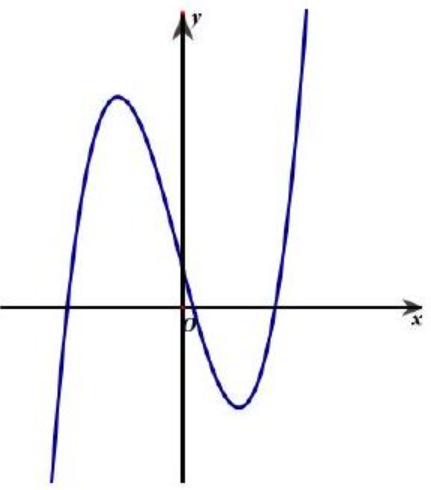
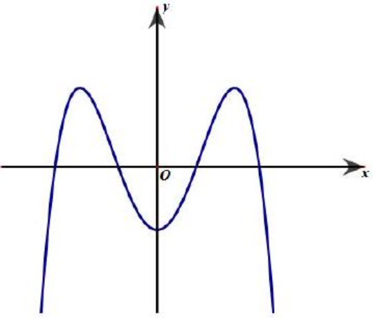
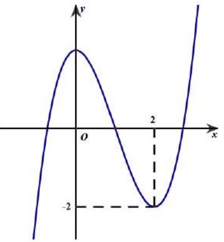
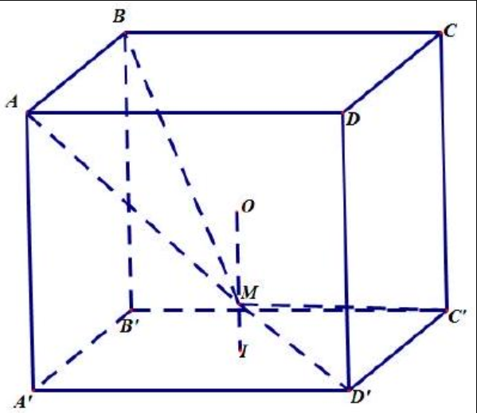
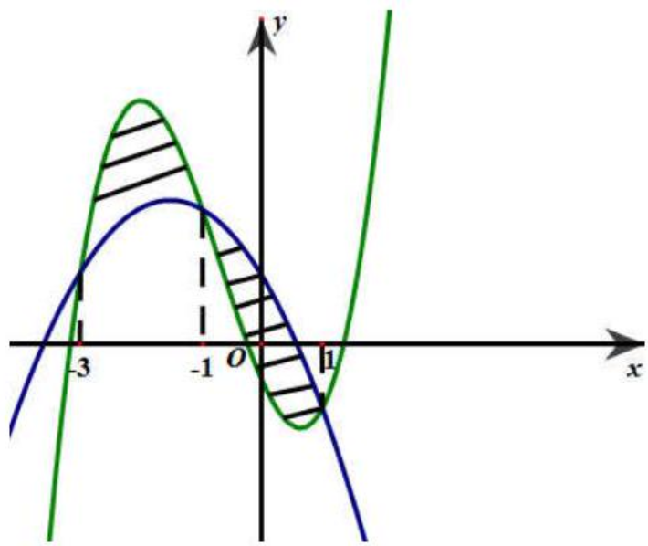
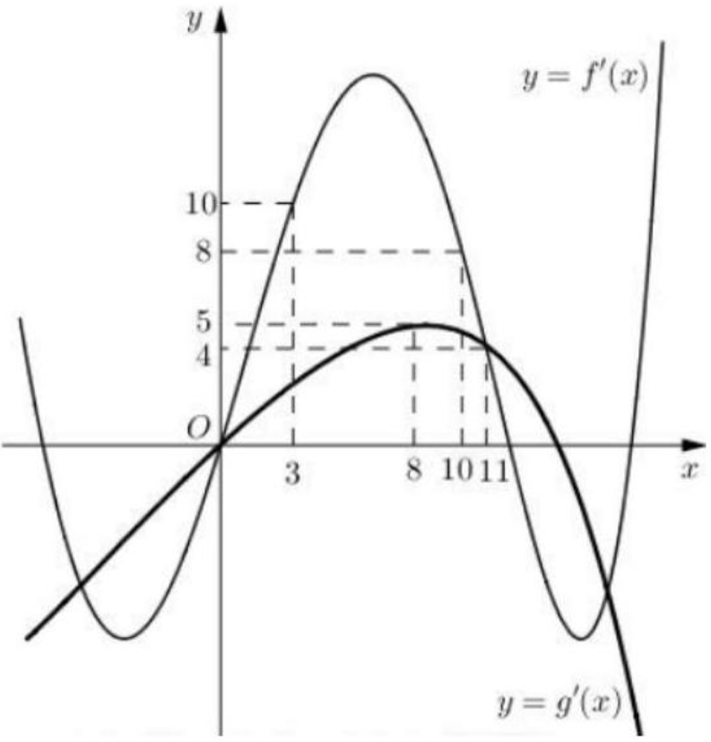

BỘ GIÁO DỤC VÀ ĐÀO TẠO ĐỀ THI CHÍNH THÚC
(Đề thi có 06 trang)

KỲ THI TRUNG HỌC PHỔ THÔNG QUỐC GIA NĂM 2018
Bài thi: TOÁN
Thời gian làm bài: 90 phút, không kể thời gian phát đề

Mã đề thi: 101
Họ và tên thí sinh:
Số báo danh:
Câu 1: Có bao nhiêu cách chọn hai học sinh từ một nhóm gồm 34 học sinh?
A. $2^{34}$.
B. $A_{34}^{2}$.
C. $34^{2}$.
D. $C_{34}^{2}$.

Câu 2: Trong không gian $O x y z$, mặt phẳng $(P): x+2 y+3 z-5=0$ có một vectơ pháp tuyến là
A. $\overrightarrow{n_{1}}=(3 ; 2 ; 1)$.
B. $\overrightarrow{n_{3}}=(-1 ; 2 ; 3)$.
C. $\overrightarrow{n_{4}}=(1 ; 2 ;-3)$.
D. $\overrightarrow{n_{2}}=(1 ; 2 ; 3)$.

Câu 3: Cho hàm số $y=a x^{3}+b x^{2}+c x+d(a, b, c, d \in \mathbb{R})$ có đồ thị như hình vẽ bên.

Số điểm cực trị của hàm số đã cho là
A. 2 .
B. 0 .
C. 3 .
D. 1 .

Câu 4: Cho hàm số $y=f(x)$ có bảng biến thiên như sau

\begin{tabular}{|c|rrrrrrrrr|}
\hline$x$ & $-\infty$ & & -1 & & 0 & & 1 & $+\infty$ \\
\hline$y^{\prime}$ & & - & 0 & + & 0 & - & 0 & + \\
\hline$y$ & $+\infty$ & & & & 3 & & & $+{ }^{+\infty}$ \\
\hline
\end{tabular}

Hàm số đã cho nghịch biến trên khoảng nào dưới đây?
A. $(0 ; 1)$.
B. $(-\infty ; 0)$.
C. $(1 ;+\infty)$.
D. (-1;0).

Câu 5: Gọi $S$ là diện tích của hình phẳng giới hạn bởi các đường $y=e^{x}, y=0, x=0, x=2$. Mệnh đề nào dưới đây đúng?
A. $S=\pi \int_{0}^{2} \mathrm{e}^{2 x} d x$.
B. $S=\int_{0}^{2} \mathrm{e}^{x} d x$.
C. $S=\pi \int_{0}^{2} \mathrm{e}^{x} d x$.
D. $S=\int_{0}^{2} \mathrm{e}^{2 x} d x$.

Câu 6: Với $a$ là số thực dương tùy ý, $\ln (5 a)-\ln (3 a)$ bằng
A. $\frac{\ln (5 a)}{\ln (3 a)}$.
B. $\ln (2 a)$.
C. $\ln \frac{5}{3}$.
D. $\frac{\ln 5}{\ln 3}$.

Câu 7: Nguyên hàm của hàm số $f(x)=x^{3}+x$ là
A. $x^{4}+x^{2}+C$.
B. $3 x^{2}+1+C$.
C. $x^{3}+x+C$.
D. $\frac{1}{4} x^{4}+\frac{1}{2} x^{2}+C$.

Câu 8: Trong không gian $O x y z$, đường thẳng $d:\left\{\begin{array}{l}x=2-t \\ y=1+2 t \\ z=3+t\end{array}\right.$ có một vectơ chỉ phương là
A. $\overrightarrow{u_{3}}=(2 ; 1 ; 3)$.
B. $\overrightarrow{u_{4}}=(-1 ; 2 ; 1)$.
C. $\overrightarrow{u_{2}}=(2 ; 1 ; 1)$.
D. $\overrightarrow{u_{1}}=(-1 ; 2 ; 3)$.

Câu 9: Số phức $-3+7 i$ có phần ảo bằng
A. 3 .
B. -7 .
C. -3 .
D. 7 .

Câu 10: Diện tích của mặt cầu bán kính $R$ bằng
A. $\frac{4}{3} \pi R^{2}$.
B. $2 \pi R^{2}$.
C. $4 \pi R^{2}$.
D. $\pi R^{2}$.

Câu 11: Đường cong trong hình vẽ là đồ thị của hàm số nào dưới đây?

A. $y=x^{4}-3 x^{2}-1$.
B. $y=x^{3}-3 x^{2}-1$.
C. $y=-x^{3}+3 x^{2}-1$.
D. $y=-x^{4}+3 x^{2}-1$.

Câu 12: Trong không gian $O x y z$, cho hai điểm $A(2 ;-4 ; 3)$ và $B(2 ; 2 ; 7)$. Trung điểm của đoạn $A B$ có tọa độ là
A. $(1 ; 3 ; 2)$.
B. (2;6;4).
C. $(2 ;-1 ; 5)$.
D. $(4 ;-2 ; 10)$.

Câu 13: $\lim \frac{1}{5 n+3}$ bằng
A. 0 .
B. $\frac{1}{3}$.
C. $+\infty$.
D. $\frac{1}{5}$.

Câu 14: Phương trình $2^{2 x+1}=32$ có nghiệm là
A. $x=\frac{5}{2}$.
B. $x=2$.
C. $x=\frac{3}{2}$.
D. $x=3$.

Câu 15: Cho khối chóp có đáy là hình vuông cạnh $a$, chiều cao bằng $2 a$. Thể tích của khối chóp đã cho bằng
A. $4 a^{3}$.
B. $\frac{2}{3} a^{3}$.
C. $2 a^{3}$.
D. $\frac{4}{3} a^{3}$.

Câu 16: Một người gửi tiết kiệm vào một ngân hàng với lãi suất $7,5 \%$ / năm. Biết rằng nếu không rút tiền ra khỏi ngân hàng thì cứ sau mỗi năm số tiền lai sẽ được nhập vào vốn để tính lãi cho năm tiếp theo. Hỏi sau ít nhất bao nhiêu năm người đó thu được cả số tiền gửi ban đầu và lãi gấp đôi số tiền gửi ban đầu, giả định trong khoảng thời gian này lãi suất không thay đổi và người đó không rút tiền ra?
A. 11 năm.
B. 9 năm.
C. 10 năm.
D. 12 năm.

Câu 17: Cho hàm số $y=a x^{3}+b x^{2}+c x+d(a, b, c, d \in \mathbb{R})$. Đồ thị hàm số $y=f(x)$ như hình vẽ bên.

Số nghiệm thực của phương trình $3 f(x)+4=0$ là
A. 3 .
B. 0 .
C. 1 .
D. 2 .

Câu 18: Số tiệm cận đứng của đồ thị hàm số $y=\frac{\sqrt{x+9}-3}{x^{2}+x}$ là
A. 3 .
B. 2 .
C. 0 .
D. 1 .

Câu 19: Cho hình chóp $S . A B C D$ có đáy là hình vuông cạnh $a, S A$ vuông góc với mặt phẳng đáy và $S B=2 a$. Góc giữa đường thẳng $S B$ và mặt phẳng đáy bằng
A. $60^{\circ}$.
B. $90^{\circ}$.
C. $30^{\circ}$.
D. $45^{\circ}$.

Câu 20: Trong không gian $O x y z$, mặt phẳng đi qua điểm $A(2 ;-1 ; 2)$ và song song với mặt phẳng $(P): 2 x-y+3 z+2=0$ có phương trình là
A. $2 x+y+3 z-9=0$.
B. $2 x-y+3 z+11=0$.
C. $2 x-y-3 z+11=0$.
D. $2 x-y+3 z-11=0$.

Câu 21: Từ một hộp chứa 11 quả cầu màu đỏ và 4 quả cầu màu xanh, lấy ngẫu nhiên đồng thời 3 quả cầu. Xác suất để lấy được 3 quả cầu màu xanh bằng
A. $\frac{4}{455}$.
B. $\frac{24}{455}$.
C. $\frac{4}{165}$.
D. $\frac{33}{91}$.

Câu 22: $\int_{1}^{2} \mathrm{e}^{3 x-1} \mathrm{~d} x$ bằng
A. $\frac{1}{3}\left(\mathrm{e}^{5}-\mathrm{e}^{2}\right)$.
B. $\frac{1}{3} \mathrm{e}^{5}-\mathrm{e}^{2}$.
C. $\mathrm{e}^{5}-\mathrm{e}^{2}$.
D. $\frac{1}{3}\left(\mathrm{e}^{5}+\mathrm{e}^{2}\right)$.

Câu 23: Giá trị lớn nhất của hàm số $y=x^{4}-4 x^{2}+9$ trên đoạn $[-2 ; 3]$ bằng
A. 201 .
B. 2 .
C. 9 .
D. 54 .

Câu 24: Tìm hai số thực $x$ và $y$ thỏa mãn $(2 x-3 y i)+(1-3 i)=x+6 i$ với $i$ là đơn vị ảo.
A. $x=-1 ; y=-3$.
B. $x=-1 ; y=-1$.
C. $x=1 ; y=-1$.
D. $x=1 ; y=-3$.

Câu 25: Cho hình chóp $S . A B C$ có đáy là tam giác vuông đỉnh $B, A B=a, S A$ vuông góc với mặt phẳng đáy và $S A=2 a$. Khoảng cách từ $A$ đến mặt phẳng ( $S B C$ ) bằng
A. $\frac{2 \sqrt{5} a}{5}$.
B. $\frac{\sqrt{5} a}{3}$.
C. $\frac{2 \sqrt{2} a}{3}$.
D. $\frac{\sqrt{5} a}{5}$.

Câu 26: Cho $\int_{16}^{55} \frac{d x}{x \sqrt{x+9}}=a \ln 2+b \ln 5+c \ln 11$, với $a, b, c$ là các số hữu tỉ. Mệnh đề nào dưới đây đúng?
A. $a-b=-c$.
B. $a+b=-c$.
C. $a+b=3 c$.
D. $a-b=-3 c$.

Câu 27: Một chiếc bút chì có dạng khối lăng trụ lục giác đều có cạnh đáy bằng 3 mm và chiều cao bằng 200 mm . Thân bút chì được làm bằng gỗ và phần lõi được làm bằng than chì. Phần lõi có dạng khối trụ có chiều cao bằng chiều dài của bút và đáy là hình tròn có bán kính . Giả định $1 \mathrm{~m}^{3}$ gỗ có giá $a$ (triệu đồng), $1 \mathrm{~m}^{3}$ than chì có giá là $8 a$ (triệu đồng). Khi đó giá nguyên vật liệu làm một chiếc bút chì như trên gần nhất với kết quả nào dưới đây?
A. 9, 7.a (đồng).
B. $97,03 . a$ (đồng).
C. 90, 7.a (đồng).
D. 9, 07.a (đồng).

Câu 28: Hệ số của $x^{5}$ trong khai triển biểu thức $x(2 x-1)^{6}+(3 x-1)^{8}$ bằng
A. -13368 .
B. 13368 .
C. -13848 .
D. 13848.

Câu 29: Cho hình chóp $S . A B C D$ có đáy là hình chữ nhật, $A B=a, B C=2 a, S A$ vuông góc với mặt phẳng đáy và $S A=a$. Khoảng cách giữa hai đường thẳng $A C$ và $S B$ bằng
A. $\frac{\sqrt{6} a}{2}$.
B. $\frac{2 a}{3}$.
C. $\frac{a}{2}$.
D. $\frac{a}{3}$.

Câu 30: Xét các số phức $z$ thỏa mãn $(\bar{z}+i)(z+2)$ là số thuần ảo. Trên mặt phẳng tọa độ, tập hợp tất cả các điểm biểu diễn số phức $z$ là một đường tròn có bán kính bằng
A. 1 .
B. $\frac{5}{4}$.
C. $\frac{\sqrt{5}}{2}$.
D. $\frac{\sqrt{3}}{2}$.

Câu 31: Ông $A$ dự định sử dụng hết $6,5 \mathrm{~m}^{3}$ kính để làm một bể cá bằng kính có dạng hình hộp chữ nhật không nắp, chiều dài gấp đôi chiều rộng (các mối ghép có kích thước không đáng kể). Bể cá có dung tích lớn nhất bằng bao nhiêu (kết quả làm tròn đến hàng phần trăm)?
A. $2,26 \mathrm{~m}^{3}$.
B. $1,61 \mathrm{~m}^{3}$.
C. $1,33 \mathrm{~m}^{3}$.
D. $1,50 \mathrm{~m}^{3}$.

Câu 32: Một chất điểm $A$ xuất phát từ $O$, chuyển động thẳng với vận tốc biến thiên theo thời gian bởi quy luật $v(t)=\frac{1}{180} t^{2}+\frac{11}{18} t(\mathrm{~m} / \mathrm{s})$, trong đó $t$ (giây) là khoảng thời gian tính từ lúc $A$ bắt đầu chuyển động. Từ trạng thái nghỉ, một chất điểm $B$ cũng xuất phát từ $O$, chuyển động thẳng cùng hướng với $A$, nhưng chậm hơn 5 giây so với $A$ và có gia tốc bằng $a\left(\mathrm{~m} / \mathrm{s}^{2}\right)$ ( $a$ là hằng số). Sau khi $B$ xuất phát được 10 giây thì đuổi kịp $A$. Vận tốc của $B$ tại thời điểm đuổi kịp $A$ bằng
A. $22(\mathrm{~m} / \mathrm{s})$.
B. $15(\mathrm{~m} / \mathrm{s})$.
C. $10(\mathrm{~m} / \mathrm{s})$.
D. $7(\mathrm{~m} / \mathrm{s})$.

Câu 33: Trong không gian $O x y z$, cho điểm $A(1 ; 2 ; 3)$ và đường thẳng $d: \frac{x-3}{2}=\frac{y-1}{1}=\frac{z+7}{-2}$. Đường thẳng đi qua $A$, vuông góc với $d$ và cắt trục $O x$ có phương trình là
A. $\left\{\begin{array}{l}x=-1+2 t \\ y=2 t \\ z=3 t\end{array}\right.$.
B. $\left\{\begin{array}{l}x=1+t \\ y=2+2 t \\ z=3+2 t\end{array}\right.$.
C. $\left\{\begin{array}{l}x=-1+2 t \\ y=-2 t \\ z=t\end{array}\right.$.
D. $\left\{\begin{array}{l}x=1+2 t \\ y=2+2 t \\ z=3+3 t\end{array}\right.$.

Câu 34: Gọi $S$ là tập hợp tất cả các giá trị nguyên của tham số $m$ sao cho phương trình $16^{x}-m \cdot 4^{x+1}+5 m^{2}-45=0$ có hai nghiệm phân biệt. Hỏi $S$ có bao nhiêu phần tử?
A. 13 .
B. 3 .
C. 6 .
D. 4 .

Câu 35: Có bao nhiêu giá trị nguyên của tham số $m$ để hàm số $y=\frac{x+2}{x+5 m}$ đồng biến trên khoảng $(-\infty ;-10) ?$
A. 2 .
B. Vô số.
C. 1.
D. 3 .

Câu 36: Có bao nhiêu giá trị nguyên của tham số $m$ để hàm số $y=x^{8}+(m-2) x^{5}-\left(m^{2}-4\right) x^{4}+1$ đạt cực tiểu tại $x=0$ ?.
A. 3 .
B. 5 .
C. 4 .
D. Vô số.

Câu 37: Cho hình lập phương $A B C D \cdot A^{\prime} B^{\prime} C^{\prime} D^{\prime}$ có tâm $O$. Gọi $I$ là tâm của hình vuông $A^{\prime} B^{\prime} C^{\prime} D^{\prime}$ và $M$ là điểm thuộc đoạn thẳng $O I$ sao cho $M O=2 M I$ (tham khảo hình vẽ).

Khi đó côsin của góc tạo bởi hăi mặt phẳng $\left(M C^{\prime} D^{\prime}\right)$ và $(M A B)$ bằng
A. $\frac{6 \sqrt{85}}{85}$.
B. $\frac{7 \sqrt{85}}{85}$.
C. $\frac{17 \sqrt{13}}{65}$.
D. $\frac{6 \sqrt{13}}{65}$.

Câu 38: Có bao nhiêu số phức $z$ thỏa mãn $|z|(z-4-i)+2 i=(5-i) z$ ?
A. 2 .
B. 3 .
C. 1.
D. 4 .

Câu 39: Trong không gian $O x y z$, cho mặt cầu $(S):(x+1)^{2}+(y+1)^{2}+(z+1)^{2}=9$ và điểm $A(2 ; 3 ;-1)$. Xét các điểm $M$ thuộc ( $S$ ) sao cho đường thẳng $A M$ tiếp xúc với ( $S$ ). $M$ luôn thuộc mặt phẳng có phương trình là
A. $6 x+8 y+11=0$.
B. $3 x+4 y+2=0$.
C. $3 x+4 y-2=0$.
D. $6 x+8 y-11=0$.

Câu 40: Cho hàm số $y=\frac{1}{4} x^{4}-\frac{7}{2} x^{2}$ có đồ thị $(C)$. Có bao nhiêu điểm $A$ thuộc ( $C$ ) sao cho tiếp tuyến của $(C)$ tại $A$ cắt $(C)$ tại hai điểm phân biệt $M\left(x_{1} ; y_{1}\right), N\left(x_{2} ; y_{2}\right)(M, N$ khác $A)$ thỏa mãn $y_{1}-y_{2}=6\left(x_{1}-x_{2}\right) ?$
A. 1 .
B. 2 .
C. 0 .
D. 3 .

Câu 41: Cho hai hàm số $f(x)=a x^{3}+b x^{2}+c x-\frac{1}{2}$ và $g(x)=d x^{2}+e x+1(a, b, c, d, e \in \mathbb{R})$. Biết rằng đồ thị của hàm số $y=f(x)$ và $y=g(x)$ cắt nhau tại ba điểm có hoành độ lần lượt là $-3 ;-1 ; 1$ (tham khảo hình vẽ).

Hình phẳng giới hạn bởi hai đồ thị đã cho có diện tích bằng
A. $\frac{9}{2}$.
B. 8 .
C. 4 .
D. 5 .

Câu 42: Cho khối lăng trụ $A B C \cdot A^{\prime} B^{\prime} C^{\prime}$, khoảng cách từ $C$ đến $B B^{\prime}$ bằng 2 , khoảng cách từ $A$ đến các đường thẳng $B B^{\prime}$ và $C C^{\prime}$ lần lượt bằng 1 và $\sqrt{3}$, hình chiếu vuông góc của $A$ lên mặt phẳng $\left(A^{\prime} B^{\prime} C^{\prime}\right)$ là trung điểm $M$ của $B^{\prime} C^{\prime}$ và $A^{\prime} M=\frac{2 \sqrt{3}}{3}$. Thể tích khối lăng trụ đã cho bằng
A. 2 .
B. 1 .
C. $\sqrt{3}$.
D. $\frac{2 \sqrt{3}}{3}$.

Câu 43: Ba bạn $A, B, C$ mỗi bạn viết ngẫu nhiên lên bảng một số tự nhiên thuộc đoạn [1;17] để ba số được viết ra có tổng chia hết cho 3 bằng
A. $\frac{1728}{4913}$.
B. $\frac{1079}{4913}$.
C. $\frac{23}{68}$.
D. $\frac{1637}{4913}$.

Câu 44: Cho $a>0, b>0$ thỏa mãn $\log _{3 a+2 b+1}\left(9 a^{2}+b^{2}+1\right) \cdot \log _{6 a b+1}(3 a+2 b+1)=2$. Giá trị của $a+2 b$ bằng
A. 6 .
B. 9 .
C. $\frac{7}{2}$.
D. $\frac{5}{2}$.

Câu 45: Cho hàm số $y=\frac{x-1}{x+2}$ có đồ thị $(C)$. Gọi $I$ là giao điểm của hai tiệm cận của $(C)$. Xét tam giác đều $A B I$ có hai đỉnh $A, B$ thuộc ( $C$ ), đoạn thẳng $A B$ có độ dài bằng
A. $\sqrt{6}$.
B. $2 \sqrt{3}$.
C. 2 .
D. $2 \sqrt{2}$.

Câu 46: Cho phương trình $5^{x}+m=\log _{5}(x-m)$ với $m$ là tham số. Có bao nhiêu giá trị nguyên của $m \in(-20 ; 20)$ để phương trình đã cho có nghiệm?
A. 20 .
B. 19 .
C. 9.
D. 21 .

Câu 47: Trong không gian $O x y z$, cho mặt cầu ( $S$ ) có tâm $I(-2 ; 1 ; 2)$ và đi qua điểm $A(1 ;-2 ;-1)$. Xét các điểm $B, C, D$ thuộc ( $S$ ) sao cho $A B, A C, A D$ đôi một vuông góc với nhau. Thể tích khối tứ diện $A B C D$ có giá trị lớn nhất bằng
A. 72 .
B. 216 .
C. 108 .
D. 36 .

Câu 48: Cho hàm số $f(x)$ thỏa mãn $f(2)=-\frac{2}{9}, f^{\prime}(x)=2 x[f(x)]^{2} \forall x \in R, f(1)=\frac{3}{2}$. Giá trị $f(1)$ bằng:
A. $-\frac{35}{36}$.
B. $-\frac{2}{3}$.
C. $-\frac{19}{36}$.
D. $-\frac{2}{15}$.

Câu 49: Trong không gian $O x y z$, cho đường thẳng $d:\left\{\begin{array}{l}x=1+3 t \\ y=1+4 t \\ z=1\end{array}\right.$. Gọi $\Delta$ là đường thẳng qua $A(1 ; 1 ; 1)$ và có vectơ chỉ phương $\vec{u}=(1 ;-2 ; 2)$. Đường phân giác của góc nhọn tạo bởi $d$ và $\Delta$ có phương trình là
A. $\left\{\begin{array}{l}x=1+7 t \\ y=1+t \\ z=1+5 t\end{array}\right.$.
B. $\left\{\begin{array}{l}x=-1+2 t \\ y=-10+11 t \\ z=-6-5 t\end{array}\right.$.
C. $\left\{\begin{array}{l}x=-1+2 t \\ y=-10+11 t \\ z=6-5 t\end{array}\right.$.
D. $\left\{\begin{array}{l}x=1+3 t \\ y=1+4 t \\ z=1-5 t\end{array}\right.$.

Câu 50: Cho hàm số $y=f(x), y=g(x)$. Hai hàm số $y=f^{\prime}(x)$ và $y=g^{\prime}(x)$ có đồ thị như hình bên, trong đó đường cong đậm hơn là đồ thị của hàm số $y=g^{\prime}(x)$.

Hàm số $h(x)=f(x+4)-g\left(2 x-\frac{3}{2}\right) h(x)=f(x+4)-g\left(2 x-\frac{3}{2}\right)$ đồng biến trên khoảng nào sau đây?
A. $\left(5 ; \frac{31}{5}\right)$.
B. $\left(\frac{9}{4} ; 3\right)$.
C. $\left(\frac{31}{5} ;+\infty\right)$.
D. $\left(6 ; \frac{25}{4}\right)$.