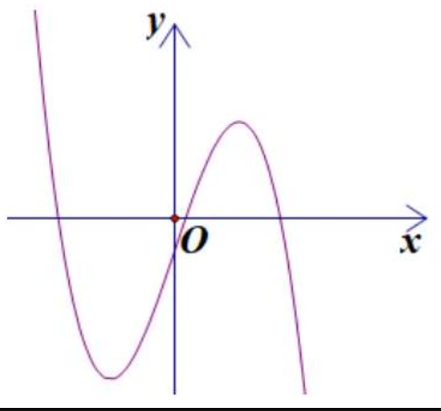
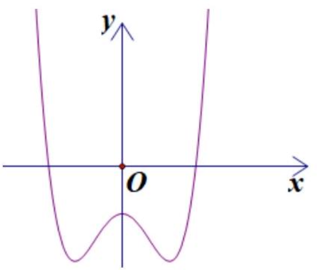
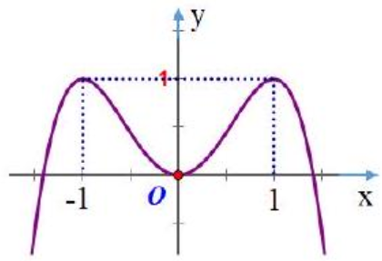
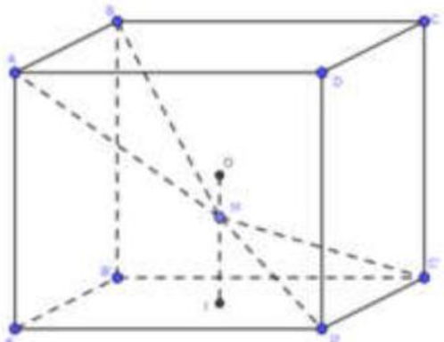
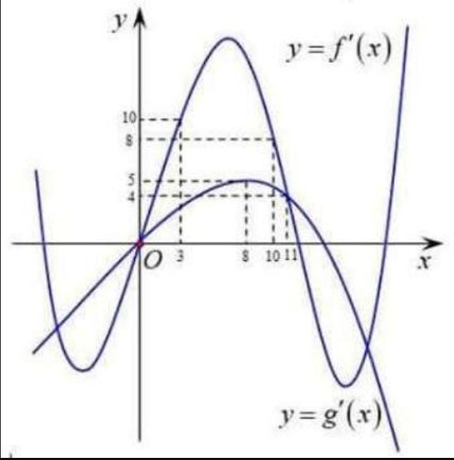

BỘ GIÁO DỤC VÀ ĐÀO TẠO
ĐÈ THI CHÍNH THÚC
(Đề thi có 06 trang)

KỲ THI TRUNG HỌC PHỔ THÔNG QUỐC GIA NĂM 2018
Bài thi: TOÁN
Thời gian làm bài: 90 phút, không kể thời gian phát đề

MÃ ĐỀ THI 102
Câu 1: $\quad \lim \frac{1}{5 n+2}$ bằng
A. $\frac{1}{5}$.
B. 0 .
C. $\frac{1}{2}$.
D. $+\infty$.

Câu 2: Gọi $S$ là diện tích của hình phẳng giới hạn bởi các đường $y=2^{x}, y=0, x=0, x=2$. Mệnh đề nào dưới đây đúng?
A. $S=\int_{0}^{2} 2^{x} \mathrm{~d} x$.
B. $S=\pi \int_{0}^{2} 2^{2 x} \mathrm{~d} x$.
C. $S=\int_{0}^{2} 2^{2 x} \mathrm{~d} x$.
D. $S=\pi \int_{0}^{2} 2^{x} \mathrm{~d} x$.

Câu 3: Tập nghiệm của phương trình $\log _{2}\left(x^{2}-1\right)=3$ là
A. $\{-3 ; 3\}$.
B. $\{-3\}$.
C. $\{3\}$.
D. $\{-\sqrt{10} ; \sqrt{10}\}$.

Câu 4: Nguyên hàm của hàm số $f(x)=x^{4}+x$ là
A. $x^{4}+x+C$
B. $4 x^{3}+1+C$.
C. $x^{5}+x^{2}+C$.
D. $\frac{1}{5} x^{5}+\frac{1}{2} x^{2}+C$.

Câu 5: Cho hàm số $y=a x^{3}+b x^{2}+c x+d(a, b, c, d \in \mathbb{R})$ có đồ thị như hình vẽ bên. Số điểm cực trị của hàm số đã cho là
A. 0 .
B. 1 .
C. 3 .
D. 2 .

Câu 6: Số phức có phần thực bằng 3 và phần ảo bằng 4 là
A. $3+4 i$.
B. $4-3 i$.
C. 3-4i.
D. $4+3 i$.

Câu 7: Cho khối chóp có đáy là hình vuông cạnh $a$ và chiều cao $4 a$. Thể tích của khối chóp đã cho bằng
A. $\frac{4}{3} a^{3}$.
B. $\frac{16}{3} a^{3}$.
C. $4 a^{3}$.
D. $16 a^{3}$.

Câu 8: Đường cong trong hình vẽ bên là đồ thị của hàm số nào dưới đây?
A. $y=x^{4}-2 x^{2}-1$.
B. $y=-x^{4}+2 x^{2}-1$.
C. $y=x^{3}-x^{2}-1$.
D. $y=-x^{3}+x^{2}-1$.

Câu 9: Thể tích của khối cầu bán kính $R$ bằng
A. $\frac{4}{3} \pi R^{3}$.
B. $4 \pi R^{3}$.
C. $2 \pi R^{3}$.
D. $\frac{3}{4} \pi R^{3}$.

Câu 10: Trong không gian $O x y z$, cho hai điểm $A(1 ; 1 ;-2)$ và $B(2 ; 2 ; 1)$. Vectơ $\overrightarrow{A B}$ có tọa độ là
A. $(3 ; 3 ;-1)$.
B. (-1;-1;-3).
C. $(3 ; 3 ; 1)$.
D. ( $1 ; 1 ; 3$ ).

Câu 11. Với $a$ là số thực dương tùy ý, $\log _{3}(3 a)$ bằng
A. $3 \log _{3} a$.
B. $3+\log _{3} a$.
C. $1+\log _{3} a$.
D. $1-\log _{3} a$.

Câu 12. Cho hàm số $y=f(x)$ có bảng biến thiên như sau

| $x$ | $-\infty$ | -1 |  | 1 |  | $+\infty$ |  |
| :---: | :---: | :---: | :---: | :---: | :---: | :---: | :---: |
| $y^{\prime}$ |  | + | 0 | - | 0 | + |  |
| $y$ |  | $\longrightarrow^{3}$ |  |  |  |  |  |

Hàm số đã cho đồng biến trên khoảng nào dưới đây?
A. $(-1 ;+\infty)$.
B. $(1 ;+\infty)$.
C. $(-1 ; 1)$.
D. $(-\infty ; 1)$.

Câu 13. Có bao nhiêu cách chọn 2 học sinh từ một nhóm 38 học sinh?
A. $A_{38}^{2}$.
B. $2^{38}$.
C. $C_{38}^{2}$.
D. $38^{2}$.

Câu 14. Trong không gian $O x y z$, cho đường thẳng $d: \frac{x+3}{1}=\frac{y-1}{-1}=\frac{z-5}{2}$ có một vectơ chỉ phương là
A. $\overrightarrow{u_{1}}=(3 ;-1 ; 5)$.
B. $\overrightarrow{u_{4}}=(1 ;-1 ; 2)$.
C. $\overrightarrow{u_{2}}=(-3 ; 1 ; 5)$.
D. $\overrightarrow{u_{3}}=(1 ;-1 ;-2)$.

Câu 15. Trong không gian $O x y z$, mặt phẳng $(P): 3 x+2 y+z-4=0$ có một vectơ pháp tuyến là
A. $\overrightarrow{n_{3}}=(-1 ; 2 ; 3)$.
B. $\overrightarrow{n_{4}}=(1 ; 2 ;-3)$.
C. $\overrightarrow{n_{2}}=(3 ; 2 ; 1)$.
D. $\overrightarrow{n_{1}}=(1 ; 2 ; 3)$.

Câu 16. Cho hàm số $f(x)=a x^{4}+b x^{2}+c(a, b, c \in \mathbb{R})$. Đồ thị của hàm số $y=f(x)$ như hình vẽ bên. Số nghiệm của phương trình $4 f(x)-3=0$ là

A. 4 .
B. 3 .
C. 2 .
D. 0 .

Câu 17. Từ một hộp chứa 7 quả cầu mà đỏ và 5 quả cầu màu xanh, lấy ngẫu nhiên đồng thời 3 quả cầu. Xác suất để lấy được 3 quả cầu màu xanh bằng
A. $\frac{5}{12}$.
B. $\frac{7}{44}$.
C. $\frac{1}{22}$.
D. $\frac{2}{7}$.

Câu 18. Giá trị nhỏ nhất của hàm số $y=x^{3}+2 x^{2}-7 x$ trên đoạn $[0 ; 4]$ bằng
A. -259 .
B. 68 .
C. 0 .
D. -4 .

Câu 19. Cho hình chóp $S . A B C D$ có đáy là hình vuông cạnh $a, S A$ vuông góc với mặt phẳng đáy và $S A=\sqrt{2} a$. Góc giữa đường thẳng $S C$ và mặt phẳng đáy bằng
A. $45^{\circ}$.
B. $60^{\circ}$.
C. $30^{\circ}$.
D. $90^{\circ}$.

Câu 20. $\quad \int_{0}^{1} e^{3 x+1} \mathrm{~d} x$ bằng
A. $\frac{1}{3}\left(e^{4}-e\right)$.
B. $e^{4}-e$.
C. $\frac{1}{3}\left(e^{4}+e\right)$.
D. $e^{3}-e$.

Câu 21. Trong không gian $O x y z$, mặt phẳng đi qua điểm $A(1 ; 2 ;-2)$ và vuông góc với đường thẳng $\Delta: \frac{x+1}{2}=\frac{y-2}{1}=\frac{z+3}{3}$ có phương trình là
A. $3 x+2 y+z-5=0$.
B. $2 x+y+3 z+2=0$.
C. $x+2 y+3 z+1=0$.
D. $2 x+y+3 z-2=0$.

Câu 22. Số tiệm cận đứng của đồ thị hàm số $y=\frac{\sqrt{x+4}-2}{x^{2}+x}$ là
A. 3 .
B. 0 .
C. 2 .
D. 1 .

Câu 23. Cho hình chóp $S . A B C$ có đáy là tam giác vuông đỉnh $B, A B=a, S A$ vuông góc với mặt phẳng đáy và $S A=a$. Khoảng cách từ $A$ đến mặt phẳng $(S B C)$ bằng
A. $\frac{a}{2}$.
B. $a$.
C. $\frac{\sqrt{6} a}{3}$.
D. $\frac{\sqrt{2} a}{2}$.

Câu 24. Một người gửi tiết kiệm vào một ngân hàng với lãi suất $7,2 \% /$ năm. Biết rằng nếu không rút tiền ra khỏi ngân hàng thì cứ sau mỗi năm số tiền lãi sẽ được nhập vào vốn để tính lãi cho năm tiếp theo. Hỏi sau ít nhất bao nhiêu năm người đo thu được (cả số tiền gửi ban đầu và lãi) gấp đôi số tiền gửi ban đầu, giả định trong khoảng thời gian này lãi suất không thay đổi và người đó không rút tiền ra?
A. 11 năm.
B. 12 năm.
C. 9 năm.
D. 10 năm.

Câu 25. Tìm hai số thực $x$ và $y$ thỏa mãn $(3 x+2 y i)+(2+i)=2 x-3 i$ với $i$ là đơn vị ảo.
A. $x=-2 ; y=-2$.
B. $x=-2 ; y=-1$.
C. $x=2 ; y=-2$.
D. $x=2 ; y=-1$.

Câu 26. Ông $A$ dự định sử dụng hết $6,7 m^{2}$ kính để làm một bể cá bằng kính có dạng hình hộp chữ nhật không nắp, chiều dài gấp đôi chiều rộng (các mối ghép có kích thước không đáng kể). Bể cá có dung tích lớn nhất bằng bao nhiêu (kết quả làm tròn đến hàng phần trăm)?
A. $1,57 m^{3}$.
B. $1,11 m^{3}$.
C. $1,23 m^{3}$.
D. $2,48 m^{3}$.

Câu 27. Cho $\int_{5}^{21} \frac{\mathrm{~d} x}{x \sqrt{x+4}}=a \ln 3+b \ln 5+c \ln 7$ với $a, b, c$ là các số hữu tỉ. Mệnh đề nào dưới đây đúng?
A. $a+b=-2 c$.
B. $a+b=c$.
C. $a-b=-c$.
D. $a-b=-2 c$.

Câu 28. Cho hình chóp $S . A B C D$ có đáy là hình chữ nhật, $A B=a, B C=2 a, S A$ vuông góc với mặt phẳng đáy và $S A=a$. Khoảng cách giữa hai đường thẳng $B D$ và $S C$ bằng
A. $\frac{\sqrt{30} a}{6}$.
B. $\frac{4 \sqrt{21} a}{21}$.
C. $\frac{2 \sqrt{21} a}{21}$.
D. $\frac{\sqrt{30} a}{12}$.

Câu 29. Trong không gian $O x y z$, cho điểm $A(2 ; 1 ; 3)$ và đường thẳng $d: \frac{x+1}{1}=\frac{y-1}{-2}=\frac{z-2}{2}$. Đường thẳng đi qua $A$, vuông góc với $d$ và cắt trục $O y$ có phương trình là
A. $\left\{\begin{array}{l}x=2 t \\ y=-3+4 t \\ z=3 t\end{array}\right.$.
B. $\left\{\begin{array}{l}x=2+2 t \\ y=1+t \\ z=3+3 t\end{array}\right.$.
C. $\left\{\begin{array}{l}x=2+2 t \\ y=1+3 t \\ z=3+2 t\end{array}\right.$.
D. $\left\{\begin{array}{l}x=2 t \\ y=-3+3 t \\ z=2 t\end{array}\right.$.

Câu 30. Có bao nhiêu giá trị nguyên của tham số $m$ để hàm số $y=\frac{x+6}{x+5 m}$ nghịch biến trên khoảng $(10 ;+\infty)$.
A. 3 .
B. Vô số.
C. 4 .
D. 5 .

Câu 31. Một chiếc bút chì có dạng khối lăng trụ lục giác đều có cạnh đáy 3 mm và chiều cao bằng 200 mm . Thân bút chì được làm bằng gỗ và phần lõi được làm bằng than chì. Phần lõi có dạng khối trụ có chiều cao bằng chiều dài của bút và đáy là hình tròn có bán kính 1 mm . Giả định $1 \mathrm{~m}^{3}$ gỗ có giá $a$ (triệu đồng), $1 \mathrm{~m}^{3}$ than chì có giá $6 a$ (triệu đồng). Khi đó giá nguyên liệu làm một chiếc bút chì như trên gần nhất với kết quả nào dưới đây?
A. $84,5 . a$ (đồng).
B. $78,2 \cdot a$ (đồng).
C. 8, 45.a (đồng).
D. $7,82 . a$ (đồng).

Câu 32. Một chất điểm $A$ xuất phát từ $O$, chuyển động thẳng với vận tốc biến thiên theo thời gian bởi quy luật $v(t)=\frac{1}{150} t^{2}+\frac{59}{75} t(\mathrm{~m} / \mathrm{s})$, trong đó $t$ (giây) là khoảng thời gian tính từ lúc $A$ bắt đầu chuyển động. Từ trạng thái nghỉ, một chất điểm $B$ cũng xuất phát từ $O$, chuyển động thẳng cùng hướng với $A$ nhưng chậm hơn 3 giây so với $A$ và có gia tốc bằng $a\left(\mathrm{~m} / \mathrm{s}^{2}\right)$ ( $a$ là hằng số). Sau khi $B$ xuất phát được 12 giây thì đuổi kịp $A$. Vận tốc của $B$ tại thời điểm đuổi kịp $A$ bằng
A. $20(\mathrm{~m} / \mathrm{s})$.
B. $16(\mathrm{~m} / \mathrm{s})$.
C. $13(\mathrm{~m} / \mathrm{s})$.
D. $15(\mathrm{~m} / \mathrm{s})$.

Câu 33. Xét các số phức $z$ thỏa mãn $(\bar{z}+3 i)(z-3)$ là số thuần ảo. Trên mặt phẳng tọa độ, tập hợp tất cả các điểm biểu diễn các số phức $z$ là một đường tròn có bán kính bằng
A. $\frac{9}{2}$.
B. $3 \sqrt{2}$.
C. 3 .
D. $\frac{3 \sqrt{2}}{2}$.

Câu 34. Hệ số của $x^{5}$ trong khai triển biểu thức $x(3 x-1)^{6}+(2 x-1)^{8}$ bằng
A. -3007 .
B. -577 .
C. 3007 .
D. 577 .

Câu 35. Gọi $S$ là tập hợp tất cả các giá trị nguyên của tham số $m$ sao cho phương trình $25^{x}-m \cdot 5^{x+1}+7 m^{2}-7=0$ có hai nghiệm phân biệt. Hỏi $S$ có bao nhiêu phần tử ?
A. 7 .
B. 1 .
C. 2 .
D. 3 .

Câu 36. Cho hai hàm số $f(x)=a x^{3}+b x^{2}+c x-2$ và $g(x)=d x^{2}+e x+2 (a, b, c, d, e \in \mathbb{R})$. Biết rằng đồ thị của hàm số $y=f(x)$ và $y=g(x)$ cắt nhau tại ba điểm có hoành độ lần lượt là $-2 ;-1 ; 1$ (tham khảo hình vẽ). Hình phẳng giới hạn bởi hai đồ thị đã cho có diện tích bằng
A. $\frac{37}{6}$.
B. $\frac{13}{2}$.
C. $\frac{9}{2}$.
D. $\frac{37}{12}$.

Câu 37. Cho $a>0, b>0$ thỏa mãn $\log _{10 a+3 b+1}\left(25 a^{2}+b^{2}+1\right)+\log _{10 a b+1}(10 a+3 b+1)=2$. Giá trị của $a+2 b$ bằng
A. $\frac{5}{2}$.
B. 6 .
C. 22 .
D. $\frac{11}{2}$.

Câu 38. Có bao nhiêu giá trị nguyên của tham số $m$ để hàm $y=x^{8}+(m-1) x^{5}-\left(m^{2}-1\right) x^{4}+1$ số đạt cực tiểu tại $x=0$ ?
A. 3 .
B. 2 .
C. Vô số.
D. 1 .

Câu 39. Cho hình lập phương $A B C D \cdot A^{\prime} B^{\prime} C^{\prime} D^{\prime}$ có tâm $O$. Gọi $I$ là tâm của hình vuông $A B C D$ và $M$ là điểm thuộc $O I$ sao cho $M O=\frac{1}{2} M I$ ( tham khảo hình vẽ). Khi đó, côsin góc tạo bởi hai mặt phẳng $\left(M C^{\prime} D^{\prime}\right)$ và $(M A B)$ bằng

A. $\frac{6 \sqrt{13}}{65}$.
B. $\frac{7 \sqrt{85}}{85}$.
C. $\frac{6 \sqrt{85}}{85}$.
D. $\frac{17 \sqrt{13}}{65}$.

Câu 40: Cho hàm số $f(x)$ thỏa mãn $f(2)=-\frac{1}{3}$ và $f^{\prime}(x)=x[f(x)]^{2}$ với mọi $x \in \mathbb{R}$. Giá trị của $f(1)$ bằng .
A. $-\frac{11}{6}$.
B. $-\frac{2}{3}$.
C. $-\frac{2}{9}$.
D. $-\frac{7}{6}$.

Câu 41: Trong không gian $O x y z$,cho mặt cầu $(S)$ có tâm $I(-1 ; 2 ; 1)$ và đi qua điểm $A(1 ; 0 ;-1)$. Xét các điểm $B, C, D$ thuộc ( $S$ ) sao cho $A B, A C, A D$ đôi một vuông góc với nhau. Thể tích của khối tứ diện $A B C D$ lớn nhất bằng
A. $\frac{64}{3}$.
B. 32 .
C. 64 .
D. $\frac{32}{3}$.

Câu 42: Trong không gian $O x y z$ cho mặt cầu $(S):(x-2)^{2}+(y-3)^{2}+(z-4)^{2}=2$ và điểm $A(1 ; 2 ; 3)$. Xét điểm $M$ thuộc mặt cầu ( $S$ ) sao cho đường thẳng $A M$ tiếp xúc với ( $S$ ), $M$ luôn thuộc mặt phẳng có phương trình là
A. $2 x+2 y+2 z+15=0$.
$2 x+2 y+2 z-15=0$.
C. $x+y+z+7=0$.
D. $x+y+z-7=0$.
B.

Câu 43: Ba bạn $A, B, C$ mỗi bạn viết lên bảng một số tự nhiên thuộc đoạn [1;19].Xác suất để ba số được viết ra có tổng chia hết cho 3 bằng .
A. $\frac{1027}{6859}$.
B. $\frac{2539}{6859}$.
C. $\frac{2287}{6859}$.
D. $\frac{109}{323}$.

Câu 44: Trong không gian $O x y z$ cho đường thẳng $d:\left\{\begin{array}{l}x=1+3 t \\ y=-3 \\ z=5+4 t\end{array}\right.$. Gọi $\Delta$ là đường thẳng đi qua điểm $A(1 ;-3 ; 5)$ và có véc tơ chỉ phương là $\vec{u}=(1 ; 2 ;-2)$. Đường phân giác góc nhọn tạo bởi hai đường thẳng $d$ và $\Delta$ là
A. $\left\{\begin{array}{l}x=-1+2 t \\ y=2-5 t \\ z=6+11 t\end{array}\right.$.
B. $\left\{\begin{array}{l}x=-1+2 t \\ y=2-5 t \\ z=-6+11 t\end{array}\right.$.
C. $\left\{\begin{array}{l}x=1+7 t \\ y=3-5 t \\ z=5+t\end{array}\right.$.
D. $\left\{\begin{array}{l}x=1-t \\ y=-3 \\ z=5+7 t\end{array}\right.$.

Câu 45: Cho phương trình $3^{x}+m=\log _{3}(x-m)$ với là tham số. Có bao nhiêu giá trị nguyên của $m \in(-15 ; 15)$ để phương trình đã cho có nghiệm?
A. 16 .
B. 9 .
C.14.
D. 15 .

Câu 46: Cho khối lăng trụ $A B C \cdot A^{\prime} B^{\prime} C^{\prime}$, khoảng cách từ điểm $C$ đến đường thẳng $B B^{\prime}$ bằng $\sqrt{5}$, khoảng cách từ $A$ đến các đường thẳng $B B^{\prime}$ và $C C^{\prime}$ lần lượt bằng 1 và 2 , hình chiếu vuông góc của $A$ lên mặt phẳng $\left(A^{\prime} B^{\prime} C^{\prime}\right)$ là trung điểm $M$ của $B^{\prime} C^{\prime}$ và $A^{\prime} M=\frac{\sqrt{15}}{3}$. Thể tích của khối lăng trụ đã cho bằng:
A. $\frac{\sqrt{15}}{3}$.
B. $\frac{2 \sqrt{5}}{3}$.
C. $\sqrt{5}$.
D. $\frac{2 \sqrt{15}}{3}$.

Câu 47: Cho hai hàm số $y=f(x)$ và $y=g(x)$. Hai hàm số $y=f^{\prime}(x)$ và $y=g^{\prime}(x)$ có đồ thị như hình vẽ bên, trong đó đường cong đậm hơn là đồ thị hàm số $y=g^{\prime}(x)$. Hàm số $h(x)=f(x+7)-g\left(2 x+\frac{9}{2}\right)$ đồng biến trên khoảng nào dưới đây?

A. $\left(2 ; \frac{16}{5}\right)$.
B. $\left(-\frac{3}{4} ; 0\right)$.
C. $\left(\frac{16}{5} ;+\infty\right)$.
D. $\left(3 ; \frac{13}{4}\right)$.

Câu 48: Cho hàm số $y=\frac{x-1}{x+1}$ có đồ thị $(C)$. Gọi $I$ là giao điểm của hai tiệm cận của $(C)$. Xét tam giác đều $A B I$ có hai đỉnh $A, B$ thuộc $(C)$, đoạn $A B$ có độ dài bằng:
A. 3 .
B. 2 .
C. $2 \sqrt{2}$.
D. $2 \sqrt{3}$.

Câu 49: Có bao nhiêu số phức $z$ thỏa mãn $|z|(z-3-i)+2 i=(4-i) z$ ?
A. 1 .
B. 3 .
C. 2 .
D. 4 .

Câu 50: Cho hàm số $y=\frac{1}{8} x^{4}-\frac{7}{4} x^{2}$ có đồ thị là $(C)$. Có bao nhiêu điểm $A$ thuộc $(C)$ sao cho tiếp tuyến của ( $C$ ) tại $A$ cắt ( $C$ ) tại hai điểm phân biệt $M\left(x_{1} ; y_{1}\right) ; N\left(x_{2} ; y_{2}\right)(M, N$ khác $A)$ thỏa mãn $y_{1}-y_{2}=3\left(x_{1}-x_{2}\right)$ ?
A. 0 .
B. 2 .
C. 3 .
D. 1.

