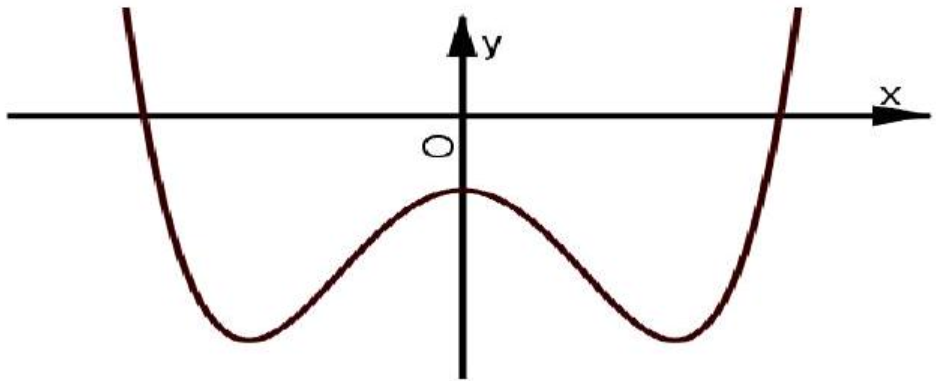
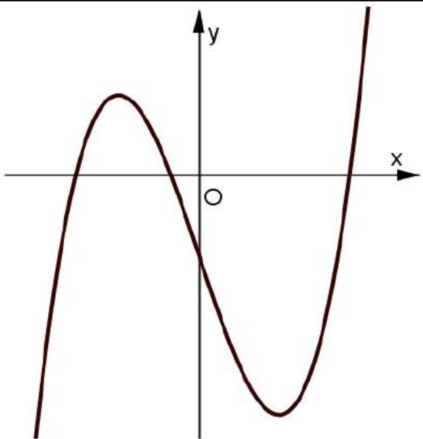
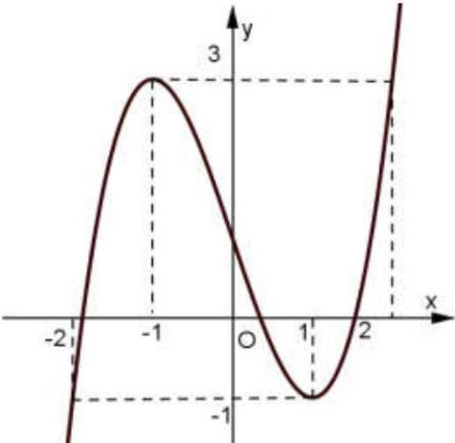
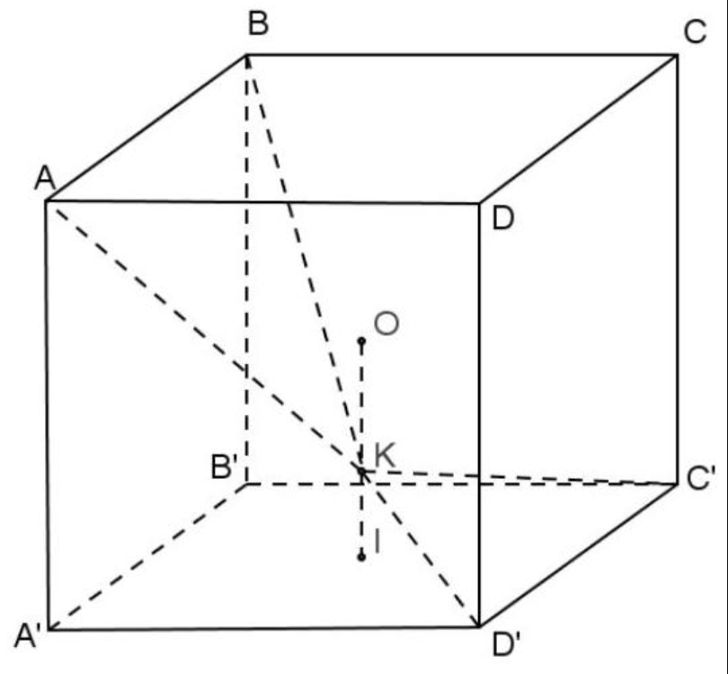
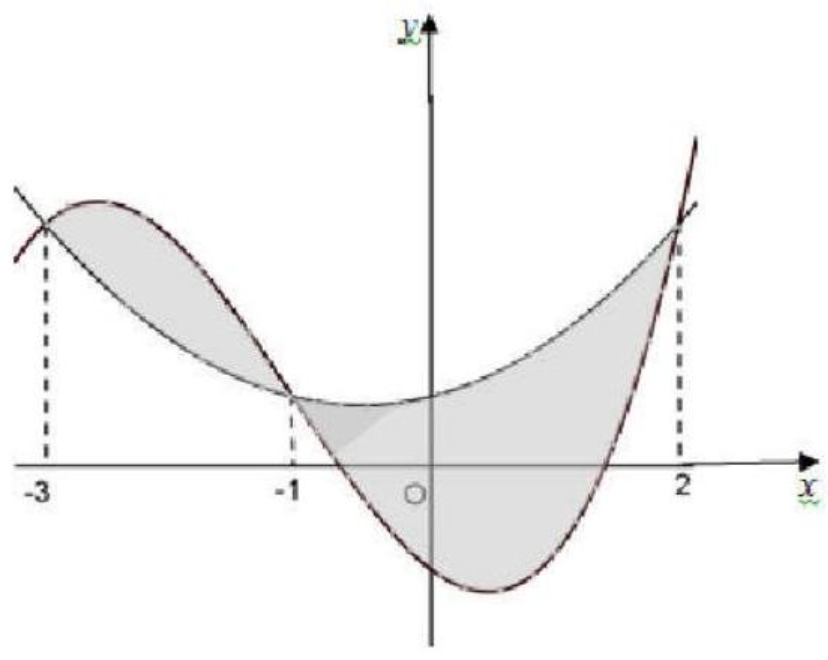
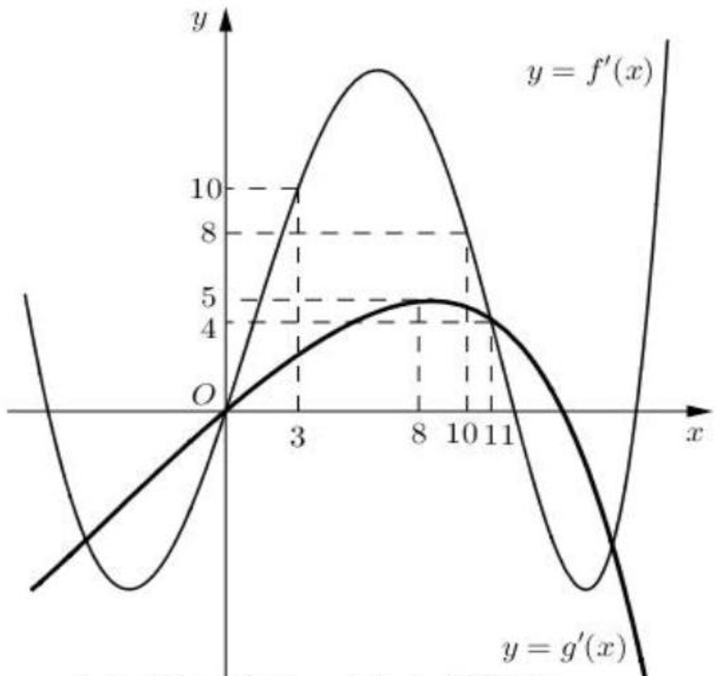

BỘ GIÁO DUC VÀ ĐÀO TẠO
ĐÊ THI CHÍNH THỨC
(Đề thi có 05 trang)

KỲ THI TRUNG HỌC PHỔ THÔNG QUỐC GIA NĂM 2018
Bài thi: TOÁN
Thời gian làm bài: 90 phút, không kể thời gian phát đề

Mã đề thi 103
Câu 1: Với $a$ là số thực dương tùy ý, $\ln (7 a)-\ln (3 a)$ bằng
A. $\frac{\ln (7 a)}{\ln (3 a)}$.
B. $\frac{\ln 7}{\ln 3}$.
C. $\ln \frac{7}{3}$
D. $\ln (4 a)$

Câu 2: Cho hàm số $y=a x^{4}+b x^{2}+c(a, b, c \in \mathbb{R})$ có đồ thị như hình vẽ bên. Số điểm cực trị của hàm số đã cho là
A. 2 .
B. 3 .
C. 0 .
D. 1 .

Câu 3. Thể tích của khối trụ tròn xoay có bán kính đáy $r$ và chiều cao $h$ bằng
A. $\frac{1}{3} \pi r^{2} h$.
B. $2 \pi r h$.
C. $\frac{4}{3} \pi r^{2} h$.
D. $\pi r^{2} h$.

Câu 4. Cho hình phẳng ( $H$ ) giới hạn bởi các đường $y=x^{2}+3, y-0, x=0, x=2$. Gọi $V$ là thể tích của khối tròn xoay được tạo thành khi quay ( $H$ ) xung quanh trục $\mathrm{O} x$. Mệnh đề nào dưới đây đúng ?
A. $V=\pi \int_{0}^{2}\left(x^{2}+3\right)^{2} d x$.
B. $V=\pi \int_{0}^{2}\left(x^{2}+3\right) d x$.
C. $V=\int_{0}^{2}\left(x^{2}+3\right)^{2} d x$.
D. $V=\int_{0}^{2}\left(x^{2}+3\right) d x$.

Câu 5. Từ các chữ số $1,2,3,4,5,6,7$ lập được bao nhiêu số tự nhiên gồm hai chữ số khác nhau?
A. $C_{7}^{2}$.
B. $2^{7}$.
C. $7^{2}$.
D. $A_{7}^{2}$.

Câu 6. Đường cong trong hình vẽ bên là đồ thị của hàm số nào dưới đây?
A. $y=-x^{4}+x^{2}-1$.
B. $y=x^{4}-3 x^{2}-1$.
C. $y=-x^{3}-3 x-1$.
D. $y=x^{3}-3 x-1$.

Câu 7. Cho hàm số $y=f(x)$ có bảng biến thiên như sau

| $x$ | $-\infty$ |  | -1 |  | 0 | 1 |  | $+\infty$ |  |
| :--- | :--- | :--- | :---: | :--- | :--- | :--- | :--- | :--- | :--- |
| $y^{\prime}$ |  | + | 0 | - | 0 | + | 0 | - |  |
| $y$ |  |  | -1 |  |  |  | -1 |  |  |

Hàm số đã cho đồng biến trên khoảng nào dưới đây?
A. ( $-1 ; 0$ ).
B. $(1 ;+\infty)$.
C. $(-\infty ; 1)$.
D. ( $0 ; 1$ ).

Câu 8. Cho khối lăng trụ có đáy là hình vuông cạnh $a$ và chiều cao bằng $4 a$. Thể tích khối lăng trụ đã cho bằng
A. $4 a^{3}$
B. $\frac{16}{3} a^{3}$
C. $\frac{4}{3} a^{3}$
D. $16 a^{3}$

Câu 9. Trong không gian $O x y z$, cho mặt cầu $(S):(x+3)^{2}+(y+1)^{2}+(z-1)^{2}=2$. Tâm của ( $S$ ) có tọa độ là
A. $(3 ; 1 ;-1)$.
B. $(3 ;-1 ; 1)$.
C. ( $-3 ;-1 ; 1$ ).
D. $(-3 ; 1 ;-1)$.

Câu 10. $\lim \frac{1}{2 n+7}$ bằng
A. $\frac{1}{7}$.
B. $+\infty$.
C. $\frac{1}{2}$.
D. 0 .

Câu 11. Số phức $5+6 i$ có phần thực bằng
A. -5 .
B. 5 .
C. -6 .
D. 6 .

Câu 12. Trong không gian $O x y z$, mặt phẳng $(P): 2 x+3 y+z-1=0$ có một vectơ pháp tuyến là
A. $\overrightarrow{n_{1}}=(2 ; 3 ;-1)$.
B. $\overrightarrow{n_{3}}=(1 ; 3 ; 2)$.
C. $\overrightarrow{n_{4}}=(2 ; 3 ; 1)$.
D. $\overrightarrow{n_{2}}=(-1 ; 3 ; 2)$

Câu 13. Tập nghiệm của phương trình $\log _{3}\left(x^{2}-7\right)=2$ là
A. $\{-\sqrt{15} ; \sqrt{15}\}$.
B. $\{-4 ; 4\}$.
C. $\{4\}$.
D. $\{-4\}$.

Câu 14. Nguyên hàm của hàm số $y=x^{4}+x^{2}$ là
A. $4 x^{3}+2 x+C$.
B. $\frac{1}{5} x^{5}+\frac{1}{3} x^{3}+C$.
C. $x^{4}+x^{2}+C$
D. $x^{5}+x^{3}+C$.

Câu 15. Trong không gian $\mathrm{O} x y z$, điểm nào dưới đây thuộc đường thẳng $d: \frac{x+2}{1}=\frac{y-1}{1}=\frac{z+2}{2}$ ?
A. $P(1 ; 1 ; 2)$.
B. $N(2 ;-1 ; 2)$.
C. $Q(-2 ; 1 ;-2)$.
D. $M(-2 ;-2 ; 1)$.

Câu 16. Từ một hộp chứa 9 quả cầu màu đỏ và 6 quả cầu màu xanh, lấy ngẫu nhiên đồng thời 3 quả cầu. Xác suất để lấy được 3 quả cầu màu xanh bằng
A. $\frac{12}{65}$.
B. $\frac{5}{21}$.
C. $\frac{24}{91}$.
D. $\frac{4}{91}$.

Câu 17. Trong không gian $O x y z$, cho ba điểm $A(-1 ; 1 ; 1), B(2 ; 1 ; 0), C(1 ;-1 ; 2)$. Mặt phẳng đi qua $A$ và vuông góc với đường thẳng $B C$ có phương trình là
A. $x+2 y-2 z+1=0$.
B. $x+2 y-2 z-1=0$.
C. $3 x+2 z-1=0$.
D. $3 x+2 z+1=0$.

Câu 18. Số tiệm cận đứng của đồ thị hàm số $y=\frac{\sqrt{x^{2}-25}-5}{x^{2}+x}$ là
A. 2 .
B. 0 .
C. 1 .
D. 3 .

Câu 19. Tích phân $\int_{1}^{2} \frac{\mathrm{~d} x}{3 x-2}$ bằng
A. $2 \ln 2$.
B. $\frac{1}{3} \ln 2$.
C. $\frac{2}{3} \ln 2$.
D. $\ln 2$.

Câu 20. Cho hình chóp $S \cdot A B C$ có đáy là tam giác vuông tại $C, A C=a, B C=\sqrt{2} a$. $S A$ vuông góc với mặt phẳng đáy và $S A=a$. Góc giữa đường thẳng $S B$ và mặt phẳng đáy bằng
A. $60^{0}$.
B. $90^{0}$.
C. $30^{0}$.
D. $45^{0}$.

Câu 21. Giá trị nhỏ nhất của hàm số $y=x^{3}+3 x^{2}$ trên đoạn $[-4 ;-1]$ bằng
A. -4 .
B. -16 .
C. 0 .
D. 4 .

Câu 22. Cho hàm số $y=f(x)$ liên tục trên đoạn $[-2 ; 2]$ và có đồ thị như hình vẽ bên. Số nghiệm thực của phương trình $3 f(x)-4=0$ trên đoạn $[-2 ; 2]$ là
A. 3 .
B. 1 .
C. 2 .
D. 4 .

Câu 23. Tìm hai số thực $x$ và $y$ thỏa mãn $(3 x+y i)+(4-2 i)=5 x+2 i$ với $i$ là đơn vị ảo.
A. $x=-2 ; y=4$.
B. $x=2 ; y=4$.
C. $x=-2 ; y=0$.
D. $x=2 ; y=0$.

Câu 24. Cho hình chóp $S \cdot A B C D$ có đáy là hình vuông cạnh $\sqrt{3} a, S A$ vuông góc với mặt phẳng đáy và $S A=a$. Khoảng cách từ $A$ đến mặt phẳng ( $S B C$ ) bằng
A. $\frac{\sqrt{5} a}{3}$.
B. $\frac{\sqrt{3} a}{2}$.
C. $\frac{\sqrt{6} a}{6}$.
D. $\frac{\sqrt{3} a}{3}$.

Câu 25. Một người gửi tiết kiệm vào một ngân hàng với lãi suất $6,6 \%$ /năm. Biết rằng nếu không rút tiền ra khỏi ngân hàng thì cứ sau mỗi năm số tiền lãi sẽ được nhập vào vốn để tính lãi cho năm tiếp theo. Hỏi sau ít nhất bao nhiêu năm người đó thu được (cả số tiền gửi ban đầu và lãi) gấp đôi số tiền gửi ban đầu, giả định trong khoảng thời gian này lãi suất không thay đổi và người đó không rút tiền ra?
A. $a+b=c$.
B. $a+b=-c$.
C. $a-b=c$.
D. $a-b=-c$.

Câu 26. Cho $\int_{1}^{e}(1+x \ln x) \mathrm{d} x=a e^{2}+b e+c$ với $a, b, c$ là các số hữu tỉ. Mệnh đề nào dưới đây đúng ?
A. 11 năm.
B. 10 năm.
C. 13 năm.
D. 12 năm.

Câu 27. Một chất điểm $A$ xuất phát từ $O$, chuyển động thẳng với vận tốc biến thiên theo thời gian bởi quy luật $v(t)=\frac{1}{100} t^{2}+\frac{13}{30} t(\mathrm{~m} / \mathrm{s})$, trong đó $t$ (giây) là khoảng thời gian tính từ lúc $A$ bắt đàu chuyển động. Từ trạng thái nghỉ, một chất điểm $B$ cũng xuất phát từ $O$, chuyển động thẳng cùng hướng với $A$ nhưng chậm hơn 10 giây so với $A$ và có gia tốc bằng $a\left(\mathrm{~m} / \mathrm{s}^{2}\right)$ ( $a$ là hằng số). Sau khi $B$ xuất phát được 15 giây thì đưởi kịp $A$. Vận tốc của $B$ tại thời điểm đuổi kịp $A$ bằng
A. $15(\mathrm{~m} / \mathrm{s})$.
B. $9(\mathrm{~m} / \mathrm{s})$.
C. $42(\mathrm{~m} / \mathrm{s})$.
D. $25(\mathrm{~m} / \mathrm{s})$.

Câu 28. Xét các số phức $z$ thỏa mãn $(\bar{z}+2 i)(z-2)$ là số thuần ảo. Trên mặt phẳng tọa độ, tập hợp tất cả các điểm biểu diễn các số phức $z$ là một đường tròn có bán kính bằng
A. 2 .
B. $2 \sqrt{2}$.
C. 4 .
D. $\sqrt{2}$.

Câu 29. Hệ số của $x^{5}$ trong khai triển biểu thức $x(2 x-1)^{6}+(x-3)^{8}$ bằng
A. -1272 .
B. 1272 .
C. -1752 .
D. 1752 .

Câu 30. Ông A dự định sử dụng hết $5 \mathrm{~m}^{2}$ kính để làm một bể cá bằng kính có dạng hình hộp chữ nhật không nắp, chiều dài gấp đôi chiều rộng (các mối ghép có kích thước không đáng kể). Bể cá có dung tích lớn nhất bằng bao nhiêu (kết quả làm tròn đến hàng phần trăm) ?
A. $1,01 \mathrm{~m}^{3}$.
B. $0,96 \mathrm{~m}^{3}$.
C. $1,33 \mathrm{~m}^{3}$.
D. $1,51 \mathrm{~m}^{3}$.

Câu 31. Có bao nhiêu giá trị nguyên của tham số $m$ để hàm số $y=\frac{x+1}{x+3 m}$ nghịch biến trên khoảng $(6 ;+\infty)$ ?
A. 3 .
B. Vô số.
C. 0 .
D. 6 .

Câu 32. Cho tứ diện $O A B C$ có $O A, O B, O C$ đôi một vuông góc với nhau, $O A=O B=a$ và $O C=2 a$. Gọi $M$ là trung điểm của $A B$. Khoảng cách giữa hai đường thẳng $O M$ và $A C$ bằng
A. $\frac{\sqrt{2} a}{3}$.
B. $\frac{2 \sqrt{5} a}{5}$.
C. $\frac{\sqrt{2} a}{2}$.
D. $\frac{2 a}{3}$.

Câu 33. Gọi $S$ là tập hợp tất cả các giá trị nguyên của tham số $m$ sao chho phương trình $4^{x}-m \cdot 2^{x+1}+2 m^{2}-5=0$ có hai nghiệm phân biệt. Hỏi $S$ có bao nhiêu phần tử?
A. 3 .
B. 5 .
C. 2 .
D. 1 .

Câu 34. Một chiếc bút chì có dạng khối lăng trụ lục giác đều có cạnh đáy bằng 3 mm và chiều cao bằng 200 mm . Thân bút được làm bằng gỗ và phần lõi được làm bằng than chì. Phần lõi có dạng khối trụ có chiều cao bằng chiều dài của bút và đáy là hình tròn có bán kính 1 mm . Giả định $1 \mathrm{~m}^{3}$ gỗ có giá $a$ (triệu đóng), $1 \mathrm{~m}^{3}$ than chì có giá $9 a$ (triệu đồng). Khi đó giá nguyên vật liệu làm một chiếc bút chì như trên gần nhất với kết quả nào dưới đây?
A. $97,03 \cdot a$ (đồng).
B. 10,33.a (đồng).
C. 9,7.a (đồng).
D. 103,3.a (đồng).

Câu 35. Trong không gian $O x y z$, cho đường thẳng $\Delta: \frac{x+1}{2}=\frac{y}{-1}=\frac{z+2}{2}$ và mặt phẳng $(P): x+y-z+1=0$. Đường thẳng nằm trong $(P)$ đồng thời cắt và vuông góc với $\Delta$ có phương trình là
A. $\left\{\begin{array}{l}x=-1+t \\ y=-4 t \\ z=-3 t\end{array}\right.$.
B. $\left\{\begin{array}{l}x=3+t \\ y=-2+4 t \\ z=2+t\end{array}\right.$.
C. $\left\{\begin{array}{l}x=3+t \\ y=-2-4 t \\ z=2-3 t\end{array}\right.$.
D. $\left\{\begin{array}{l}x=3+2 t \\ y=-2+6 t \\ z=2+t\end{array}\right.$.

Câu 36. Có bao nhiêu số phức $z$ thỏa mãn $|z|(z-6-i)+2 i=(7-i) z$ ?
A. 2 .
B. 3 .
C. 1 .
D. 4 .

Câu 37. Cho $a>0, b>0$ thỏa mãn $\log _{4 a+5 b+1}\left(16 a^{2}+b^{2}+1\right)=2$. Giá trị của $a+2 b$ bằng
A. 9 .
B. 6 .
C. $\frac{27}{4}$.
D. $\frac{20}{3}$.

Câu 38. Cho hình lập phương $A B C D \cdot A^{\prime} B^{\prime} C^{\prime} D^{\prime}$ có tâm $O$. Gọi $I$ là tâm của hình vuông $A^{\prime} B^{\prime} C^{\prime} D^{\prime}$ và $M$ là điểm thuộc đoạn $O I$ sao cho $O M=2 M I$ (tham khảo hình vẽ). Khi đó sin của góc tạo bởi hai mặt phẳng $\left(M C^{\prime} D^{\prime}\right)$ và $(M A B)$ bằng
A. $\frac{6 \sqrt{13}}{65}$.
B. $\frac{7 \sqrt{85}}{85}$.
C. $\frac{17 \sqrt{13}}{65}$.
D. $\frac{6 \sqrt{85}}{85}$.

Câu 39. Trong không gian $O x y z$, cho đường thẳng $d:\left\{\begin{array}{l}x=1+t \\ y=2+t \\ z=3\end{array}\right.$. Gọi $\Delta$ là đường thẳng đi qua điểm $A(1 ; 2 ; 3)$ và có vectơ chỉ phương $\vec{u}=(0 ;-7 ;-1)$. Đường phân giác của góc nhọn tạo bởi $d$ và $\Delta$ có phương trình là
A. $\left\{\begin{array}{l}x=1+6 t \\ y=2+11 t \\ z=3+8 t\end{array}\right.$.
B. $\left\{\begin{array}{l}x=-4+5 t \\ y=-10+12 t \\ z=2+t\end{array}\right.$.
C. $\left\{\begin{array}{l}x=-4+5 t \\ y=-10+12 t \\ z=-2+t\end{array}\right.$.
D. $\left\{\begin{array}{l}x=1+5 t \\ y=2-2 t \\ z=3-t\end{array}\right.$.

Câu 40. Cho hàm số có đồ thị ( $C$ ). Gọi $I$ là giao điểm của hai tiệm cận của ( $C$ ). Xét tam giác đều $A B I$ có hai đỉnh $A, B$ thuộc ( $C$ ), đoạn thẳng $A B$ có độ dài bằng
A. $2 \sqrt{2}$.
B. 4 .
C. 2 .
D. $2 \sqrt{3}$.

Câu 41. Cho hàm số $f(x)$ thỏa mãn $f(2)=-\frac{1}{25}$ và $f^{\prime}(x)=4 x^{3}[f(x)]^{2}$ với mọi $x \in \mathbb{R}$. Giá trị của $f(1)$ bằng
A. $-\frac{41}{400}$.
B. $-\frac{1}{10}$.
C. $-\frac{391}{400}$.
D. $-\frac{1}{40}$.

Câu 42. Cho phương trình $7^{x}+m=\log _{7}(x-m)$ với $m$ là tham số. Có bao nhiêu giá trị nguyên của $m \in(-25 ; 25)$ để phương trình đã ch có nghiệm ?
A. 9 .
B. 25 .
C. 24 .
D. 26 .

Câu 43. Cho hai hàm số $f(x)=a x^{3}+b x^{2}+c x-1$ và $g(x)=d x^{2}+e x+\frac{1}{2}(a, b, c, d, e \in \mathbb{R})$. Biết rằng đồ thị của hàm số $y=f(x)$ và $y=g(x)$ cắt nhau tại ba điểm có hoành độ lần lượt là $-3 ;-1 ; 2$ (tham khảo hình vẽ bên). Hình phẳng giới hạn bởi hai đồ thị đã cho có diện tích bằng
A. $\frac{253}{12}$.
B. $\frac{125}{12}$.
C. $\frac{253}{48}$.
D. $\frac{125}{48}$.

Câu 44. Cho hai hàm số $y=f(x), y=g(x)$. Hai hàm số $y=f^{\prime}(x)$ và $y=g^{\prime}(x)$ có đồ thị như hình vẽ bên, trong đó đường cong đậm hơn là đồ thị của hàm số $y=g^{\prime}(x)$. Hàm số $h(x)=f(x+3)-g\left(2 x-\frac{7}{2}\right)$ đồng biến trên khoảng nào dưới đây ?
A. $\left(\frac{13}{4} ; 4\right)$.
B. $\left(7 ; \frac{29}{4}\right)$.
C. $\left(6 ; \frac{36}{5}\right)$.
D. $\left(\frac{36}{5} ;+\infty\right)$.

Câu 45. Cho khối lăng trụ $A B C \cdot A^{\prime} B^{\prime} C^{\prime}$, khoảng cách từ $C$ đến đường thẳng $B B^{\prime}$ bằng 2 , khoảng cách từ $A$ đến các đường thẳng $B B^{\prime}$ và $C C^{\prime}$ lần lượt bằng 1 và $\sqrt{3}$, hình chiếu vuông góc của A lên mặt phẳng ( $A^{\prime} B^{\prime} C^{\prime}$ ) là trung điểm $M$ của $B^{\prime} C^{\prime}$ và $A^{\prime} M=2$. Thể tích của khối lăng trụ đã cho bằng
A. $\sqrt{3}$.
B. 2 .
C. $\frac{2 \sqrt{3}}{3}$.
D. 1 .

Câu 46. Trong không gian $O x y z$, cho mặt cầu $(S):(x-1)^{2}+(y-2)^{2}+(z-3)^{2}=1$ và điểm $A(2 ; 3 ; 4)$. Xét các điểm $M$ thuộc ( $S$ ) sao cho đường thẳng $A M$ tiếp xúc với ( $S$ ), $M$ luôn thuộc mặt phẳng có phương trình là
A. $2 x+2 y+2 z-15=0$.
B. $x+y+z-7=0$.
C. $2 x+2 y+2 z+15=0$.
D. $x+y+z+7=0$.

Câu 47. Có bao nhiêu giá trị nguyên của tham số $m$ để hàm số $y=x^{8}+(m-4) x^{5}-\left(m^{2}-16\right) x^{4}+1$ đạt cực tiểu tại $x=0$ ?
A. 8 .
B. Vô số.
C. 7 .
D. 9 .

Câu 48. Trong không gian $O x y z$, cho mặt cầu ( $S$ ) có tâm $I(1 ; 2 ; 3)$ và đi qua điểm $A(5 ;-2 ;-1)$. Xét các điểm $B, C, D$ thuộc ( $S$ ) sao cho $A B, A C, A D$ đôi một vuông góc với nháu. Thể tích của khối tứ diện $A B C D$ có giá trị lớn nhất bằng
A. 256 .
B. 128 .
C. $\frac{256}{3}$.
D. $\frac{128}{3}$.

Câu 49. Ba bạn $\mathrm{A}, \mathrm{B}, \mathrm{C}$ mỗi bạn viết ngẫu nhiên lên bảng một số tự nhiên thuộc đoạn [1;14]. Xác suất để ba số được viết ra có tổng chia hết cho 3 bằng
A. $\frac{457}{1372}$.
B. $\frac{307}{1372}$.
C. $\frac{207}{1372}$.
D. $\frac{31}{91}$.

Câu 50. Cho hàm số $y=\frac{1}{3} x^{4}-\frac{14}{3} x^{2}$ có đồ thị ( $C$ ). Có bao nhiêu điểm $A$ thuộc ( $C$ ) sao cho tiếp tuyến của ( $C$ ) tại $A$ cắt ( $C$ ) tại hai điểm phân biệt $M\left(x_{1} ; y_{1}\right), N\left(x_{2} ; y_{2}\right)(M, N$ khác $A)$ thỏa mãn $y_{1}-y_{2}=8\left(x_{1}-x_{2}\right)$ ?
A. 1 .
B. 2 .
C. 0 .
D. 3 .

