BỘ GIÁO DỤC VÀ ĐÀO TẠO  **KỲ THI TRUNG HỌC PHỔ THÔNG QUỐC GIA NĂM 2018 ![ref1]**

ĐỀ THI CHÍNH THỨC  **Bài thi: TOÁN** 

*(Đề thi có 06 trang)  Thời gian làm bài: 90 phút, không kể thời gian phát đề *

**Mã đề thi: 101 **

**Họ và tên thí sinh:** ……………………………………………… **Số báo danh:** …………………………………………………… 

**Câu 1:**  Có bao nhiêu cách chọn hai học sinh từ một nhóm gồm 34 học sinh? 

**A.** 234 .  **B.**  *A*2 .  **C.**342 .  **D.***C*2 . 

34 34

**Câu 2:**  Trong không gian *Oxyz* , mặt phẳng (*P*): *x*+2*y*+3*z*-5 = 0 có một vectơ pháp tuyến là 

ur uur uur uur

**A.** *n*1 = (3;2;1).  **B.** *n*3 = (-1;2;3) .  **C.** *n*4 = (1;2;-3).  **D.** *n*2 = (1;2;3). 

**Câu 3:**  Cho hàm số  *y* = *ax*3 +*bx*2 +*cx*+*d* (*a*,*b*,*c*,*d* Ρ ) có đồ thị như hình vẽ bên.  

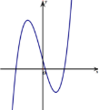

Số điểm cực trị của hàm số đã cho là 

**A.** 2.  **B.** 0.  **C.** 3.  **D.** 1. 

**Câu 4:**  Cho hàm số  *y* = *f* (*x*) có bảng biến thiên như sau 

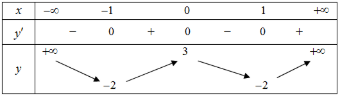

Hàm số đã cho nghịch biến trên khoảng nào dưới đây? 

**A.** (0;1).  **B.** (-¥;0).  **C.** (1;+¥).  **D.** (-1;0) . 

**Câu 5:**  Gọi  *S* là diện tích của hình phẳng giới hạn bởi các đường  *y* = *ex* ,  *y* = 0,  *x* = 0 ,  *x* = 2. Mệnh 

đề nào dưới đây đúng? 

**A.** *S* = π2òe2*xdx*.  **B.** *S* = 2òe*xdx*.  **C.** *S* = π2òe*xdx* .  **D.** *S* = 2òe2*xdx*. 

0 0 0 0

**Câu 6:**  Với *a* là số thực dương tùy ý, ln(5*a*)-ln(3*a*) bằng 

ln(5*a*) ( ) 5 ln5

**A.**~~  .  **B.** ln 2*a* .  **C.** ln .  **D.**~~  . 

ln(3*a*) 3 ln3

**Câu 7:**  Nguyên hàm của hàm số  *f* (*x*) = *x*3 + *x* là 

**A.** *x*4 +*x*2 +*C*.  **B.** 3*x*2 +1+*C*.  **C.** *x*3 + *x*+*C* .  **D.**  1 *x*4 + 1 *x*2 +*C* . 

**A.** *u*3 =(2;1;3).  **B.** *u*uur4 =(-1;2;1).ìïïî*xz* ==32+-*tt* 2 41 2

**Câu 8:**  Trong không gian *Oxyz* , đường thẳng *d* :í*y* =1+ 2*t* có một vectơ chỉ phương là 

uur **C.** *u*uur =(2;1;1).  **D.** *u*ur =(-1;2;3). 

**Câu 9:**  Số phức -3+ 7*i* có phần ảo bằng 

**A.** 3.  **B.** -7.  **C.** -3.  **D.** 7. 

**Câu 10:**  Diện tích của mặt cầu bán kính *R* bằng 

**A.**  4 π*R*2 .  **B.** 2π*R*2 .  **C.** 4π*R*2 .  **D.** π*R*2 . 

3

**Câu 11:**  Đường cong trong hình vẽ là đồ thị của hàm số nào dưới đây? 

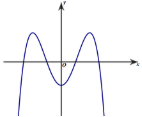

**A.**  *y* = *x*4 -3*x*2 -1.  **B.**  *y* = *x*3 -3*x*2 -1.  **C.**  *y* = -*x*3 +3*x*2 -1.  **D.**  *y* = -*x*4 +3*x*2 -1. 

**Câu 12:**  Trong không gian *Oxyz* , cho hai điểm  *A*(2;-4;3) và  *B*(2;2;7). Trung điểm của đoạn  *AB* có 

tọa độ là 

**A.** (1;3;2).  **B.** (2;6;4).  **C.** (2;-1;5).  **D.** (4;-2;10). 

1

**Câu 13:**  lim bằng 

5*n*+3

**A.** 0.  **B.** 1 .  **C.** +¥.  **D.** 1 . 

3 5

**Câu 14:**  Phương trình 22*x*+1 =32 có nghiệm là 

5 3

**A.** *x* = .  **B.**  *x* = 2.  **C.** *x* = .  **D.**  *x* = 3. 

2 2

**Câu 15:**  Cho khối chóp có đáy là hình vuông cạnh  *a*, chiều cao bằng  2*a* . Thể tích của khối chóp đã 

cho bằng  

**A.** 4*a*3 .  **B.**  2*a*3 .  **C.** 2*a*3 .  **D.**  4*a*3 . 

3 3

**Câu 16:**  Một người gửi tiết kiệm vào một ngân hàng với lãi suất  7,5%/ năm. Biết rằng nếu không rút 

tiền ra khỏi ngân hàng thì cứ sau mỗi năm số tiền lai sẽ được nhập vào vốn để tính lãi cho năm tiếp theo. Hỏi sau ít nhất bao nhiêu năm người đó thu được cả số tiền gửi ban đầu và lãi gấp đôi số tiền gửi ban đầu, giả định trong khoảng thời gian này lãi suất không thay đổi và người đó không rút tiền ra? 

**A.** 11 năm.  **B.** 9 năm.  **C.** 10 năm.  **D.** 12 năm. 

**Câu 17:**  Cho hàm số  *y* = *ax*3 +*bx*2 +*cx*+*d* (*a*,*b*,*c*,*d* Ρ ). Đồ thị hàm số  *y* = *f* (*x*) như hình vẽ bên. 

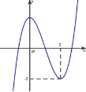

Trang 3/6 – Mã đề thi 101 

Số nghiệm thực của phương trình 3*f* (*x*)+4 = 0 là 

**A.** 3.  **B.** 0.  **C.** 1. 

*x*+9 -3

**Câu 18:**  Số tiệm cận đứng của đồ thị hàm số  *y* = là 

*x*2 + *x*

**A.** 3.  **B.** 2.  **C.** 0. 

**D.** 2. 

**D.** 1. 

Trang /6 – Mã đề thi 101 

**Câu 19:**  Cho hình chóp  *S*.*ABCD* có đáy là hình vuông cạnh  *a*,  *SA* vuông góc với mặt phẳng đáy và 

*SB* = 2*a* . Góc giữa đường thẳng *SB* và mặt phẳng đáy bằng 

**A.** 60°.  **B.** 90°.  **C.** 30°.  **D.** 45°. 

**Câu 20:**  Trong  không  gian  *Oxyz* ,  mặt  phẳng  đi  qua  điểm  *A*(2;-1;2)và  song  song  với  mặt  phẳng 

(*P*):2*x*- *y*+3*z*+2=0 có phương trình là 

**A.** 2*x*+ *y*+3*z*-9=0.   **B.** 2*x*- *y*+3*z*+11=0.  

**C.** 2*x*- *y*-3*z*+11=0.   **D.** 2*x*- *y*+3*z*-11=0. 

**Câu 21:**  Từ một hộp chứa 11 quả cầu màu đỏ và 4 quả cầu màu xanh, lấy ngẫu nhiên đồng thời 3 quả 

cầu. Xác suất để lấy được 3 quả cầu màu xanh bằng 

4 24 4 33

**A.**~~  .  **B.**~~  .  **C.**~~  .  **D.**  . 

455 455 165 91

2

**Câu 22:**  1òe3*x*1-1(d*x* bằng)  1 1 5

**A.**  e5 -e2 .  **B.**  e5 -e2 .  **C.** e5 -e2.  **D.**  (e +e2 ). 

3 3 3

**Câu 23:**  Giá trị lớn nhất của hàm số  *y* = *x*4 -4*x*2 +9 trên đoạn [-2;3] bằng 

**A.** 201.  **B.** 2.  **C.** 9.  **D.** 54. 

**Câu 24:**  Tìm hai số thực *x* và  *y* thỏa mãn (2*x*-3*yi*)+(1-3*i*) = *x*+6*i* với *i* là đơn vị ảo.  

**A.** *x* = -1;  *y* = -3.  **B.** *x* = -1;  *y* =-1.  **C.**  *x* =1;  *y* =-1.  **D.**  *x* =1;  *y* = -3. 

**Câu 25:**  Cho hình chóp  *S*.*ABC* có đáy là tam giác vuông đỉnh  *B*,  *AB* = *a* ,  *SA* vuông góc với mặt 

phẳng đáy và *SA* = 2*a* . Khoảng cách từ  *A* đến mặt phẳng (*SBC*) bằng 

2 5*a* 5*a* 2 2*a* 5*a*

**A.**~~  .  **B.**~~  .  **C.**~~  .  **D.**~~  . 

5 3 3 5

55 *dx*

**Câu 26:**  Cho  ò~~ = *a*ln2+*b*ln5+*c*ln11, với  *a*,*b*, *c* là các số hữu tỉ. Mệnh đề nào dưới đây 

16 *x x*+9

đúng? 

**A.** *a* -*b* = -*c* .  **B.** *a* +*b* = -*c*.  **C.** *a*+*b* = 3*c*.  **D.** *a*-*b* = -3*c*. 

**Câu 27:**  Một chiếc bút chì có dạng khối lăng trụ lục giác đều có cạnh đáy bằng 3mm và chiều cao bằng 200mm . Thân bút chì được làm bằng gỗ và phần lõi được làm bằng than chì. Phần lõi có dạng 

khối trụ có chiều cao bằng chiều dài của bút và đáy là hình tròn có bán kính . Giả định 1m3 gỗ 

có giá  *a*(triệu đồng), 1m3 than chì có giá là 8*a* (triệu đồng). Khi đó giá nguyên vật liệu làm một chiếc bút chì như trên gần nhất với kết quả nào dưới đây? 

**A.** 9,7.*a*(đồng).  **B.** 97,03.*a*(đồng).  **C.** 90,7.*a*(đồng).  **D.** 9,07.*a*(đồng). 

**Câu 28:**  Hệ số của *x*5 trong khai triển biểu thức  *x*(2*x* -1)6 +(3*x* -1)8 bằng 

**A.** -13368.  **B.** 13368.  **C.** -13848.  **D.** 13848. 

**Câu 29:**  Cho hình chóp  *S*.*ABCD*có đáy là hình chữ nhật,  *AB* = *a* ,  *BC* = 2*a* ,  *SA* vuông góc với mặt 

phẳng đáy và *SA* = *a*. Khoảng cách giữa hai đường thẳng  *AC* và *SB* bằng 

6*a* 2*a a a*

**A.**~~  .  **B.**  .  **C.**  .  **D.**  . 

2 3 2 3

**Câu 30:**  Xét các số phức  *z* thỏa mãn (*z* +*i*)(*z*+2) là số thuần ảo. Trên mặt phẳng tọa độ, tập hợp tất 

cả các điểm biểu diễn số phức *z* là một đường tròn có bán kính bằng 

5 5 3

**A.** 1.  **B.**  .  **C.**~~  .  **D.**  . 

4 2 2

**Câu 31:**  Ông  *A* dự định sử dụng hết  6,5m3 kính để làm một bể cá bằng kính có dạng hình hộp chữ 

nhật không nắp, chiều dài gấp đôi chiều rộng (các mối ghép có kích thước không đáng kể). Bể cá có dung tích lớn nhất bằng bao nhiêu (kết quả làm tròn đến hàng phần trăm)? 

**A.** 2,26m3 .  **B.** 1,61m3 .  **C.** 1,33m3 .  **D.** 1,50m3 . 

**Câu 32:**  Một chất điểm  *A* xuất phát từ *O*, chuyển động thẳng với vận tốc biến thiên theo thời gian bởi quy luật *v*(*t*) = 1~~ *t*2 +11*t* (m/s), trong đó *t* (giây) là khoảng thời gian tính từ lúc  *A* bắt đầu 

180 18

chuyển động. Từ trạng thái nghỉ, một chất điểm  *B* cũng xuất phát từ  *O*, chuyển động thẳng cùng hướng với  *A*, nhưng chậm hơn 5 giây so với  *A* và có gia tốc bằng *a* (m/s2 ) (*a* là hằng 

số). Sau khi *B* xuất phát được 10 giây thì đuổi kịp  *A*. Vận tốc của *B* tại thời điểm đuổi kịp  *A* bằng 

**A.** 22 (m/s).  **B.** 15 (m/s).  **C.** 10 (m/s).  **D.** 7 (m/s). 

*x*-3 *y*-1 *z*+7

**Câu 33:**  Trong không gian  *Oxyz* , cho điểm  *A*(1;2;3) và đường thẳng  *d* :~~ =~~ =~~ . Đường 

2 1 -2

thẳng đi qua  *A*, vuông góc với *d* và cắt trục *Ox* có phương trình là 

ì*x* = -1+2*t* ì*x* =1+*t* ì*x* = -1+2*t* ì*x* =1+2*t*

**A.** ïí*y* = 2*t* .  **B.** ïí*y* = 2+ 2*t* .  **C.** ïí*y* = -2*t* .  **D.** ïí*y* = 2+ 2*t* . 

ïî*z* = 3*t* ïî*z* = 3+2*t* ïî*z* = *t* ïî*z* = 3+3*t*

**Câu 34:**  Gọi  *S*  là  tập  hợp  tất  cả  các  giá  trị  nguyên  của  tham  số  *m*  sao  cho  phương  trình 

16*x* -*m*.4*x*+1 +5*m*2 -45 = 0 có hai nghiệm phân biệt. Hỏi *S* có bao nhiêu phần tử? 

**A.** 13.  **B.** 3.  **C.** 6.  **D.** 4. 

*x*+2

**Câu 35:**  Có bao nhiêu giá trị nguyên của tham số  *m* để hàm số  *y* = đồng biến trên khoảng 

*x*+5*m*

(-¥;-10)? 

**A.** 2.  **B.** Vô số.  **C.** 1.  **D.** 3. 

**Câu 36:**  Có bao nhiêu giá trị nguyên của tham số  *m* để hàm số  *y* = *x*8 +(*m*-2)*x*5 -(*m*2 -4)*x*4 +1 đạt 

cực tiểu tại *x* = 0?. 

**A.** 3.  **B.** 5.  **C.** 4.  **D.** Vô số. 

**Câu 37:**  Cho hình lập phương  *ABCD*.*A*¢*B*¢*C*¢*D*¢ có tâm *O*. Gọi  *I* là tâm của hình vuông  *A*¢*B*¢*C*¢*D*¢ và 

*M* là điểm thuộc đoạn thẳng *OI* sao cho *MO* = 2*MI* (tham khảo hình vẽ). 

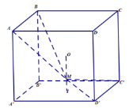

Khi đó côsin của góc tạo bởi hăi mặt phẳng (*MC*¢*D*¢) và (*MAB*) bằng 

6 85 7 85 17 13 6 13

**A.**~~  .  **B.**~~  .  **C.**~~  .  **D.**~~  . 

85 85 65 65

**Câu 38:**  Có bao nhiêu số phức *z* thỏa mãn *z* (*z*-4-*i*)+2*i* =(5-*i*)*z*? 

**A.** 2.  **B.** 3.  **C.** 1.  **D.** 4. 

**Câu 39:**  Trong không gian *Oxyz* , cho mặt cầu (*S*):(*x*+1)2 +(*y* +1)2 +(*z* +1)2 = 9 và điểm  *A*(2;3;-1). 

Xét các điểm  *M* thuộc (*S*)sao cho đường thẳng  *AM* tiếp xúc với (*S*).  *M* luôn thuộc mặt phẳng có phương trình là 

**A.** 6*x*+8*y*+11=0.  **B.** 3*x*+4*y*+2=0.  **C.** 3*x*+4*y*-2 =0.  **D.** 6*x*+8*y*-11=0. 

1 7

**Câu 40:**  Cho hàm số  *y* = *x*4 - *x*2 có đồ thị (*C*). Có bao nhiêu điểm  *A* thuộc (*C*) sao cho tiếp tuyến 

4 2

của (*C*) tại  *A* cắt (*C*) tại hai điểm phân biệt *M* (*x*1; *y*1),  *N* (*x*2; *y*2 ) (*M*, *N* khác  *A*) thỏa mãn 

*y*1 - *y*2 =6(*x*1 -*x*2 )? 

**A.** 1.  **B.** 2.  **C.** 0.  **D.** 3. 

**Câu 41:**  Cho hai hàm số  *f* (*x*) = *ax*3 +*bx*2 +*cx*- 1 và  *g*(*x*) = *dx*2 +*ex*+1 (*a*,*b*,*c*, *d*,*e*Ρ ). Biết rằng 

2

đồ thị của hàm số  *y* = *f* (*x*) và  *y* = *g*(*x*) cắt nhau tại ba điểm có hoành độ lần lượt là -3; -1;1 (tham khảo hình vẽ). 

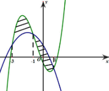

Hình phẳng giới hạn bởi hai đồ thị đã cho có diện tích bằng 

9

**A.**  .  **B.** 8.  **C.** 4.  **D.** 5. 

2

**Câu 42:**  Cho khối lăng trụ  *ABC*.*A*¢*B*¢*C*¢, khoảng cách từ *C* đến *BB*¢bằng 2, khoảng cách từ  *A* đến các 

đường thẳng  *BB*¢ và *CC*¢ lần lượt bằng 1 và  3 , hình chiếu vuông góc của  *A* lên mặt phẳng (*A*¢*B*¢*C*¢) là trung điểm *M* của *B*¢*C*¢ và  *A*¢*M* = 2 3 . Thể tích khối lăng trụ đã cho bằng 

3

2 3

**A.** 2.  **B.** 1.  **C.**  3.  **D.**~~  . 

3

**Câu 43:**  Ba bạn  *A*, *B*,*C* mỗi bạn viết ngẫu nhiên lên bảng một số tự nhiên thuộc đoạn [1;17] để ba số 

được viết ra có tổng chia hết cho 3 bằng   

1728 1079 23 1637

**A.**~~  .  **B.**~~  .  **C.**  .  **D.**~~  . 

4913 4913 68 4913

**Câu 44:**  Cho  *a* > 0,  *b* > 0  thỏa  mãn  log3*a*+2*b*+1 (9*a*2 +*b*2 +1).log6*ab*+1 (3*a* +2*b* +1) = 2.  Giá  trị  của 

*a* +2*b* bằng 

7 5

**A.** 6.  **B.** 9.  **C.**  .  **D.**  . 

2 2

**Câu 45:**  Cho hàm số  *y* = *x*-1 có đồ thị (*C*). Gọi  *I* là giao điểm của hai tiệm cận của (*C*). Xét tam 

*x*+2

giác đều  *ABI* có hai đỉnh  *A*, *B* thuộc (*C*), đoạn thẳng  *AB*  có độ dài bằng 

**A.**  6 .  **B.** 2 3.  **C.** 2.  **D.** 2 2 . 

**Câu 46:**  Cho phương trình  5*x* +*m* = log5 (*x*-*m*)với  *m* là tham số. Có bao nhiêu giá trị nguyên của 

*m*Î(-20;20) để phương trình đã cho có nghiệm ?  

**A.** 20.  **B.** 19.  **C.** 9.  **D.** 21. 

**Câu 47:**  Trong không gian *Oxyz* , cho mặt cầu (*S*) có tâm  *I* (-2;1;2) và đi qua điểm  *A*(1;-2;-1). Xét 

các điểm  *B*,*C*, *D* thuộc (*S*) sao cho  *AB*, *AC*, *AD* đôi một vuông góc với nhau. Thể tích khối tứ diện  *ABCD* có giá trị lớn nhất bằng 

**A.** 72.  **B.** 216.  **C.** 108.  **D.** 36. 

**Câu 48:**  Cho hàm số  *f* (*x*) thỏa mãn  *f* (2) = -92 ,  *f* ¢(*x*) = 2*x*éë *f* (*x*)ùû2 "*x*Î*R*,  *f* (1) = 32. Giá trị  *f* (1)

bằng: 

**A.** -35.  **B.** - 2 .  **C.** -19 .  **D.** - 2 . 

36 3 36 15

ì*x* =1+3*t*

**Câu 49:**  Trong không gian *Oxyz* , cho đường thẳng *d* :ïí*y* =1+ 4*t* . Gọi D là đường thẳng qua  *A*(1;1;1)

ïî*z* =1

và có vectơ chỉ phương  *u*r = (1;-2;2) . Đường phân giác của góc nhọn tạo bởi  *d* và  D có phương trình là 

ì*x* =1+7*t* ì*x* = -1+2*t* ì*x* = -1+2*t* ì*x* =1+3*t*

**A.** ïí*y* =1+*t* .  **B.** ïí*y* = -10+11*t* .  **C.** ïí*y* = -10+11*t* .  **D.** ïí*y* =1+ 4*t* . 

ïî*z* =1+5*t* ïî*z* = -6-5*t* ïî*z* = 6-5*t* ïî*z* =1-5*t*

**Câu 50:**  Cho hàm số  *y* = *f* (*x*),  *y* = *g*(*x*). Hai hàm số  *y* = *f* ¢(*x*)và  *y* = *g*¢(*x*)có đồ thị như hình bên, 

trong đó đường cong đậm hơn là đồ thị của hàm số  *y* = *g*¢(*x*) .  

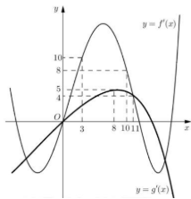

Hàm số *h*(*x*) = *f* (*x*+4)- *g*æç2*x*- 3ö÷ *h*(*x*)= *f* (*x*+4)-*g*æç2*x*- 3ö÷ đồng biến trên khoảng nào 

- 2ø è 2ø

sau đây? 

- 31ö æ9 ö÷ æ31 +¥ö æ6 25ö

**A.** ç5;~~ ÷.  **B.** ç ;3 .  **C.** ç~~ ; ÷.  **D.** ç ;~~ ÷. 

- 5 ø è4 ø è 5 ø è 4 ø ----------------------------HẾT---------------------------- 

Trang 7/6 – Mã đề thi 101 

BỘ GIÁO DỤC VÀ ĐÀO TẠO  **KỲ THI TRUNG HỌC PHỔ THÔNG QUỐC GIA NĂM 2018 ![ref1]**

ĐỀ THI CHÍNH THỨC  **Bài thi: TOÁN** 

*(Đề thi có 06 trang)  Thời gian làm bài: 90 phút, không kể thời gian phát đề *

MÃ ĐỀ THI 102 

1

**Câu 1:**  lim bằng 

5*n*+2

1 1

**A.** .  **B.** 0. **C.** .  **D.** +¥.

5 2

**Câu 2:**  Gọi  *S* là diện tích của hình phẳng giới hạn bởi các đường  *y* = 2*x*,*y* =0,*x* =0,*x* = 2. Mệnh đề 

nào dưới đây đúng? 

**A.** *S* = ò2 2*x*d*x*.  **B.** *S* =pò2 22*x*d*x*. **C.** *S* = ò2 22*x*d*x*. **D.** *S* =pò2 2*x* d*x*.

**Câu 3:**  Tập nghi0 ệm của phương trình log 0( ) 0

**A.** {-3;3}. **B.** {-3}. 2 *x*2 -1 =3 là**C.** {3}. **D.** {- 100; 10}.

**Câu 4:**  Nguyên hàm của hàm số  *f* (*x*) = *x*4 + *x* là 

1 1

**A.** *x*4 + *x*+*C* **B.** 4*x*3 +1+*C*** . **C.** *x*5 + *x*2 +*C* . **D.** *x*5 + *x*2 +*C*. 

5 2

**Câu 5:**  Cho  hàm  số  *y* = *ax*3 +*bx*2 +*cx*+*d* (*a*,*b*,*c*,*d*Ρ )  có  đồ  thị  như  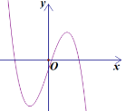

hình vẽ bên. Số điểm cực trị của hàm số đã cho là  

1. 0. 
1. 1. 
1. 3. 
1. 2. 

**Câu 6:**  Số phức có phần thực bằng 3 và phần ảo bằng 4 là  

**A.** 3+ 4*i*. **B.** 4-3*i* . **C.** 3- 4*i*. **D.** 4+3*i*.

**Câu 7:**  Cho khối chóp có đáy là hình vuông cạnh  *a* và chiều cao  4*a* . Thể tích của khối chóp đã cho 

bằng 

**A.** 4*a*3 .  **B.** 16*a*3 .  **C.** 4*a*3 . **D.** 16*a*3 .

3 3

**Câu 8:**  Đường cong trong hình vẽ bên là đồ thị của hàm số nào dưới  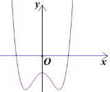

đây?  

1. *y* = *x*4 -2*x*2 -1. 
1. *y* = -*x*4 +2*x*2 -1. 
1. *y* = *x*3 - *x*2 -1. 
1. *y* = -*x*3 + *x*2 -1. 

**Câu 9:**  Thể tích của khối cầu bán kính *R* bằng 

**A.**  4p*R*3 .  **B.** 4p*R*3 .  **C.** 2p*R*3 .  **D.** 3p*R*3 . 

3 4

uuur

**Câu 10:**  Trong không gian *Oxyz* ,  cho hai điểm  *A*(1;1;-2) và *B*(2;2;1). Vectơ  *AB* có tọa độ là 

**A.** (3;3;-1). **B.** (-1;-1;-3). **C.** (3;3;1). **D.** (1;1;3).

**Câu 11.**  Với *a* là số thực dương tùy ý, log3 (3*a*) bằng** 

**A.** 3log3 *a*.  **B.** 3+log3 *a* .  **C.** 1+log3 *a*.  **D.** 1-log3 *a*. 

**Câu 12.**  Cho hàm số  *y* = *f* (*x*) có bảng biến thiên như sau** 

*x* -¥ -1 1 +¥ *y*¢*   + 0  - 0  +

3  +¥

*y*

-¥ -2

Hàm số đã cho đồng biến trên khoảng nào dưới đây? 

**A.** (-1;+¥).  **B.** (1;+¥).  **C.** (-1;1) .  **D.** (-¥;1). 

**Câu 13.**  Có bao nhiêu cách chọn 2 học sinh từ một nhóm 38 học sinh?**  

**A.**  *A*2 .  **B.** 238 .  **C.** *C*2 .  **D.** 382 . 

38 38

*x*+3 *y*-1 *z*-5

**Câu 14.**  Trong không gian *Oxyz* , cho đường thẳng *d* :~~ =~~ = có một vectơ chỉ phương là** 

**A.** *u*ur1 =(3;-1;5).  **B.** *u*uur4 =(1;-1;2).  1**C.** *u*uur2 =-1(-3;1;52).  **D.** *u*uur3 =(1;-1;-2).  

**Câu 15.**  Trong không gian *Oxyz* , mặt phẳng (*P*):3*x*+2*y* + *z* -4 = 0 có một vectơ pháp tuyến là** 

**A.** *n*uur3 =(-1;2;3).  **B.** *n*uur4 =(1;2;-3).  **C.** *n*uur2 =(3;2;1).  **D.** *n*ur1 =(1;2;3). 

**Câu 16.**  Cho hàm số  *f* (*x*)= *ax*4 + *bx*2+ *c* (*a*,*b*,*c*Ρ). Đồ thị của hàm số  *y*= *f* (*x*) như hình vẽ bên. 

Số nghiệm của phương trình 4 *f* (*x*)- 3= 0 là** 

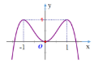

**A.** 4.  **B.** 3.  **C.** 2.  **D.** 0. 

**Câu 17.**  Từ một hộp chứa  7 quả cầu mà đỏ và 5 quả cầu màu xanh, lấy ngẫu nhiên đồng thời 3 quả 

cầu. Xác suất để lấy được 3 quả cầu màu xanh bằng** 

5 7 1 2

**A.**  .  **B.**  .  **C.**  .  **D.**  . 

12 44 22 7

**Câu 18.**  Giá trị nhỏ nhất của hàm số  *y* = *x*3 + 2*x*2 - 7*x* trên đoạn [0;4] bằng** 

**A.** -259.  **B.** 68.  **C.** 0.  **D.** -4. 

**Câu 19.**  Cho hình chóp  *S*.*ABCD* có đáy là hình vuông cạnh  *a*,  *SA* vuông góc với mặt phẳng đáy và 

*SA*= 2*a* . Góc giữa đường thẳng *SC* và mặt phẳng đáy bằng ****

**A.** 45°.  **B.** 60°.  **C.** 30°.  **D.** 90°. 

1

**Câu 20.**  ò *e*3*x*+1d*x* bằng** 

**A.**0 1(*e*4 - *e*).  **B.** *e*4 - *e*.  **C.** 1(*e*4 + *e*).  **D.** *e*3 - *e*. 

3 3

**Câu 21.**  Trong không gian  *Oxyz* , mặt phẳng đi qua điểm  *A*(1;2;-2) và vuông góc với đường thẳng 

*x*+1 *y*- 2 *z*+ 3

D :~~ =~~ = có phương trình là** 

2 1 3

**A.** 3*x*+ 2*y*+ *z*- 5= 0.   **B.** 2*x*+ *y*+ 3*z*+ 2= 0.** 

**C.** *x*+ 2*y*+ 3*z*+ 1= 0.   **D.** 2*x*+ *y*+ 3*z*- 2= 0. 

*x*+ 4- 2

**Câu 22.**  Số tiệm cận đứng của đồ thị hàm số  *y* = là** 

*x*2 + *x*

**A.** 3.  **B.** 0.  **C.** 2.  **D.** 1. 

**Câu 23.**  Cho hình chóp  *S*.*ABC* có đáy là tam giác vuông đỉnh  *B* ,  *AB* = *a*,  *SA* vuông góc với mặt 

phẳng đáy và *SA*= *a*. Khoảng cách từ  *A* đến mặt phẳng (*SBC*) bằng** 

*a* 6*a* 2*a*

**A.**  .  **B.** *a*.  **C.**~~  .  **D.**~~  . 

2 3 2

**Câu 24.**  Một người gửi tiết kiệm vào một ngân hàng với lãi suất 7,2%/ năm. Biết rằng nếu không rút 

tiền ra khỏi ngân hàng thì cứ sau mỗi năm số tiền lãi sẽ được nhập vào vốn để tính lãi cho năm tiếp theo. Hỏi sau ít nhất bao nhiêu năm người đo thu được (cả số tiền gửi ban đầu và lãi) gấp đôi số tiền gửi ban đầu, giả định trong khoảng thời gian này lãi suất không thay đổi và người đó không rút tiền ra?** 

**A.** 11 năm.  **B.** 12 năm.  **C.** 9 năm.  **D.** 10 năm. 

**Câu 25.**  Tìm hai số thực *x* và  *y* thỏa mãn (3*x*+ 2*yi*)+(2+ *i*)= 2*x*- 3*i* với *i* là đơn vị ảo.** 

**A.** *x*=-2; *y*=-2.  **B.** *x*=-2; *y*=-1.  **C.** *x*= 2;*y*=-2.  **D.** *x*= 2; *y*=-1. 

**Câu 26.**  Ông  *A* dự định sử dụng hết  6,7*m*2 kính để làm một bể cá bằng kính có dạng hình hộp chữ 

nhật không nắp, chiều dài gấp đôi chiều rộng (các mối ghép có kích thước không đáng kể). Bể cá có dung tích lớn nhất bằng bao nhiêu (kết quả làm tròn đến hàng phần trăm)?** 

**A.** 1,57*m*3 .  **B.** 1,11*m*3 .  **C.** 1,23*m*3 .  **D.** 2,48*m*3 . 

21

**Câu 27.**  Cho  ò *x* d*xx*+ 4 = *a*ln3+ *b*ln5+ *c*ln7 với  *a*,*b*,*c* là các số hữu tỉ. Mệnh đề nào dưới đây 

5

đúng?** 

**A.** *a*+ *b*=-2*c*.  **B.** *a*+ *b*= *c*.  **C.** *a*- *b*=-*c*.  **D.** *a*- *b*=-2*c*. 

**Câu 28.**  Cho hình chóp  *S*.*ABCD* có đáy là hình chữ nhật,  *AB* = *a*,  *BC* = 2*a* ,  *SA* vuông góc với mặt 

phẳng đáy và *SA*= *a*. Khoảng cách giữa hai đường thẳng *BD* và *SC* bằng** 

30*a* 4 21*a* 2 21*a* 30*a*

**A.**~~  .  **B.**~~  .  **C.**~~  .  **D.**~~  . 

6 21 21 12

*x*+1 *y*-1 *z*- 2

**Câu 29.**  Trong không gian *Oxyz* , cho điểm  *A*(2;1;3) và đường thẳng *d* :~~ =~~ =~~ . Đường 

1 -2 2

thẳng đi qua  *A*, vuông góc với *d* và cắt trục *Oy* có phương trình là** 

**A.** ìïïïïíïïïî*xzy*=== 32-*tt*3+ 4*t* .  **B.** ïïïïïî*xzy*== 312++*t*3*t* .  **C.** ìïïïïíïïïî*xzy*=== 312+++322*ttt* .  **D.** ïïïî*zy*= 2*t*3 3*t* . 

ìï = + 2*t* ìïïïï*x*== 2-*t*+

- íïï ï íï

*x*+ 6

**Câu 30.**  Có bao nhiêu giá trị nguyên của tham số  *m* để hàm số  *y* = nghịch biến trên khoảng 

*x*+ 5*m*

(10;+¥).** 

**A.** 3.  **B.** Vô số.   **C.** 4.   **D.** 5. 

**Câu 31.**  Một chiếc bút chì có dạng khối lăng trụ lục giác đều có cạnh đáy  3mm và chiều cao bằng 200mm. Thân bút chì được làm bằng gỗ và phần lõi được làm bằng than chì. Phần lõi có dạng 

khối trụ có chiều cao bằng chiều dài của bút và đáy là hình tròn có bán kính 1mm. Giả định 

1m3 gỗ có giá *a* (triệu đồng), 1m3 than chì có giá 6*a* (triệu đồng). Khi đó giá nguyên liệu làm một chiếc bút chì như trên gần nhất với kết quả nào dưới đây?** 

**A.** 84,5.*a* (đồng).  **B.** 78,2.*a* (đồng).  **C.** 8,45.*a* (đồng).  **D.** 7,82.*a* (đồng). 

**Câu 32.**  Một chất điểm  *A* xuất phát từ *O*, chuyển động thẳng với vận tốc biến thiên theo thời gian bởi quy luật *v*(*t*) = 1~~ *t*2 + 59*t*(m/s), trong đó *t* (giây) là khoảng thời gian tính từ lúc  *A* bắt đầu 

150 75

chuyển động. Từ trạng thái nghỉ, một chất điểm  *B* cũng xuất phát từ  *O*, chuyển động thẳng cùng hướng với  *A* nhưng chậm hơn 3 giây so với  *A* và có gia tốc bằng *a*(m/s2 ) (*a* là hằng 

số). Sau khi  *B* xuất phát được 12 giây thì đuổi kịp  *A*. Vận tốc của  *B* tại thời điểm đuổi kịp 

*A* bằng  

**A.** 20(m/s).  **B.** 16(m/s).  **C.** 13(m/s).  **D.** 15(m/s). 

**Câu 33.**  Xét các số phức  *z* thỏa mãn (*z* +3*i*)(*z* -3) là số thuần ảo. Trên mặt phẳng tọa độ, tập hợp tất 

cả các điểm biểu diễn các số phức  *z* là một đường tròn có bán kính bằng  

9 3 2

**A.**  .  **B.** 3 2 .  **C.** 3.  **D.**~~  . 

2 2

**Câu 34.**  Hệ số của  *x*5 trong khai triển biểu thức  *x*(3*x*-1)6 +(2*x*-1)8 bằng  

**A.** -3007.  **B.** -577.  **C.** 3007 .  **D.** 577 . 

**Câu 35.**  Gọi  *S*  là  tập  hợp  tất  cả  các  giá  trị  nguyên  của  tham  số  *m*  sao  cho  phương  trình 

25*x* -*m*.5*x*+1 +7*m*2 -7 = 0 có hai nghiệm phân biệt. Hỏi *S* có bao nhiêu phần tử ? 

**A.** 7.  **B.** 1.  **C.** 2.  **D.** 3. 

**Câu 36.**  Cho hai hàm số  *f* (*x*) = *ax*3 +*bx*2 +*cx*-2 và  *g*(*x*) = *dx*2 +*ex*+2 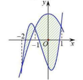(*a*,*b*,*c*,*d*,*e*Ρ ).  Biết  rằng  đồ  thị  của  hàm  số  *y* = *f* (*x*)  và  

*y* = *g*(*x*) cắt nhau tại ba điểm có hoành độ lần lượt là  -2;-1;1  (tham khảo hình vẽ). Hình phẳng giới hạn bởi hai đồ thị đã cho có  

diện tích bằng  

37 13 

**A.**  .  **B.**  .  

6 2 

9 37 

**C.**  .  **D.**  .  

2 12

**Câu 37.**  Cho  *a* >0,  *b* > 0 thỏa mãn  log10*a*+3*b*+1 (25*a*2 +*b*2 +1)+log10*ab*+1 (10*a*+3*b*+1)= 2. Giá trị của 

*a*+2*b* bằng  

5 11

**A.**  .  **B.** 6.  **C.** 22.  **D.**  . 

2 2

**Câu 38.**  Có bao nhiêu giá trị nguyên của tham số  *m* để hàm  *y* = *x*8 +(*m*-1)*x*5 -(*m*2 -1)*x*4 +1 số đạt 

cực tiểu tại *x* = 0 ? 

**A.** 3.  **B.** 2 .  **C.** Vô số.  **D.** 1.  

**Câu 39.**  Cho hình lập phương  *ABCD*.*A*'*B*'*C*'*D*' có tâm *O* . Gọi  *I* là tâm của hình vuông  *ABCD* và *M* là điểm thuộc *OI* sao cho *MO* = 1 *MI* ( tham khảo hình vẽ).  Khi đó, côsin góc tạo bởi hai 

2

mặt phẳng (*MC*'*D*') và (*MAB*) bằng 

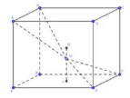

6 13 7 85 6 85 17 13

**A.** .  **B.** .  **C.**~~ .  **D.**~~ . 

65 85 85**  65

**Câu 40:**  Cho hàm số  *f* (*x*) thỏa mãn   *f* (2) = -13 và  *f* ¢(*x*) = *x*éë *f* (*x*)ùû2 với mọi  *x*Ρ . Giá trị của

*f* (1)  bằng . 

11 2 2 7

**A.** - .  **B.**-** .  **C.**- .  **D.** - . 

6 3 9 6

**Câu 41:**  Trong không gian  *Oxyz* ,cho mặt cầu  (*S*) có tâm  *I* (-1;2;1) và đi qua điểm  *A*(1;0;-1). Xét 

các điểm  *B*,*C*,*D* thuộc (*S*) sao cho  *AB*, *AC*, *AD* đôi một vuông góc với nhau. Thể tích của khối tứ diện  *ABCD* lớn nhất bằng 

64 32

**A.**  .  **B.**32** .  **C.**64.  **D.**  . 

3 3

**Câu 42:**  Trong không gian *Oxyz* cho mặt cầu (*S*):(*x*-2)2 +(*y*-3)2 +(*z*-4)2 = 2 và điểm  *A*(1;2;3). 

Xét điểm *M* thuộc mặt cầu (*S*)sao cho đường thẳng *AM* tiếp xúc với (*S*), *M* luôn thuộc mặt phẳng có phương trình là 

**A.** 2*x*+2*y*+2*z*+15 = 0.  **B.**

2*x*+2*y*+2*z*-15 = 0** .  

**C.***x*+ *y*+ *z*+7 =0.  **D.** *x*+ *y*+ *z*-7 = 0. 

**Câu 43:**  Ba bạn A, B, C mỗi bạn viết lên bảng một số tự nhiên thuộc đoạn [1;19].Xác suất để ba số 

được viết ra có tổng chia hết cho 3 bằng . 

1027 2539 2287 109

**A.**~~  .  **B.** .  **C.**~~ .  **D.**~~  . 

6859 6859 6859 323

ì*x* =1+3*t*

**Câu 44:**  Trong không gian *Oxyz* cho đường thẳng  *d* :ïí*y* = -3 .  Gọi D là đường thẳng đi qua điểm 

ïî*z* = 5+4*t*

r

*A*(1;-3;5) và có véc tơ chỉ phương là  *u* = (1;2;-2) . Đường phân giác góc nhọn tạo bởi hai đườngì*x* t=hẳng-1+ 2*dt* và D là  **B.**ìï*x* = -1+2*t*** .  **C.**ìïí*xy*==13+-75*tt* .  **D.** ìï*x* ==1--*t* . 

**A.** ïíïî*zy*==62+-115*tt* .  íïî*zy*==-26-+51*t*1*t* ïî*z* =5+*t* íïî*zy*= 5+37*t*

**Câu 45:**  Cho  phương  trình  3*x* +*m* = log3 (*x*-*m*)  với  là  tham  số.  Có  bao  nhiêu  giá  trị  nguyên  của  

*m*Î(-15;15) để phương trình đã cho có nghiệm? 

**A.** 16.  **B.**9** .  **C.**14.  **D.** 15. 

**Câu 46:**  Cho khối lăng trụ  *ABC*.*A*'*B*'*C* ', khoảng cách từ điểm  *C* đến đường thẳng  *BB*¢ bằng  5 , khoảng cách từ  *A* đến các đường thẳng  *BB*¢  và  *CC*¢  lần lượt bằng 1  và  2 , hình chiếu 

15 vuông góc của  *A* lên mặt phẳng (*A*'*B*'*C*') là trung điểm  *M* của  *B*¢*C*¢  và  *A*'*M* =~~ . Thể 

3

tích của khối lăng trụ đã cho bằng:  

15 2 5 2 15

**A.**~~  .  **B.**~~  .  **C.**  5.  **D.**~~  . 

3 3 3

**Câu 47:**  Cho hai hàm số  *y* = *f* (*x*) và  *y* = *g*(*x*) . Hai hàm số  *y* = *f* '(*x*) và  *y* = *g*'(*x*) có đồ thị như hình  vẽ  bên,  trong  đó  đường  cong  **đậm  hơn**  là  đồ  thị  hàm  số  *y* = *g*'(*x*)  .  Hàm  số 

*h*(*x*) = *f* (*x*+7)- *g*æç2*x*+ 9ö 

2÷ đồng biến trên khoảng nào dưới đây ?  

- ø

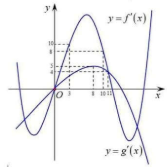

- 16ö æ 3 ö æ16 ö æ 13ö

**A.** ç2;~~ ÷.  **B.** ç- ;0÷.  **C.** ç~~ ;+¥÷.  **D.** ç3;~~ ÷. 

- 5 ø è 4 ø è 5 ø è 4 ø

**Câu 48:**  Cho hàm số  *y* = *x*-1 có đồ thị (*C*). Gọi  *I* là giao điểm của hai tiệm cận của (*C*) . Xét tam 

*x*+1

giác đều  *ABI* có hai đỉnh  *A*, *B* thuộc (*C*), đoạn  *AB* có độ dài bằng:  

**A.** 3.  **B.** 2.  **C.** 2 2 .  **D.** 2 3. 

**Câu 49:**  Có bao nhiêu số phức *z* thỏa mãn *z* (*z*-3-*i*)+2*i* =(4-*i*)*z* ?  ****

**A.** 1.  **B.** 3.  **C.** 2.  **D.** 4. 

**Câu 50:**  Cho hàm số  *y* = 1 *x*4 - 7 *x*2 có  đồ thị là (*C*). Có bao nhiêu điểm  *A* thuộc (*C*) sao cho tiếp 

8 4

tuyến của  (*C*) tại  *A* cắt  (*C*) tại hai điểm phân biệt  *M* (*x*1; *y*1);*N* (*x*2; *y*2 ) (*M*, *N* khác *A* ) thỏa mãn   *y*1 - *y*2 =3(*x*1 - *x*2 ) ?** 

**A.** 0.  **B.** 2.  **C.** 3.  **D.** 1. 

**BỘ GIÁO DỤC VÀ ĐÀO TẠO  KỲ THI TRUNG HỌC PHỔ THÔNG QUỐC GIA NĂM 2018** 

ĐỀ THI CHÍNH THỨC  **Bài thi: TOÁN** 

(*Đề thi có 05 trang*)  *Thời gian làm bài: 90 phút, không kể thời gian phát đề *

**Câu 1:** Với *a* là số thực dương tùy ý, ln(7*a*)-ln(3*a*) bằng 

ln(7*a*) ln7 7

**A.**~~  .  **B.**~~  .  **C.** ln

ln(3*a*) ln3 3

**Câu 2:** Cho hàm số  *y* = *ax*4 +*bx*2 +*c*(*a*,*b*,*c*Ρ ) có đồ thị như hình vẽ 

bên. Số điểm cực trị của hàm số đã cho là 

**A.** 2.   **B.** 3.  

**C.** 0.   **D.** 1. 

  **Mã đề thi 103** 

**D.** ln(4*a*) 

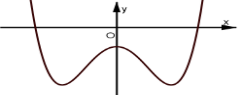

**Câu 3.** Thể tích của khối trụ tròn xoay có bán kính đáy *r* và chiều cao *h* bằng 

**A.** 1p*r*2*h*.  **B.** 2p*rh*.  **C.**  4p*r*2*h* .  **D.** p*r*2*h*. 

3 3

**Câu 4.** Cho hình phẳng (*H*) giới hạn bởi các đường  *y* = *x*2 + 3, *y* - 0, *x* = 0, *x* = 2 . Gọi *V* là thể tích của khối tròn xoay được tạo thành khi quay (*H*) xung quanh trục O*x*. Mệnh đề nào dưới đây đúng ?  

**A.** *V* = p ò2 (*x*2 + 3)2 *dx* .  **B.** *V* = p ò2 (*x*2 + 3)*dx* .  **C.** *V* = ò2 (*x*2 + 3)2 *dx* .  **D.** *V* = ò2 (*x*2 + 3)*dx* . 

0 0 0 0

**Câu 5.** Từ các chữ số 1,2,3,4,5,6,7 lập được bao nhiêu số tự nhiên gồm hai chữ số khác nhau ?  

**A.** *C*72 .   **B.** 27 .   **C.** 72 .   **D.**  *A*72 . **Câu 6.** Đường cong trong hình vẽ bên là đồ thị của hàm số nào dưới đây?  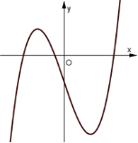

1. *y* = -*x*4 + *x*2 -1.   
1. *y* = *x*4 -3*x*2 -1.  
1. *y* = -*x*3 -3*x*-1.   
1. *y* = *x*3 -3*x*-1.  

**Câu 7.** Cho hàm số  *y* = *f* (*x*) có bảng biến thiên như sau  

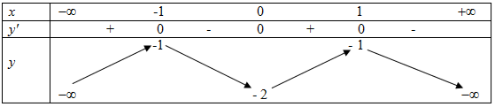

Hàm số đã cho đồng biến trên khoảng nào dưới đây ? 

**A.** ( - 1; 0).  **B.** (1; +¥).  **C.** (-¥; 1).   **D.** (0; 1). 

**Câu 8.** Cho khối lăng trụ có đáy là hình vuông cạnh *a*  và chiều cao bằng 4*a*. Thể tích khối lăng trụ đã cho bằng 

16 4

**A.** 4*a*3   **B.**  *a*3  **C.**  *a*3  **D.** 16*a*3 

3 3

**Câu 9.** Trong không gian *Oxyz*, cho mặt cầu (*S*):(*x*+3)2 +(*y* +1)2 +(*z* -1)2 = 2. Tâm của (*S*) có tọa độ là 

**A.** (3;1;-1).   **B.** (3;-1;1).   **C.** (-3;-1;1).   **D.** (-3;1;-1). 

1

**Câu 10.** lim bằng 

2*n*+7

1 1

**A.**  .   **B.** +¥.  **C.**  .   **D.** 0. 

7 2

**Câu 11.** Số phức 5+6*i* có  phần thực bằng  

**A.** – 5.   **B.** 5.   **C.** – 6.   **D.** 6. 

**Câu 12.** Trong không gian *Oxyz*, mặt phẳng (*P*):2*x*+3*y* + *z* -1= 0 có một vectơ pháp tuyến là 

**A.Câu 13.***n*ur1 =( 2T;ậ3p ng;-1)hi. ệm của phương**B.** tr*n*uur3ình =(1;log3;2)(.*x* -7)= 2 là  **C.** *n*uur4 = (2;3;1).  **D.** *n*uur2 = (-1;3;2) 

2

**A.** {- 15; 15}.  **B.** {-4;4}.  3 **C.** {4}.  **D.** {-4}. 

**Câu 14.** Nguyên hàm của hàm số *y* = *x*4 + *x*2 là 

**A.** 4*x*3 +2*x*+*C* .  **B.** 1 *x*5 + 1 *x*3 +*C* .  **C.** *x*4 + *x*2 +*C*   **D.** *x*5 + *x*3 +*C*. 

5 3

*x*+2 *y*-1 *z*+2

**Câu 15.** Trong không gian O*xyz*, điểm nào dưới đây thuộc đường thẳng *d* :~~ =~~ = ? 

1 1 2

**A.** *P*(1;1;2).   **B.** *N*(2;-1;2).   **C.** *Q*(-2;1;-2).  **D.** *M*(-2;-2;1) . 

**Câu 16.** Từ một hộp chứa 9 quả cầu màu đỏ và 6 quả cầu màu xanh, lấy ngẫu nhiên đồng thời 3 quả cầu. Xác suất để lấy được 3 quả cầu màu xanh bằng 

12 5 24 4

**A.**  .   **B.**  .   **C.**  .  **D.**  . 

65 21 91 91

**Câu 17.** Trong không gian *Oxyz,* cho ba điểm  *A*(-1;1;1),*B*(2;1;0),*C*(1;-1;2). Mặt phẳng đi qua  *A* và vuông góc 

với đường thẳng *BC*  có phương trình là 

**A.** *x*+2*y*-2*z*+1= 0.   **B.** *x*+2*y*-2*z*-1= 0.  

**C.** 3*x*+2*z* -1= 0.  **D.** 3*x*+2*z* +1= 0. 

*x* -25 -5

**Câu 18.** Số tiệm cận đứng của đồ thị hàm số  *y* = 2 là 

*x*2 + *x*

**A.** 2.   **B.** 0.   **C.** 1.   **D.** 3. **Câu 19.** Tích phân ò12 3*x*d-*x* 2** bằng 

1 2

**A.** 2ln2.  **B.**  ln2.  **C.**  ln2.  **D.** ln2. 

3 3

**Câu 20.** Cho hình chóp *S*.*ABC* có đáy là tam giác vuông tại *C*,  *AC* = *a*,*BC* = 2*a* . *SA* vuông góc với mặt phẳng đáy và *SA* = *a*. Góc giữa đường thẳng *SB* và mặt phẳng đáy bằng  

**A.** 600 .  **B.** 900 .  **C.** 300 .  **D.** 450 . 

**Câu 21.** Giá trị nhỏ nhất của hàm số  *y* = *x*3 +3*x*2 trên đoạn [-4;-1] bằng 

**A.** – 4.   **B.** – 16.  **C.** 0.   **D.** 4. 

**Câu 22.** Cho hàm số  *y* = *f* (*x*) liên tục trên đoạn [-2;2] và có đồ thị như hình  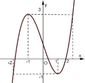

vẽ bên. Số nghiệm thực của phương trình 3*f* (*x*)-4 = 0 trên đoạn [-2;2] là  

**A.** 3.                                         **B.** 1.   

**C.** 2.                                         **D.** 4.  

**Câu 23.** Tìm hai số thực *x* và *y* thỏa mãn (3*x*+ *yi*)+(4-2*i*) = 5*x*+2*i* với *i*  là đơn vị ảo. 

**A.** *x* = -2;*y* = 4.  **B.** *x* = 2;*y* = 4.  **C.** *x* = -2;*y* = 0.  **D.** *x* = 2;*y* = 0. 

**Câu 24.** Cho hình chóp *S*.*ABCD* có đáy là hình vuông cạnh  3*a*,*SA* vuông góc với mặt phẳng đáy và *SA* = *a*. Khoảng cách từ *A* đến mặt phẳng (*SBC*) bằng 

5*a* 3*a* 6*a* 3*a*

**A.**~~  .  **B.**~~  .  **C.**~~  .  **D.**~~  . 

3 2 6 3

**Câu 25.** Một người gửi tiết kiệm vào một ngân hàng với lãi suất 6,6%/năm. Biết rằng nếu không rút tiền ra khỏi ngân hàng thì cứ sau mỗi năm số tiền lãi sẽ được nhập vào vốn để tính lãi cho năm tiếp theo. Hỏi sau ít nhất bao nhiêu năm người đó thu được (cả số tiền gửi ban đầu và lãi) gấp đôi số tiền gửi ban đầu, giả định trong khoảng thời gian này lãi suất không thay đổi và người đó không rút tiền ra ? 

**A.** *a*+*b* = *c*.   **B.** *a*+*b* = -*c*.   **C.** *a*-*b* = *c*.   **D.** *a*-*b* = -*c* . 

**Câu 26.** Cho ò*e* (1+ *x*ln *x*)d*x* = *ae*2 +*be*+*c* với *a*,*b*,*c* là các số hữu tỉ. Mệnh đề nào dưới đây đúng ? 

1

**A.** 11 năm.  **B.** 10 năm.  **C.** 13 năm.  **D.** 12 năm. 

**Câu 27.** Một chất điểm *A* xuất phát từ *O*,*  chuyển động thẳng với vận tốc biến thiên theo thời gian bởi quy luật *v*(*t*) = 1~~ *t*2 + 13 *t* (m/s), trong đó *t* (giây) là khoảng thời gian tính từ lúc *A* bắt đàu chuyển động. Từ trạng thái 

100 30

nghỉ, một chất điểm *B* cũng xuất phát từ *O*, chuyển động thẳng cùng hướng với *A* nhưng chậm hơn 10 giây so với đi**A.Câ**ểm đu1**u 28**5(m/s).**.**ổXéi k t cáịp *A*c  sbằốngphức *z* th2 ỏ**B.**a mã9(m/s)n (*z*.+2*i*)(*z*-2) là số thu**C.**ần 42(ảo. Tm/s).rên mặt phẳng tọa độ**D.**, tậ25(p hm/s)ợp tấ.t cả các điểm 

*A* và có gia tốc bằng *a* (m/s ) (*a* là hằng số). Sau khi *B* xuất phát được 15 giây thì đưởi kịp *A*. Vận tốc của *B* tại thời biểu diễn các số phức *z* là một đường tròn có bán kính bằng 

**A.** 2.   **B.** 2 2 .  **C.** 4.   **D.**  2 . 

**Câu 29.** Hệ số của *x*5 trong khai triển biểu thức  *x*(2*x*-1)6 +(*x*-3)8 bằng 

**A.** – 1272.  **B.** 1272.  **C.** – 1752.  **D.** 1752. 

**Câu 30.** Ông A dự định sử dụng hết 5 m2 kính để làm một bể cá bằng kính có dạng hình hộp chữ nhật không nắp, chiều dài gấp đôi chiều rộng (các mối ghép có kích thước không đáng kể). Bể cá có dung tích lớn nhất bằng bao nhiêu (kết quả làm tròn đến hàng phần trăm) ? 

**A.** 1,01 m3.  **B.** 0,96 m3.  **C.** 1,33 m3.  **D.** 1,51 m3. 

**Câu 31.** Có bao nhiêu giá trị nguyên của tham số *m* để hàm số  *y* = *x*+1 nghịch biến trên khoảng (6;+¥) ? 

*x*+3*m*

**A.** 3.   **B.** Vô số.  **C.** 0.   **D.** 6. 

**Câu 32.** Cho tứ diện *OABC* có *OA*,*OB*,*OC* đôi một vuông góc với nhau, *OA* = *OB* = *a* và *OC* = 2*a*. Gọi *M* là trung điểm của *AB*. Khoảng cách giữa hai đường thẳng *OM* và *AC* bằng 

2*a* 2 5*a* 2*a* 2*a*

**A.**~~  .  **B.**~~  .  **C.**~~  .  **D.**  . 

3 5 2 3

**Câu 33.** Gọi *S* là tập hợp tất cả các giá trị nguyên của tham số *m* sao chho phương trình 4*x* -*m*.2*x*+1 +2*m*2 -5 = 0 có hai nghiệm phân biệt. Hỏi *S* có bao nhiêu phần tử ? 

**A.** 3.   **B.** 5.   **C.** 2.   **D.** 1. 

**Câu 34.** Một chiếc bút chì có dạng khối lăng trụ lục giác đều có cạnh đáy bằng 3 mm và chiều cao bằng 200 mm. Thân bút được làm bằng gỗ và phần lõi được làm bằng than chì. Phần lõi có dạng khối trụ có chiều cao bằng chiều dài của bút và đáy là hình tròn có bán kính 1 mm. Giả định 1 m3 gỗ có giá *a* (triệu đóng), 1 m3 than chì có giá 9*a* (triệu đồng). Khi đó giá nguyên vật liệu làm một chiếc bút chì như trên gần nhất với kết quả nào dưới đây ? 

**A.** 97,03.*a* (đồng).  **B.** 10,33.*a* (đồng).  **C.** 9,7.*a* (đồng).  **D.** 103,3.*a* (đồng). 

*x*+1 *y z* +2

**Câu 35.** Trong không gian *Oxyz*, cho đường thẳng D:~~ = = và mặt phẳng (*P*): *x*+ *y* - *z* +1= 0. 

2  -1 2

Đường thẳng nằm trong (*P*) đồng thời cắt và vuông góc với D có phương trình là 

ìï*x* = -1+*t* ìï*x* = 3+*t* ìï*x* = 3+*t* ìï*x* = 3+ 2*t*

**A.** í*y* = -4*t* .  **B.** í*y* = -2+4*t* .  **C.** í*y* = -2-4*t* .  **D.** í*y* = -2+6*t* . 

ïî*z* = -3*t* ïî*z* = 2+*t* ïî*z* = 2-3*t* ïî*z* = 2+*t*

**Câu 36.** Có bao nhiêu số phức  *z* thỏa mãn *z*(*z* -6-*i*)+2*i* = (7-*i*)*z* ?  

**A.** 2.   **B.** 3.   **C.** 1.   **D.**  4. 

**Câu 37.** Cho *a* > 0,*b* > 0 thỏa mãn log4*a*+5*b*+1(16*a*2 +*b*2 +1) = 2 . Giá trị của *a* +2*b* bằng 

27 20

**A.** 9.   **B.** 6.   **C.**  .  **D.**  . 

4 3

**Câu 38.** Cho hình lập phương  *ABCD*.*A*¢*B*¢*C*¢*D*¢có tâm *O*. Gọi *I*  là tâm của hình  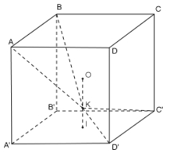vuông  *A*¢*B*¢*C*¢*D*¢ và *M* là điểm thuộc đoạn *OI* sao cho *OM* = 2*MI* (tham khảo  hình vẽ). Khi đó sin của góc tạo bởi hai mặt phẳng (*MC*¢*D*¢)và (*MAB*) bằng  

6 13 7 85 

**A.**~~  .  **B.**~~  .  

65 85 

17 13 6 85 

**C.**~~  .  **D.**~~  .  

65 85 

ìï*x* =1+*t*

**Câu 39.** Trong không gian *Oxyz*, cho đường thẳng *d* :í*y* = 2+*t* . Gọi D là đường thẳng đi qua điểm *A*(1;2;3)* và 

ïî*z* = 3

r

có vectơ chỉ phương *u* = (0;-7;-1). Đường phân giác của góc nhọn tạo bởi *d* và D có phương trình là 

ìï ìï ìï ìï

*x* =1+6*t x* = -4+5*t x* = -4+5*t x* =1+5*t*

**A.** í*y* = 2+11*t*.  **B.** í*y* = -10+12*t* .  **C.** í*y* = -10+12*t* .  **D.** í*y* = 2-2*t*. 

ïî*z* = 3+8*t* ïî*z* = 2+*t* ïî*z* = -2+*t* ïî*z* = 3-*t*

**Câu 40.** Cho hàm số  có đồ thị (*C*). Gọi *I* là giao điểm của hai tiệm cận của (*C*). Xét tam giác đều *ABI* có hai đỉnh *A,B* thuộc (*C*), đoạn thẳng *AB* có độ dài bằng  

**A.** 2 2 .  **B.** 4.   **C.** 2.   **D.** 2 3. 

**Câu 41.** Cho hàm số  *f* (*x*) thỏa mãn  *f* (2) = - 1 và  *f* ¢(*x*) = 4*x*3 [ *f* (*x*)]2 với mọi *x*Ρ . Giá trị của  *f* (1) bằng 

25

**A.** - 41 .  **B.** - 1 .  **C.** - 391 .  **D.** - 1 . 

400 10 400 40

**Câu 42.** Cho phương trình 7*x* +*m* = log7 (*x*-*m*) với *m* là tham số. Có bao nhiêu giá trị nguyên của *m*Î(-25;25) 

để phương trình đã ch có nghiệm ?  

**A.** 9.   **B.** 25.   **C.** 24.   **D.** 26. **Câu  43.**  Cho  hai  hàm  số  *f* (*x*) = *ax*3 +*bx*2 +*cx*-1  và  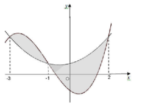

*g*(*x*) = *dx*2 +*ex*+ 1 (*a*,*b*,*c*,*d*,*e*Ρ). Biết rằng đồ thị của hàm số  

2 

*y* = *f* (*x*) và  *y* = *g*(*x*) cắt nhau tại ba điểm có hoành độ lần lượt  là – 3; – 1; 2 (tham khảo hình vẽ bên). Hình phẳng giới hạn bởi  

hai đồ thị đã cho có diện tích bằng  

253 125 

**A.**~~  .  **B.**~~  .  

12 12 

253 125 

**C.**~~  .  **D.**~~  .  

48 48

**Câu 44.** Cho hai hàm số  *y* = *f* (*x*), *y* = *g*(*x*). Hai hàm số  *y* = *f* ¢(*x*)và  *y* = *g*¢(*x*) có đồ thị như hình vẽ bên, trong đó đường cong đậm hơn là đồ thị của hàm số  *y* = *g*¢(*x*). Hàm số *h*(*x*) = *f* (*x* 3) *g*æè2*x*- 2÷ø đồng biến trên 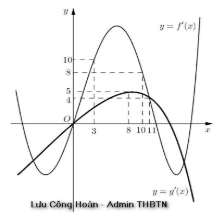

\+ - ç 7ö

khoảng nào dưới đây ? 

æ13 ö

**A.** ç 4 ;4÷. 

1. ø
2. æç7;29ö÷.  
   1. 4 ø
- 36ö
3. ç6;~~ ÷. 
- 5 ø æ36 ö
4. ç~~ ;+¥÷. 
- 5 ø

**Câu 45.** Cho khối lăng trụ  *ABC*.*A*¢*B*¢*C*¢, khoảng cách từ *C* đến đường thẳng  *BB*¢ bằng 2, khoảng cách từ *A* đến các đường thẳng *BB*¢ và *CC*¢lần lượt bằng 1 và  3 , hình chiếu vuông góc của A lên mặt phẳng (*A*¢*B*¢*C*¢) là trung 

điểm *M* của *B*¢*C*¢ và  *A*¢*M* = 2 . Thể tích của khối lăng trụ đã cho bằng 

2 3

**A.**  3 .  **B.** 2.   **C.**~~ .  **D.** 1. 

3

**Câu 46.** Trong không gian *Oxyz*, cho mặt cầu (*S*):(*x*-1)2 +(*y* -2)2 +(*z* -3)2 =1 và điểm *A*(2;3;4). Xét các điểm 

*M* thuộc (*S*) sao cho đường thẳng *AM* tiếp xúc với (*S*), *M*  luôn thuộc mặt phẳng có phương trình là 

**A.** 2*x*+2*y*+2*z* -15= 0.  **B.** *x*+ *y*+ *z* -7 = 0.  

**C.** 2*x*+2*y*+2*z*+15= 0.  **D.** *x*+ *y*+ *z* +7 = 0. 

**Câu 47.** Có bao nhiêu giá trị nguyên của tham số *m* để hàm số  *y* = *x*8 +(*m*-4)*x*5 -(*m*2 -16)*x*4 +1 đạt cực tiểu tại  *x* = 0 ? 

**A.** 8.   **B.** Vô số.  **C.** 7.   **D.** 9. 

**Câu 48.** Trong không gian *Oxyz*, cho mặt cầu (*S*) có tâm *I*(1;2;3) và đi qua điểm *A*(5;-2;-1). Xét các điểm *B,C,D* thuộc (*S*) sao cho *AB,AC,AD* đôi một vuông góc với nháu. Thể tích của khối tứ diện *ABCD* có giá trị lớn nhất bằng 

256 128

**A.** 256.  **B.** 128.   **C.**~~  .  **D.**~~  . 

3 3

**Câu 49.** Ba bạn A, B, C mỗi bạn viết ngẫu nhiên lên bảng một số tự nhiên thuộc đoạn [1;14]. Xác suất để ba số được viết ra có tổng chia hết cho 3 bằng 

457 307 207 31

**A.**~~  .  **B.**~~  .  **C.**~~  .  **D.**  . 

1372 1372 1372 91

**Câu 50.** Cho hàm số  *y* = 1 *x*4 -14 *x*2 có đồ thị (*C*). Có bao nhiêu điểm *A* thuộc (*C*) sao cho tiếp tuyến của (*C*) tại *A*  

3  3

cắt (*C*) tại hai điểm phân biệt *M*(*x*1; *y*1),*N*(*x*2; *y*2) (*M,N* khác *A*) thỏa mãn  *y*1 - *y*2 =8(*x*1 -*x*2) ? 

**A.** 1.   **B.** 2.   **C.** 0.   **D.** 3. 

**--------------------- Hết ----------------------** 

BỘ GIÁO DỤC VÀ  ĐÀO TẠO  **KỲ THI TRUNG HỌC PHỔ THÔNG QUỐC GIA NĂM 2018 **

ĐỀ THI CHÍNH THỨC  **Bài thi: TOÁN** 

**MÃ ĐỀ: 104**  *Thời gian làm bài: 90 phút, không kể thời gian phát đề *

**CâCâu 1.u 2.** T**A.**Trừ ong2cá8 c . khôngchữ số g1ia, n 2*O*, *x*3*y*, *z*4, m**B.**,  5ặ*C*t ph, 826.ẳ, ng7 , (8*P*l)ậ: p đư2*x*+ợc *y***C**ba+**.**3o nhiê*Az*82-. 1=u s0ố  ctó mự nhiêột ven gcồ**D.**tơ pháp tum ha82 . i chữ yếsố n làkhác nhau? 

**A.** *n*uur4 = (1;3; 2).  **B.** *n*ur1 = (3;1; 2).  **C.** *n*uur3 = (2;1;3).  **D.** *n*uur2 = (-1;3; 2). 

**Câu 3.**  Cho hàm số  *y* = *ax*4 +*bx*2 +*c* (*a*,*b*,*c*Ρ ) có đồ thị như hình vẽ bên. Số  *y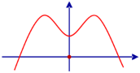*

điểm cực trị của hàm số đã cho là 

**A.** 0 . **B.** 1.

**C.** 2. **D.** 3. *O x*

**Câu 4.**  Đường cong trong hình vẽ bên là đồ thị của hàm số nào dưới đây ?  *y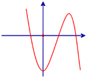*

1. *y* = *x*3 -3*x*2 -2.
1. *y* = *x*4 -*x*2 -2.

*O x*

3. *y* = -*x*4 + *x*2 -2.
3. *y* = -*x*3 +3*x*2 -2.
- 3ö 

**Câu 5.**  Với *a* là số thực dương tùy ý, log3 ç *a* ÷ bằng 

- ø

**A.** 1-log3 *a* .  **B.** 3-log3 *a*.  **C.** *n*uur3 = (2;1;3).  **D.** *n*uur2 = (-1;3; 2). 

**Câu 6.**  Nguyên hàm của hàm số  *f* (*x*) = *x*3 + *x*2 là 

**A.** *x*4 + *x*3 +*C* . **B.** 1 *x*4 + 1 *x*3 +*C* .  **C.** 3*x*2 +2*x*+*C* . **D.** *x*3 + *x*2 +*C* .

4  3

**Câu 7.**  Cho hàm số  *y* = *f* (*x*) có bảng biến thiên như sau 

*x* -¥ -2 3 +¥

*y*¢ - 0 + 0 -

+¥ 4 

*y* 

0 -¥

**A.** (-2;+¥). **B.** (-2;3). **C.** (3;+¥). **D.** (-¥;-2).

**Câu 8.**  Trong không gian *Oxyz* , mặt cầu (*S*): (*x*-5)2 +(*y*-1)2 +(*z*+2)2 =3 có bán kính bằng

**A.**  3.  **B.** 2 3.  **C.** 3. **D.** 9.

**Câu 9.**  Số phức có phần thực bằng 1 và phần ảo bằng 3 là 

**A.** -1-3*i* . **B.** 1-3*i* . **C.** -1+3*i*. **D.** 1+3*i*.

ì*x* =1-*t*

**Câu 10.**  Trong không gian *Oxyz* , điểm nào dưới đây thuộc đường thẳng *d* : ïí*y* = 5+*t* ? 

ïî*z* = 2+3*t*

**A.** *P*(1; 2;5). **B.** *N*(1;5;2). **C.** *Q*(-1;1;3). **D.** *M* (1;1;3).

**Câu 11.**  Cho khối lăng trụ có đáy là hình vuông cạnh *a* và chiều cao bằng 2*a*. Thể tích của khối lăng trụ 

đã cho bằng  

**A.**  2*a*3 .  **B.**  4*a*3 .  **C.** 2*a*3 .  **D.** 4*a*3 . 

3 3

**Câu 12.**  Diện tích xung quanh của hình trụ tròn xoay có bán kính đáy *r* và độ dài đường sinh *l* bằng  

**A.** p*rl* .  **B.** 4p*rl* .  **C.** 2p*rl* .  **D.**  4p*rl*. 

3

**Câu 13.**  Cho hình phẳng (*H*) giới hạn bởi các đường thẳng  *y* = *x*2 +2,  *y* =0, *x* =1, *x* = 2. Gọi *V* là thể 

tích của khối tròn xoay được tạo thành khi quay (*H* ) xung quanh trục *Ox* . Mệnh đề nào dưới đây đúng ? 

**A.** *V* = pò2 (*x*2 +2)2 d*x*.  **B.** *V* = ò2 (*x*2 +2)2 d*x*.  **C.** *V* = pò2 (*x*2 +2)d*x* .  **D.** *V* = ò2 (*x*2 +2)d*x*. 

1 1 1 1

**Câu 14.**  Phương trình 52*x*+1 =125 có nghiệm là 

**A.** *x* = 3 .  **B.** *x* = 5 .  **C.** *x* =1.  **D.** *x* =3. 

2 2

1

**Câu 15.**  lim bằng 

2*n*+5

**A.**  1 .  **B.** 0 .  **C.** +¥.  **D.** 1. 

2 5

**Câu 16.**  Một người gửi tiết kiệm vào một ngân hàng với lãi suất 6,1%/năm. Biết rằng nếu không rút tiền ra 

khỏi ngân hàng thì cứ sau mỗi năm số tiền lãi sẽ được nhập vào vốn để tính lãi cho năm tiếp theo. Hỏi sau ít nhất bao nhiêu năm người đó thu được (cả số tiền gửi ban đầu và lãi) gấp đôi số tiền gửi ban đầu, giả định trong khoảng thời gian này lãi suất không thay đổi và người đó không rút tiền ra?  

**A.** 13 năm.  **B.** 10 năm.  **C.** 11 năm.  **D.** 12 năm. 

**Câu 17.**  Cho hình chóp *S*.*ABC* có *SA* vuông góc với mặt phẳng đáy,  *AB* = *a* và *SB* = 2*a*. Góc giữa 

đường thẳng *SB* và mặt phẳng đáy bằng  

**A.** 60°.  **B.** 45°.  **C.** 30°.  **D.** 90°. 

**Câu 18.**  Cho hình chóp *S*.*ABC* có đáy là tam giác vuông cân tại *C* , *BC* = *a* , *SA* vuông góc với mặt phẳng 

đáy và *SA* = *a*. Khoảng cách từ  *A* đến mặt phẳng (*SBC*) bằng    

2*a a* 3*a*

**A.**  2*a*.  **B.**~~  .  **C.**  .  **D.**~~  . 

2 2 2

*x*+16 -4

**Câu 19.**  Số tiệm cận đứng của đồ thị hàm số  *y* = là 

*x*2 + *x*

**A.** 0 .  **B.** 3.  **C.** 2.  **D.** 1. 

**Câu 20.**  ò2 2*x*d*x*+3 bằng 

1

7 1 7 1 7

**A.** 2ln .  **B.**  ln35.  **C.** ln .  **D.**  ln . 

5 2 5 2 5

**Câu 21.**  Từ một hộp chứa 10 quả cầu màu đỏ và 5 quả cầu màu xanh, lấy ngẫu nhiên đồng thời 3 quả cầu. 

Xác suất để lấy được 3 quả cầu màu xanh bằng 

2 12 1 24

**A.**  .  **B.**  .  **C.**  .  **D.**  . 

91 91 12 91

**Câu 22.**  Giá trị lớn nhất của hàm số  *y* = *x*4 - *x*2 +13 trên đoạn [-1; 2] bằng 

51

**A.** 25.  **B.**  .  **C.** 13.  **D.** 85. 

4

**Câu 23.**  Trong không gian *Oxyz* , cho hai điểm  *A*(5; -4; 2) và *B*(1; 2; 4). Mặt phẳng đi qua  *A* và vuông 

góc với đường thẳng  *AB* có phương trình là  

**A.** 2*x*-3*y*- *z*+8=0.  **B.** 3*x*- *y*+3*z*-13=0.  

**C.** 2*x*-3*y*- *z*-20 = 0.  **D.** 3*x*- *y*+3*z*-25= 0.  *y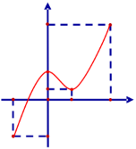*

**Câu 24.**  Cho hàm số  *y* = *f* (*x*) liên tục trên đoạn [-2; 4] và có đồ thị như hình vẽ bên .  6

Số nghiệm thực của phương trình 3*f* (*x*)-5 = 0 trên đoạn [-2; 4] là 

1. 0 .**  2

-2 1

2. 3. 

*O* 4 *x*

3. 2.  2
3. 1.  -3

**Câu 25.**  Tìm hai số *x* và  *y* thỏa mãn (2*x*-3*yi*)+(3-*i*) = 5*x*-4*i* với *i* là đơn vị ảo.  

**A.** *x* = -1;  *y* = -1 .  **B.** *x* = -1;  *y* =1 .  **C.** *x* =1;  *y* = -1 .  **D.** *x* =1;  *y* =1 . 

*x*+2

**Câu 26.**  Có bao nhiêu giá trị nguyên của tham số *m* để hàm số  *y* = đồng biến trên khoảng 

*x*+3*m*

(-¥;-6) ? 

**A.** 2 .  **B.** 6 .  **C.** Vô số.  **D.** 1. 

**Câu 27.**  Một chất điểm  *A* xuất phát từ *O*, chuyển động thẳng với vận tốc biến thiên theo thời gian bởi quy 

1 58

luật *v*(*t*) = *t*2 + *t* (m/s), trong đó *t* (giây) là khoảng thời gian tính từ lúc  *A* bắt đầu chuyển 

120 45

động. Từ trạng thái nghỉ, một chất điểm *B* cũng xuất phát từ *O*, chuyển động thẳng cùng hướng với  *A* nhưng chậm hơn 3 giây so với  *A* và có giá tốc bằng *a* (m/s2) (*a* là hằng số). Sau khi *B* xuất phát được 15 giây thì đuổi kịp  *A*. Vận tốc của *B* tại thời điểm đuổi kịp  *A* bằng    

**A.** 25 (m/s).  **B.** 36(m/s).  **C.** 30(m/s).  **D.** 21(m/s). 

**Câu 28.**  Gọi *S* là tập hợp các giá trị nguyên của tham số *m* sao cho phương trình 

9*x* -*m*.3*x*+1 +3*m*2 -75 = 0 có hai nghiệm phân biệt. Hỏi *S* có bao nhiêu phần tử ? 

**A.** 8.  **B.** 4.  **C.** 19.  **D.** 5. 

**Câu 29.**  Xét các số phức  *z* thỏa mãn (*z* -2*i*)(*z* + 2) là số thuần ảo. Trên mặt phẳng tọa độ, tập hợp tất cả 

các điểm biểu diễn các số phức  *z* là một đường tròn có bán kính bằng 

**A.** 2 2 .  **B.**  2 .  **C.** 2.  **D.** 4. 

**Câu 30.**  Một chiếc bút chì có dạng khối lăng trụ lục giác đều có cạnh đáy 3mm và chiều cao 200mm. 

Thân bút chì được làm bằng gốc và phần lõi được làm bằng than chì. Phần lõi có dạng khối trụ có chiều cao bằng chiều dài của bút và đáy là hình tròn có bán kính 1mm. Giả định 1m3 gỗ có giá a (triệu đồng), 1m3 than chì có giá 7a (triệu đồng). Khi đó giá nguyên vật liệu làm một chiếc bút chì 

như trên gần nhất với kết quả nào dưới đây ?   

**A.** 84,5.a(đồng).  **B.** 9,07.a (đồng).  **C.** 8,45.a (đồng).  **D.** 90,07.a (đồng). 

**Câu 31.**  Hệ số của  *x*5 trong khai triển biểu thức  *x*(*x*-2)6 +(3*x*-1)8 bằng  

**A.** 13548.  **B.** 13668.  **C.** -13668.  **D.** -13548. 

**Câu 32.**  Ông A dự định sử dụng hết 5,5m2 kính để làm một bể các bằng kính có dạng hình hộp chữ nhật 

không nắp, chiều dài gấp đôi chiều rộng (các mối ghép có kích thước không đáng kể). Bể cá có dung tích lớn nhất bằng bao nhiêu (kết quả làm tròn đến hàng phần trăm) ?  

**A.** 1,17 m3.  **B.** 1,01m3.  **C.** 1,51m3.  **D.** 1,40m3. 

**Câu 33.**  Cho ò*e* (2+ *x*ln *x*)d*x* = *a*.e2 +*b*.e+*c* với *a* , *b* , *c* là các số hữu tỉ. Mệnh đề nào dưới đây đúng?   

1

**A.** *a*+*b* = -*c*.  **B.** *a*+*b* = *c*.  **C.** *a*-*b* = *c*.  **D.** *a*-*b* = -*c* . 

**Câu 34.**  Cho tứ diện *OABC* có *OA*, *OB* , *OC* đôi một vuông góc với nhau, *OA*= *a* và *OB* =*OC* = 2*a*. 

Gọi *M* là trung điểm của *BC* . Khoảng cách giữa hai đường thẳng *OM* và  *AB* bằng   

2*a* 2 5*a* 6*a*

**A.**~~  .  **B.** *a* .  **C.**~~  .  **D.**~~  . 

2 5 3

**Câu 35.**  Trong không gian *Oxyz* , cho đường thẳng D: *x* = *y*+1 = *z*-1 và mặt phẳng 

1 2 1

(*P*): *x* -2*y* - *z* +3 = 0. Đường thẳng nằm trong (*P*) đồng thời cắt và vuông góc với D có phương trình là   

ì*x* =1 ì*x* = -3 ì*x* =1+*t* ì*x* =1+2*t*

- ï ï ï

**A.** í*y* =1-*t* .  **B.** í*y* = -*t* .  **C.** í*y* =1-2*t* .  **D.** í*y* =1-*t* . 

ïî*z* = 2+2*t* ïî*z* = 2*t* ïî*z* = 2+3*t* ïî*z* = 2

**Câu 36.**  Ba bạn  *A*, *B* , *C* mỗi bạn viết ngẫu nhiên lên bảng một số tự nhiên thuộc đoạn [1;16]. Xác suất để 

ba số được viết ra có tổng chia hết cho 3 bằng    

683 1457 19 77

**A.**~~  .  **B.**~~  .  **C.**  .  **D.**~~  . 

2048 4096 56 512

**Câu 37.**  Cho hình lập phương  *ABCD*.*A*¢*B*¢*C*¢*D*¢ có tâm *O*. Gọi *I* là tâm của  *B C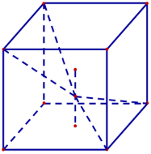*

hình vuông  *A*¢*B*¢*C*¢*D*¢ và *M* là điểm thuộc đoạn thẳng *OI* sao cho 

*OM* = 12 *MI* (tham khảo hình vẽ). Khi đó sin của góc tạo bởi  *A D*

hai mặt phẳng (*MC*¢*D*¢) và (*MAB*) bằng   *O*

**A.** 17 13 .  **B.** 6 85 .  *B*¢ *M C*¢

65 85

*I*

7 85 6 13

85 65 *A*¢ *D*¢

**C.**~~  .  **D.**~~  . 

ì*x* =1+3*t*

ïí = +

**Câu 38.**  Trong không gian *Oxyz* , cho đường thẳng *d* : *y* 1 4*t* . Gọi D là đường thẳng đi qua điểm 

ïî*z* =1

*A*(1;1;1) và có vectơ chỉ phương *u*r = (-2;1; 2) . Đường phân giác của góc nhọn tạo bởi *d* và D có phương trình là   

ì*x* =1+27*t*

1. ïí*y* =1+*t* .** ïî*z* =1+*t*

ì*x* = -18+19*t*

2. ïí*y* = -6+7*t* . ïî*z* =11-10*t*

   ì*x* = -18+19*t*

3. ïí*y* = -6+7*t* . ïî*z* = -11-10*t*

   ì*x* =1-*t*

4. ïí*y* =1+17*t* . ïî*z* =1+10*t*

**Câu 39.**  Cho khối lăng trụ  *ABC*.*A*¢*B*¢*C*¢, khoảng cách từ *C* đến đường thẳng *BB*¢ bằng  5 , khoảng cách từ  *A* đến các đường thẳng *BB*¢ và *CC*¢ lần lượt bằng 1 và 2 , hình chiếu vuông góc của  *A* lên 

mặt phẳng (*A*¢*B*¢*C*¢) là trung điểm *M* của *B*¢*C*¢ và  *A*¢*M* = 5 . Thể tích của khối trụ đã cho bằng   2 5 2 15 15

**A.**~~  .  **B.**~~  .  **C.**  5.  **D.**~~  . 

3 3 3

**Câu 40.**  Cho hai hàm số  *f* (*x*) = *ax*3 +*bx*2 +*cx*+ 3 và *g*(*x*) = *dx*2 +*ex*- 3 (*a*,*b*,*c*, *d*,*e*Ρ ). Biết rằng đồ 

4 4

thị của hàm số  *y* = *f* (*x*) và  *y* = *g*(*x*) cắt nhau tại ba điểm có  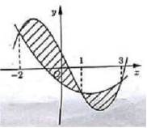hoành độ lần lượt là -2; 1; 3 (tham khảo hình vẽ). Hình phẳng  

giới hạn bởi hai đồ thị đã cho có diện tích bằng     

253 125 

**A.**~~  .  **B.**~~  .   

48 24 

125 253 

**C.**~~  .  **D.**~~  .  

48 24 

**Câu 41.**  Trong không gian *Oxyz* , cho mặt cầu (*S*) có tâm *I* (-1;0; 2) và đi qua điểm  *A*(0;1;1) . Xét các 

điểm *B* , *C* , *D* thuộc (*S*) sao cho  *AB* ,  *AC* ,  *AD* đôi một vuông góc với nhau. Thể tích của khối tứ diện  *ABCD* có giá trị lớn nhất bằng       

8 4

**A.**  .  **B.** 4.  **C.**  .  **D.** 8. 

3 3

**Câu 42.**  Có bao nhiêu giá trị nguyên của tham số *m* để hàm số  *y* = *x*8 +(*m*-3)*x*5 -(*m*2 -9)*x*4 +1 đạt cực 

tiểu tại *x* = 0 ? 

**A.** 4.  **B.** 7 .  **C.** 6 .  **D.** Vô số. 

*x*-2

**Câu 43.**  Cho hàm số  *y* = có đồ thị (*C*). Gọi *I* là giao điểm của hai tiệm cận của (*C*). Xét tam giác 

*x*+1

đều  *ABI* có hai đỉnh  *A*, *B* thuộc (*C*), đoạn thẳng  *AB* có độ dài bằng     

**A.** 2 3.  **B.** 2 2 .  **C.**  3.  **D.**  6 . 

**Câu 44.**  Cho hàm số  *f* (*x*) thỏa mãn  *f* (2) = -15 và  *f* ¢(*x*) = *x*3 éë *f* (*x*)ùû2 với mọi *x*Ρ . Giá trị của  *f* (1) 

bằng 

**A.** - 4 .  **B.** - 71.  **C.** -79 .  **D.** -4 . 

35 20 20 5

**Câu 45.**  Cho hàm số  *y* = 1 *x*4 - 7 *x*2 có đồ thị (*C*). Có bao nhiêu điểm  *A* thuộc (*C*) sao cho tiếp tuyến 

6 3

của (*C*) tại  *A* cắt (*C*) tại hai điểm phân biệt *M* (*x*1; *y*1), *N* (*x*2; *y*2 ) (*M*, *N* kh¸c *A*)thỏa mãn 

*y*1 - *y*2 = 4(*x*1 - *x*2 )?    

**A.** 3.  **B.** 0 .  **C.** 1.  **D.** 2. 

**Câu 46.**  Cho hai hàm số  *y* = *f* (*x*),  *y* = *g*(*x*). Hai hàm số  *y* = *f* ¢(*x*) và  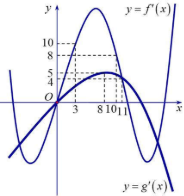

*y* = *g*¢(*x*) có đồ thị như hình vẽ bên, trong đó đường cong đậm hơn  

là đồ thị của hàm số  *y* = *g*¢(*x*) . Hàm số  

*h*(*x*) *f* (*x* 6) *g*æ2*x* 2÷ đồng biến trên khoảng nào dưới đây ?     

= + - ç + 5ö 

1. ø 
1. æç 21; +¥ö÷ .  **B.** æç 1;1ö÷.  
   1. 5 ø è 4 ø 

**C.** æ 21 17ö÷ 

` `ç3; ö÷.  **D.** æç4; .  

- 5 ø è 4 ø

**Câu 47.**  Có bao nhiêu số phức  *z* thỏa mãn *z* (*z* -5-*i*)+2*i* =(6-*i*)*z* ? 

**A.** 1.  **B.** 3.  **C.** 4.  **D.** 2. 

**Câu 48.**  Cho phương trình 2*x* +*m* = log2 (*x*-*m*) với *m* là tham số. Có bao nhiêu giá trị nguyên của 

*m*Î(-18;18) để phương trình đã cho có nghiệm ? 

**A.** 9.  **B.** 19.  **C.** 17 .  **D.** 18. 

**Câu 49.**  Trong không gian *Oxyz* , cho mặt cầu (*S*):(*x*-2)2 +(*y*-3)2 +(*z*+1)2 =16 và điểm 

*A*(-1; -1; -1). Xét các điểm *M* thuộc (*S*) sao cho đường thẳng  *AM* tiếp xúc với (*S*), *M* luôn thuộc mặt phẳng có phương trình là     

**A.** 3*x*+4*y*-2 = 0.  **B.** 3*x*+4*y*+2 = 0.  **C.** 6*x*+8*y*+11=0.  **D.** 6*x*+8*y*-11= 0. 

**Câu 50.**  Cho *a* > 0, *b* > 0 thỏa mãn log2*a*+2*b*+1 (4*a*2 +*b*2 +1)+log4*ab*+1 (2*a*+2*b*+1) = 2. Giá trị của *a*+2*b* 

bằng   

15 3

**A.**  .  **B.** 5.  **C.** 4.  **D.**  . 

4 2

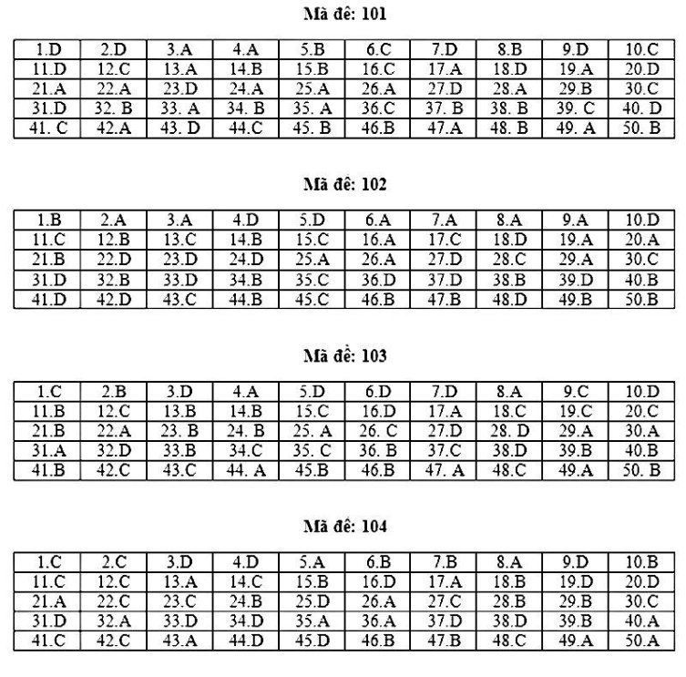

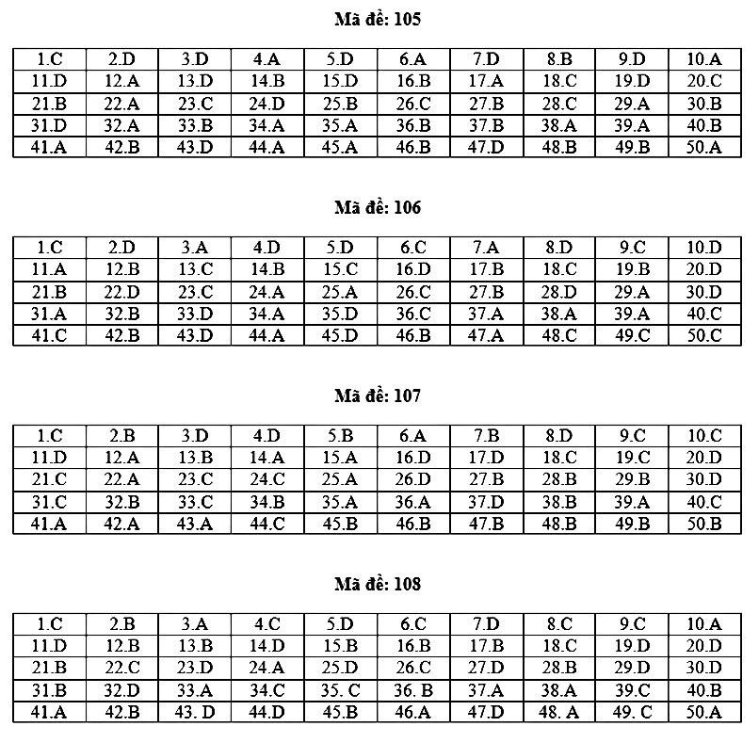

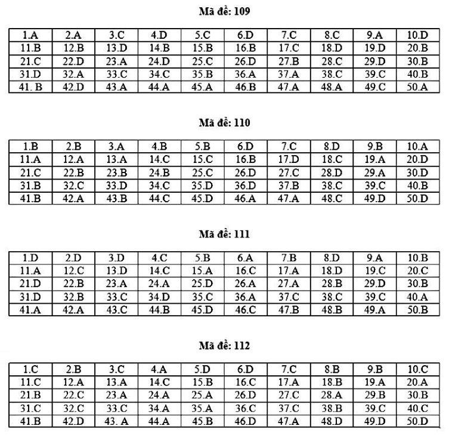

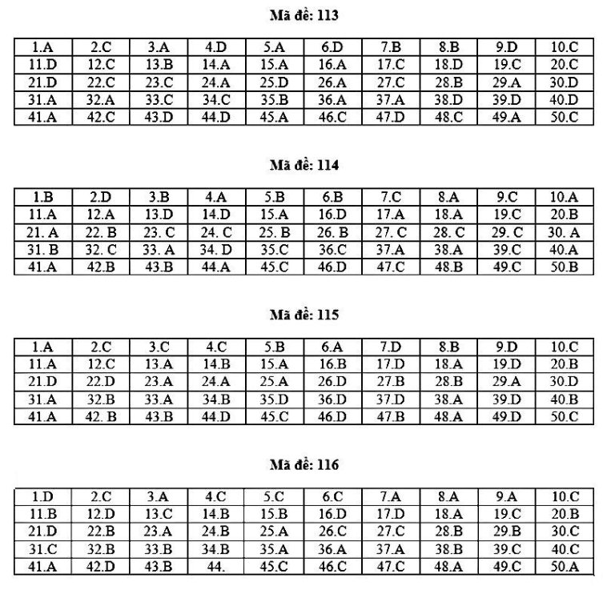

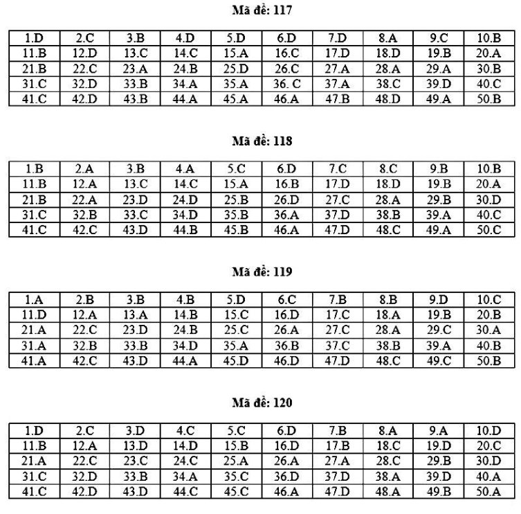

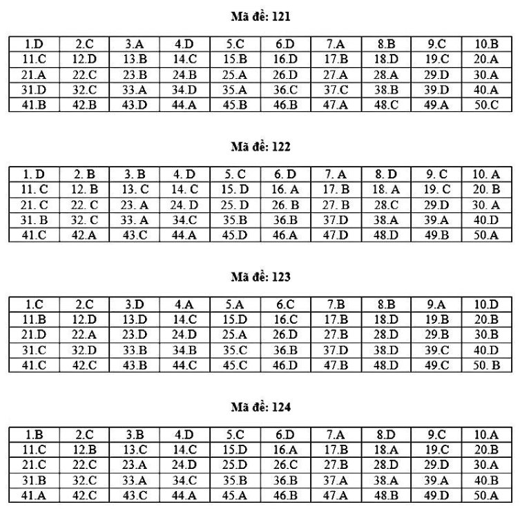

[ref1]: Aspose.Words.a3c83e3a-6c51-4c72-b8ad-132d26359fdd.001.png
