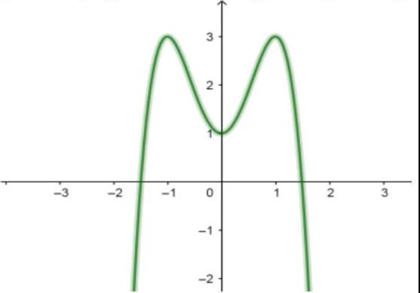
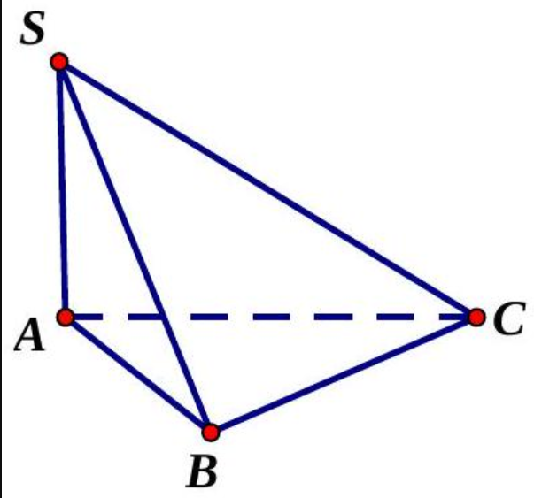
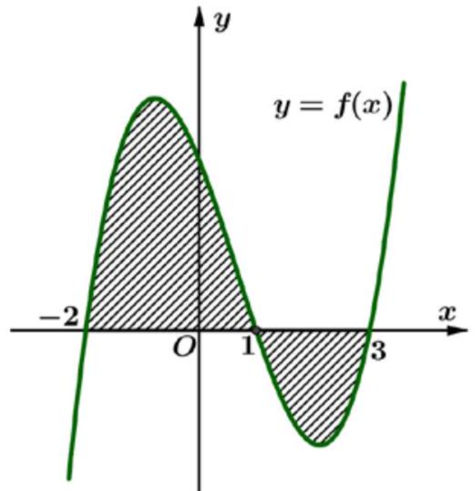
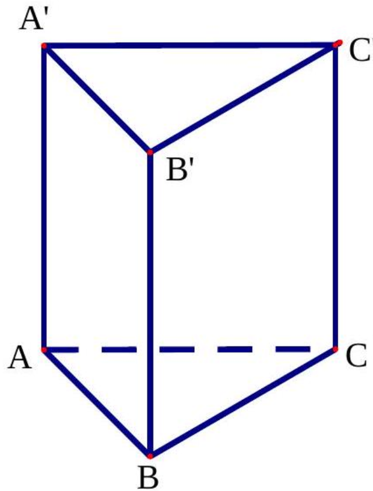
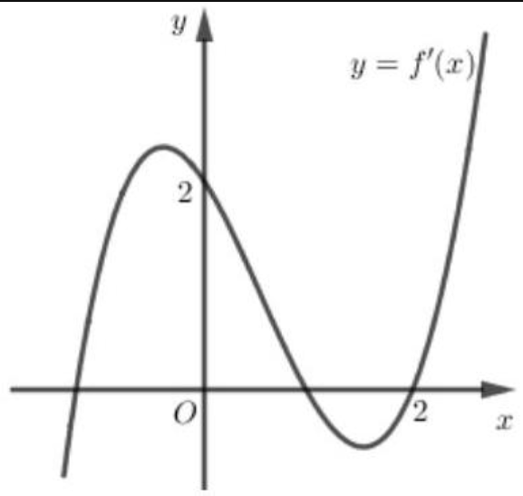
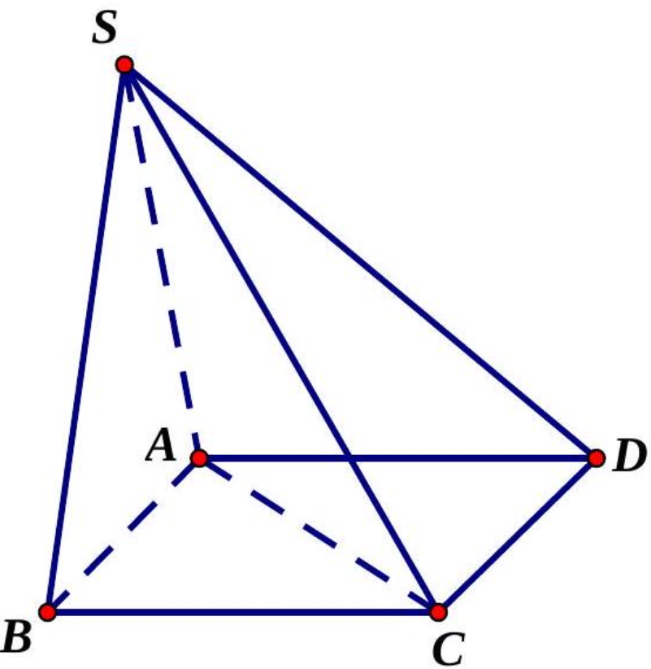
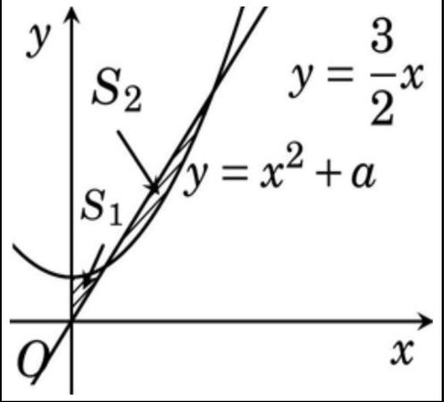
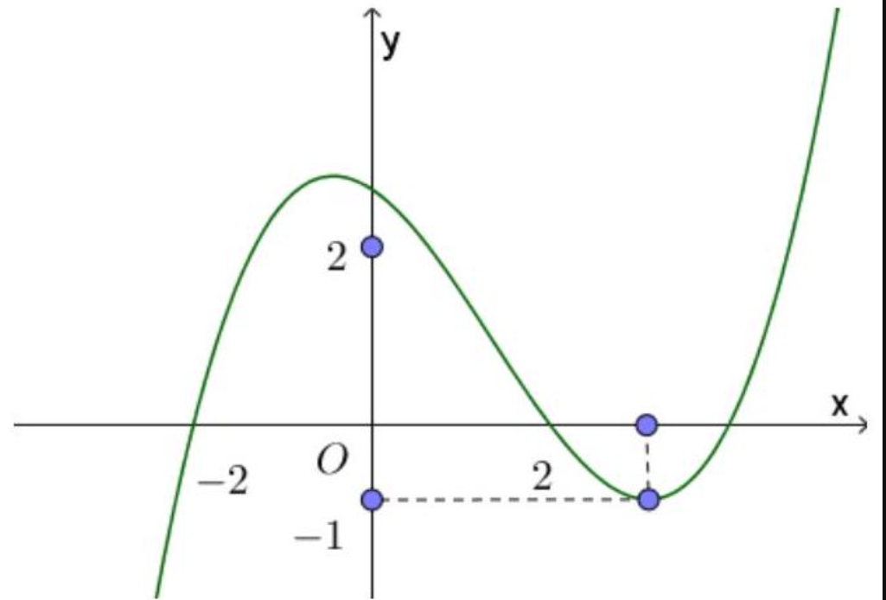

BỘ GIÁO DỤC VÀ ĐÀO TẠO

ĐỀ THI CHÍNH THÚC

KỲ THI THPT QUỐC GIA NĂM 2019

## Bài thi: TOÁN HỌC

Thời gian làm bài: 90 phút, không kể thời gian phát đề

MÃ ĐỀ 104
Câu 1. Số cách chọn 2 học sinh từ 8 học sinh là
A. $C_{8}^{2}$.
B. $8^{2}$.
C. $A_{8}^{2}$.
D. $2^{8}$.

Câu 2. Trong không gian $O x y z$, cho mặt phẳng $(P): 4 x+3 y+z-1=0$. Vectơ nào dưới đây là một vectơ pháp tuyến của $(P)$ ?
A. $\vec{n}_{4}=(3 ; 1 ;-1)$.
B. $\vec{n}_{3}=(4 ; 3 ; 1)$.
C. $\vec{n}_{2}=(4 ; 1 ;-1)$.
D. $\vec{n}_{1}=(4 ; 3 ;-1)$.

Câu 3. Nghiệm của phương trình $2^{2 x-1}=32$ là
A. $x=3$.
B. $x=\frac{17}{2}$.
C. $x=\frac{5}{2}$.
D. $x=2$.

Câu 4. Thể tích của khối lăng trụ có diện tích đáy $B$ và chiều cao $h$ là
A. $\frac{4}{3} B h$.
B. $\frac{1}{3} B h$.
C. $3 B h$.
D. Bh.

Câu 5. Số phức liên hợp của số phức $3-2 i$ là
A. $-3+2 i$.
B. $3+2 i$.
C. $-3-2 i$.
D. $-2+3 i$.

Câu 6. Trong không gian $O x y z$, hình chiếu vuông góc của điểm $M(3 ; 1 ;-1)$ trên trục $O y$ có tọa độ là
A. ( $0 ; 1 ; 0$ ) .
B. ( $3 ; 0 ; 0$ ).
C. $(0 ; 0 ;-1)$.
D. $(3 ; 0 ;-1)$.

Câu 7. Cho cấp số cộng $\left(u_{n}\right)$ với $u_{1}=1$ và $u_{2}=4$. Công sai của cấp số cộng đã cho bằng
A. 5 .
B. 4 .
C. -3 .
D. 3 .

Câu 8. Họ tất cả các nguyên hàm của hàm số $f(x)=2 x+4$ là
A. $2 x^{2}+4 x+C$.
B. $x^{2}+4 x+C$.
C. $x^{2}+C$.
D. $2 x^{2}+C$.

Câu 9. Đồ thị của hàm số nào dưới đây có dạng như đường cong trong hình vẽ bên?

A. $y=2 x^{3}-3 x+1$.
B. $y=-2 x^{4}+4 x^{2}+1$.
C. $y=2 x^{4}-4 x^{2}+1$.
D. $y=-2 x^{3}+3 x+1$.

Câu 10. Cho hàm số $f(x)$ có bảng biến thiên như sau:

| $x$ | $-\infty$ |  | -1 |  | 0 |  | 1 |  | $+\infty$ |
| :---: | :---: | :---: | :---: | :---: | :---: | :---: | :---: | :---: | :---: | :---: |
| $f^{\prime}(x)$ |  | - | 0 | + | 0 | - | 0 | + |  |
| $f(x)$ | $+\infty$ |  |  |  | ${ }^{3}$ |  |  |  | $+\infty$ |
|  |  |  | 0 |  |  |  | 0 | $+\infty$ |  |

Hàm số đã cho nghịch biến trên khoảng nào dưới đây?
A. $(0 ; 1)$.
B. $(1 ;+\infty)$.
C. (-1;0).
D. $(0 ;+\infty)$.

Câu 11. Trong không gian $O x y z$, cho đường thẳng $d: \frac{x-3}{1}=\frac{y+1}{-2}=\frac{z-5}{3}$. Vectơ nào dưới đây là một vec tơ chỉ phương của $d$.
A. $\overrightarrow{u_{1}}=(3 ;-1 ; 5)$.
B. $\overrightarrow{u_{3}}=(2 ; 6 ;-4)$.
C. $\overrightarrow{u_{4}}=(-2 ;-4 ; 6)$.
D. $\overrightarrow{u_{2}}=(1 ;-2 ; 3)$.

Câu 12. Với $a$ là số thực dương tùy ý, $\log _{3} a^{2}$ bằng?
A. $2 \log _{3} a$.
B. $\frac{1}{2}+\log _{3} a$.
C. $\frac{1}{2} \log _{3} a$.
D. $2+\log _{3} a$.

Câu 13. Thể tích khối nón có chiều cao $h$ và bán kính đáy $r$ là
A. $2 \pi r^{2} h$.
B. $\pi r^{2} h$.
C. $\frac{1}{3} \pi r^{2} h$.
D. $\frac{4}{3} \pi r^{2} h$.

Câu 14. Cho hàm số $f(x)$ có bảng biến thiên như sau:

| $x$ | $-\infty$ | 1 |  | 3 |  | $+\infty$ |  |
| :---: | :---: | :---: | :---: | :---: | :---: | :---: | :---: |
| $f^{\prime}(x)$ |  | + | 0 | - | 0 | + |  |
| $f(x)$ |  |  |  |  |  |  |  |
|  | $-\infty$ |  |  |  | -2 |  |  |
|  |  |  |  |  |  |  |  |

Hàm số đã cho đạt cực tiểu tại
A. $x=-2$.
B. $x=1$.
C. $x=3$.
D. $x=2$.

Câu 15. Biết $\int_{0}^{1} f(x) d x=2 ; \int_{0}^{1} g(x) d x=-4$. Khi đó $\int_{0}^{1}[f(x)+g(x)] d x$ bằng
A. 6 .
B. -6 .
C. -2 .
D. 2 .

Câu 16. Cho hai số phức $z_{1}=2-i, z_{2}=1+i$. Trên mặt phẳng tọa độ $O x y$, điểm biểu diễn số phức $2 z_{1}+z_{2}$ có tọa độ là:
A. $(5 ;-1)$.
B. (-1;5).
C. $(5 ; 0)$.
D. $(0 ; 5)$.

Câu 17. Cho hình chóp $S . A B C$ có $S A$ vuông góc với mặt phẳng ( $A B C$ ), $S A=2 a$, tam giác $A B C$ vuông cân tại $B$ và $A B=\sqrt{2} a$.(minh họa như hình vẽ bên).

Góc giữa đường thẳng $S C$ và mặt phẳng $(A B C)$ bằng
A. $60^{\circ}$.
B. $45^{\circ}$.
C. $30^{\circ}$.
D. $90^{\circ}$.

Câu 18. Trong không gian $O x y z$, cho mặt cầu $(S): x^{2}+y^{2}+z^{2}-2 y+2 z-7=0$. Bán kính của mặt cầu đã cho bằng
A. 9 .
B. 3 .
C. 15.
D. $\sqrt{7}$.

Câu 19. Trong không gian $O x y z$, cho hai điểm $A(4 ; 0 ; 1), B(-2 ; 2 ; 3)$. Mặt phẳng trung trực của đoạn thẳng $A B$ có phương trình là
A. $6 x-2 y-2 z-1=0$.
B. $3 x+y+z-6=0$.
C. $x+y+2 z-6=0$.
D. $3 x-y-z=0$.

Câu 20. Gọi $z_{1}, z_{2}$ là hai nghiệm phức của phương trình $z^{2}-4 z+7=0$. Giá trị của $z_{1}^{2}+z_{2}^{2}$ bằng
A. 10 .
B. 8.
C. 16 .
D. 2 .

Câu 21. Giá trị nhỏ nhất của hàm số $f(x)=x^{3}-3 x$ trên đoạn $[-3 ; 3]$ bằng
A. 18 .
B. -18 .
C. -2 .
D. 2 .

Câu 22. Một cơ sở sản xuất cố hai bể nước hình trụ có chiều cao bằng nhau, bán kính đáy lần lượt bằng 1 m và $1,5 \mathrm{~m}$. Chủ cơ sở dự định làm một bể nước mới, hình trụ, có cùng chiều cao và có thể tích bằng tổng thể tích của hai bể trên. Bán kính đáy của bể nước dự định làm gần nhất với kết quả nào dưới đây?
A. $1,6 m$.
B. $2,5 m$.
C. $1,8 m$.
D. $2,1 m$.

Câu 23. Cho hàm số $y=f(x)$ có bảng biến thiên như sau:

| $x$ | $-\infty$ | 0 |  | 3 | $+\infty$ |
| :--- | :--- | :---: | :---: | :---: | :---: |
| $y^{\prime}$ | - |  | - | 0 | + |
| $y$ | 0 |  | $+\infty$ |  |  |

Tổng số tiệm cận đứng và tiệm cận ngang của đồ thị hàm số đã cho là
A. 2 .
B. 1 .
C. 3 .
D. 4 .

Câu 24. Cho hàm số $f(x)$ liên tục trên $\mathbb{R}$. Gọi $S$ là diện tích hình phẳng giới hạn bởi các đường $y=f(x), y=0, x=-2$ và $x=3$ (như hình vẽ bên). Mệnh đề nào dưới đây là đúng?

A. $S=\int_{-2}^{1} f(x) d x-\int_{1}^{3} f(x) d x$.
B. $S=-\int_{-2}^{1} f(x) d x+\int_{1}^{3} f(x) d x$.
C. $S=\int_{-2}^{1} f(x) d x+\int_{1}^{3} f(x) d x$.
D. $S=-\int_{-2}^{1} f(x) d x-\int_{1}^{3} f(x) d x$.

Câu 25. Hàm số $y=3^{x^{2}-x}$ có đạo hàm là
A. $3^{x^{2}-x} \cdot \ln 3$.
B. $(2 x-1) 3^{x^{2}-x}$.
C. $\left(x^{2}-x\right) \cdot 3^{x^{2}-x-1}$.
D. $(2 x-1) 3^{x^{2}-x} \cdot \ln 3$.

Câu 26. Cho khối lăng trụ đứng $A B C \cdot A^{\prime} B^{\prime} C^{\prime}$ có đáy là tam giác đều cạnh $a$ và $A A^{\prime}=\sqrt{2} a$ (minh họa như hình vẽ bên). Thể tích của khối lăng trụ đã cho bằng

A. $\frac{\sqrt{6} a^{3}}{4}$.
B. $\frac{\sqrt{6} a^{3}}{6}$.
C. $\frac{\sqrt{6} a^{3}}{12}$.
D. $\frac{\sqrt{6} a^{3}}{2}$.

Câu 27. Nghiệm của phương trình $\log _{3}(2 x+1)=1+\log _{3}(x-1)$ là
A. $x=4$.
B. $x=-2$.
C. $x=1$.
D. $x=2$.

Câu 28. Cho $a, b$ là hai số thực dương thỏa mãn $a b^{3}=8$. Giá trị của $\log _{2} a+3 \log _{2} b$ bằng
A. 8 .
B. 6 .
C. 2 .
D. 3 .

Câu 29. Cho hàm số $f(x)$ có bảng biến thiên như sau:

| $x$ | $-\infty$ | -1 |  | 2 |  | $+\infty$ |
| :---: | :---: | :---: | :---: | :---: | :---: | :---: |
| $f^{\prime}(x)$ | + | 0 | - | 0 | + |  |

Số nghiệm của phương trình $2 f(x)+3=0$ là
A. 3 .
B. 1 .
C. 2 .
D. 0 .

Câu 30. Cho hàm số $f(x)$ có đạo hàm $f^{\prime}(x)=x(x+1)^{2}, \forall x \in \mathbb{R}$. Số điểm cực trị của hàm số đã cho là
A. 0 .
B. 1 .
C. 2 .
D. 3 .

Câu 31. Cho số phức $z$ thỏa $(2-i) z+3+16 i=2(\bar{z}+i)$. Môdun của $z$ bằng
A. $\sqrt{5}$.
B. 13 .
C. $\sqrt{13}$.
D. 5 .

Câu 32. Cho hàm số $f(x)$. Biết $f(0)=4$ và $f^{\prime}(x)=2 \sin ^{2} x+3, \forall x \in \mathbb{R}$, khi đó $\int_{0}^{\frac{\pi}{4}} f(x) d x$ bằng
A. $\frac{\pi^{2}-2}{8}$.
B. $\frac{\pi^{2}+8 \pi-8}{8}$.
C. $\frac{\pi^{2}+8 \pi-2}{8}$.
D. $\frac{3 \pi^{2}+2 \pi-3}{8}$.

Câu 33. Trong không gian $O x y z$, cho các điểm $A(2 ;-1 ; 0), B(1 ; 2 ; 1), C(3 ;-2 ; 0)$ và $D(1 ; 1 ;-3)$. Đường thẳng đi qua $D$ và vuông góc với mặt phẳng ( $A B C$ ) có phương trình là
A. $\left\{\begin{array}{l}x=t \\ y=t \\ z=-1-2 t\end{array}\right.$.
B. $\left\{\begin{array}{l}x=t \\ y=t \\ z=1-2 t\end{array}\right.$.
C. $\left\{\begin{array}{l}x=1+t \\ y=1+t \\ z=-2-3 t\end{array}\right.$.
D. $\left\{\begin{array}{l}x=1+t \\ y=1+t \\ z=-3+2 t\end{array}\right.$.

Câu 34. Cho hàm số $f(x)$, có bảng xét dấu $f^{\prime}(x)$ như sau:

| $x$ | $-\infty$ | -3 | -1 |  | 1 | $+\infty$ |
| :---: | ---: | ---: | ---: | ---: | ---: | ---: |
| $f^{\prime}(x)$ | - | 0 | + | 0 | - | 0 |

Hàm số $y=f(5-2 x)$ đồng biến trên khoảng nào dưới đây?
A. $(-\infty ;-3)$.
B. (4;5).
C. (3;4).
D. (1;3).

Câu 35. Họ tất cả các nguyên hàm của hàm số $f(x)=\frac{3 x-2}{(x-2)^{2}}$ trên khoảng ( $2 ;+\infty$ ) là
A. $3 \ln (x-2)+\frac{4}{x-2}+C$.
B. $3 \ln (x-2)+\frac{2}{x-2}+C$.
C. $3 \ln (x-2)-\frac{2}{x-2}+C$.
D. $3 \ln (x-2)-\frac{4}{x-2}+C$.

Câu 36. Cho phương trình $\log _{9} x^{2}-\log _{3}(4 x-1)=-\log _{3} m$ ( $m$ là tham số thực). Có tất cả bao nhiêu giá trị nguyên của $m$ để phương trình đã cho có nghiệm?
A. 5 .
B. 3 .
C. Vô số.
D. 4 .

Câu 37. Cho hàm số $f(x)$, hàm số $y=f^{\prime}(x)$ liên tục trên $\mathbb{R}$ và có đồ thị như hình vẽ bên. Bất phương trình $f(x)>2 x+m$ ( $m$ là tham số thực) nghiệm đúng với mọi $x \in(0 ; 2)$ khi và chỉ khi

A. $m \leq f(2)-4$.
B. $m \leq f(0)$.
C. $m<f(0)$.
D. $m<f(2)-4$. .

Câu 38. Chọn ngẫu nhiên hai số khác nhau từ 23 số nguyên dương đầu tiên. Xác suất để chọn được hai số có tổng là một số chẵn bằng
A. $\frac{11}{23}$.
B. $\frac{1}{2}$.
C. $\frac{265}{529}$.
D. $\frac{12}{23}$.

Câu 39. Cho hình trụ có chiều cao bằng $3 \sqrt{3}$. Cắt hình trụ đã cho bởi mặt phẳng song song với trục và cách trục một khoảng bằng 1 , thiết diện thu được có diện tích bằng 18. Diện tích xung quanh của hình trụ đã cho bằng
A. $6 \pi \sqrt{3}$.
B. $6 \pi \sqrt{39}$.
C. $3 \pi \sqrt{39}$.
D. $12 \pi \sqrt{3}$.

Câu 40. Cho hình chóp $S . A B C D$ có đáy là hình vuông cạnh $a$, mặt bên $S A B$ là tam giác đều và nằm trong mặt phẳng vuông góc với mặt phẳng đáy (minh họa như hình vẽ bên). Khoảng cách từ $B$ đến mặt phẳng ( $S A C$ ) bằng

A. $\frac{a \sqrt{2}}{2}$.
B. $\frac{a \sqrt{21}}{28}$.
C. $\frac{a \sqrt{21}}{7}$.
D. $\frac{a \sqrt{21}}{14}$.

Câu 41. Cho đường thẳng $y=\frac{3}{2} x$ và parabol $y=x^{2}+a$ ( $a$ là tham số thực dương). Gọi $S_{1}$ và $S_{2}$ lần lượt là diện tích của 2 hình phẳng được gạch chéo trong hình vẽ bên. Khi $S_{1}=S_{2}$ thì $a$ thuộc khoảng nào sau đây

A. $\left(\frac{1}{2} ; \frac{9}{16}\right)$.
B. $\left(\frac{2}{5} ; \frac{9}{20}\right)$.
C. $\left(\frac{9}{20} ; \frac{1}{2}\right)$.
D. $\left(0 ; \frac{2}{5}\right)$.

Câu 42. Cho hàm số bậc ba $y=f(x)$ có đồ thị như hình vẽ bên. Số nghiệm thực của phương trình $\left|f\left(x^{3}-3 x\right)\right|=\frac{2}{3}$ là

A. 6 .
B. 10 .
C. 3 .
D. 9.

Câu 43. Cho số phức $z$ thỏa mãn $|z|=\sqrt{2}$. Trên mặt phẳng tọa độ $O x y$, tập hợp các điểm biểu diễn của số phức $w$ thỏa mãn $w=\frac{5+i z}{1+z}$ là một đường tròn có bán kính bằng
A. 52 .
B. $2 \sqrt{13}$.
C. $2 \sqrt{11}$.
D. 44 .

Câu 44. Cho hàm số $f(x)$ có đạo hàm liên tục trên $\mathbb{R}$. Biết $f(3)=1$ và $\int_{0}^{1} x f(3 x) \mathrm{d} x=1$, khi đó $\int_{0}^{3} x^{2} f^{\prime}(x) \mathrm{d} x$ bằng
A. 3 .
B. 7 .
C. -9 .
D. $\frac{25}{3}$.

Câu 45. Trong không gian $O x y z$, cho điểm $A(0 ; 3 ;-2)$. Xét đường thẳng $d$ thay đổi, song song với trục $O z$ và cách trục $O z$ một khoảng bằng 2. Khi khoảng cách từ $A$ đến $d$ lớn nhất, $d$ đi qua điểm nào dưới đây?
A. $Q(-2 ; 0 ;-3)$.
B. $M(0 ; 8 ;-5)$.
C. $N(0 ; 2 ;-5)$.
D. $P(0 ;-2 ;-5)$.

Câu 46. Cho hình lăng trụ $A B C \cdot A^{\prime} B^{\prime} C^{\prime}$ có chiều cao bằng 4 và đáy là tam giác đều cạnh bằng 4 . Gọi $M, N$ và $P$ lần lượt là tâm của các mặt bên $A B B^{\prime} A^{\prime}, A C C^{\prime} A^{\prime}$ và $B C C^{\prime} B^{\prime}$. Thể tích của khối đa diện lồi có các đỉnh là các điểm $A, B, C, M, N, P$ bằng
A. $\frac{14 \sqrt{3}}{3}$.
B. $8 \sqrt{3}$.
C. $6 \sqrt{3}$.
D. $\frac{20 \sqrt{3}}{3}$.

Câu 47. Cho hai hàm số $y=\frac{x-2}{x-1}+\frac{x-1}{x}+\frac{x}{x+1}+\frac{x+1}{x+2}$ và $y=|x+1|-x-m$ ( $m$ là tham số thực) có đồ thị lần lượt là $\left(C_{1}\right)$ và $\left(C_{2}\right)$. Tập hợp tất các các giải trịcủa $m$ để $\left(C_{1}\right)$ và $\left(C_{2}\right)$ cắt nhau tại đúng 4 điểm phân biệt là
A. $(-3 ;+\infty)$.
B. $(-\infty ;-3)$.
C. $[-3 ;+\infty)$.
D. $(-\infty ;-3]$.

Câu 48. Cho phương trình $\left(2 \log _{2}^{2} x-\log _{2} x-1\right) \sqrt{4^{x}-m}=0$ ( $m$ là tham số thực). Có tất cả bao nhiêu giá trị nguyên dương của $m$ để phương trình đã cho có đúng hai nghiệm phân biệt
A. Vô số.
B. 62 .
C. 63 .
D. 64 .

Câu 49. Trong không gian $O x y z$, cho mặt cầu $(S): x^{2}+y^{2}+(z-1)^{2}=5$. Có tất cả bao nhiêu điểm $A(a ; b ; c)(a, b, c$ là các số nguyên ) thuộc mặt phẳng ( $O x y$ ) sao cho có ít nhất hai tiếp tuyến của ( $S$ ) đi qua $A$ và hai tiếp tuyến đó vuông góc với nhau.
A. 12 .
B. 16 .
C. 20 .
D. 8 .

Câu 50. Cho hàm số $f(x)$, bảng biến thiên của hàm số $f^{\prime}(x)$ như sau:

| $x$ | $-\infty$ |  | -1 |  | 0 |  | 1 |  | $+\infty$ |
| :---: | :---: | :---: | :---: | :---: | :---: | :---: | :---: | :---: | :---: |
| $f^{\prime}(x)$ | $+\infty$ |  |  |  | 2 |  |  |  | $+\infty$ |
|  |  |  | -3 |  |  |  | -1 |  |  |

Số điểm cực trị của hàm số $y=f\left(4 x^{2}+4 x\right)$ là
A. 5 .
B. 9 .
C. 7 .
D. 3 .

