**BỘ GIÁO DỤC VÀ ĐÀO TẠO** 

**KỲ THI THPT QUỐC GIA NĂM 2019** 

**\_\_\_\_\_\_\_\_\_\_\_\_\_\_\_\_** **ĐỀ THI CHÍNH THỨC** 

**Bài thi: TOÁN HỌC** 

*Thời gian làm bài: 90 phút, không kể thời gian phát đề* 

**MÃ ĐỀ 101 **

**BỘ GIÁO DỤC VÀ ĐÀO TẠO** 

**KỲ THI THPT QUỐC GIA NĂM 2019** 

**Câu 1.** Trong không gian *Oxyz* , cho mặt phẳng (*P*): *x*+2*y* +3*z* −1 0. Vectơ nào dưới đây là một vectơ pháp tuyế**A**n c**.** *n*uuủar3  =((*P*1;)2?;  1)**.  B.** *n*uur4 =(1;2;3)**.  C.** *n*ur1  =(1;3; 1)**.  D.** *n*uur2  =(2;3; 1)**.** 

**Câu 2.** Với *a* là số thực dương tùy, log *a*2 bằng 

5

**A.** 2log5 *a***.  B.** 2+log5 *a***.  C.**  12 +log *a***.  D.**  1 log *a***.** 

5 2 5

**Câu 3.** Cho hàm số  *f* (*x*) có bảng biến thiên như sau: 

Hàm số đã cho nghịch biến trên khoảng nào dưới đây? 

**A.** (−2;0)**.  B.** (2;+∞)**.  C.** (0;2)**.  D.** (0;+∞)**.** 

**Câu 4.** Nghiệm phương trình 32*x*−1 = 27 là 

**A.** *x* =5**.  B.** *x* =1**.  C.** *x* = 2**.  D.** *x* = 4**.** 

**Câu 5.** Cho cấp số cộng (*un* ) với *u*1 = 3 và *u*2 = 9. Công sai của cấp số cộng đã cho bằng 

**A.** −6**.  B.** 3**.  C.** 12**.  D.** 6**.** 

**Câu 6.** Đồ thị của hàm số nào dưới đây có dạng như đường cong hình vẽ bên 

**A.** −*y x*3+ 3*x*2 3**.  B.**  *y* + *x*3+ 3*x*2 3**.  C.** −*y x*4+ 2*x*2 3**.  D.**  *y*+ *x*4+ 2*x*2 3**.** 

*x*−2 *y* −1 *z* +3

**Câu 7.** Trong không gian *Oxyz*, cho đường thẳng*d* :~~  =  =. Vectơ nào dưới đây là một vectơ chỉ 

−1 2 1

phư**A.** *u*uơur2ng c=(2ủ;a1 ;*d*1?).**.  B.** *u*uur4  =(1;2; 3).**.  C.** *u*ur3  =( 1−;2;1).**.  D.** *u*ur1  =(2;1; 3).**.** 

**Câu 8.** Thể tích của khối nón có chiều cao *h* và bán kính *r* là 

**A.** 1 π*r*2*h*.**.  B.** π*r*2*h*.**.  C.**  4 π*r*2*h*.**.  D.** 2π*r*2*h*.**.** 

3 3

**Câu 9.** Số cách chọn 2 học sinh từ 7 học sinh là 

**A.** 27 **.  B.**  *A*2 **.  C.** *C*2 **.  D.** 72 **.** 

**Câu 10.** Trong không gian *Oxyz* , hì7 nh chiếu vuông góc của đi7 ểm *M* (2;1;−1) trên trục *Oz* có tọa độ là 

**A.** (2;1;0)**.  B.** (0;0;−1)**.  C.** (2;0;0)**.  D.** (0;1;0)**.** 

**Câu 11.** Biết ∫1 *f* (*x*)*dx*  = −2 và ∫1 *g*(*x*)*dx* = 3, khi đó ∫1 *f* (*x*)−*g*(*x*) *dx* bằng 

0 0 0

**A.** −5.**.  B.** 5.**.  C.** −1.**.  D.** 1.**.** 

**Câu 12.** Thể tích khối lăng trụ có diện tích đáy *B* và chiều cao *h* là 

4 1

**A.** 3*Bh*.**.  B.** *Bh*.**.  C.**  *Bh*.**.  D.**  *Bh*.**.** 

3 3

**Câu 13.** Số phức liên hợp của số phức 3−4*i* là 

**A.** −3−4*i***.  B.** −3+4*i***.  C.** 3+4*i***.  D.** −4+3*i***.** 

**Câu 14.** Cho hàm số  *f* (*x*) có bảng biến thiên như sau: 

Hàm số đã cho đạt cực tiểu tại 

**A.** *x* = 2**.  B.** *x* =1**.  C.** *x*  = −1**.  D.** *x*  = −3**.** 

**Câu 15.** Họ tất cả các nguyên hàm của hàm số  *f* (*x*)  =2*x* 5 là 

**A.** *x*2 +5*x*+*C*.**.  B.** 2*x*2 +5*x*+*C*.**.  C.** 2*x*2 +*C*.**.  D.** *x*2 +*C*.**.** 

**Câu 16.** Cho hàm số  *f* (*x*) có bảng biến thiên như sau: 

Số nghiệm thực của phương trình 2*f* (*x*)−3 0 là 

**A.** 2**.  B.** 1**.  C.** 4**.  D.** 3**.** 

**Câu 17.** Cho hình chóp  *S*.*ABC* có  *SA* vuông góc với mặt phẳng (*ABC*),  *SA* = 2*a* , tam giác  *ABC* vuông tại *B* ,  *AB* = *a* 3 và *BC* = *a* (minh họa hình vẽ bên). Góc giữa đường thẳng *SC* và mặt phẳng (*ABC*) bằng 

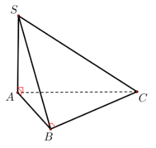

**A.** 90o**.  B.** 45o**.  C.** 30o**.  D.** 60o**.** 

**Câu 18.** Gọi *z*1,*z*2 là hai nghiệm phức phương trình *z*2 −6*z* +10 0. Giá trị *z*12 + *z*22 bằng 

**A.** 16**.  B.** 56**.  C.** 20**.  D.** 26**.** 

**Câu 19.** Cho hàm số  *y* = 2*x*2 −3*x* có đạo hàm là 

**A.** (2*x*−3).2*x*2 −3*x*.ln2**.  B.** 2*x*2 −3*x*.ln2**.  C.** (2*x*−3).2*x*2 −3*x* **.  D.** (*x*2 −3*x*).2*x*2 −3*x*−1 **.** 

**Câu 20.** Giá trị lớn nhất của hàm số  *f* (*x*) − *x*3 +3*x* 2 trên đoạn [−3;3] bằng 

**A.** −16**.  B.** 20**.  C.** 0**.  D.** 4**.** 

**Câu 21.** Trong không gian *Oxyz* , cho mặt cầu (*S*):*x*2 + *y*2 + *z*2 +2*x*−2*z* −7 0. bán kính của mặt cầu đã cho 

bằng 

**A.**  7 **.  B.** 9**.  C.** 3**.  D.**  15**.** 

**Câu 22.** Cho khối lăng trụ đứng  *ABC*.*A*'*B*'*C*' có đáy là tam giác đều cạnh  *a* và  *AA*' = 3*a* (hình minh họa 

như hình vẽ). Thể tích của lăng trụ đã cho bằng 

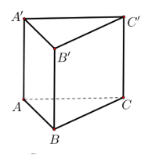

3*a*3 3*a*3 *a*3 *a*3

**A.  .  B.  .  C.  .  D.  .** 

4 2 4 2

**Câu 23.** Cho hàm số  *f* (*x*) có đạo hàm  *f* '(*x*)  =*x*(*x* 2)2 , ∀*x*∈ ¡. Số điểm cực trị của hàm số đã cho là 

**A.** 0**.  B.** 3**.  C.** 2**.  D.** 1**.** 

**Câu 24.** Cho *a* và *b* là hai số thực dương thỏa mãn *a*4*b* =16. Giá trị của 4log2 *a*+log2 *b* bằng 

**A.** 4**.  B.** 2**.  C.** 16**.  D.** 8**.** 

**Câu 25.** Cho hai số phức  *z*1  =1 *i*−và  *z*2  =1 2+*i* . Trên mặt phẳng toạ độ *Oxy* , điểm biểu diễn số phức 3*z*1 + *z*2

có to4ạ*;* độ1 )là**.**   ( **.  C.** (4*;*1) **D.** ( **.** **A.** ( − **B.**  −1*;*4) **.**  1*;*4)

**Câu 26.** Nghiệm của phương trình log3 (*x*+1)+1 log3 (4*x* 1) là 

**A.** *x* =3**.  B.** *x*  = −3**.  C.** *x* = 4**.  D.** *x* = 2**.** 

**Câu 27.** Một cở sở sản xuất có hai bể nước hình trụ có chiều cao bằng nhau, bán kính đáy lần lượt bằng 1*m* và 1,2*m*. Chủ cơ sở dự định làm một bể nước mới, hình trụ, có cùng chiều cao và có thể tích bằng tổng thể tích 

của hai bể nước trên. Bán kính đáy của bể nước dự dịnh làm **gần nhất** với kết quả nào dưới đây? 

**A.** 1,8*m*.**.  B.** 1,4*m*.**.  C.** 2,2*m*.**.  D.** 1,6*m*.**.** 

**Câu 28.** Cho hàm số  *y* = *f* (*x*)có bảng biến thiên như sau: 

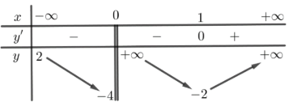

Tổng số tiệm cận đứng và tiệm cận ngang của đồ thị hàm số đã cho là 

**A.** 4.**.  B.** 1.**.  C.** 3.**.  D.** 2.**.** 

**Câu  29.**  Cho  hàm  số  *f* (*x*)  liên  tục  trên  R.  Gọi  *S*  là  diện  tích  hình  phẳng  giới  hạn  bởi  các  đường 

*y*  =*f* (*x*), *y*  =0,*x*  =1 và *x* = 4 (như hình vẽ bên). Mệnh đề nào dưới đây là đúng? 

1 4 1 4

**A.** *S* ∫*f* (*x*)*dx* ∫*f* (*x*)*dx***.  B.** *S*  =∫*f* (*x*)*dx* ∫*f* (*x*)*dx*−**.** 

−1 1 −1 1

**C.** *S*  =∫1 *f* (*x*)*dx* ∫4 *f* (*x*)*dx*+**.  D.** *S* ∫1 *f* (*x*)*dx* ∫4 *f* (*x*)*dx***.** 

**Câu 30.** T−r1ong không 1gian *Oxyz* , cho hai điểm  *A*(1;3;0)và  *B*(−51;1;−2). Mặ1t phẳng trung trực của đoạn thẳng 

*AB* có phương trình là 

**A.** 2*x*− *y* −*z* +5 0**.  B.** 2*x*−*y* −*z* −5 0**.  C.** *x*+ *y*+2*z*−3 0**.  D.**3*x*+2*y*−*z* −14 0**.** 

- ) 2*x*−1 (− +∞)

**Câu 31.** Họ tất cả các nguyên hàm của hàm số  *f x* = trên khoảng  1; là 

(*x*+1)2

**A.** 2ln(*x*+1)+ 2 +*C* **.  B.** 2ln(*x*+1)+ 3 +*C* **.  C.** 2ln(*x*+1)− 2 +*C* **.  D.** 2ln(*x*+1)− 3 +*C* **.** 

*x*+1 *x*+1 *x*+1 *x*+1

**Câu 32.** Cho hàm số *f* (*x*). Biết  *f* (0) = 4 và  *f* ′(*x*) = 2cos2 *x*+1, ∀*x*∈ ¡, khi đó  π∫4 *f* (*x*)*dx* bằng 

0

π 2 +4 π 2 +14π π 2 +16π+4 π 2 +16π+16

**A.  .  B.  .  C.  .  D.  .** 

16 16 16 16

**Câu 33.** Trong không gian *Oxyz* , cho các điểm  *A*(1;2;0), *B*(2;0;2) , *C*(2;−1;3) và *D*(1;1;3). Đường thẳng 

đi qua *C* và vuông góc với mặt phẳng (*ABD*) có phương trình là 

−*x* − 2 4*t* *x*  =2 4+*t* −*x* + 2 4*t* *x*  =4 2+*t*

**Câu 34.** *z*Cho s2ố−3ph*t***.**ức *z* thỏa mãn *z*3(*z*+*i*)−(2−*i*)*z*+ 3**C**10**.** *i*−*zy*. M =+2ô đun c4 *t*+3*t***.**ủa *z* bằng**D.** *zy*  ==13 3*t*+*t*−**.** 

**A.** −*y* − **B.** *y*− + 1 3*t***.** 

  =2 *t*   =3 *t*−

**A.** 3**.  B.** 5**.  C.**  5**.  D.**  3**.** 

**Câu 35.** Cho hàm số  *f* (*x*), bảng xét dấu của  *f* ′(*x*) như sau: 

*x* −∞ −3 −1  1 +∞

*f* ′(*x*) − 0 + 0 − 0 +

Hàm số  *y*  =*f* (3 2*x*)−nghịch biến trên khoảng nào dưới đây? 

**A.** (4;+∞)**.  B.** (−2;1) **.  C.** (2;4)**.  D.** (1;2)**.** 

**Câu 36.** Cho hàm số  *f* (*x*), hàm số  *y* = *f* ′(*x*) liên tục trên ¡ và có đồ thị như hình vẽ bên**.** 

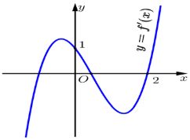

Bất phương trình  *f* (*x*) < *x*+*m* (*m* là tham số thực) nghiệm đúng với mọi *x*∈ (0;2) khi và chỉ khi 

**A.** *m* ≥ *f* (2)−2**.  B.** *m* ≥ *f* (0)**.  C.** *m* > *f* (2)−2**.  D.** *m* > *f* (0)**.** 

**Câu 37.** Chọn ngẫu nhiên 2 số tự nhiên khác nhau từ 25 số nguyên dương đầu tiên. Xác suất để chọn được hai 

số có tổng là một số chẵn bằng 

1 13 12 313

**A.  .  B.  .  C.  .  D.  .** 

2 25 25 625

**Câu 38.** Cho hình trụ có chiều cao bằng 5 3 . Cắt hình trụ đã cho bởi mặt phẳng song song với trục và cách 

trục một khoảng bằng 1, thiết diện thu được có diện tích bằng 30. Diện tích xung quanh của hình trụ đã cho bằng 

**A.** 10 3π **.  B.** 5 39π **.  C.** 20 3π **.  D.** 10 39π **.** 

**Câu 39.** Cho phương trình  log9 *x*2 −log3 (3*x* −1) log3 *m* (*m* là tham số thực). Có tất cả bao nhiêu giá trị 

nguyên của *m* để phương trình đã cho có nghiệm 

**A.** 2**.  B.** 4**.  C.** 3**.  D.** Vô số**.** 

**Câu 40.** Cho hình chóp  *S*.*ABCD* có đáy là hình vuông cạnh  *a* , mặt bên  *SAB* là tam giác đều và nằm trong 

mặt phẳng vuông góc với mặt phẳng đáy. Khoảng cách từ  *A* đến mặt phẳng (*SBD*) bằng 

21*a* 21*a* 2*a* 21*a*

**A.  .  B.  .  C.  .  D.  .** 

14 7 2 28

**Câu 41.** Cho hàm số  *f* (*x*) có đạo hàm liên tục trên ¡. Biết  *f* (4) =1 và ∫1 *xf* (4*x*)d*x* =1, khi đó ∫4 *x*2 *f* ′(*x*)d*x*

0 0

bằng 

**A.** 31**.  B.** −16**.  C.** 8**.  D.** 14**.** 

2

**Câu 42.** Trong không gian *Oxyz* , cho điểm  *A*(0;4;−3). Xét đường thẳng *d* thay đổi, song song với trục *Oz* và 

cách trục *Oz* một khoảng bằng 3. Khi khoảng cách từ  *A*đến *d* nhỏ nhất, *d* đi qua điểm nào dưới đây? 

**A.** *P*(−3;0;−3)**.  B.** *M* (0;−3;−5) **.  C.** *N* (0;3;−5)**.  D.** *Q*(0;5;−3)**.** 

**Câu 43.** Cho hàm số bậc ba  *y* = *f* (*x*) có đồ thị như hình vẽ bên**.** 

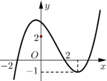

Số nghiệm thực của phương trình *f* (*x*3 −3*x*) 43 là 

**A.** 3**.  B.** 8**.  C.** 7**.  D.** 4**.** 

**Câu 44.** Xét các số phức  *z* thỏa mãn *z* = 2 . Trên mặt phẳng tọa độ *Oxy* , tập hợp điểm biểu diễn của các số 

4+*iz*

phức w = là một đường tròn có bán kính bằng 

1+ *z*

**A.**  34. **B.** 26. **C.** 34. **D.**  26.

**Câu 45.** Cho đường thẳng  *y* = *x* và Parabol  *y*  =1 *x*2 *a* (*a* là tham số thực dương). Gọi *S* và  *S* lần lượt là 

2 1 2

diện tích của hai hình phẳng được gạch chéo trong hình vẽ bên. Khi  *S*1 = *S*2 thì  *a* thuộc khoảng nào sau 

đây? 

**A.** 3;1 **.  B.** 0;1 **.  C.** 1;2 **.  D.**  ;  

 2 3 **.**

7 2   3  3 5  5 7 

**Câu 46.** Cho hàm số  *f* (*x*), bảng biến thiên của hàm số  *f* ′(*x*) như sau 

Số điểm cực trị của hàm số  *y*  =*f* (*x*2 2*x*) là 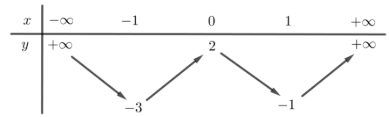

**A.** 9**.  B.** 3**.  C.** 7 **.  D.** 5**.** 

**Câu 47.** Cho lăng trụ  *ABC*⋅*A*'*B*'*C*' có chiều cao bằng 8 và đáy là tam giác đều cạnh bằng 6. Gọi  *M*,*N* và *P* lần lượt là tâm của các mặt bên  *ABB*'*A*',  *ACC*'*A*' và  *BCC*'*B*'. Thể tích của khối đa diện lồi có các 

đỉnh là các điểm  *A*,*B*,*C*,*M*,*N*,*P* bằng: 

**A.** 27 3**.  B.** 21 3**.  C.** 30 3 **.  D.** 36 3 **.** 

**Câu  48.**  Trong  không  gian  *Oxyz* ,  cho  mặt  cầu  (*S*):*x*2 + *y*2 +(*z*+ 2)2 3.  Có  tất  cả  bao  nhiêu  điểm *A*(*a*;*b*;*c*) (*a*, *b*, *c* là các số nguyên) thuộc mặt phẳng  (*Oxy*) sao cho có ít nhất hai tiếp tuyến của (*S*) đi 

qua  *A* và hai tiếp tuyến đó vuông góc với nhau? 

**A.** 12**.  B.** 8**.  C.** 16**.  D.** 4**.** 

**Câu 49.** Cho hai hàm số  *y* +*x*−3 +*x* −2 +*x* −1 *x* và  *y* +*x* −2 +*x m* (*m* là tham số thực) có đồ thị lần 

*x*−2 *x* −1 *x x* +1

lượt là (*C* ) và (*C* ). Tập hợp tất cả các giá trị của *m* để (*C* ) và (*C* ) cắt nhau tại 4 điểm phân biệt là 

**A.** (−∞;2]1**.**  2 **B.** [2;+∞)**.  C.** (−∞;12) **.**  2 **D.** (2;+∞) **.** 

**Câu 50.** Cho phương trình (4log22 *x*+log2 *x*−5) 7*x* −*m* 0 (*m* là tham số thực). Có tất cả bao nhiêu giá trị 

nguyên dương của *m* để phương trình đã cho có đúng hai nghiệm phân biệt 

**A.** 49**.  B.** 47**.  C.** Vô số**.  D.** 48**.** 

**-------- HẾT -------** 

**BỘ GIÁO DỤC VÀ ĐÀO TẠO** **\_\_\_\_\_\_\_\_\_\_\_\_\_\_\_\_** 

**ĐỀ THI CHÍNH THỨC** 

**KỲ THI THPT QUỐC GIA NĂM 2019** 

**Bài thi: TOÁN HỌC** 

*Thời gian làm bài: 90 phút, không kể thời gian phát đề* 

**MÃ ĐỀ 102 **

**Câu 1.** Họ tất cả các nguyên hàm của hàm số  *f* (*x*)  =2*x* 6 là 

**A.** *x*2 +6*x*+*C* **.  B.** 2*x*2 +*C* **.  C.** 2*x*2 +6*x*+*C* **.  D.** *x*2 +*C* **.** 

**Câu 2.** Trong không gian *Oxyz* ,cho mặt phẳng (*P*):  2*x*− *y* +3*z* +1 0. Vectơ nào dưới đây là một vectơ 

pháp tuyến của (*P*) 

**A.** *n*r1 (2−; 1−; 3)**.  B.** *n*r4 = (2;1;3)**.  C.** *n*r2  =(2; 1;3−)**.  D.** *n*r3 = (2;3;1)**.** 

**Câu 3.** Thể tích của khối nón có chiều cao *h* và bán kính đáy *r* là 

**A.** π*r*2*h***.  B.** 2π*r*2*h***.  C.** 1π*r*2*h***.  D.**  4π*r*2*h***.** 

3 3

**Câu 4.** Số phức liên hợp của số phức 5−3*i* là 

**A.** −5 +3*i***.  B.** −3+5*i***.  C.** −5 −3*i***.  D.** 5+3*i***.** 

**Câu 5.** Với *a* là số thực dương tùy ý, log *a*3 bằng 

**A.** 13log5 *a***.  B.** 13 +log5 *a*5**.  C.** 3+log *a* **.  D.** 3log *a* **.** 

5 5

**Câu 6.** Trong không gian *Oxyz* , hình chiếu vuông góc của điểm *M* (3;−1;1) trên trục *Oz* có tọa độ là 

**A.** (3;0;0)**.  B.** (3;−1;0)**.  C.** (0;0;1)**.  D.** (0;−1;0)**.** 

**Câu 7.** Số cách chọn 2 học sinh từ 5 học sinh là 

**A.** 52 **.  B.** 25 **.  C.** *C*2 **.  D.**  *A*52 **.** 

**Câu 8.** Biết ∫1 *f* (*x*)*dx* = 3 và ∫1 *g*(*x*)*dx*  = −4 khi đó ∫1 *f* (*x*) 5+ *g*(*x*) *dx* bằng 

0 0 0

**A.** −7**.  B.** 7 **.  C.** −1**.  D.** 1**.** 

*x*−1 *y* −3 *z* +2

**Câu 9.** Trong không gian *Oxyz* , cho đường thẳng *d* :~~  =  . Vectơ nào dưới đây là một vectơ 

2 −5 3

chỉ phương của *d* ? 

**A.** *u*r1 = (2;5;3)**.  B.** *u*r4  =(2; 5;3−)**.  C.** *u*r2 = (1;3;2)**.  D.** *u*r3  =(1;3; 2)**.** 

**Câu 10.** Đồ thị của hàm số nào dưới đây có dạng như đường cong trong hình 

**A.**  *y* + *x*4 + 2*x*2 1**.  B.**  *y* + *x*+3 3*x* 1**.  C.** −*y x*3+ 3*x*2 1**.  D.** −*y x*4+ 2*x*2 1**.** 

**Câu 11.** Cho cấp số cộng (*un* ) với *u*1 = 2 và *u*2 =8. Công sai của cấp số cộng đã cho bằng 

**A.** 4**.  B.** −6**.  C.** 10**.  D.** 6**.** 

**Câu 12.** Thể tích khối lăng trụ có diện tích đáy *B* và chiều cao *h* là 

4 1

**A.** 3*Bh***.  B.** *Bh* **.  C.**  *Bh***.  D.**  *Bh***.** 

3 3

**Câu 13.** Nghiệm của phương trình 32*x*+1 = 27 là**.** 

**A.** *x* = 2**.  B.** *x* =1**.  C.** *x* =5**.  D.** *x* = 4**.** 

**Câu 14.** Cho hàm số  *f* (*x*) có bảng biến thiên như sau: 

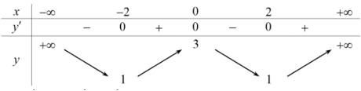

Hàm số đã cho đồng biến trên khoảng nào dưới đây? 

**A.** (0;+∞)**.  B.** (0;2)**.  C.** (−2;0) **.  D.** (−∞;−2)**.** 

**Câu 15.** Cho hàm số  *y* = *f* (*x*) có bảng biến thiên như sau: 

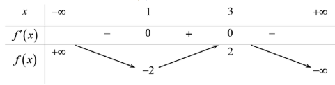

Hàm số đã cho đạt cực đại tại 

**A.** *x* = 2**.  B.** *x*  = −2**.  C.** *x* =3**.  D.** *x* =1**.** 

**Câu 16.** Nghiệm của phương trình log2 (*x*+1+) 1 log−2 (*x* 1) là: 

**A.** *x* =1**.  B.** *x*  = −2**.  C.** *x* =3**.  D.** *x* = 2**.** 

**Câu 17.** Giá trị nhỏ nhất của hàm số  *f* (*x*) − *x*3 +3*x* 2 trên đoạn [−3;3] bằng 

**A.** 20**.  B.** 4**.  C.** 0**.  D.** −16**.** 

**Câu 18.** Một cơ sở sản xuất có hai bể nước hình trụ có chiều cao bằng nhau, bán kính đáy lần lượt bằng 1 m và 1,4 m . Chủ cơ sở dự định làm một bể nước mới, hình trụ, có cùng chiều cao và có thể tích bằng tổng 

thể tích của hai bể nước trên. Bán kính đáy của bể nước dự định làm **gần nhất** với kể quả nào dưới đây? 

**A.** 1,7 m **.  B.** 1,5 m**.  C.** 1,9 m**.  D.** 2,4 m**.** 

**Câu 19.** Cho hàm số  *f* (*x*) có đạo hàm  *f* ′(*x*) *x*(*x* −2)2 , ∀*x* ∈¡. Số điểm cực trị của hàm số đã cho là 

**A.** 2**.  B.** 1**.  C.** 0 **.  D.** 3**.** 

**Câu 20.** Gọi *z*1,*z*2 là hai nghiệm phức của phương trình *z*2 −6*z* +14 0. Giá trị của  *z*12 + *z*22 bằng 

**A.** 36**.  B.** 8**.  C.** 28**.  D.** 18**.** 

**Câu 21.** Cho khối chóp đứng  *ABC*.*A*′*B* ′*C* ′ có đáy là tam giác đều cạnh  *a* và  *AA*′= 2*a* (minh hoạ như 

hình vẽ bên)**.** 

**A/ C/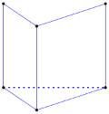**

**A**

**A**

**C**

**B**

Thể tích của khối lăng trụ đã cho bằng 

3*a*3 *a*3 3 3*a*3

**A.  .  B.  .  C.**  3*a*3 **.  D.  .** 

3 6 2

**Câu 22.** Trong không gian *Oxyz* , cho mặt cầu (*S*): *x*2 + *y*2 + *z*2 −2*x* +2*y* −7 0. Bán kính của mặt cầu 

đã cho bằng 

**A.** 3**.  B.** 9**.  C.**  15 **.  D.**  7 **.** 

**Câu 23.** Cho hàm số  *f* (*x*)có bảng biến thiên như sau: 

Số nghiệm thực của phương trình3*f* (*x*)−5 0 là: 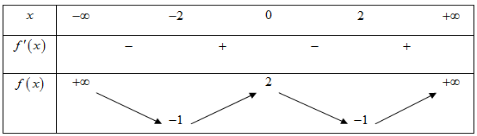

**A.** 2**.  B.** 3**.  C.** 4**.  D.** 0**.** 

**Câu 24.** Cho hàm số  *y* = *f* (*x*) có bảng biến thiên sau: 

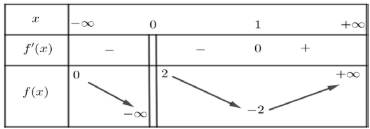

Tổng số tiệm cận đứng và tiệm cận ngang của đồ thị hàm số là: 

**A.** 3**.  B.** 1**.  C.** 2**.  D.** 4**.** 

**Câu 25.** Cho *a*và *b* là các số thực dương thỏa mãn *a*3*b*2 = 32 . Giá trị của 3log2 *a*+2log2 *b* bằng 

**A.** 5**.  B.** 2**.  C.** 32**.  D.** 4**.** 

**Câu 26.** Hàm số  *y* = 3*x*2 −3*x* có đạo hàm là 

**A.** (2*x*−3).3*x*2 −3*x* **.  B.** 3*x*2 −3*x*.ln3**.  C.** (*x*2 −3*x*).3*x*2 −3*x*−1**.  D.** (2*x*−3).3*x*2 −3*x*.ln3**.** 

**Câu 27.** Trong không gian  *Oxyz* , cho hai điểm  *A*(−1;2;0) và  *B*(3;0;2). Mặt phẳng trung trực của đoạn 

*AB* có phương trình là? 

**A.** 2*x*+ *y*+ *z*−4 0**.  B.** 2*x*− *y* +*z* −2 0**.  C.** *x*+ *y*+ *z*−3 0**.  D.** 2*x*− *y* +*z* +2 0**.** 

**Câu 28.** Cho hai số phức  *z*− + 2 *i* và  *z*2  =1 *i*+. Trên mặt phẳng tọa độ  *Oxy* điểm biểu diễn số phức 

**A**2*z***.** 1(+3;*z*−2 3c)ó t**.** ọa độ là  1**B.** (2;−3)**.  C.** (−3;3)**.  D.** (−3;2)**.** 

**Câu 29.** Cho hàm số  *f* (*x*) liên tục trên  ¡. Gọi  *S* là diện tích hình phẳng giới hạn bởi các đường 

*y* = *f* (*x*),  *y* = 0, *x*  = −1 và *x* =5 (như hình vẽ bên). Mệnh đề nào dưới đây đúng? 

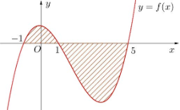

1 5 1 5

**A.** *S*  =∫*f* (*x*)*dx* ∫*f* (*x*)*dx*+**.  B.** *S*  =∫*f* (*x*)*dx* ∫*f* (*x*)*dx*−**.** 

−1 1 −1 1

**C.** *S* ∫1 *f* (*x*)*dx* ∫5 *f* (*x*)*dx***.  D.** *S* ∫1 *f* (*x*)*dx* ∫5 *f* (*x*)*dx***.** 

−1 1 −1 1

**Câu 30.** Cho hình chóp  *S*.*ABC* có  *SA* vuông góc với mặt phẳng (*ABC*),  *SA* = 2*a* , tam giác  *ABC* vuông 

tại  *B* ,  *AB* = *a* và  *BC* = 3*a* (minh họa như hình vẽ). Góc giữa đường thẳng *SC* và mặt phẳng (*ABC*) bằng 

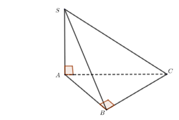

**A.** 90o**.  B.** 30o**.  C.** 60o**.  D.** 45o**.** 

**Câu 31.** Cho số phức *z* thỏa mãn 3(*z* −*i*)−(2 +3*i*)*z*− 7 16*i* . Môđun của *z* bằng 

**A.**  5**.  B.** 5**.  C.**  3**.  D.** 3**.** 

**Câu 32.** Trong không gian *Oxyz* , cho các điểm  *A*(1;0;2),  *B*(1;2;1) , *C*(3;2;0) và  *D*(1;1;3). Đường thẳng 

đi qua  *A* và vuông góc với mặt phẳng (*BCD*) có phương trình là 

*x*  =1 *t*− *x*  =1 *t*+ *x*  =2 *t*+ *x*  =1 *t*−

**A.** *y* = 4*t* **.  B.** *y* = 4 **.  C.** *y*  =4 4+*t* **.  D.** *y*  =2 4−*t* **.** 

    *z*  =2 2+*t* *z*  =2 2+*t* *z*  =4 2+*t* *z*  =2 2−*t*

π

**Câu 33.** Cho hàm số  *f* (*x*). Biết  *f* (0) = 4 và  *f* '(*x*) 2cos2 *x* 3, +*x* ∀¡,∈ khi đó ∫4 *f* (*x*)d*x* bằng 

0

π 2 + 2 π 2 +8π +8 π 2 +8π + 2 π 2 +6π +8

**A.  .  B.  .  C.  .  D.  .** 

8 8 8 8

3*x* −1

**Câu 34.** Họ tất cả các nguyên hàm của hàm số  *f* (*x*) = trên khoảng (1;+∞) là 

(*x* −1)2

**A.** 3ln(*x* −1) − 2 +*C***.  B.** 3ln(*x* −1) + 1 +*C***.  C.** 3ln(*x* −1) − 1 +*C***.  D.** 3ln(*x* −1) + 2 +*C***.** 

*x* −1 *x* −1 *x* −1 *x* −1

**Câu 35.** Cho hàm số  *f* (*x*), bảng xét dấu của  *f* ′(*x*) như sau: 

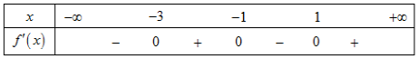

Hàm số  *y*  =*f* (5 2*x*) nghịch biến trên khoảng nào dưới đây? 

**A.** (2;3)**.  B.** (0;2)**.  C.** (3;5)**.  D.** (5;+∞)**.** 

**Câu 36.** Cho hình trụ có chiều cao bằng 4 2 . Cắt hình trụ đã cho bởi mặt phẳng song song với trục và cách 

trục một khoảng bằng  2 , thiết diện thu được có diện tích bằng 16. Diện tích xung quanh của hình trụ đã cho bằng 

**A.** 24 2π **.  B.** 8 2π **.  C.** 12 2π **.  D.** 16 2π **.** 

**Câu 37.** Cho phương trình log9 *x*2 −log3 (6*x* −1) log3 *m* (*m* là tham số thực). Có tất cả bao nhiêu giá trị 

nguyên của *m* để phương trình đã cho có nghiệm? 

**A.** 6 **.  B.** 5**.  C.** Vô số**.  D.** 7 **.** 

**Câu 38.** Cho hàm số  *f* (*x*), hàm số  *y* = *f* ′(*x*) liên tục trên  ¡ và có đồ thị như hình vẽ bên. Bất phương 

trình  *f* (*x*) > *x*+*m* (*m* là tham số thực) nghiệm đúng với mọi *x*∈ (0;2) khi và chỉ khi 

*y y* = *f* ′(*x*)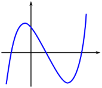

1

*x*

*O* 2

**A.** *m* ≤ *f* (2)−2**.  B.** *m* < *f* (2)−2**.  C.** *m* ≤ *f* (0)**.  D.** *m* < *f* (0)**.** 

**Câu 39.** Cho hình chóp *S*.*ABCD* có đáy là hình vuông cạnh *a*, mặt bên *SAB* là tam giác đều và nằm trong mặt phẳng vuông góc với mặt phẳng đáy. Khoảng cách từ *C* đến (*SBD*) bằng? (minh họa như hình vẽ 

sau) 

***S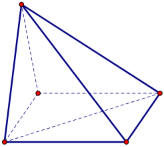***

***D***

***A***

***B C***

21*a* 21*a* 2*a* 21*a*

**A.  .  B.  .  C.  .  D.  .** 

28 14 2 7

**Câu 40.** Chọn ngẫu nhiên hai số khác nhau từ 27 số nguyên dương đầu tiên. Xác suất để chọn được hai số 

có tổng là một số chẵn là 

13 14 1 365

**A.  .  B.  .  C.  .  D.  .** 

27 27 2 729

**Câu 41.** Cho hàm số bậc ba  *y* = *f* (*x*) có đồ thị như hình vẽ bên. Số nghiệm thực của phương trình 

*f* (*x*3 −3*x*) 1 là 

2

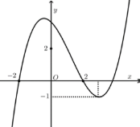

**A.** 6 **.  B.** 10**.  C.** 12**.  D.** 3**.** 

**Câu  42.**  Cho  hàm  số  *f* (*x*)  có  đạo  hàm  liên  tục  trên  ¡.  Biết  *f* (5) =1  và  ∫1 *xf* (5*x*)d*x* =1,  khi  đó 

0

5

∫*x*2 *f* ′(*x*)d*x* bằng 0

123

**A.** 15**.  B.** 23**.  C.  .  D.** −25**.** 

5

**Câu 43.** Cho đường thẳng  *y* = 3 *x* và parbol  *y*  =1 *x*2 *a* (*a* là tham số thực dương). Gọi *S* , *S* lần lượt là 

4 2 1 2

diện tích của hai hình phẳng được gạch chéo trong hình vẽ bên**.** 

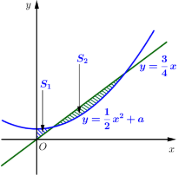

Khi *S* = *S* thì *a* thuộc khoảng nào dưới đây? 

**A.** 11 9 2 3 7 **.**  3   7 1 

4; **.  B.**  ;   **C.** 0; **.  D.**  ; **.** 

 32  16 32   16  32 4 

**Câu 44.** Xét các số phức  *z* thỏa mãn *z* = 2 . Trên mặt phẳng tọa độ Ox*y* , tập hợp điểm biểu diễn các số 

3+*iz*

phức *w* = là một đường tròn có bán kính bằng 

1+ *z*

**A.** 2 3**.  B.** 12**.  C.** 20**.  D.** 2 5**.** 

**Câu 45.** Trong không gian  *Oxyz* , cho điểm  *A*(0;4;−3). Xét đường thẳng  *d* thay đổi, song song với trục 

*Oz* và cách trục  *Oz* một khoảng bằng 3. Khi khoảng cách từ  *A* đến  *d* lớn nhất,  *d* đi qua điểm nào dưới đây? 

**A.** *P*(−3;0;−3)**.  B.** *M* (0;11;−3)**.  C.** *N* (0;3;−5)**.  D.** *Q*(0;−3;−5)**.** 

**Câu 46.** Trong không gian  *Oxyz* , cho mặt cầu  (*S*):*x*2 + *y*2 +(*z* − 2)2 3. Có tất cả bao nhiêu điểm *A*(*a*;*b*;*c*) (*a*,*b*,*c* là các số nguyên) thuộc mặt phẳng (*Oxy*) sao cho có ít nhất hai tiếp tuyến của (*S*) đi 

qua  *A* và hai tiếp tuyến đó vuông góc với nhau? 

**A.** 12**.  B.** 4**.  C.** 8**.  D.** 16**.** 

**Câu 47.** Cho phương trình (2log22 *x*−3log2 *x* −2) 3*x* −*m* 0 (*m* là tham số thực). Có tất cả bao nhiêu giá 

trị nguyên dương của *m* để phương trình đã cho có đúng hai nghiệm phân biệt? 

**A.** 79 **.  B.** 80**.  C.** Vô số**.  D.** 81**.** 

**Câu 48.** Cho hàm số  *f* (*x*), bảng biến thiên của hàm số  *f* ′(*x*) như sau: 

Số điểm cực trị của hàm số  *y*  =*f* (*x*2 2*x*) là ![ref1]

**A.** 3**.  B.** 9**.  C.** 5**.  D.** 7 **.** 

**Câu 49.** Cho khối lăng trụ *ABC*.*A*′*B* ′*C* ′ có chiều cao bằng 8 và đáy là tam giác đều cạnh bằng 4. Gọi *M*,*N* 

và  *P* lần lượt là tâm của các mặt bên  *ABA*′*B* ′,  *ACC*′*A* ′ và  *BCC*′*B* ′. Thể tích của khối đa diện lồi có các đỉnh là các điểm  *A*,*B*,*C*,*M*,*N*,*P* bằng 

28 3 40 3

**A.** 12 3**.  B.** 16 3**.  C.  .  D.  .** 

3 3

**Câu 50.** Cho hai hàm số  *y*+ *x*~~ + *x*+1+ *x*+2 *x*+3 và *y* +*x* −1 +*x m* (*m* là tham số thực) có đồ thị 

*x*+1 *x*+2 *x*+3 *x*+4

lần lượt là (*C*1 ) và (*C*2 ) . Tập hợp tất cả các giá trị của *m* để (*C*1 ) và (*C*2 ) cắt nhau tại đúng bốn điểm phân biệt là 

**A.** (3;+∞)**.  B.** (−∞;3]**.  C.** (−∞;3)**.  D.** [3;+∞)**.** 

**--------- HẾT ---------** 

**BỘ GIÁO DỤC VÀ ĐÀO TẠO**  **KỲ THI THPT QUỐC GIA NĂM 2019** 

**\_\_\_\_\_\_\_\_\_\_\_\_\_\_\_\_**  **Bài thi: TOÁN HỌC** 

**ĐỀ THI CHÍNH THỨC**  *Thời gian làm bài: 90 phút, không kể thời gian phát đề* **MÃ ĐỀ 103 **

**Câu 1.** Trong không gian  *Oxyz* , cho mặt phẳng  (*P*):2*x*−3*y* +*z* −2 0. Vectơ nào dưới đây là một vectơ pháp tuyến của (*P*)? 

uur uur ur uur

**A.**−*n*3 −( 3;1; 2)**.  B.** *n*2 (2−; 3−; 2)**.  C.** *n*1  =(2; 3;1)−**.  D.** *n*4  =(2;1; 2)**.** 

**Câu 2.** Đồ thị của hàm số nào dưới đây có dạng như đường cong trong hình vẽ bên? 

**A.** −*y x*3− 3*x*2 2**.  B.** −*y x*4− 2*x*2 2**.  C.**  *y* + *x*3− 3*x*2 2**.** 

**Câu 3.** Số cách chọn 2 học sinh từ 6 học sinh là 

**A.**  *A*2 **.  B.** *C* **.  C.** 26 **.** 

6 ∫2 *f* (*x*)d*x* = 2 ∫2 *g*(62*x*)d*x* = 6 ∫2 *f* (*x*)−*g*(*x*) d*x*

**Câu 4.** Biết  1 và  1 , khi đó  1 bằng 

**A.** 4 **.  B.** −8**.  C.** 8**.** 

**Câu 5.** Nghiệm của phương trình 22*x*−1 = 8 là 

**A.** *x* = 3**.  B.**  *x* = 2**.  C.** *x* = 5**.** 

2 2

**Câu 6.** Thể tích của khối nón có chiều cao *h* và bán kính đáy *r* là 

**A.** π*r*2*h* **.  B.**  4π*r*2*h***.  C.** 2π*r*2*h***.** 

3

**Câu 7.** Số phức liên hợp của số phức 1−2*i* là 

**A.** −1−2*i***.  B.** 1+2*i* **.  C.** −2 +*i***.** 

**Câu 8.** Thể tích của khối lăng trụ có diện tích đáy *B* và chiều cao *h* là 

4 1

**A.**  *Bh***.  B.** 3*Bh***.  C.**  *Bh***.** 

3 3

**Câu 9.** Cho hàm số  *f* (*x*) có bảng biến thiên như sau: 

**D.**  *y* + *x*4− 2*x*2 2**.** 

**D.** 62 **.** 

**D.** −4**.** 

**D.** *x* =1**.** 

1

**D.**  π*r*2*h***.** 

3

**D.** −1+2*i***.** 

**D.** *Bh* **.** 

Hàm số đã cho đạt cực đại tại 

**A.**  *x* = 2**.  B.** *x*  = −2**.  C.**  *x* = 3**.  D.** *x* =1**.** 

**Câu 10.** Trong không gian *Oxyz* , hình chiếu vuông góc của điểm *M* (2;1;−1) trên trục *Oy* có tọa độ là 

**A.** (0;0;−1) **.  B.** (2;0;−1)**.  C.** (0;1;0)**.  D.** (2;0;0)**.** 

**Câu 11.** Cho cấp số cộng (*un* ) với *u*1 = 2 và *u*2 = 6. Công sai của cấp số cộng đã cho bằng 

**A.** 3**.  B.** −4**.  C.** 8**.  D.** 4 **.** 

**Câu 12.** Họ tất cả các nguyên hàm của hàm số  *f* (*x*)  =2*x* 3 là 

**A.** 2*x*2 +*C* **.  B.**  *x*2 +3*x* +*C* **.  C.** 2*x*2 +3*x* +*C* **.  D.** *x*2 +*C* **.** 

*x* +2 *y* −1 *z* −3

**Câu 13.** Trong không gian *Oxyz* , cho đường thẳng *d* :~~  =  . Vectơ nào dưới đây là một 

1 −3 2

vectuơur chỉ phương của *d* ?  uur ur uur

**A.** *u*2  =(1; 3;2−)**.  B.** *u*3  =( 2−;1;3) **.  C.** *u*1  =( 2−;1;2)**.  D.** *u*4 = (1;3;2)**.** 

**Câu 14.** Với *a* là số thực dương tùy ý, log2 *a*3 bằng 

1 1

**A.** 3log *a***.  B.**  log *a***.  C.**  +log *a***.  D.** 3+log *a***.** 

2 3 2 3 2 2

**Câu 15.** Cho hàm số  *f* (*x*) có bảng biến thiên như sau: 

Hàm số đã cho đồng biến trên khoảng nào dưới đây? 

**A.** (−1;0)**.  B.** (−1;+ ∞)**.  C.** (−∞;−1) **.  D.** (0;1)**.** 

**Câu 16.** Cho hàm số  *f* (*x*) có bảng biến thiên như sau: 

Số nghiệm thực của phương trình 2 *f* (*x*)−3 0 là 

**A.** 1**.  B.** 2 **.  C.** 3**.  D.** 0**.** 

**Câu 17.** Cho hai số phức  *z*1  =1 *i*+và  *z*2  =2 *i*+. Trên mặt phẳng *Oxy* , điểm biểu diễn số phức  *z*1 + 2*z*2 

có tọa độ là 

**A.** (2;5)**.  B.** (3;5) **.  C.** (5;2)**.  D.** (5;3) **.** 

**Câu 18.** Hàm số  *y* = 2*x*2−*x* có đạo hàm là 

**A.** (*x*2 − *x*)2*x*2−*x*−1 **.  B.** (2*x* −1).2*x*2−*x* **.  C.** 2*x*2−*x*.ln2**.  D.** (2*x* −1).2*x*2−*x*.ln2**.** 

**Câu 19.** Giá trị lớn nhất của hàm số  *f* (*x*)  =*x*3 3*x*−trên đoạn [−3;3] bằng 

**A.** 18**.  B.** 2**.  C.** −18**.  D.** −2**.** 

**Câu 20.** Cho hàm số  *f* (*x*) có đạo hàm  *f* ′(*x*)  =*x*(*x* 1)2 ,∀*x*∈ ¡. Số điểm cực trị của hàm số đã cho là 

**A.** 2**.  B.** 0 **.  C.** 1**.  D.** 3**.** 

**Câu 21.** Cho *a* ; *b* là hai số thực dương thỏa mãn *a*2*b*3 =16 . Giá trị của 2log2 *a* +3log2 *b* bằng 

**A.** 8**.  B.** 16**.  C.** 4**.  D.** 2**.** 

**Câu  22.**  Cho  hình  chóp  *S*.*ABC*  có  *SA*  vuông  góc  với  mặt  phẳng  (*ABC*).*SA* = 2*a* ,  tam  giác 

*ABC* vuông cân tại *B* và  *AB* = *a* . Góc giữa đường thẳng *SC* và mặt phẳng (*ABC*) bằng 

***S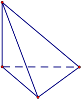***

***A C***

***B***

**A.** 45°**.  B.** 60°**.  C.** 30°**.  D.** 90°**.** 

**Câu 23.** Một cở sở sản xuất có hai bể nước hình trụ có chiều cao bằng nhau, bán kính đáy lần lượt bằng 1*m* và 1,8*m*. Chủ cơ sở dự định làm một bể nước mới, hình trụ, có cùng chiều cao và có thể tích bằng 

tổng thể tích của hai bể nước trên. Bán kính đáy của bể nước dự dịnh làm **gần nhất** với kết quả nào dưới đây? 

**A.** 2,8*m***.  B.** 2,6*m* **.  C.** 2,1*m* **.  D.** 2,3*m* **.** 

**Câu 24.** Nghiệm của phương trình log2 (*x*+1)+1 log2 (3*x* 1) là 

**A.** *x* =3**.  B.** *x* = 2**.  C.** *x*  = −1**.  D.** *x* =1**.** 

**Câu 25.** Cho khối lăng trụ đứng  *ABC*.*A*′*B* ′*C* ′ có đáy là tam giác đều cạnh  2*a* và  *AA*′= 3*a* (minh họa 

như hình vẽ bên)**.** 

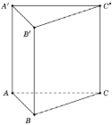

Thể tích của khối lăng trụ đã cho bằng 

**A.** 2 3*a*3 **.  B.**  3*a*3 **.  C.** 6 3*a*3 **.  D.** 3 3*a*3 **.** 

**Câu 26.** Trong không gian *Oxyz* , cho mặt cầu (*S*):*x*2 + *y*2 + *z*2 +2*y*−2*z* −7 0. Bán kính của mặt cầu 

đã cho bằng 

**A.** 9**.  B.**  15 **.  C.**  7 **.  D.** 3**.** 

**Câu 27.** Trong không gian *Oxyz* , cho hai điểm  *A*(2;1;2) và *B*(6;5;−4). Mặt phẳng trung trực của đoạn 

thẳng  *AB* có phương trình là 

**A.** 2*x*+2*y*−3*z* −17 0 **.  B.** 4*x*+3*y*−*z* −26 0**.  C.** 2*x*+2*y*−3*z* +17 0**.  D.** 2*x*+2*y*+3*z* −11 0 **.** 

**Câu 28.** Cho hàm số  *f* (*x*) có bảng biến thiên như sau: 

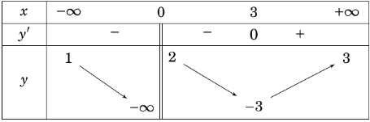

Tổng số tiệm cận đứng và tiệm cận ngang của đồ thị hàm số đã cho là 

**A.** 1**.  B.** 2**.  C.** 3**.  D.** 4**.** 

**Câu 29.** Cho hàm số  *f* (*x*) liên tục trên ¡. Gọi *S* là diện tích hình phẳng giới hạn bởi các đường 

*y f* (*x*), *y* 0,*x* 1,*x* 2(như hình vẽ bên). Mệnh đề nào dưới đây đúng? 

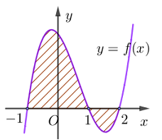

1 2 1 2

**A.** *S* ∫*f* (*x*)*dx* ∫*f* (*x*)*dx***.  B.** *S* ∫*f* (*x*)*dx* ∫*f* (*x*)*dx***.** 

−1 1 −1 1

1 2 1 2

**C.** *S*  =∫*f* (*x*)*dx* ∫*f* (*x*)*dx*−**.  D.** *S*  =∫*f* (*x*)*dx* ∫*f* (*x*)*dx*+**.** 

−1 1 −1 1

**Câu 30.** Gọi *z*1,*z*2 là hai nghiệm phức của phương trình *z*2 −4*z* +5 0. Gái trị của  *z*12 + *z*22 bằng 

**A.** 6**.  B.** 8**.  C.** 16**.  D.** 26**.** 

**Câu 31.** Trong không gian  *Oxyz* , cho các điểm  *A*(0;0;2), *B*(2;1;0),*C*(1;2 −1) và  *D*(2;0;−2) . Đường 

thẳng đi qua  *A*và vuông góc với mặt phẳng (*BCD*) có phương trình là 

*x*  =3 3+*t* *x* =3 *x*  =3 3+*t* *x* =3*t*

**A.** −*y* + 2 2*t* **.  B.** *y* = 2 **.  C.** *y*  =2 2+*t* **.  D.** *y* = 2*t* **.** 

*z*  =1 *t*− −*z* + 1 2*t* *z*  =1 *t*− *z*  =2 *t*+

**Câu 32.** Cho số phức *z*** thỏa (2+*i*)*z*−4(*z* −*i*−) + 8 19*i*. Môđun của  *z* bằng 

**A.** 13**.  B.** 5**.  C.**  13 **.  D.**  5**.** 

**Câu 33.** Cho hàm số  *f* (*x*), bảng xét dấu của  *f* ′(*x*)như sau: 

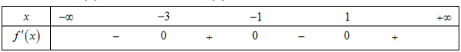

Hàm số  *y*  =*f* (3 2*x*)−đồng biến trên khoảng nào dưới đây? 

**A.** (3;4)**.  B.** (2;3)**.  C.** (−∞;−3)**.  D.** (0;2)**.** 

**Câu 34.** Họ tất cả các nguyên hàm của hàm số  *f* (*x*) = (2*xx*++21)2 trên khoảng (−2;+∞) là: 

1 1 3

**A.** 2ln(*x*+2)+~~ +*C* **. B.** 2ln(*x*+2)−~~ +*C* **. C.** 2ln(*x*+2)−~~ +*C* **. D.** 

*x*+2 *x*+2 *x*+2

2ln(*x*+2)+ 3~~ +*C* **.** 

*x*+2

π

**Câu 35.** Cho hàm số  *f* (*x*). Biết  *f* (0) = 4 và  *f* ′(*x*) 2sin2 *x* 1, +*x* ∀¡∈, khi đó ∫4 *f* (*x*)d*x* bằng 

0

π 2 +15π π 2 +16π −16 π 2 +16π−4 π 2 −4

**A.  .  B.  .  C.  .  D.  .** 

16 16 16 16

**Câu 36.** Cho phương trình log9 *x*2 −log3 (5*x* −1) log3 *m* (*m* là tham số thực). Có tất cả bao nhiêu giá 

trị nguyên của *m* để phương trình đã cho có nghiệm 

**A.** Vô số**.  B.** 5**.  C.** 4 **.  D.** 6 **.** 

**Câu 37.** Cho hình trụ có chiều cao bằng 3 2 . Cắt hình trụ bởi mặt phẳng song song với trục và cách trục 

một khoảng bằng 1, thiết diện thu được có diện tích bằng 12 2 . Diện tích xung quanh của hình trụ đã cho bằng 

**A.** 6 10π **.  B.** 6 34π **.  C.** 3 10π **.  D.** 3 34π **.** 

**Câu 38.** Cho hàm số  *f* (*x*), hàm số  *y* = *f* ′(*x*) liên tục trên ¡ và có đồ thị như hình vẽ bên**.** 

![ref2]

Bất phương trình  *f* (*x*) < 2*x*+*m* (*m* là tham số thực) nghiệm đúng với mọi *x*∈(0;2) khi và chỉ khi 

**A.** *m* > *f* (0)**.  B.** *m* > *f* (2)−4**.  C.** *m*≥ *f* (0)**.  D.** *m* ≥ *f* (2) −4**.** 

**Câu 39.** Cho hình chóp  *S*.*ABCD* có đáy là hình vuông cạnh  *a* , mặt bên  *SAB* là tam giác đều và nằm 

trong mặt phẳng vuông góc với mặt phẳng đáy (minh họa như hình vẽ bên). Khoảng cách từ  *D* đến mặt phẳng (*SAC*)bằng 

***S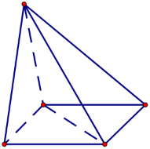***

***A D***

***B C***

*a* 21 *a* 21 *a* 2 *a* 21

**A.  .  B.  .  C.  .  D.  .** 

14 28 2 7

**Câu 40.** Chọn ngẫu nhiên hai số khác nhau từ 21 số nguyên dương đầu tiên. Xác suất để chọn được hai số 

có tổng là một số chẵn bằng 

11 221 10 1

**A.  .  B.  .  C.  .  D.  .** 

21 441 21 2

**Câu 41.** Cho đường thẳng  *y* = 3*x* và parabol  *y*  =2*x*2 *a* (  *a* là tham số thực dương). Gọi  *S* và  *S* lần 

1 2

lượt là diện tích của 2 hình phẳng được gạch chéo trong hình vẽ bên. Khi  *S*1 = *S*2 thì *a* thuộc khoảng 

nào dưới đây? 

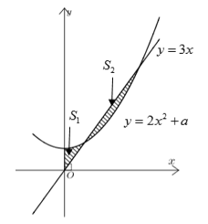

**A.** 4; 9 **.  B.** 0; 4 **.  C.** 1;9 **.  D.**  9 ;1 **.** 

5 10   5   8  10 

**Câu 42.** Trong không gian *Oxyz* , cho điểm  *A*(0;3;−2). Xét đường thẳng *d* thay đổi, song song với trục 

*Oz* và cách trục  *Oz* một khoảng bằng 2. Khi khoảng cách từ  *A*đến  *d* nhỏ nhất,  *d* đi qua điểm nào dưới đây? 

**A.** *P*(−2;0;−2)**.  B.** *N* (0;−2;−5)**.  C.** *Q*(0;2;−5)**.  D.** *M* (0;4;−2) **.** 

**Câu 43.** Cho số phức  *z* thỏa mãn *z* = 2 . Trên mặt phẳng tọa độ *Oxy* , tập hợp các điểm biểu diễn của 

số phức *w* thỏa mãn *w* = 2+*iz* là một đường tròn có bán kính bằng 

1+ *z*

**A.** 10**.  B.**  2 **.  C.** 2**.  D.**  10 **.** 

**Câu 44.** Cho hàm số  *f* (*x*) có đạo hàm liên tục trên  ¡. Biết  *f* (6) =1 và  ∫1 *xf* (6*x*)d *x* =1, khi đó 

0

∫6 *x*2 *f* ′(*x*)d*x* bằng 0

107

**A.  .  B.** 34**.  C.** 24**.  D.** −36**.** 

3

**Câu 45.** Cho hàm số bậc ba  *y* = *f* (*x*) có đồ thị như hình vẽ bên. Số nghiệm thực của phương trình 

*f* (*x*3 −3*x*) 3 là 

2

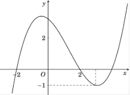

**A.** 8**.  B.** 4**.  C.** 7**.  D.** 3**.** 

**Câu 46.** Cho phương trình (2log2 *x*- log *x*-1) 5*x*- *m*= 0(m là tham số thực). Có tất cả bao nhiêu giá 

3 3

trị nguyên dương của *m* để phương trình đã cho có đúng 2 nghiệm phân biệt? 

**A.** 123**.  B.** 125**.  C.** Vô số**.  D.** 124**.** 

**Câu 47.** Trong không gian  Ox*yz* , cho mặt cầu  (*S*):*x*2 + *y*2 +(*z*+1)2 5. Có tất cả bao nhiêu điểm *A*(*a*;*b*;*c*) ( *a*,*b*,*c* là các số nguyên) thuộc mặt phẳng (*Oxy*) sao cho có ít nhất hai tiếp tuyến của (*S*) 

đi qua  *A* và hai tiếp tuyến đó vuông góc với nhau? 

**A.** 20**.  B.** 8**.  C.** 12**.  D.** 16**.** 

**Câu 48.** Cho hàm số  *f* (*x*), bảng biến thiên của hàm số  *f* ′(*x*) như sau: 

Số điểm cực trị của hàm số  *y*  =*f* (4*x*2 4*x*) là 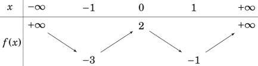

**A.** 9**.  B.** 5**.  C.** 7 **.  D.** 3**.** 

**Câu 49.** Cho lăng trụ  *ABC*.*A*'*B*'*C*' có chiều cao bằng 6 và đáy là tam giác đều cạnh bằng 4. Gọi *M*, *N, P* lần lượt là tâm của các mặt bên  *ABB*'*A*',*ACC* '*A*', *BCC* '*B* '. Thể tích của khối đa diện lồi có các đỉnh 

là các điểm  *A*,*B*,*C*,*M* ,*N*,*P* bằng 

**A.** 9 3 **.  B.** 10 3 **.  C.** 7 3**.  D.** 12 3 **.** 

**Câu 50.** Cho hai hàm số  *y* + *x*−1+ *x* +*x* +1 *x* +2 và  *y* +*x* −2 −*x m* (*m* là tham số thực) có đồ 

*x x*+1 *x*+2 *x*+3

thị lần lượt là (*C*1 ) và (*C*2 ). Tập hợp tất cả các giá trị của  *m* để (*C*1 ) và (*C*2 ) cắt nhau tại đúng  4 điểm phân biệt là 

**A.** [−2;+∞)**.  B.** (−∞ :−2)**.  C.** (−2: +∞)**.  D.** (−∞;−2]**.** 

**-------- HẾT --------** 

**BỘ GIÁO DỤC VÀ ĐÀO TẠO** 

**KỲ THI THPT QUỐC GIA NĂM 2019** 

**\_\_\_\_\_\_\_\_\_\_\_\_\_\_\_\_** **ĐỀ THI CHÍNH THỨC** 

**Bài thi: TOÁN HỌC** 

*Thời gian làm bài: 90 phút, không kể thời gian phát đề* 

**MÃ ĐỀ 104 **

**BỘ GIÁO DỤC VÀ ĐÀO TẠO** 

**KỲ THI THPT QUỐC GIA NĂM 2019** 

**CCâuâu 1. 2.** ST82ốrongcác hkhôngchọn 2 hgianọ c*O* s*x*inh t*yz* , ừc2ho8 hmọcặ st phinh lẳngà  (*P*):4*x*+3*y*82+ *z*−1 0. Vectơ nào dưới đây là một vectơ 

**A.** *C* **.  B.** 8 **.  C.**  *A* **.  D.** 28 **.** 

pháp tuyến của (*P*)? 

**A.** *n*r4  =(3;1; 1)**.  B.** *n*r3 = (4;3;1)**.  C.** *n*r2  =(4;1; 1) **.  D.** *n*r1  =(4;3; 1)**.** 

**Câu 3.** Nghiệm của phương trình 22*x*−1 = 32 là 

17 5

**A.** *x* =3**.  B.** *x* = **.  C.** *x* = **.  D.** *x* = 2**.** 

2 2

**Câu 4.** Thể tích của khối lăng trụ có diện tích đáy *B* và chiều cao *h* là 

4 1

**A.**  *Bh***.  B.**  *Bh***.  C.** 3*Bh***.  D.** *Bh* **.** 

3 3

**Câu 5.** Số phức liên hợp của số phức 3−2*i* là 

**A.** −3+2*i***.  B.** 3+2*i***.  C.** −3−2*i***.  D.** −2+3*i***.** 

**Câu 6.** Trong không gian *Oxyz* , hình chiếu vuông góc của điểm *M*(3;1;−1) trên trục *Oy* có tọa độ là 

**A.** (0;1;0) **.  B.** (3;0;0)**.  C.** (0;0;−1) **.  D.** (3;0;−1)**.** 

**Câu 7.** Cho cấp số cộng (*un* ) với *u*1 =1 và *u*2 = 4. Công sai của cấp số cộng đã cho bằng 

**A.** 5**.  B.** 4**.  C.** −3**.  D.** 3**.** 

**Câu 8.** Họ tất cả các nguyên hàm của hàm số  *f* (*x*)  =2*x* 4 là 

**A.** 2*x*2 +4*x*+*C***.  B.** *x*2 +4*x*+*C* **.  C.** *x*2 +*C* **.  D.** 2*x*2 +*C***.** 

**Câu 9.** Đồ thị của hàm số nào dưới đây có dạng như đường cong trong hình vẽ bên? 

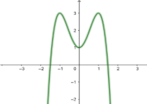

**A.**  *y* 2−*x*3 +3*x* 1**.  B.**  *y*+ 2+*x*4 4*x*2 1**.  C.**  *y* −2*x*4 +4*x*2 1**.  D.**  *y* + 2+*x*3 3*x* 1**.** 

**Câu 10.** Cho hàm số  *f* (*x*) có bảng biến thiên như sau:  

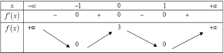

**BỘ GIÁO DỤC VÀ ĐÀO TẠO** 

**KỲ THI THPT QUỐC GIA NĂM 2019** 

Hàm số đã cho nghịch biến trên khoảng nào dưới đây? 

**A.** (0;1)**.  B.** (1;+∞ )**.  C.** (−1;0)**.** 

**Câu 11.** Trong không gian *Oxyz* , cho đường thẳng  *d* : *x* −3  =*y* +1

1 −2

vec tơ chỉ phương của *d* **.** 

**D.** (0;+∞)**.** 

*z* −5

. Vectơ nào dưới đây là một 

3

**A.** *u*ur1  =(3; 1;5−)**.  B.** *u*uur3  =(2;6; 4)**.  C.** *u*uur4− (−2; 4;6)**.** 

**Câu 12.** Với *a* là số thực dương tùy ý, log3 *a*2 bằng? 

1 1

**A.** 2log *a* **.  B.**  +log *a***.  C.**  log *a* **.** 

3 2 3 2 3

**Câu 13.** Thể tích khối nón có chiều cao *h* và bán kính đáy*r* là 

**A.** 2π*r*2*h***.  B.** π*r*2*h***.  C.** 1π*r*2*h***.** 

3

**Câu 14.** Cho hàm số *f* (*x*)có bảng biến thiên như sau: 

uur

**D.** *u*2  =(1; 2;3−)**.** 

**D.** 2+log3 *a***.** 

**D.**  4π*r*2*h* **.** 

3

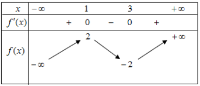

Hàm số đã cho đạt cực tiểu tại 

**A.** *x*  = −2**.  B.** *x* =1**.  C.** *x* =3**.  D.** *x* = 2**.** 

**Câu 15.** Biết ∫1 *f* (*x*)*dx*  =2; ∫1 *g*(*x*)*dx*  =4−. Khi đó ∫1 [ *f* (*x*)+ *g*(*x*)]*dx* bằng 

0 0 0

**A.** 6**.  B.** -6**.  C.** −2**.  D.** 2**.** 

**Câu 16.** Cho hai số phức *z*1 2 *i*,*z*2 1 *i*. Trên mặt phẳng tọa độ *Oxy*, điểm biểu diễn số phức 2*z*1 + *z*2 

có tọa độ là: 

**A.** (5;−1)**.  B.** (−1;5)**.  C.** (5;0)**.  D.** (0;5)**.** 

**Câu 17.** Cho hình chóp  *S*.*ABC* có  *SA* vuông góc với mặt phẳng  (*ABC*),  *SA* = 2*a* , tam giác  *ABC*

vuông cân tại *B* và  *AB* = 2*a*.(minh họa như hình vẽ bên)**.** 

***S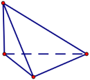***

***A C***

***B***

Góc giữa đường thẳng *SC* và mặt phẳng (*ABC*) bằng 

**A.** 60°**.  B.** 45°**.  C.** 30°**.  D.** 90°**.** 

**Câu 18.** Trong không gian *Oxyz* , cho mặt cầu (*S*):*x*2 + *y*2 + *z*2 −2*y* +2*z* −7 0. Bán kính của mặt cầu 

đã cho bằng 

**A.** 9**.  B.** 3**.  C.** 15**.  D.**  7 **.** 

**Câu 19.** Trong không gian  *Oxyz* , cho hai điểm  *A*(4;0;1),  *B*(−2;2;3). Mặt phẳng trung trực của đoạn 

thẳng  *AB* có phương trình là 

**A.** 6*x*−2*y* −2*z* −1 0**.  B.** 3*x*+ *y*+ *z*−6 0**.  C.** *x*+ *y*+2*z*−6 0**.  D.** 3*x*− *y* −*z* 0**.** 

**Câu 20.** Gọi *z*1,*z*2 là hai nghiệm phức của phương trình *z*2 −4*z* +7 0 . Giá trị của  *z*12 + *z*22 bằng 

**A.** 10**.  B.** 8**.  C.** 16**.  D.** 2**.** 

**Câu 21.** Giá trị nhỏ nhất của hàm số  *f* (*x*)  =*x*3 3*x*−trên đoạn [−3;3] bằng 

**A.** 18**.  B.** −18**.  C.** −2**.  D.** 2 **.** 

**Câu 22.** Một cơ sở sản xuất cố hai bể nước hình trụ có chiều cao bằng nhau, bán kính đáy lần lượt bằng 1*m* và 1,5*m*. Chủ cơ sở dự định làm một bể nước mới, hình trụ, có cùng chiều cao và có thể tích bằng 

tổng thể tích của hai bể trên. Bán kính đáy của bể nước dự định làm **gần nhất** với kết quả nào dưới đây? 

**A.** 1,6*m* **.  B.** 2,5*m***.  C.** 1,8*m***.  D.** 2,1*m* **.** 

**Câu 23.** Cho hàm số  *y* = *f* (*x*)có bảng biến thiên như sau: 

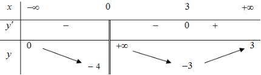

Tổng số tiệm cận đứng và tiệm cận ngang của đồ thị hàm số đã cho là 

**A.** 2**.  B.** 1**.  C.** 3**.  D.** 4**.** 

**Câu 24.** Cho hàm số  *f* (*x*) liên tục trên  R. Gọi  *S* là diện tích hình phẳng giới hạn bởi các đường 

*y*  =*f* (*x*), *y*  =0,*x*  =2 và *x* = 3 (như hình vẽ bên). Mệnh đề nào dưới đây là đúng? 

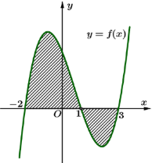

1 3 1 3

**A.** *S*  =∫*f* (*x*)*dx* ∫*f* (*x*)*dx*−**.  B.** *S* ∫*f* (*x*)*dx* ∫*f* (*x*)*dx* **.** 

−2 1 −2 1

1 3 1 3

**C.** *S*  =∫*f* (*x*)*dx* ∫*f* (*x*)*dx*+**.  D.** *S* ∫*f* (*x*)*dx* ∫*f* (*x*)*dx***.** 

−2 1 −2 1

**Câu 25.** Hàm số  *y* = 3*x*2 −*x* có đạo hàm là 

**A.** 3*x*2 −*x*.ln3**.  B.** (2*x*−1)3*x*2 −*x* **.  C.** (*x*2 −*x*).3*x*2 −*x*−1**.  D.** (2*x*−1)3*x*2 −*x*.ln3**.** 

**Câu 26.** Cho khối lăng trụ đứng  *ABC*.*A*′*B* ′*C* ′ có đáy là tam giác đều cạnh  *a* và  *AA*′= 2*a* (minh họa 

như hình vẽ bên). Thể tích của khối lăng trụ đã cho bằng 

A'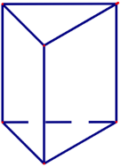

C'

B'

A C

B

6*a*3 6*a*3 6*a*3 6*a*3

**A.  .  B.  .  C.  .  D.  .** 

4 6 12 2

**Câu 27.** Nghiệm của phương trình log3 (2*x*+1+) 1 log−3 (*x* 1) là 

**A.** *x* = 4**.  B.** *x*  = −2**.  C.** *x* =1**.  D.** *x* = 2**.** 

**Câu 28.** Cho *a*,*b* là hai số thực dương thỏa mãn *ab*3 =8. Giá trị của log2 *a* +3log2 *b* bằng 

**A.** 8**.  B.** 6**.  C.** 2**.  D.** 3**.** 

**Câu 29.** Cho hàm số  *f* (*x*) có bảng biến thiên như sau: 

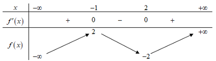

Số nghiệm của phương trình 2*f* (*x*)+3 0 là 

**A.** 3**.  B.** 1**.  C.** 2**.  D.** 0 **.** 

**Câu 30.** Cho hàm số  *f* (*x*) có đạo hàm  *f* ′(*x*) *x*(*x* +1)2 , ∀*x* ∈¡. Số điểm cực trị của hàm số đã cho là 

**A.** 0 **.  B.** 1**.  C.** 2**.  D.** 3**.** 

**Câu 31.** Cho số phức *z* thỏa (2−*i*)*z* +3+16*i* 2(*z*+ *i*). Môđun của  *z* bằng 

**A.**  5 **.  B.** 13**.  C.**  13 **.  D.** 5**.** 

**Câu 32.** Cho hàm số  *f* (*x*). Biết  *f* (0) = 4và  *f* '(*x*) 2sin2 *x* 3,+*x* ∀¡∈, khi đó  π∫4 *f* (*x*)*dx* bằng 

0

π 2 −2 π 2 +8π−8 π 2 +8π −2 3π 2 +2π−3

**A.  .  B.  .  C.  .  D.  .** 

8 8 8 8

**Câu 33.** Trong không gian  *Oxyz* , cho các điểm  *A*(2;−1;0),  *B*(1;2;1),  *C*(3;−2;0) và  *D*(1;1;−3). 

Đường thẳng đi qua *D* và vuông góc với mặt phẳng (*ABC*) có phương trình là 

*x* =*t* *x* =*t* *x*  =1 *t*+ *x*  =1 *t*+

**A.** *y* =*t* **.  B.** *y* =*t* **.  C.** *y*  =1 *t*+ **.  D.** *y*  =1 *t*+ **.** 

−*z* − 1 2*t* *z*  =1 2−*t* −*z* − 2 3*t* −*z* + 3 2*t*

**Câu 34.** Cho hàm số  *f* (*x*), có bảng xét dấu  *f* ′(*x*) như sau: 

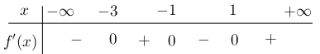

Hàm số  *y*  =*f* (5 2*x*) đồng biến trên khoảng nào dưới đây? 

**A.** (−∞;−3)**.  B.** (4;5)**.  C.** (3;4)**.  D.** (1;3) **.** 

**Câu 35.** Họ tất cả các nguyên hàm của hàm số  *f* (*x*)= 3*x*- 2 trên khoảng (2;+¥) là 

(*x*- 2)2

**A.** 3ln(*x*- 2)+ 4~~ + *C* **.  B.** 3ln(*x*- 2)+ 2~~ + *C* **.** 

*x*- 2 *x*- 2

**C.** 3ln(*x*- 2)- 2~~ + *C***.  D.** 3ln(*x*- 2)- 4~~ + *C***.** 

*x*- 2 *x*- 2

**Câu 36.** Cho phương trình log9 *x*2 −log3 (4*x* −1) log3 *m* (*m* là tham số thực). Có tất cả bao nhiêu giá 

trị nguyên của *m* để phương trình đã cho có nghiệm? 

**A.** 5**.  B.** 3**.  C.** Vô số**.  D.** 4 **.** 

**Câu 37.** Cho hàm số  *f* (*x*), hàm số  *y* = *f* ′(*x*) liên tục trên R và có đồ thị như hình vẽ bên. Bất phương 

trình  *f* (*x*) > 2*x* +*m* (*m* là tham số thực) nghiệm đúng với mọi *x*∈ (0;2) khi và chỉ khi 

**A.** *m* ≤ *f* (2)−4**.  B.** *m* ≤ *f* (0)**.  C.** *m* < *f* (0)**.  D.** *m* < *f* (2)−4.* **.** ![ref3]

**Câu 38.** Chọn ngẫu nhiên hai số khác nhau từ 23 số nguyên dương đầu tiên. Xác suất để chọn được hai số 

có tổng là một số chẵn bằng 

11 1 265 12

**A.  .  B.  .  C.  .  D.  .** 

23 2 529 23

**Câu 39.** Cho hình trụ có chiều cao bằng3 3. Cắt hình trụ đã cho bởi mặt phẳng song song với trục và 

cách trục một khoảng bằng 1, thiết diện thu được có diện tích bằng 18. Diện tích xung quanh của hình trụ đã cho bằng 

**A.** 6π 3 **.  B.** 6π 39 **.  C.** 3π 39 **.  D.** 12π 3 **.** 

**Câu 40.** Cho hình chóp*S*.*ABCD* có đáy là hình vuông cạnh  *a*, mặt bên*SAB* là tam giác đều và nằm 

trong mặt phẳng vuông góc với mặt phẳng đáy (minh họa như hình vẽ bên). Khoảng cách từ  *B* đến mặt phẳng(*SAC*)bằng 

***S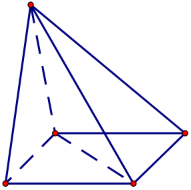***

***A D***

***B C***

*a* 2 *a* 21 *a* 21 *a* 21

**A.  .  B.  .  C.  .  D.  .** 

2 28 7 14

**Câu 41.** Cho đường thẳng  *y* = 3 *x* và parabol  *y*  =*x*2 *a* (  *a* là tham số thực dương). Gọi  *S* và  *S* lần 

2 1 2

lượt là diện tích của 2 hình phẳng được gạch chéo trong hình vẽ bên. Khi  *S*1 = *S*2 thì *a* thuộc khoảng 

nào sau đây 

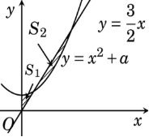

**A.** 1; 9 **.  B.** 2; 9 **.  C.**  9 ;1 **.  D.** 0;2 **.** 

2 16  5 20  20 2   5 

**Câu 42.** Cho hàm số bậc ba  *y* = *f* (*x*) có đồ thị như hình vẽ bên. Số nghiệm thực của phương trình *f* (*x*3 −3*x*) 2 là 

3

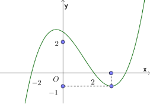

**A.** 6**. B.** 10**. C.** 3**. D.** 9**.**
**\
`  `Cho số phức  *z* thỏa mãn *z*= 2 . Trên mặt phẳng tọa độ *Oxy* , tập hợp các điểm biểu diễn của số phức *w* thỏa mãn *w* = 5+*iz* là một đường tròn có bán kính bằng 

1+ *z*

**A.** 52**.  B.** 2 13**.  C.** 2 11**.  D.** 44 **.**

1
**\
`  `Cho hàm số  *f* (*x*) có đạo hàm liên tục trên  ¡. Biết  *f* (3) =1 và  ∫*xf* (3*x*)d *x* =1, khi đó

0

∫3 *x*2 *f* ′(*x*)d*x* bằng

0

25

**A.** 3**. B.** 7**. C.** −9**. D. .** 

3

**Câu 45.** Trong không gian *Oxyz*, cho điểm  *A*(0;3;−2). Xét đường thẳng *d* thay đổi, song song với trục 

*Oz* và cách trục *Oz* một khoảng bằng 2. Khi khoảng cách từ  *A* đến *d* lớn nhất, *d* đi qua điểm nào dưới đây? 

**A.** *Q*(−2;0;−3)**. B.** *M* (0;8;−5)**. C.** *N*(0;2;−5)**. D.** *P*(0;−2;−5)**.**
**\
`  `Cho hình lăng trụ  *ABC*.*A*¢*B*¢*C*¢ có chiều cao bằng  4 và đáy là tam giác đều cạnh bằng  4 . Gọi *M*,*N* và  *P* lần lượt là tâm của các mặt bên  *ABB*¢*A*¢,  *ACC*¢*A*¢ và  *BCC*¢*B*¢. Thể tích của khối đa diện 

lồi có các đỉnh là các điểm  *A*,*B*,*C*,*M*,*N*,*P* bằng 

14 3 20 3

**A. .  B.** 8 3**. C.** 6 3**. D.  .** 

3 3

*x*- 2 *x*-1 *x x*+1 

**Câu 47.** Cho hai hàm số  *y* =~~ +~~ +~~ + và  *y* = *x*+1- *x*- *m* ( *m* là tham số thực) có 

*x*-1 *x x*+1 *x*+ 2

đồ thị lần lượt là (*C*1) và (*C*2 ). Tập hợp tất các các giải trịcủa *m* để (*C*1) và (*C*2 ) cắt nhau tại đúng 4 điểm phân biệt là  

**A.** (−3;+∞)**.  B.** (−∞;−3)**.  C.** [−3;+∞)**.  D.** (−∞;−3]**.** 

**Câu 48.** Cho phương trình (2log22 *x*−log2 *x* −1) 4*x* −*m* 0 (*m* là tham số thực). Có tất cả bao nhiêu giá 

trị nguyên dương của *m* để phương trình đã cho có đúng hai nghiệm phân biệt 

**A.** Vô số**.  B.** 62 **.  C.** 63**.  D.** 64 **.** 

**Câu 49.** Trong không gian  *Oxyz* , cho mặt cầu  (*S*):*x*2 + *y*2 +(*z* −1)2 5. Có tất cả bao nhiêu điểm *A*(*a*;*b*;*c*) ( *a*,*b*,*c* là các số nguyên ) thuộc mặt phẳng (*Oxy*) sao cho có ít nhất hai tiếp tuyến của (*S*)

đi qua  *A* và hai tiếp tuyến đó vuông góc với nhau**.** 

**A.** 12**.  B.** 16**.  C.** 20**.  D.** 8**.** 

**Câu 50.** Cho hàm số  *f* (*x*), bảng biến thiên của hàm số  *f* ′(*x*) như sau: 

![ref4]

Số điểm cực trị của hàm số  *y*  =*f* (4*x*2 4*x*) là 

**A.** 5**.  B.** 9**.  C.** 7 **.  D.** 3**.** 

**-------- HẾT --------** 

**BỘ GIÁO DỤC VÀ ĐÀO TẠO  KỲ THI THPT QUỐC GIA NĂM 2019** 

**ĐỀ THI CHÍNH THỨC  Bài thi:** **TOÁN** 

**Mã đề 101**  Thời gian làm bài: **90** **phút** 

**Câu 1.**  Trong không gian  , cho mặt phẳng  (*P*): *x*+2*y* +3*z* -1= 0. Vectơ nào dưới đây là một 

v**A**e**.**c*n*tuơur3 p=h(á1p;2t;u-y1ế)n.  củ*O*a *x*(*yPz*)**B**?**.** *n*uur4 =(1;2;3).  **C.** *n*ur1 =(1;3;-1).  **D.** *n*uur2 =(2;3;-1). 

**Lời giải** 

**Chọn B** 

Từ phương trình mặt phẳng (*P*): *x*+2*y*+3*z* -1= 0 ta có vectơ pháp tuyến của (*P*) là 

*n*uur4 =(1;2;3). 

**Câu 2.**  Với *a* là số thực dương tùy, log *a*2 bằng 

5

**A.** 2log5 *a*.  **B.** 2+log5 *a*.  **C.**  12 +log *a*.  **D.**  1 log *a*. 

5 2 5

**Lời giải** 

**Chọn A** 

Ta có log5 *a*2 = 2log5 *a*. 

**Câu 3.**  Cho hàm số  *f* (*x*) có bảng biến thiên như sau: 

Hàm số đã cho nghịch biến trên khoảng nào dưới đây? 

**A.** (-2;0).  **B.** (2;+¥).  **C.** (0;2). **D.** (0;+¥).

**Lời giải** 

**Chọn C** 

Ta có  *f* ¢(*x*) < 0 Û "*x*Î(0;2)Þ *f* (*x*)** nghịch biến trên khoảng (0;2)**.** 

**Câu 4.**  Nghiệm phương trình 32*x*-1 = 27 là 

**A.** *x* =5. **B.** *x* =1. **C.** *x* = 2. **D.** *x* = 4.

**Lời giải** 

**Chọn C** 

Ta có 32*x*-1 = 27 Û 32*x*-1 = 33 Û 2*x*-1= 3Û *x* = 2. 

**Câu 5.**  Cho cấp số cộng (*un* ) với *u*1 =3 và *u*2 =9. Công sai của cấp số cộng đã cho bằng 

**A.** -6. **B.** 3. **C.** 12. **D.** 6**.**

**Lời giải** 

**Chọn D** 

Ta có: *u*2 =*u*1 +*d* Û9=3+*d* Þ *d* =6

**Câu 6.**  Đồ thị của hàm số nào dưới đây có dạng như đường cong hình vẽ bên 

**A.** *y* = *x*3 -3*x*2 +3. **B.** *y* = -*x*3 +3*x*2 +3.  **C.**  *y* = *x*4 -2*x*2 +3.  **D.**  *y* = -*x*4 +2*x*2 +3.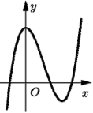![ref5]

**Lời giải** 

**Chọn A** 

Đồ thị hàm số có hai điểm cực trị nên loại C và D.** 

Khi *x* ®-¥ thì  *y* ® -¥ nên hệ số *a* > 0. Vậy chọn A.** 

*x*-2 *y*-1 *z* +3

**Câu 7.**  Trong không gian *Oxyz*, cho đường thẳng*d* :~~ =~~ = . Vectơ nào dưới đây là một 

v**A**e**.**c*u*tuơur2 c=h(ỉ2p;1h;ư1ơ).ng của *d*? **B.** *u*uur4 = (1;2;-3). -**C**1**.** *u*ur3 =2(-1;2;11). **D.** *u*ur1 = (2;1;-3).

**Lời giải** 

**Chọn C** 

**Câu 8.**  Thể tích của khối nón có chiều cao *h* và bán kính *r* là 

**A.** 1p*r*2*h*. **B.** p*r*2*h*. **C.** 4p*r*2*h*. **D.** 2p*r*2*h*.

3 3

**Lời giải** 

**Chọn A** 

**Câu 9.**  Số cách chọn 2 học sinh từ 7 học sinh là 

**A.** 27 .  **B.**  *A*72 .  **C.** *C*72 .  **D.** 72 .

**Lời giải** 

**Chọn C** 

**Câu 10.**  STốrocnágc hk hcôhnọgn  g2i ahnọ c*O*s*x*in*yz*h ,từhì7nhhọchcisếiun hv ulàô n*C*g72g. óc của điểm *M* (2;1;-1) trên trục *Oz* có tọa độ là 

**A.** (2;1;0). **B.** (0;0;-1). **C.** (2;0;0). **D.** (0;1;0).

**Lời giải** 

**Chọn B** 

Hình chiếu vuông góc của điểm *M* (2;1;-1) trên trục *Oz* có tọa độ là (0;0;-1). **Câu 11.**  Biết ò1 *f* (*x*)*dx* = -2 và ò1 *g*(*x*)*dx* = 3, khi đó ò1 éë *f* (*x*)- *g*(*x*)ùû*dx* bằng

0 0 0

**A.** -5. **B.** 5. **C.** -1. **D.** 1.

**Lời giải** 

**Chọn A** 

Ta có ò1 éë *f* (*x*)- *g*(*x*)ùû*dx* = ò1 *f* (*x*)*dx*-ò1 *g*(*x*)*dx* = -2-3= -5.

0 0 0

**Câu 12.**  Thể tích khối lăng trụ có diện tích đáy *B* và chiều cao *h* là 

4 1

**A.** 3*Bh*. **B.** *Bh*. **C.**  *Bh*. **D.** *Bh*.

3 3

**Lời giải** 

` `****3** ![ref6]**
**Đề **4** ![ref5]**

**Chọn B** 

**Câu 13.**  Số phức liên hợp của số phức 3-4*i* là 

**A.** -3-4*i*. **B.** -3+4*i*. **C.** 3+4*i*. **D.** -4+3*i*.

**Lời giải** 

**Chọn C** 

*z* = 3-4*i* Þ *z* = 3+4*i*. 

**Câu 14.**  Cho hàm số  *f* (*x*) có bảng biến thiên như sau: 

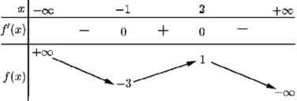

Hàm số đã cho đạt cực tiểu tại 

**A.** *x* = 2. **B.** *x* =1. **C.** *x* = -1. **D.** *x* = -3.

**Lời giải** 

**Chọn C** 

Từ bảng biến thiên ta thấy hàm số đã cho đạt cực tiểu tại *x* = -1**.** 

**Câu 15.**  Họ tất cả các nguyên hàm của hàm số  *f* (*x*) = 2*x*+5 là 

**A.** *x*2 +5*x*+*C*. **B.** 2*x*2 +5*x*+*C*. **C.** 2*x*2 +*C*. **D.** *x*2 +*C*.

**Lời giải** 

**Chọn A** 

Ta có ò *f* (*x*)d*x* = ò(2*x*+5)d*x* = *x*2 +5*x*+*C*. **Câu 16.**  Cho hàm số  *f* (*x*) có bảng biến thiên như sau: 

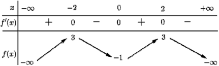

Số nghiệm thực của phương trình 2*f* (*x*)-3= 0 là 

**A.** 2.  **B.** 1.  **C.** 4. **D.** 3.

**Lời giải** 

**Chọn C** 

Ta có 2*f* (*x*)-3= 0 Û *f* (*x*) = 3.

2

Dựa vào bảng biến thiên ta thấy đồ thị hàm số  *y* = *f* (*x*) cắt đường thẳng  *y* = 3 tại ba điểm 

2

phân biệt. Do đó phương trình 2 *f* (*x*)-3= 0 có 4 nghiệm phân biệt. 

**Câu 17.**  Cho hình chóp  *S*.*ABC* có  *SA* vuông góc với mặt phẳng  (*ABC*),  *SA* = 2*a* , tam giác  *ABC*

vuông tại  *B* ,  *AB* = *a* 3 và  *BC* = *a* (minh họa hình vẽ bên). Góc giữa đường thẳng *SC* và mặt phẳng (*ABC*) bằng 

**4**![ref6]

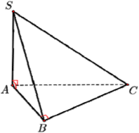

**A.** 90o. **B.** 45o. **C.** 30o. **D.** 60o.![ref5]

**Lời giải** 

**Chọn B** 

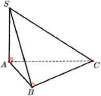

Ta thấy hình chiếu vuông góc của *SC* lên (*ABC*)là  *AC* nên (*S*·*C*,(*ABC*)) = *S*·*CA*. Mà  *AC* = *AB*2 +*BC*2 = 2*a*nên tan*S*·*CA* = *SA* =1. 

*AC*

Vậy góc giữa đường thẳng *SC* và mặt phẳng (*ABC*) bằng 45o. 

**Câu 18.**  Gọi *z*1,*z*2 là hai nghiệm phức phương trình *z*2 -6*z* +10 = 0. Giá trị *z*12 + *z*22 bằng 

**A.** 16. **B.** 56. **C.** 20. **D.** 26.

**Lời giải** 

**Chọn A** 

Theo định lý Vi-ét ta có *z*1 + *z* =6, *z*1.*z* =10. 

Suy ra *z*12 + *z*22 = (*z*1 + *z*2 )2 -2*z*21*z*2 = 62 -220 =16. 

**Câu 19.**  Cho hàm số  *y* = 2*x*2 -3*x* có đạo hàm là 

**A.** (2*x*-3).2*x*2-3*x*.ln2.  **B.** 2*x*2-3*x*.ln2. **C.** (2*x*-3).2*x*2-3*x* . **D.** (*x*2 -3*x*).2*x*2-3*x*-1.

**Lời giải** 

**Chọn A** 

**Câu 20.**  Giá trị lớn nhất của hàm số  *f* (*x*) = *x*3 -3*x*+2 trên đoạn [-3;3] bằng 

**A.** -16.  **B.** 20.  **C.** 0. **D.** 4.

**Lời giải**  

**Chọn B** 

Ta có:  *f* (*x*) = *x*3 -3*x*+2Þ *f* ¢(*x*) =3*x*2 -3

Có:  *f* ¢(*x*) = 0 Û 3*x*2 -3= 0 Û éêë*xx*==-11

Mặt khác :  *f* (-3) = -16, *f* (-1) = 4, *f* (1) = 0, *f* (3) = 20. 

Vậy max *f* (*x*) = 20.

[-3;3]

**Câu 21.**  Trong không gian *Oxyz* , cho mặt cầu (*S*):*x*2 + *y*2 + *z*2 +2*x*-2*z*-7 =0. bán kính của mặt cầu 

đã cho bằng 

**A.** 7 . **B.** 9. **C.** 3. **D.** 15.

**Lời giải** 

**Chọn C** Ta có: 

(*S*): *x*2 + *y*2 + *z*2 +2*x*-2*z* -7 = 0 Û (*x*+1)2 + *y*2 +(*z* -1)2 =9 Û (*x*+1)2 + *y*2 +(*z* -1)2 =32

Suy ra bán kính của mặt cầu đã cho bằng *R* = 3.

**Câu 22.**  Cho khối lăng trụ đứng  *ABC*.*A*'*B*'*C*' có đáy là tam giác đều cạnh *a* và  *AA*' = 3*a* (hình minh 

họa như hình vẽ). Thể tích của lăng trụ đã cho bằng 

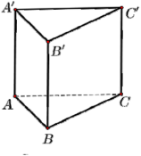

3*a*3 3*a*3 *a*3 *a*3

**A.** . **B.** . **C.**  . **D.**  .

4 2 4 2

**Lời giải** 

**Chọn A** 

Ta có:  *ABC* là tam giác đều cạnh *a* nên *S*D*ABC* = *a*43 .

Ta lại có  *ABC*.*A*'*B*'*C*' là khối lăng trụ đứng nên  *AA*' = 3*a* là đường cao của khối lăng trụ. Vậy thể tích khối lăng trụ đã cho là: *VABC*.*A*'*B*'*C*' = *AA*'.*S*D*ABC* = *a* 3.*a*2 3 = 3*a*3 . 

4 4

**Câu 23.**  Cho hàm số  *f* (*x*) có đạo hàm  *f* '(*x*) = *x*(*x*+2)2 , "*x*Ρ. Số điểm cực trị của hàm số đã cho 

là 

**A.** 0. **B.** 3. **C.** 2. **D.** 1.

**Lời giải** 

**Chọn D** 

Xét  *f* '(*x*) = *x*(*x*+2)2 . Ta có  *f* '(*x*) = 0 Û *x*(*x*+2)2 = 0 Û éê*x* = 0 . 

ë*x* = -2

Bảng biến thiên 

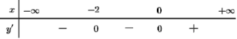

Dựa vào bảng xét dấu đạo hàm suy ra hàm số có một cực trị. 

**Câu 24.**  Cho *a* và *b* là hai số thực dương thỏa mãn *a*4*b* =16. Giá trị của 4log2 *a*+log2 *b* bằng ![ref5]

**A.** 4.  **B.** 2.  **C.** 16. **D.** 8.

**Lời giải** 

**Chọn A** 

Ta có 4log2 *a*+log2 *b* = log2 *a*4 +log2 *b* = log2 *a*4*b* = log2 16 = 4. 

**Câu 25.**  Cho hai số phức  *z*1 =1-*i* và  *z*2 =1+2*i* . Trên mặt phẳng toạ độ *Oxy* , điểm biểu diễn số phức 

3*z*1 + *z*2 có toạ độ là 

**A.** (4*;*-1). **B.** (-1*;*4). **C.** (4*;*1). **D.** (1*;*4).

**Lời giải** 

**Chọn A** 

- 3*z*1 + *z*2 =3(1-*i*)+(1+2*i*) = 4-*i*. 
- Vậy số phức z = 3*z*1 + *z*2 được biểu diễn trên mặt phẳng toạ độ *Oxy* là *M* (4*;*-1). 

**Câu 26.**  Nghiệm của phương trình log3 (*x*+1)+1= log3 (4*x*+1) là 

**A.** *x* =3. **B.** *x* = -3. **C.** *x* =4. **D.** *x* =2.

**Lời giải** 

**Chọn D** 

- log3 (*x*+1)+1=log (4*x*+1) (1)
- (1) Û log3 éë3*.*(*x*+13)ùû = log3 (4*x*+1) Û3*x*+3=4*x*+1>0 Û *x* =2. 
- Vậy (1) có một nghiệm *x* = 2.

**Câu 27.**  Một cở sở sản xuất có hai bể nước hình trụ có chiều cao bằng nhau, bán kính đáy lần lượt bằng 1*m* và 1,2*m*. Chủ cơ sở dự định làm một bể nước mới, hình trụ, có cùng chiều cao và có thể 

tích bằng tổng thể tích của hai bể nước trên. Bán kính đáy của bể nước dự dịnh làm **gần nhất** với kết quả nào dưới đây? 

**A.** 1,8*m*. **B.** 1,4*m*. **C.** 2,2*m*. **D.** 1,6*m*.

**Lời giải** 

**Chọn D** 

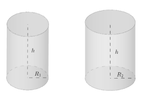

Ta có: 

*V* =p*R* 2*h* =p*h* và *V* =p*R* 2*h* = 36p *h*.

1 1 2 2 25

36p 61p

Theo đề bài ta lại có: *V* =*V* +*V* =*V* =p*h*+~~ *h* =~~ *h* =p*R*2*h*. 

1  2 1 25 25
- *R*2 = 61 Û *R* =1,56(*V*,*R*lần lượt là thể tích và bán kính của bể nước cần tính) 25

` `****8** ![ref6]**
**Đề **10** ![ref5]**

**Câu 28.**  Cho hàm số  *y* = *f* (*x*)có bảng biến thiên như sau: 

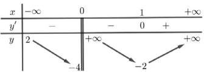

Tổng số tiệm cận đứng và tiệm cận ngang của đồ thị hàm số đã cho là 

**A.** 4. **B.** 1. **C.** 3. **D.** 2.

**Lời giải** 

**Chọn D** 

Dựa vào bản biến thiên ta có 

lim *y* = +¥ Þ *x* = 0là tiệm cận đứng của đồ thị hàm số. 

*x*®0+

lim *y* = 2 Þ *y* = 2 là tiệm cận ngang của đồ thị hàm số. 

*x*®-¥

Vậy tổng số tiệm cận đứng và tiệm cận ngang của đồ thị hàm số đã cho là 2 

**Câu 29.**  Cho hàm số  *f* (*x*) liên tục trên  R. Gọi  *S* là diện tích hình phẳng giới hạn bởi các đường *y* = *f* (*x*), *y* = 0,*x* = -1 và  *x* = 4 (như hình vẽ bên). Mệnh đề nào dưới đây là đúng? 

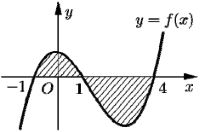

1 4 1 4

- -ò ( ) ò ( ) ò ( ) ò ( )

**AC..** *SS* = ò1 -1*f f*(*x*)*xdxdx*++ò4 1*f f*(*x*)*xdxdx*. .  **BD..**  *SS* == --1ò1*f fx*(*xd*)*xdx*--1 ò4*f fx*(*xd*)*xdx*. . 

-1 1 -1 1

**Lời giải** 

**Chọn B** 

Ta có *S* = ò4 *f* (*x*) *dx* = ò1 *f* (*x*) *dx*+ò4 *f* (*x*) *dx* = ò1 *f* (*x*)*dx*-ò4 *f* (*x*)*dx![ref7]![ref7]*

-1 -1 1 -1 1

**Câu 30.**  Trong không gian *Oxyz* , cho hai điểm  *A*(1;3;0)và  *B*(5;1;-2). Mặt phẳng trung trực của đoạn 

thẳng  *AB* có phương trình là 

**A.** 2*x*- *y*- *z* +5 = 0.  **B.** 2*x*- *y*-*z*-5=0.  **C.** *x*+ *y*+2*z*-3=0.  **D.**3*x*+2*y*- *z* -14 = 0. **Lời giải** 

**Chọn B**  uuur

Ta có tọa độ trung điểm *I* của  *AB* là *I* (3;2;-1) và  *AB* = (4;-2;-2) . 

r uuur

Mặt phẳng trung trực của đoạn thẳng  *AB* đi qua *I* và có vectơ pháp tuyến *n* = *AB* nên có phương trình là 4(*x*-3)-2(*y*-2)-2(*z* +1) = 0 Û 2*x*- *y* - *z* -5 = 0 .  

**Câu 31.**  Họ tất cả các nguyên hàm của hàm số  *f* (*x*) = 2*x*-1)2 trên khoảng (-1;+¥) là 

(*x*+1

2 3

**A.** 2ln(*x*+1)+~~ +*C* .  **B.** 2ln(*x*+1)+~~ +*C* . 

*x*+1 *x*+1

**10**![ref6]

**C.** 2ln(*x*+1)- 2 +*C* .  **D.** 2ln(*x*+1)- 3 +*C* . ![ref5]

*x*+1 *x*+1

**Lời giải** 

**Chọn B** 

- *f* (*x*)d*x* = ò 2*x*-1 d*x* = 2((*x*+1)-3d*x* = 2ò d*x* -3 d*x*~~ = 2ln *x*+1 + 3 +*C* . (*x*+1)2 ò *x*+1)2 *x*+1 ò(*x*+1)2 *x*+1

Vì *x*Î(-1;+¥)nên ò *f* (*x*)*dx* =2ln(*x*+1)+ *x*3+1+*C*

**Câu 32.**  Cho hàm số *f* (*x*). Biết  *f* (0) = 4 và  *f* ¢(*x*) = 2cos2 *x*+1, "*x*Ρ, khi đó  pò4 *f* (*x*)*dx* bằng 

0

- 2 +4 p 2 +14p p 2 +16p +4 p 2 +16p +16

**A.**  .  **B.**  .  **C.**  .  **D.**  . 

16 16 16 16

**Lời giải** 

**Chọn C** 

Ta có:  *f* (*x*) = ò *f* ¢(*x*)*dx* = ò(2cos2 *x*+1)*dx* = ò(2+cos2*x*)*dx* = 2*x*+ 1sin2*x*+*C* . 

2

(0) = 4 Û 2.0+ 1.sin0+*C* = 4 Û *C* = 4. Suy ra *f* (*x*) = 2*x*+ 1sin2*x*+4. 

TVp0hậeyo:  bài:  *f* 0 æçè2*x*+ 12sin2*x*+4ö÷ø*dx* =æçè*x*2 - cos42*x* +4*x*ö÷ø 0p4 =æçèp162 +p ö÷ø-æçè- 14ö÷ø = p 2 +1166p +4 . 

2 2

ò4 *f* (*x*)*dx* = pò4

**Câu 33.**  Trong  không  gian  *Oxyz* ,  cho  các  điểm  *A*(1;2;0),  *B*(2;0;2) ,  *C*(2;-1;3)  và  *D*(1;1;3). 

Đường thẳng đi qua *C* và vuông góc với mặt phẳng (*ABD*) có phương trình là 

ì*x* = -2-4*t* ì*x* = 2+4*t* ì*x* = -2+4*t* ì*x* = 4+2*t*

**A.** ïí*y* = -2-3*t* .  **B.** ïí*y* = -1+3*t* .  **C.** ïí*y* = -4+3*t*.  **D.** ïí*y* = 3-*t* . 

ïî*z* = 2-*t* ïî*z* = 3-*t* ïî*z* = 2+*t* ïî*z* =1+3*t*

**Lời giải** 

**C**Ta**họ**có**n**  **C**u*A*u** *B*ur=(1;-2;2), u*A*u*D*ur=(0;-1;3) Þ éëu*A*u*B*ur, u*A* u*D* urùû =(-4;-3;-1).

Đường thẳng đi qua *C* và vuông góc với mặt phẳng (*ABD*) có phương trình là

ì*x* = -2+4*t*

ïí*y* = -4+3*t* . 

ïî*z* = 2+*t*

**Câu 34.**  Cho số phức *z* thỏa mãn 3(*z* +*i*)-(2-*i*)*z* = 3+10*i* . Mô đun của  *z* bằng

**A.** 3. **B.** 5. **C.** 5. **D.** 3.

**Lời giải** 

**Chọn C** 

Gọi *z* = *x*+ *yi* (*x*, *y*Ρ) Þ *z* = *x*- *yi* . 

Ta có 3(*z*+*i*)-(2-*i*)*z* = 3+10*i* Û3(*x*- *yi*)-(2-*i*)(*x*+ *yi*) =3+7*i*

- *x*- *y*+(*x*-5*y*)*i* =3+7*i* Û ì*x*- *y* =3 ìí*x* = 2 .

íî*x*-5*y* = 7 î*y* = -1

Suy ra *z* = 2-*i*. 

Vậy *z* = 5 . 

**Câu 35.**  Cho hàm số  *f* (*x*), bảng xét dấu của  *f* ¢(*x*) như sau: 

*x* -¥ -3 -1 1 +¥

*f*¢(*x*) - 0 + 0 - 0 +

Hàm số  *y* = *f* (3-2*x*) nghịch biến trên khoảng nào dưới đây? 

**A.** (4;+¥). **B.** (-2;1). **C.** (2;4). **D.** (1;2).

**Lời giải** 

**Chọn B** 

Ta có  *y*¢= -2*f* ¢(3-2*x*)< 0 Û *f* ¢(3-2*x*) >0 Û éê-3<3-2*x* < -1Û éê2< *x* <3. 

ë3-2*x* >1 ë*x* <1

Vì hàm số nghịch biến trên khoảng (-¥;1) nên nghịch biến trên (-2;1) . 

**Câu 36.**  Cho hàm số  *f* (*x*), hàm số  *y* = *f* ¢(*x*) liên tục trên ¡ và có đồ thị như hình vẽ bên. 

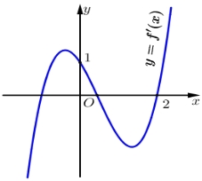

Bất phương trình  *f* (*x*) < *x*+*m* (*m* là tham số thực) nghiệm đúng với mọi  *x*Î(0;2) khi và chỉ khi  

**A.** *m*³ *f* (2)-2. **B.** *m*³ *f* (0). **C.** *m*> *f* (2)-2. **D.** *m*> *f* (0).

**Lời giải** 

**Chọn B** 

Ta có:  *f* (*x*)< *x*+*m* Û *g*(*x*) = *f* (*x*)-*x* < *m*. 

Từ đồ thị hàm số  *y* = *f*¢(*x*) ta thấy: *g*¢(*x*) = *f*¢(*x*)-1<0Þmax*g*(*x*) = *g*(0) = *f* (0). 

(0;2)

Do đó: bất phương trình  *f* (*x*) < *x*+*m* nghiệm đúng với mọi *x*Î(0;2) khi và chỉ khi 

max*g*(*x*)£ *m*Þ *f* (0)£ *m*. ![ref5]

(0;2)

**Câu 37.**  Chọn ngẫu nhiên 2 số tự nhiên khác nhau từ 25 số nguyên dương đầu tiên. Xác suất để chọn 

được hai số có tổng là một số chẵn bằng 

1 13 12 313

**A.** . **B.**  . **C.**  . **D.**  . 

2 25 25 625

**Lời giải** 

**Chọn C** 

Số phần tử của không gian mẫu:  *n*(W) = *C*225 = 300 (kết quả đồng khả năng xảy ra). 

Gọi biến cố  *A* là biến cố cần tìm. 

Nhận xét: tổng của hai số là một số chẵn có 2 trường hợp: 

+ TH1: tổng của hai số chẵn

`   `Từ số 1 đến số 25 có 13 số chẵn, chọn 2 trong 13 số chẵn có: *C*123 = 78 (cách) 

+ TH2: tổng của hai số chẵn

`   `Từ số 1 đến số 25 có 12 số chẵn, chọn 2 trong 12 số chẵn có: *C*122 = 66 (cách) Suy ra: *n*(*A*) = 78+66 =144 

Vậy: *P*(*A*) = *n*(*A*) = 144 = 12 . 

*n*(W) 300 25

**Câu 38.**  Cho hình trụ có chiều cao bằng 5 3 . Cắt hình trụ đã cho bởi mặt phẳng song song với trục và 

cách trục một khoảng bằng 1, thiết diện thu được có diện tích bằng 30. Diện tích xung quanh của hình trụ đã cho bằng 

**A.** 10 3p . **B.** 5 39p . **C.** 20 3p . **D.** 10 39p .

**Lời giải** 

**Chọn C** 

Goi hình trụ có hai đáy là *O*, *O*¢ và bán kính *R* . 

Cắt hình trụ đã cho bởi mặt phẳng song song với trục nên thiết diện thu được là hình chữ nhật 

*ABCD* với  *AB* là chiều cao khi đó  *AB* =*CD* =5 3 suy ra  *AD* = *BC* = 30 = 2 3 . 

5 3

2  *AD*2 (2 3)2

Gọi *H* là trung điểm của  *AD* ta có *OH* =1 suy ra *R* = *OH* +~~ = 1+ = 2. 

4 4

Vậy diện tích xung quanh hình trụ là *Sxq* = 2p*Rh* = 2p.2.5 3 = 20 3p . 

**Câu 39.**  Cho phương trình log9 *x*2 -log3 (3*x* -1) = -log3 *m* (*m* là tham số thực). Có tất cả bao nhiêu giá 

trị nguyên của *m* để phương trình đã cho có nghiệm 

**A.** 2. **B.** 4. **C.** 3. **D.** Vô số.

**Lời giải** 

**Chọn A** 

` `****14** ![ref6]**
**Đề **16** ![ref5]**

1

Điều kiện: *x* >

3

Phương trình tương đương với: 

log *x*-log (3*x*-1) = -log *m* Û log3 3*x*-1 = log3 *m* Û *m* = 3*x*-1 = *f* (*x*)

3 3 3 *x x*

3*x*-1 æ1 ö 1 æ1 ö

Xét  *f* (*x*) = ;*x*Îç ;+¥÷; *f* ¢(*x*) = >0;"*x*Îç ;+¥÷

*x* è3 ø *x*2 è3 ø

Bảng biến thiên 

Để phương trình có nghiệm thì *m*Î(0;3) , suy ra có 2 giá trị nguyên thỏa mãn 

**Câu 40.**  Cho hình chóp  *S*.*ABCD* có đáy là hình vuông cạnh  *a* , mặt bên  *SAB* là tam giác đều và nằm 

trong mặt phẳng vuông góc với mặt phẳng đáy (minh họa như hình vẽ bên). Khoảng cách từ  *A* đến mặt phẳng (*SBD*) bằng 

***S***

***D***

***A***

***B C***

21*a* 21*a* 2*a* 21*a*

**A.** . **B.** . **C.** . **D.** .

14 7 2 28

**Lời giải** 

**Chọn B** 

Gọi *H* là trung điểm  *AB*. Suy ra *SH* ^ (*ABCD*). 

*d*(*H*,(*SBD*)) = 1 Þ ( ) ( ) Ta có  *d*(*A*,(*SBD*)) = *BBHA* 2 *d A*,(*SBD*) = 2*d H*,(*SBD*) . 

**16**![ref6]

Gọi *I* là trung điểm *OB* , suy ra *HI* ||*OA*(với *O* là tâm của đáy hình vuông). ![ref5]

1 *a* 2 ì*BD* ^ *HI*

Suy ra *HI* = *OA*= . Lại có í Þ *BD* ^(*SHI*).

2 4 î*BD* ^ *SH*

Vẽ *HK* ^ *SI* Þ *HK* ^ (*SBD*). Ta có  1 = 1~~ + *H*1*I* 2 Þ *HK* = *a*1421. 

*HK*2 *SH* 2

- ( )) ( ( )) *a* 21

Suy ra *d A*, *SBD* = 2*d H*, *SBD* = 2*HK* = . 

7

**Câu 41.**  Cho hàm số  *f* (*x*) có đạo hàm liên tục trên  ¡. Biết  *f* (4) =1 và  ò1 *xf* (4*x*)d*x* =1, khi đó

0

ò4 *x*2 *f* ¢(*x*)d*x* bằng

0

31 

**A.** .  **B.** -16. **C.** 8. **D.** 14.

2

**Lời giải** 

**C**ĐK**h**ặhti**ọ**đ**n***t*ó=**B**:4ò1*xxf*Þ(4d*x*t)=d*x*4=d*x*ò4 *t*.1*f*6(*t*)dt =1Þ ò4 *xf* (*x*)d*x* =16

0 0 0

Xét: ò4 *x*2 *f* ¢(*x*)dx

0

Áp dụng công thức tích phân từng phần ta có: 

ò4 *x*2 *f* ¢(*x*)d*x* = *x*2 *f* (*x*) 40 -ò4 2*x*.*f* (*x*)d*x* =16.*f* (4)-2ò4 *x*.*f* (*x*)d*x* =16-2.16 = -16

0 0 0

**Câu 42.**  Trong không gian *Oxyz* , cho điểm  *A*(0;4;-3). Xét đường thẳng *d* thay đổi, song song với trục 

*Oz* và cách trục *Oz* một khoảng bằng 3. Khi khoảng cách từ  *A*đến *d* nhỏ nhất, *d* đi qua điểm nào dưới đây? 

**A.** *P*(-3;0;-3). **B.** *M* (0;-3;-5) . **C.** *N* (0;3;-5). **D.** *Q*(0;5;-3).

**Lời giải** 

**Chọn C** 

Ta có mô hình minh họa cho bài toán sau: 

Ta có *d*(*A*;*d*) = *d*(*A*;*Oz*)-*d*(*d*;*Oz*) =1. 

Khi đó đường mthinẳng *d* đi qua điểm cố định (0;3;0) và do *d* / /*Oz* Þ *ud* = *k* = (0;0;1) làm vectơ 

uur r

ì*x* = 0

chỉ phương của *d* Þ *d* :ïí*y* = 3. Dựa vào 4 phương án ta chọn đáp án C.** *N* (0;3;-5). 

ïî*z* = *t*

**Cách 2**: Điểm  *A* thuộc mặt phẳng (*Oyz*) và có tung độ dương. 

Đường thẳng *d* thuộc mặt trụ có trục là *Oz* và có bán kính bằng 3 (phương trình: *x*2 + *y*2 = 9). Do đó khi khoảng cách từ  *A* đến *d* nhỏ nhất thì *d* phải nằm trong mặt phẳng (*Oyz*) và cách 

*Oz* một khoảng bằng 3, đồng thời đi qua điểm có tung độ dương. Vậy *d* đi qua điểm *N* (0;3;-5). 

**Câu 43.**  Cho hàm số bậc ba  *y* = *f* (*x*) có đồ thị như hình vẽ bên. 

Số nghiệm thực của phương trình  *f* (*x*3 -3*x*) = 4 là

3 

**A.** 3. **B.** 8. **C.** 7. **D.** 4.

**Lời giải** 

**Chọn B** 

- 3 ) 4 ( )

Xét phương trình:  *f x* -3*x* = 1 . 

3

Đặt *t* = *x*3 -3*x*, ta có: *t*¢ = 3*x*2 -3; *t*¢=0Û *x* = ±1. Bảng biến thiên: 

*x*  -¥  -1 1 +¥ *t*¢ + 0 - 0 +

+¥

2

*t*

-2

-¥ 

Phương trình (1) trở thành  *f* (*t*) = 4 với *t*Ρ. 

3

Từ đồ thị hàm số  *y* = *f* (*x*) ban đầu, ta suy ra đồ thị hàm số  *y* =*f* (*t*) như sau: 

**19**![ref6]

Suy ra phương trình  *f* (*t*) = 4 có các nghiệm *t* < -2<*t* <*t* < 2<*t* . ![ref5]

3 1 2 3 4

Từ bảng biến thiên ban đầu ta có: 

+) *x*3 -3*x* =*t* có 1 nghiệm  *x* . 

1 1

+) *x*3 -3*x* = *t*4 có 1 nghiệm *x*2 . 

+) *x*3 -3*x* =*t*2 có 3 nghiệm *x*3 , *x*3 , *x*5 . 

+) *x*3 -3*x* =*t* có 3 nghiệm *x* , *x* , *x* . 

Vậy phương t3rình  *f* (*x*3 -3*x*6) =7 4 c8 ó 8 nghiệm.

3

**Câu 44.**  Xét các số phức  *z* thỏa mãn *z*= 2 . Trên mặt phẳng tọa độ *Oxy* , tập hợp điểm biểu diễn của 

4+*iz*

các số phức w = là một đường tròn có bán kính bằng 

1+ *z*

**A.** 34. **B.** 26. **C.** 34. **D.** 26.

Lời giải 

**Chọn A** 

Ta có *w* = 4+*iz* Þ w(1+ *z*) = 4+*iz* Û *z*(w -*i*) = 4-w Þ 2 w-*i* = 4-w 

1+ *z*

Đặt w = *x*+ *yi*(*x*,*y*Ρ)

Ta có  2. *x*2 +(*y*-1)2 = (*x*-4)2 + *y*2 Û 2(*x*2 + *y*2 -2*y*+1) = *x*2 -8*x*+16+ *y*2

- *x*2 + *y*2 +8*x*-4*y*-14 = 0 Û (*x*+4)2 +(*y*-2)2 =34

Vậy tập hợp điểm biễu diễn của các số phức w là đường tròn có bán kính bằng  34

**Câu 45.**  Cho đường thẳng  *y* = *x* và Parabol  *y* = 12 *x*2 + *a* (*a* là tham số thực dương). Gọi *S*1 và  *S*2 lần lượt là diện tích của hai hình phẳng được gạch chéo trong hình vẽ bên. Khi *S*1 = *S*2 thì *a* thuộc 

khoảng nào sau đây? 

` `****20** ![ref6]**
**Đề **21** ![ref5]**

**21**![ref6]
**Đề  ![ref5]**

- 3 1ö æ 1ö

**A.** çè 7; 2÷ø.  **B.** çè0;3÷ø . 

**Chọn C Cách 1:** 

æ1 2ö æ 2 3ö

**C.** ç ; ÷.  **D.** ç 5; ÷ è3 5ø è 7ø

**Lời giải** 

![ref6]
**Đề **22** ![ref5]**

1

Xét phương trình tương giao: *x*2 +*a* = *x*

2

- *x*2 - *x*+ 2*a* = 0 Þ éê*x*1 =1- , với điều kiện 0 < *a* < 1 2 êë*x*1 =1+ 11--22*aa* 2. 

Đặt *t* = 1-2*a*,(*t* ³ 0) Þ *a* =1-*t*2 . 

2

Xét *g*(*x*) = *x*2 -*x*+*a* và ò *g*(*x*)*dx* =*G*(*x*)+*C* .

- *x*ò1 *g*(*x*)*dx* =*G*(*x*1 )-*G*(0).

T*S*h2e=o -g*x*òi2ả*g*th(i*x*ế)t*d*t*x*a=có*GS*(1*x*1 )-0 *G*(*x*2 ).

*x*1

Do *S*1 = *S*2 Þ*G*(*x*2 ) =*G*(0) Þ 1 *x*23 - 1 *x*22 +*ax*2 = 0

6 2

- *x*2 -3*x* +6*a* = 0 Þ(1+*t*)2 -3(1+*t*)+6ç 2 ÷ = 0

æ1-*t* ö

2 2 è 2 ø

- -2*t*2 -*t* +1= 0 Þ *t* = 1 và *t* =-1(loại). 

2

Khi *t* = 1 Þ *a* = 3 . 

2 8

**Cách 2:** 

Phương trình hoành độ giao điểm của đồ thị hàm số  *y* = *x* và  *y* = 1 *x*2 +*a*: 

2

*x* = 1 *x*2 +*a* Û 1 *x*2 - *x*+*a* = 0 (có D =1-2a ) 

2 2

Theo hình, ta có: 0 < *a* < 1 . 

2

Gọi *x*1 ,*x*2 (0< *x*1 <*x*2 ) là hai hoành độ giao điểm: *x*1 =1- 1-2a , *x*2 =1+ 1-2a (1). 

**22**![ref6]

*x*1 æ1 2 + - ö = *x*2 æ*x*- 1 *x*2 -*a*ö*dx*. ![ref5]*S*1 =*S*2 Û òçè 2 *x a x*÷ø*dx* òçè 2 ÷ø

0 *x*1

Khi Û æçè16 *x*3 +*ax*- 12 *x*2 ö÷ø 0*x*1 =æçè12 *x*2 - 16 *x*3 -*ax*ö÷ø *xx*2 .

- *x*22 - *x*23 -*ax* = 0 Û 3 *x* -6*a* = 0. (2)1

*x* - 2

2 6 2 2 2

Từ (1),(2) Û 1-2a = 4a -1Û ìï*a* ³ 14 Û *a* = 3. 

íï 2 8

î16a -6a = 0

**Câu 46.**  Cho hàm số  *f* (*x*), bảng biến thiên của hàm số  *f* ¢(*x*) như sau** 

Số điểm cực trị của hàm số  *y* = *f* (*x*2 -2*x*) là

**A.** 9. **B.** 3. **C.** 7. **D.** 5.

**Lời giải** 

**Chọn C Cách 1** 

Từ bảng biến thiên ta có: 

é*x* = *a*,*a*Î(-¥;-1)

Phương trình  *f* ¢(*x*) = 0 có các nghiệm tương ứng là êêêê*xx* ==*bc*,,c*b*ÎÎ((0-;11;)0) . 

êë*x* = *d*,*d* Î(1;+¥)

Xét hàm số  *y* = *f* (*x*2 -2*x*)Þ *y*¢ = 2(*x*-1) *f* ¢(*x*2 -2*x*).

Giải phương trình  *y*¢= 0 Û 2(*x*-1) *f* ¢(*x*2 -2*x*) = 0 Û éêêë*xf*-¢(1*x*=-02*x* Û éêêê*xx*22=---1222*xxx* ===*bca*    (((132))) . 

2 ) = 0 ê*x*

êê*x*2

êë*x*2 -2*x* = *d*  (4) Xét hàm số *h*(*x*) = *x*2 -2*x* ta có *h*(*x*) = *x*2 -2*x* = -1+(*x*-1)2 ³ -1,"*x*Ρ do đó 

Phương trình *x*2 -2*x* = *a*,(*a* < -1) vô nghiệm. 

` `****24** ![ref6]**

của phương trình (1). 

Pcủhaư ơpnhgư ơtnrìgn htr ìn*x*h2 -(12)*x*v=à *c*p,h(ư0ơ<n*c*g <tr1ìn)hc(ó2h)a. i nghiệm phân biệt  *x*3;*x*4 không trùng với nghiệm Phương trình  *x*2 -2*x* = *d*,(*d* >1) có hai nghiệm phân biệt  *x* ;*x* không trùng với nghiệm của 

phương trình (1) và phương trình (2) và phương trình (3).  5 6

Vậy phương trình  *y*¢ = 0 có  7 nghiệm phân biệt nên hàm số  *y* = *f* (*x*2 -2*x*) có  7 điểm cực trị. 

**Cách 2** 

Từ bảng biến thiên ta có: 

é*x* = *a*,*a*Î(-¥;-1) Phương trình  *f* ¢(*x*) = 0 có các nghiệm tương ứng làêê*x* = *b*,*b*Î(-1;0)

êê*x* = *c*,cÎ(0;1)

êë*x* = *d*,*d* Î(1;+¥)

Xét hàm số  *y* = *f* (*x*2 -2*x*)Þ *y*¢= 2(*x*-1) *f* ¢(*x*2 -2*x*).

é*x* =1

ê*x*2

é*x*-1= 0 ê - ( ) *y*¢ = 0 Û 2(*x*-1) *f* ¢(*x*2 -2*x*) = 0 Û ê Û êê*x*2 -22*xx* = *ba*   (12)

êë *f* ¢(*x*2 -2*x*) = 0 ê 2 = . ê*x* -2*x* = *c*  (3)

êë*x*2 -2*x* = *d*  (4)

Vẽ đồ thị hàm số *h*(*x*) = *x*2 -2*x*

Dựa vào đồ thị ta thấy: phương trình (1) vô nghiệm. Các phương trình (2);(3);(4) mỗi phương trình có 2 nghiệm. Các nghiệm đều phân biệt nhau. 

Vậy phương trình  *y*¢ = 0 có  7 nghiệm phân biệt nên hàm số  *y* = *f* (*x*2 -2*x*) có  7 điểm cực trị. 

**Câu 47.**  Cho lăng trụ  *ABC*× *A*'*B*'*C*' có chiều cao bằng  8 và đáy là tam giác đều cạnh bằng  6. Gọi 

*M*,*N* và *P* lần lượt là tâm của các mặt bên  *ABB*'*A*',  *ACC*'*A*' và *BCC*'*B*'. Thể tích của khối đa diện lồi có các đỉnh là các điểm  *A*,*B*,*C*,*M*,*N*,*P* bằng: 

**A.** 27 3. **B.** 21 3. **C.** 30 3. **D.** 36 3.

**Lời giải** 

**Chọn A** 

**Cách 1: ![ref5]**

*A C*

*B*

*N C1*

*A1*

*Q*

*M*

*B1*

*C'*

*A'*

*B'*

8\.62 3 

Thể tích khối lăng trụ đã cho là *V* =~~ = 72 3 . 

4

Gọi  *A*1,*B*1,*C*1 là trung điểm của  *AA*¢,*BB*¢,*CC*¢ . 

Thể tích khối đa diện cần tính là thể tích khối lăng trụ  *ABC*.*A*1*B*1*C*1 , trừ đi thể tích các khối chóp  *AA*1*MN*;*BB*1*MP*;*CC*1*NP*. 

62 3

Thể tích khối chóp  *AAMN* bằng 1.8. 4 = *V* .

1 3 2 4 24

Vậy thể tích khối đa diện cần tính là *V* = *V* -3 *V* = 3*V* = 27 3.

*ABCMNP* 2 24 8

**Cách 2:** 

Diện tích của đáy *S* = 62. 3 =9 3 , chiều cao lăng trụ *h* =8. 

4

Gọi *I* là trung điểm  *AA*¢. Ta có (*MINP*)/ /(*ABC*). 

Gọi *E* là giao điểm của  *A*¢*P* và (*ABC*), suy ra *BE* / /*AC* và *BE* = 2*MP* = *AC* , hay *E* là đỉnh thứ tư của hình bình hành  *ABEC*. 

Ta có *V* =*VA*¢.*ABEC* -*VP*.*BEC* -*VA*¢.*IMPN* -*VA*.*IMN* . 

Trong đó: 

1 2

*V* = .2*S*.*h* = *Sh*. 

*A*¢.*ABEC* 3 3

1 1 1 1

*V* = .*S* .*d*(*P*,(*ABC*)) = *S*. *h* = *Sh*. 

*P*.*BEC* 3 *BEC* 3 2 6

*V* = 1*S* .*d*(*A*¢,(*IMPN*)) = 1.1 *S*.1 *h* = 1 *Sh*. 

*A*¢.*IMPN* 3 *IMPN* 3 2 2 12

1 1 1 1 1

*V* = *S* .*d*(*A*,(*IMN*)) = . *S*. *h* = *Sh* . 

*A*.*IMN* 3 *IMN* 3 4 2 24

Vậy *V VA*¢.*ABEC VP*.*BEC VA*¢.*IMPN VA*.*IMN* çè 3 16 112 214ø*Sh* = 83*Sh* = 27 3 . 

- - - - =æ 2 - - - ö÷ 

**Câu 48.**  Trong không gian  *Oxyz* , cho mặt cầu  (*S*): *x*2 + *y*2 +(*z* + 2)2 = 3. Có tất cả bao nhiêu điểm *A*(*a*;*b*;*c*) (*a*, *b*, *c* là các số nguyên) thuộc mặt phẳng (*Oxy*) sao cho có ít nhất hai tiếp tuyến 

của (*S*) đi qua  *A* và hai tiếp tuyến đó vuông góc với nhau? 

**A.** 12. **B.** 8. **C.** 16. **D.** 4.

**Lời giải** 

**C**D**h**o **ọ***A***n** (**A***a*;** *b*;*c*) thuộc mặt phẳng (*Oxy*) nên *A*(*a*;*b*;0) .

Nhận xét: Nếu từ  *A* kẻ được ít nhất 2 tiếp tuyến vuông góc đến mặt cầu khi và chỉ khi 

Tmậặpt  pcáhcẳ nđgiể(m*O* *x*th*y*ỏ)a, tđạềolbà ởciá2c đđiưểờmn gn gtruòynênđồnnằgmt âtmro n*O*2g (h0ì;n0h; 0v)à nbhá nk hkăín (kể nh lầncả biêlượt ln),à 1 nằmvà 2trong .

*R* £ *IA* £ *R* 2Û 3£ *a* 2+ *b* 2+ 2£ 6Û 1£ *a*+ *b* 2£ 4. 

Nhìn hình vẽ ta có 12 điểm thỏa mãn yêu cầu bài toán. 

**Câu 49.**  Cho hai hàm số  *y* = *x*-3 + *x*-2 + *x*-1+ *x* và  *y* = *x*+2 -*x*+*m* (*m* là tham số thực) có đồ 

*x*-2 *x*-1 *x x*+1

thị lần lượt là (*C*1) và (*C*2 ). Tập hợp tất cả các giá trị của *m* để (*C*1) và (*C*2 ) cắt nhau tại 4 điểm phân biệt là 

**A.** (-¥;2]. **B.** [2;+¥). **C.** (-¥;2). **D.** (2;+¥).

**Lời giải ![ref5]**

**Chọn B** 

**Cách 1:** 

*x*-3 *x*-2 *x*-1 *x *

Xét phương trình~~  +~~ +~~ +~~ = *x*+2 - *x*+*m*

*x*-2 *x*-1 *x x*+1

*x*-3 *x*-2 *x*-1 *x *

- +~~ +~~ +~~ - *x*+2 + *x* = *m*  (1) 

*x*-2 *x*-1 *x x*+1

Hàm số 

*p*(*x*) = *x*-3 + *x*-2 + *x*-1+ *x* ìïï*xx*--32 + *xx*--12 + *xx*-1+ *xx*+1-2 khi *x* ³ -2

*x*-2 *x*-1 *x x*+1- *x*+2 + *x* = í*x*-3 *x*-2 *x*-1 *x*~~ + + < -

- +~~ +~~ + 2*x* 2 khi*x* 2 ïî*x*-2 *x*-1 *x x*+1

ìï 1~~ + 1~~ + 1 + 1~~ > 0,"*x*Î(-2;+¥)\{-1;0;1;2}

- ï( - ) ( ) (*x*+1)

Ta có  *p* (*x*) = í *x* 2 2 *x*-1 2 *x*2 2 nên hàm số 

ïî(*x*-12)2 (*x*-11)2 *x*12 + (*x*+1)2 2 0, *x* 2

- +~~ + 1~~ + > " < -

*y* = *p*(*x*) đồng biến trên mỗi khoảng (-¥;-1), (-1;0) , (0;1), (1;2), (2;+¥) . 

Mặt khác ta có  lim *p*(*x*) = 2 và  lim *p*(*x*) = -¥. 

*x*®+¥ *x*®-¥

Bảng biến thiên hàm số  *y* = *g*(*x*): 

|*x*|-¥ -2 -1 0   1   2   +¥|||||
| - | - | :- | :- | :- | :- |
|*g*¢(*x*)|+ |+ |+ |+ |+ |
|*g*(*x*)|
+¥ 12

49

-¥
|
+¥

-¥
|
+¥

-¥
|
+¥

-¥
|
2

-¥
|

Do đó để (*C*1 ) và (*C*2 ) cắt nhau tại đúng bốn điểm phân biệt thì phương trình (1) phải có 4 nghiệm phân biệt. Điều này xảy ra khi và chỉ khi đường thẳng  *y* = *m* cắt đồ thị hàm số 

*y* = *p*(*x*) tại 4 điểm phân biệt Û *m*³2. 

**Cách 2:**  

Phương trình hoành độ giao điểm của (*C* ) và (*C*2 ):

*x*-3 + *x*-2 + *x*-1+ *x* = *x*+2 - *x*+*m*1

*x*-2 *x*-1 *x x*+1

*x*-3 *x*-2 *x*-1 *x *

- +~~ +~~ +~~ - *x*+2 + *x*-*m* = 0 (1). 

*x*-2 *x*-1 *x x*+1

*x*-3 *x*-2 *x*-1 *x *

Đặt  *f* (*x*) =~~ +~~ +~~ +~~ - *x*+2 + *x*-*m*. 

*x*-2 *x*-1 *x x*+1

Tập xác định *D* = ¡\{-1;0;1;2}. 

*f* ¢(*x*) = 1~~ + 1~~ + 1 + 1~~ - *x*+2 +1

(*x*-2)2 (*x*-1)2 *x*2 (*x*+1)2 *x*+2

1 1 1 1 *x*+2 -(*x*+2)

- +~~ + +~~ + 

(*x*-2)2 (*x*-1)2 *x*2 (*x*+1)2 *x*+2

- *f*¢(*x*) >0,"*x*Î*D*,*x* ¹ -2. 

Bảng biến thiên 

` `****30** ![ref6]**
**Đề **32** ![ref5]**

Yêu cầu bài toán Û (1) có 4 nghiệm phân biệt Û 2-*m* £ 0 Û *m* ³ 2. 

**Câu 50.**  Cho phương trình (4log22 *x* +log2 *x* -5) 7*x* -*m* = 0 (*m* là tham số thực). Có tất cả bao nhiêu 

giá trị nguyên dương của *m* để phương trình đã cho có đúng hai nghiệm phân biệt 

**A.** 49. **B.** 47. **C.** Vô số. **D.** 48.

**Lời giải** 

**Chọn B** 

ì*x* > 0

Điều kiện: íî*x* ³ log7 *m*

Với *m* =1, phương trình trở thành(4log22 *x*+log2 *x*-5) 7*x* -1 = 0

élog *x* =1

- ê 22 Û êlog2 *x* = - . 

  é4log *x*+log *x*-5= 0 ê 5

  êë7*x* -1= 0 2 ê 2 4

êë*x* = 0 (*loai*)

Phương trình này có hai nghiệm (thỏa) 

Với *m* ³ 2, điều kiện phương trình là *x* ³ log7 *m*

élog *x* =1 é*x* = 2

- é4log2 *x*+log2 *x*-5= 0 ê 2 5 ê -5

Pt ê 2 Û êlog *x* = - Û êê*x* 2

êë7*x* -*m* = 0 ê 2 4 = 4

êë7*x* = *m* êë7*x* = *m*

Do *x* = 2-54 » 2,26 không là số nguyên, nên phương trình có đúng 2 nghiệm khi và chỉ khi ì*m* ³3 -5

íî*m* < 72 (nghiệm *x* = 2 4 không thỏa điều kiện và nghiệm *x* = 2 thỏa điều kiện và khác log7 *m*) 

Vậy *m*Î{3;4;5;...;48}. Suy ra có 46giá trị của *m* . 

Do đó có tất cả 47 giá trị của *m*

**Cách 2:**  

ì*x* > 0 ì*x* > 0

Điều kiện: í Û í . 

î7*x* -*m* ³ 0 î7*x* ³ *m*

* Trường hợp *m* £ 0 thì (4log22 *x*+log2 *x*-5) 7*x* -*m* = 0 Û 4log22 *x*+log2 *x*-5= 0 élog2 *x* =1 é*x* = 2
- (log2 *x*-1)(4log2 *x*+5) = 0 Û êê = -5 Û êê -5 . 

ëlog2 *x* 4 ë*x* = 2 4

Trường hợp này không thỏa điều kiện *m* nguyên dương. 

**32**![ref6]

ì*x* > 0![ref5]

* Trường hợp *m* > 0, ta có í Û *x* ³ log *m* nếu *m* >1 và *x* > 0 nếu 0< *m* £1. 

Khi đó (4log22 *x*+log2 *x*-5) 7*x* -*m* Û éê47lo*x*g2 *x*+log2 *x*-5 = 0 éêê*x* = 2- 54 .   

î7*x* ³ *m*

- 0  êë 7 -2 *m* = 0 Û êê*xx* == l2og *m*

êë 7

+ Xét 0 < *m* £1 thì nghiệm *x* = log7 *m* £ 0 nên trường hợp này phương trình đã cho có đúng 2 

-5

nghiệm *x* = 2;*x* = 2 4 thỏa mãn điều kiện. 

+ Xét *m* >1, khi đó điều kiện của phương trình là *x* ³ log7 *m* . 
- 5 -5

Vì 2 > 2 4 nên phương trình đã cho có hai nghiệm phân biệt khi và chỉ khi 2 > log7 *m* ³ 2 4

5

- 72- 4 £ *m* < 72 . 

Trường hợp này *m*Î{3;4;5;...;48}, có 46 giá trị nguyên dương của *m* . 

Tóm lại có 47 giá trị nguyên dương của *m* thỏa mãn.  

**---HẾT---** 

` `****33** ![ref6]**
**Đề **1** ![ref5]**

**BỘ GIÁO DỤC VÀ ĐÀO TẠO  KỲ THI THPT QUỐC GIA NĂM 2019** 

**ĐỀ THI CHÍNH THỨC  Bài thi:** **TOÁN** 

**Mã đề 102**  Thời gian làm bài: **90** **phút** 

**Câu 1:**  Họ tất cả các nguyên hàm của hàm số  *f* (*x*) = 2*x*+6 là 

**A.** *x*2 +6*x*+*C* . **B.** 2*x*2 +*C* . **C.** 2*x*2 +6*x*+*C* . **D.** *x*2 +*C* .

**Lời giải** 

**Chọn A.** 

*f* (*x*) = 2*x*+6 có họ tất cả các nguyên hàm là *F* (*x*) = *x*2 +6*x*+*C* . 

**Câu 2:**  Trong không gian  *Oxyz* ,cho mặt phẳng  (*P*):  2*x* - *y* +3*z* +1= 0. Vectơ nào dưới đây là một 

vectơ pháp tuyến của (*P*) 

**A.** *n*r1 = (2;-1;-3) .  **B.** *n*r4 = (2;1;3).  **C.** *n*r2 = (2;-1;3).  **D.** *n*r3 = (2;3;1).

**Lời giải** 

**C**(*P***h**)**ọ**:**n** 2**C***x***.** - *y*+3*z* +1= 0 có một vtpt là *n*r2 = (2;-1;3).

**Câu 3:**  Thể tích của khối nón có chiều cao *h* và bán kính đáy *r* là 

**A.** p*r*2*h*. **B.** 2p*r*2*h*. **C.** 1p*r*2*h*.  **D.** 4p*r*2*h*. 

3 3

**Lời giải** 

**Chọn C.** 

**Câu 4:**  Số phức liên hợp của số phức 5-3*i* là 

**A.** -5+3*i*. **B.** -3+5*i*. **C.** -5-3*i*. **D.** 5+3*i*.

**Lời giải** 

**Chọn D.** 

**Câu 5:**  Với *a* là số thực dương tùy ý, log *a*3 bằng** 

5

**A.** 1log5 *a*.  **B.** 1+log5 *a* .  **C.** 3+log5 *a*.  **D.** 3log *a* . 3 3 5

**Lời giải** 

**Chọn D.** 

Ta có log5 *a*3 = 3log5 *a* 

**Câu 6:**  Trong không gian *Oxyz* , hình chiếu vuông góc của điểm *M* (3;-1;1) trên trục *Oz* có tọa độ là 

**A.** (3;0;0). **B.** (3;-1;0). **C.** (0;0;1). **D.** (0;-1;0).

**Lời giải** 

**Chọn C.** 

Hình chiếu vuông góc của điểm *M* (3;-1;1) trên trục *Oz* có tọa độ là (0;0;1). **Câu 7:**  Số cách chọn 2 học sinh từ 5 học sinh là** 

**A.** 52 . **B.** 25 . **C.** *C*52 .  **D.** *A*52 . 

**Lời giải** 

**Chọn C.** 

Số cách chọn 2 học sinh từ 5 học sinh là *C*52 .** 

1 1 1

**Câu 8:**  Biết ò *f* (*x*)*dx* =3 và ò *g*(*x*)*dx* = -4 khi đó òéë *f* (*x*)+ *g*(*x*)ùû*dx* bằng

0 0 0

**1** **![ref6]**

**A.** -7. **B.** 7. **C.** -1. **D.** 1.![ref5]

**Lời giải** 

**Chọn C.** 

Ta có ò1 éë *f* (*x*)+ *g*(*x*)ùû*dx* = ò1 *f* (*x*)*dx*+ò1 *g*(*x*)*dx* =3-4 = -1.

0 0 0

*x*-1 *y*-3 *z*+2

**Câu 9:**  Trong không gian *Oxyz* , cho đường thẳng *d* :~~ =~~ = . Vectơ nào dưới đây là một 

2 -5 3

v**A**e**.**c*u*trơ1 =ch(ỉ2p;h5;ư3ơ)n.g của *d*?**B.** *u*r4 = (2;-5;3). **C.** *u*r2 = (1;3;2). **D.** *u*r3 = (1;3;-2).

**Lời giải** 

**Chọn B.** 

**Câu 10:**  Đồ thị của hàm số nào dưới đây có dạng như đường cong trong hình 

**A.** *y* = -*x*4 + 2*x*2 +1.  **B.**  *y* = -*x*3 +3*x* +1.  **C.**  *y* = *x*3 -3*x*2 +1.  **D.**  *y* = *x*4 -2*x*2 +1.

**Lời giải** 

**Chọn B.** 

Dựa vào đồ thị trên là của hàm số bậc ba ( loại **A** và **D).** Nhánh cuối cùng đi xuống nên *a* < 0, nên **Chọn B.** 

**Câu 11:**  Cho cấp số cộng (*un* ) với *u*1 = 2 và *u*2 =8. Công sai của cấp số cộng đã cho bằng 

**A.** 4. **B.** -6. **C.** 10. **D.** 6.

**Lời giải** 

**Chọn D.** 

Công sai của cấp số cộng này là: *d* = *u*2 -*u*1 = 6. 

**Câu 12:**  Thể tích khối lăng trụ có diện tích đáy *B* và chiều cao *h* là 

4 1

**A.** 3*Bh*.  **B.** *Bh*.  **C.**  *Bh*.  **D.** *Bh*. 

3 3

**Lời giải** 

**Chọn B.** 

**Câu 13:**  Nghiệm của phương trình 32*x*+1 = 27 là.** 

**A.** *x* = 2. **B.** *x* =1. **C.** *x* =5. **D.** *x* = 4.

**Lời giải** 

**Chọn B.** 

Ta xét phương trình 32*x*+1 = 27 

- 32*x*+1 =33 Û 2*x*+1=3Û *x* =1. 

**Câu 14:**  Cho hàm số  *f* (*x*) có bảng biến thiên như sau:** 

*x* -¥  -2  0 2 +¥

*y*¢*  -  0 + 0 -  0 +

+¥  3  +¥ 

*y*

1  1

Hàm số đã cho đồng biến trên khoảng nào dưới đây. 

**A.** (0;+¥). **B.** (0;2). **C.** (-2;0). **D.** (-¥;-2).

**Lời giải** 

**Chọn C.** 

Quan sát bảng biến thiên ta thấy (-2;0) thì *y*¢mang dấu dương. 

**Câu 15:**  Cho hàm số  *y* = *f* (*x*) có bảng biến thiên như sau:** 

*x*  -¥  1 3  +¥ *f* ¢(*x*) -  0 + 0 - 

+¥ 2 

*f* (*x*)*  

-2 -¥ Hàm số đã cho đạt cực đại tại 

**A.** *x* = 2. **B.** *x* = -2. **C.** *x* =3. **D.** *x* =1.

**Lời giải** 

**Chọn C.** 

**Câu 16:**  Nghiệm của phương trình log2 (*x*+1) =1+log2 (*x*-1) là:** 

**A.** *x* =1. **B.** *x* = -2. **C.** *x* =3. **D.** *x* = 2.

**Lời giải** 

**Chọn C.** 

ì*x* >1

log2 (*x*+1) =1+log2 (*x*-1) Û log2 (*x*+1) = log2 éë2(*x*-1)ùû Û íî*x*+1= 2*x*-2 Û *x* =3. **Câu 17:**  Giá trị nhỏ nhất của hàm số  *f* (*x*) = *x*3 -3*x*+2 trên đoạn [-3;3] bằng** 

**A.** 20.  **B.** 4.  **C.** 0. **D.** -16.

**Lời giải** 

**Chọn D.** 

*f* ¢(*x*) =3*x*2 -3 

é*x* =1Î[-3;3]

*f* ¢(*x*) = 0 Û 3*x*2 -3= 0 Û ê

êë*x* = -1Î[-3;3]

*f* (-3) = -16;  *f* (3) = 20;  *f* (-1) = 4;  *f* (1) = 0. Vậy min *f* (*x*) = -16.

[-3;3]

**Câu 18:**  Một cơ sở sản xuất có hai bể nước hình trụ có chiều cao bằng nhau, bán kính đáy lần lượt bằng 1 m và 1,4 m . Chủ cơ sở dự định làm một bể nước mới, hình trụ, có cùng chiều cao và có thể 

tích bằng tổng thể tích của hai bể nước trên. Bán kính đáy của bể nước dự định làm **gần nhất** với kể quả nào dưới đây?** 

**A.** 1,7 m.  **B.** 1,5 m.  **C.** 1,9 m.  **D.** 2,4 m.

**4** **![ref6]**

**Lời giải** ![ref5]

**Chọn A.** 

Gọi *R*1 =1 m, *R*2 =1,4 m , *R*3 lần lượt là bán kính của các bể nước hình trụ thứ nhất, thứ hai và bể nước mới. 

Ta có *V*1 +*V*2 =*V*3 Û π*R*12*h*+π*R*22*h* = π*R*32*h* Û *R*3 = 1+1,42 =1,7. 

**Câu 19:**  Cho hàm số  *f* (*x*) có đạo hàm  *f* ¢(*x*) = *x*(*x*-2)2 ,"*x*Ρ. Số điểm cực trị của hàm số đã cho 

là** 

**A.** 2. **B.** 1. **C.** 0. **D.** 3.

**Lời giải** 

**Chọn B.** 

Ta  có  *f* ¢(*x*) = *x*(*x*-2)2 Þ *f* ¢(*x*) = 0 Û éêë*xx* == 02,  trong  đó  *x* = 0  là  nghiệm  đơn;  *x* = 2  là nghiệm bội chẵn 

Vậy hàm số có một cực trị là *x* = 0. 

**Câu 20:**  Gọi *z* ,*z* là hai nghiệm phức của phương trình *z*2 -6*z* +14 = 0. Giá trị của *z*2 + *z*2 bằng** 

1  2 1 2

**A.** 36. **B.** 8. **C.** 28. **D.** 18.

**Lời giải** 

**Chọn B.** 

**Cách 1:** Ta có: *z*2 -6*z*+14 =0 có 2 nghiệm *z*1,2 =3± 5*i*

Do đó *z*12 + *z*22 =(3- 5*i*)2 +(3+ 5*i*)2 =8. 

**Cách 2:** Áp dụng định lý Vi ét ta có *z*12 + *z*22 = (*z*1 + *z*2 )2 -2*z*1*z*2 = 62 -2.14 =8. 

**Câu 21:**  Cho khối chóp đứng  *ABC*.*A*¢*B*¢*C*¢ có đáy là tam giác đều cạnh *a* và  *AA*¢ = 2*a* (minh hoạ như 

hình vẽ bên). 

**A/ C/**

**A**

**A**

**C**

**B**

Thể tích của khối lăng trụ đã cho bằng  ****

3*a*3 *a*3 3 3*a*3

**A.** .  **B.**  .  **C.** 3*a*3 . **D.** .** 

3 6 2

**Lời giải** 

**Chọn D.** 

Ta có *S* = 2 . Vậy *V* = *AA*¢.*S* = 2*a*. 2~~ = 3 . 

*a* 3 *a* 3 3*a*

*ABC* 4 *ABC*.*A*¢*B*¢*C*¢ *ABC* 4 2

**Câu 22:**  Trong không gian *Oxyz* , cho mặt cầu (*S*): *x*2 + *y*2 + *z*2 -2*x* + 2*y* -7 = 0. Bán kính của mặt

cầu đã cho bằng 

**A.** 3. **B.** 9. **C.** 15 . **D.** 7 .

**Lời giải** 

` `****6** ![ref6]**
**Đề **7** ![ref5]**

**Chọn A.** 

Ta có (*S*): *x*2 + *y*2 + *z*2 -2*x*+2*y*-7 = 0 Û (*x*+1)2 +(*y* -1)2 + *z*2 = 9 Vậy bán kính mặt cầu là *R* = 3. 

**Câu 23:**  Cho hàm số  *f* (*x*)có bảng biến thiên như sau: 

|*x*|-¥  -2  0 2 +¥ |
| - | - |
|*f* ¢(*x*)|- + - +|
|*f* (*x*) |
+¥ 2 +¥

-1 -1
|

Số nghiệm thực của phương trình3*f* (*x*)-5 = 0 là: 

**A.** 2  **B.** 3  **C.** 4 **D.** 0

**Lời giải** 

**Chọn C.** 

Ta có 3*f* (*x*)-5= 0 Û *f* (*x*) = 5 (\*) . 

3

Dựa vào bảng biến thiên suy ra phương trình (\*) có bốn nghiệm. 

**Câu 24:**  Cho hàm số  *y* = *f* (*x*) có bảng biến thiên sau: 

Tổng số tiệm cận đứng và tiệm cận ngang của đồ thị hàm số là: 

**A.** 3  **B.** 1  **C.** 2  **D.** 4

**Lời giải** 

**Chọn C.** 

Dựa vào bảng biến thiên ta có: 

lim *y* = -¥ ® *x* = 0 là tiệm cận đứng. *x*®0-

lim *y* = 0 ® *y* = 0là tiệm cận ngang. 

*x*®-¥

Tổng số tiệm cận là 2 

**Câu 25:**  Cho *a*và *b* là các số thực dương thỏa mãn *a*3*b*2 = 32 . Giá trị của 3log2 *a*+2log2 *b* bằng** 

**A.** 5. **B.** 2. **C.** 32. **D.** 4.

**Lời giải** 

**Chọn A.** 

Ta có 3log2 *a*+2log2 *b* = log2 (*a*3*b*2 ) =log2 32=5. **Câu 26:**  Hàm số  *y* = 3*x*2 -3*x* có đạo hàm là** 

**7** **![ref6]**

**A.** (2*x*-3).3*x*2 -3*x* . **B.** 3*x*2 -3*x*.ln3. **C.** (*x*2 -3*x*).3*x*2 -3*x*-1.  **D.** (2*x*-3).3*x*2 -3*x*.ln3. ![ref5]

**Lời giải** 

**Chọn D.** 

Áp dụng công thức (*au* )¢ = *u*¢.*au*.ln*a* ta được  *y*¢ = (2*x*-3).3*x*2 -3*x*.ln3. 

**Câu 27:**  Trong không gian  *Oxyz* , cho hai điểm  *A*(-1;2;0) và  *B*(3;0;2). Mặt phẳng trung trực của 

đoạn  *AB* có phương trình là? 

**A.** 2*x*+ *y*+ *z*-4 = 0.  **B.** 2*x*- *y*+ *z*-2 = 0.  **C.** *x*+ *y*+ *z*-3= 0.  **D.** 2*x*- *y*+ *z*+2 = 0.

**Lời giải** 

**Chọn B.** 

Gọi *I* (1;1;1) là trung điểm của  *AB* . 

u*A*u*B*ur=(4;-2;2). 

uuur

Mặt phẳng trung trực của đoạn  *AB* đi qua trung điểm  *I* và nhận véc tơ  *AB* =(4;-2;2) làm 

một véc tơ pháp tuyến có phương trình là: 2(*x*-1)-(*y*-1)+(*z*-1) = 0 Û 2*x*- *y*+ *z*-2 = 0. **Câu 28:**  Cho hai số phức  *z*1 = -2+*i* và  *z*2 =1+*i* . Trên mặt phẳng tọa độ *Oxy* điểm biểu diễn số phức 

2*z* + *z* có tọa độ là** 

**A.**1(3;-2 3). **B.** (2;-3). **C.** (-3;3) . **D.** (-3;2).

**Lời giải** 

**Chọn C.** 

2*z*1 + *z*2 = 2(-2+*i*)+1+*i* = -3+3*i*. 

Vậy điểm biểu diễn số phức 2*z*1 + *z*2 có tọa độ là (-3;3) . 

**Câu 29:**  Cho hàm số  *f* (*x*) liên tục trên  ¡. Gọi  *S* là diện tích hình phẳng giới hạn bởi các đường 

*y* = *f* (*x*),  *y* = 0, *x* = -1 và *x* =5 (như hình vẽ bên). Mệnh đề nào dưới đây đúng? 

` `****8** ![ref6]**

1 5

1. *S* = ò *f* (*x*)d*x*+ò *f* (*x*)d*x*. -1 1

   1 5

**C.** *S* = -ò *f* (*x*)d*x*+ò *f* (*x*)d*x*. 

-1 1

**Chọn B.** 

2. *S* = ò1 *f* (*x*)d*x*-ò5 *f* (*x*)d*x* . 

**D.** *S* = --1ò1 *f* (*x*)d*x*-1 ò5 *f* (*x*)d*x* . 

-1 1

**Lời giải** 

` `****9** ![ref6]**
**Đề **10** ![ref5]**

Ta có diện tích hình phẳng cần tìm 

*S* = ò5 *f* (*x*) d*x* = ò1 *f* (*x*) d*x*+ò5 *f* (*x*) d*x* = ò1 *f* (*x*)d*x*-ò5 *f* (*x*)d*x*. 

-1 -1 1 -1 1

**Câu 30:**  Cho hình chóp  *S*.*ABC* có  *SA* vuông góc với mặt phẳng  (*ABC*),  *SA*= 2*a* , tam giác  *ABC*

vuông tại *B* ,  *AB* = *a* và *BC* = 3*a* (minh họa như hình vẽ bên). Góc giữa đường thẳng *SC* và mặt phẳng (*ABC*) bằng 

S

A C

B

**A.** 90°. **B.** 30°. **C.** 60°. **D.** 45°.

**Lời giải** 

**Chọn D.** 

S![ref8]![ref8]![ref8]![ref8]![ref9]![ref10]![ref10]![ref10]![ref10]![ref11]![ref9]![ref10]![ref10]![ref10]![ref10]![ref11]![ref12]![ref12]![ref12]![ref12]

A C

B

Ta có  *AC* = *AB*2 + *BC*2 = *a*2 +( 3*a*)2 = 2*a*

*A* là hình chiếu của *S* lên mặt phẳng (*ABC*), *C* là hình chiếu của *C* lên mặt phẳng (*ABC*)

- (*S*·*C*;(*ABC*)) =(*S*·*C*;*AC*) = *S*·*CA*.

tan*S*·*CA*= *SA* = 2*a* =1 Þ *S*·*CA*= 45°. 

*AC* 2*a*

**Câu 31:**  Cho số phức *z* thỏa mãn 3(*z* -*i*)-(2+3*i*)*z* = 7-16*i* . Môđun của *z* bằng ****

**A.** 5. **B.** 5. **C.** 3. **D.** 3.

**Lời giải** 

**Chọn A.** 

**10** **![ref6]**

Gọi *z* = *x*+ *yi* (*x*, *y*Ρ) Þ *z* = *x*- *yi* . ![ref5]

Ta có 3(*z* -*i*)-(2+3*i*)*z* = 7-16*i* Û 3(*x*- *yi*-*i*)-(2+3*i*)(*x*+ *yi*) = 7-16*i*

ì*x*+3*y* = 7 ì*x* =1

- 3*x*-3*yi*-3*i*-2*x*-2*yi*-3*xi*+3*y* = 7-16*i* Û íî-5*y*-3-3*x* = -16 Û íî*y* = 2

Vậy *z* =1+2*i* Þ*z*= 5 . 

**Câu 32:**  Trong không gian  *Oxyz* , cho các điểm  *A*(1;0;2) ,  *B*(1;2;1) ,  *C*(3;2;0) và  *D*(1;1;3). Đường 

thẳng đi qua  *A* và vuông góc với mặt phẳng (*BCD*) có phương trình là** 

ì*x* =1-*t* ì*x* =1+*t* ì*x* = 2+*t* ì*x* =1-*t*

**A.** ïí*y* = 4*t* .  **B.** ïí*y* = 4 .  **C.** ïí*y* = 4+4*t* .  **D.** ïí*y* = 2-4*t* . 

- ï ï ï

î*z* = 2+2*t* î*z* = 2+2*t* î*z* = 4+2*t* î*z* = 2-2*t*

**C**u*B*u**h***C*ur**ọ**=**n** (**C**2**.**; 0;-*B*1)*C*,*D*u*B*u*D*u) r c=ó( m-2ộ;t-v1é;3c-)tơ pháp tuyế**L**n **ờ**là**i**  **g***n***iả**=**i** éëu*B*u*C*ur, u*B* u*D* urùû =(-1;-4;-2).

Mặt phẳng ( r

r Đường thẳng đi qua  *A* và vuông góc với mặt phẳng (*BCD*) nên có véc-tơ chỉ phương *u* cùng 

r

phương với *n* . Do đó loại đáp án A, **B.** 

Thay tọa độ của điểm  *A*(1;0;2) vào phương trình ở đáp án C và D thì thấy đáp án C thỏa mãn. 

p

**Câu 33:**  Cho hàm số  *f* (*x*). Biết  *f* (0) = 4 và  *f* '(*x*) = 2cos2 *x* +3,"*x*Ρ, khi đó ò4 *f* (*x*)d*x* bằng 

0

- 2 + 2 p 2 +8p +8 p 2 +8p + 2 p 2 +6p +8

**A.**  .  **B.**  .  **C.**  .  **D.**  . 

8 8 8 8

**Lời giải** 

**Chọn C.** 

Ta có  *f* '(*x*) = 2cos2 *x*+3 = 4+cos2*x*** 

- *f* (*x*) = 4*x* + 1sin2*x*+*C*

2

*f* (0) = 4 Þ *C* = 4 

p4 *f* (*x*)d*x* = p4 + +4 d = cos2x+4*x*ö÷ p4 = 2 . æ4*x* 1 *x* ö *x* æ 2 - p +8p + 2

**Câu 34:**  H0 ọ tất cả các0 nguyên hàm của hàm số  *f* (*x*) =14 3*x*-1 trên khoảng (1;+¥) là 

- òçè 2sin2 ÷ø çè2*x* ø 0 8

(*x* -1)2

**A.** 3ln(*x*-1)- 2 +*C*.  **B.** 3ln(*x*-1)+ 1 +*C*. 

*x*-1 *x*-1

**C.** 3ln(*x*-1)- 1 +*C*.  **D.** 3ln(*x* -1)+ 2 +*C*. 

*x* -1 *x* -1

**Lời giải** 

**Chọn A.** 

Đặt *t* = *x* -1 

` `****12** ![ref6]**
**Đề **13** ![ref5]**

- *f* (*x*)d*x* =ò3(*t* +*t*1)-1d*t* = ò 3*tt*+2 2d*t* = ò 3*t*d*t* + ò*t*22 d*t* = 3ln(*x* -1)- 2 +*C* 2 *x* -1

**Câu 35:**  Cho hàm số  *f* (*x*), bảng xét dấu của  *f* ¢(*x*) như sau: 

|*x*|
-3 -1 +¥

-¥ 1 
|
| - | - |
|*f* ¢(*x*)|-  0 + 0 -  0 +|

Hàm số  *y* = *f* (5-2*x*) nghịch biến trên khoảng nào dưới đây?** 

**A.** (2;3). **B.** (0;2). **C.** (3;5). **D.** (5;+¥).

**Lời giải** 

**Chọn B.** 

Ta có  *y* = *f* (5-2*x*)Þ *y*¢= -2*f* ¢(5-2*x*). 

Hàm số nghịch biến Û *y*¢£ 0Þ -2*f* ¢(5-2*x*)£ 0 Û *f* ¢(5-2*x*)³ 0. 

¢(5-2*x*)³ 0 Û é5-2*x* ³1 é*x* £ 2 . Dựa vào bảng biến thiên, ta được  *f* êë-3£ 5-2*x* £ -1Û êë3£ *x* £ 4

Vậy hàm số  *y* = *f* (5-2*x*) nghịch biến trên các khoảng (3;4),(-¥;2). 

**Câu 36:**  Cho hình trụ có chiều cao bằng 4 2 . Cắt hình trụ đã cho bởi mặt phẳng song song với trục và 

cách trục một khoảng bằng  2 , thiết diện thu được có diện tích bằng 16. Diện tích xung quanh của hình trụ đã cho bằng 

**A.** 24 2p . **B.** 8 2p . **C.** 12 2p . **D.** 16 2p .

**Lời giải** 

**Chọn D.** 

Ta có  *AB* = 16 = 2 2 , *OK* = 2 nên *r* =*OA*=*OB* = 2. 

4 2

Do đó diện tích xung quanh của hình trụ đã cho bằng *Sxq* = 2p*rl* = 2p.2.4 2 =16 2p . **Cách 2:** 

**13** **![ref6]**
**Đề **16** ![ref5]**

a

2

h

Ta có thiết diện và đáy của hình trụ như hình vẽ trên. Theo đề ta có *a*.*h* =16Þ *a*.4 2 =16 Û *a* = 2 2. 

2  ( )2 æ *a* ö2 = ( )2

Mà *R* = 2 +ç ÷ 2+ 2 = 4Þ *R* = 2. 

- 2ø

Vậy ta tính được diện tích xung quanh của hình trụ *S* = 2p*Rh* = 2.p.2.4 2 =16 2p .  

**Câu 37:**  Cho phương trình log9 *x*2 -log3 (6*x*-1) = -log3 *m* (*m* là tham số thực). Có tất cả bao nhiêu giá 

trị nguyên của *m* để phương trình đã cho có nghiệm?** 

**A.** 6.  **B.** 5.  **C.** Vô số. **D.** 7.

**Lời giải** 

**Chọn B.** 

ìï*x* > 1 ĐK: í 6 . 

ïî*m* > 0

log9 *x*2 -log3 (6*x*-1) = -log3 *m* Û log3*x* -log3 (6*x*-1) = -log3 *m*

(6*x*-1) 6*x*-1

- log3 *m* = log3 *x*~~ Û *m* = *x* (1). 

6*x*-1

Với điều kiện trên (1) trở thành: *m* = (\*). 

*x*

Xét hàm  *f* (*x*) = 6*x*-1 trên khoảng æ

*x* çè16;+¥ö÷ø. 

Ta có  *f* ¢(*x*) = 22 > 0

*x*

Ta có bảng biến thiên: 

1

*x* -¥  0 6 +¥ *f* ¢(*x*) +  ![ref13] + ![ref14]![ref13]![ref13]![ref14]![ref13]![ref13]![ref14]![ref13]![ref15]

+¥ 6![ref16]![ref17]![ref16]![ref16]![ref17]![ref16]![ref17]![ref15]

*f* (*x*)  *![ref16]![ref17]![ref16]![ref16]![ref17]![ref16]*

6 -¥   0![ref16]![ref16]![ref17]![ref16]![ref16]![ref17]

Dựa vào bảng biến thiên, phương trình (\*) có nghiệm khi 0 < *m* < 6. 

Vậy có 5 giá trị nguyên của *m* để phương trình đã cho có nghiệm là *m* ={1;2;3;4;5}. 

**Câu 38:**  Cho hàm số  *f* (*x*), hàm số  *y* = *f* ¢(*x*) liên tục trên ¡ và có đồ thị như hình vẽ bên. Bất phương trình  *f* (*x*) > *x*+*m*(*m* là tham số thực) nghiệm đúng với mọi *x*Î(0;2) khi và chỉ khi** 

*y*

*y* = *f* ¢(*x*)

1

*x*

*O* 2

**A.** *m* £ *f* (2)-2. **B.** *m* < *f* (2)-2. **C.** *m* £ *f* (0). **D.** *m* < *f* (0).

**Lời giải** 

**Chọn A.** 

Ta có  *f* (*x*) > *x*+*m*, "*x*Î(0;2) Û *m*< *f* (*x*)-*x*, "*x*Î(0;2). 

Xét hàm số *g*(*x*) = *f* (*x*)- *x* trên (0;2). Ta có *g*¢(*x*) = *f* ¢(*x*)-1.  

Dựa vào đồ thị ta có  *f* ¢(*x*) <1, "*x*Î(0;2).  

*y y* = *f* ¢(*x*)

1~~ *y* =1

*x*

*O* 2

Suy ra *g*¢(*x*) < 0, "*x*Î(0;2). Do đó *g*(*x*) nghịch biến trên (0;2).  Bảng biến thiên: 

|*x*|0 2|
| - | - |
|*g*¢(*x*)|- |
|*g*(*x*) |
*f* (0)

*f* (2)-2 
|

Dựa vào bảng biến thiên suy ra *m* < *g*(*x*), "*x*Î(0;2) Û *m* £ *f* (2)-2.

**Câu 39:**  Cho hình chóp  *S*.*ABCD* có đáy là hình vuông cạnh  *a*, mặt bên  *SAB* là tam giác đều và nằm 

trong mặt phẳng vuông góc với mặt phẳng đáy. Khoảng cách từ  *C* đến  (*SBD*) bằng? (minh họa như hình vẽ sau) 

***S***

***D***

***A***

***B C***

**16** **![ref6]**

21*a* 21*a* 2*a* 21*a![ref5]*

**A.** . **B.** . **C.** . **D.** .

28 14 2 7

**Lời giải** 

**Chọn D.** 

***S'***

***S***

***D***

***A***

***N O***

***B C***

Không mất tính tổng quát, cho *a* =1. 

Gọi *N* là trung điểm của đoạn  *AB* . Dựng *S*¢ sao cho *SS*¢*AN* là hình chữ nhật. 

Chọn hệ trục tọa độ: 

*A* là gốc tọa độ, tia  *AB* ứng với tia *Ox* , tia  *AD* ứng với tia *Oy* , tia  *AS*¢ ứng với tia *Oz* . 

æ1 3 ö *A*(0;0;0), *B*(1;0;0), *D*(0;1;0), *S*ççè 2;0; 2 ÷÷ø. 

Phương trình mặt phẳng (*SBD*) là:  3*x*+ 3*y*+ *z*- 3 = 0. 

Gọi *O* là giao điểm của  *AC* và *BD*. Ta có *O* là trung điểm của  *AC* . 

Ta có *d*(*C*;(*SBD*)) = *d*(*A*;(*SBD*)) = 21. 

7 Vậy chọn đáp án **D.** 

**Câu 40:**  Chọn ngẫu nhiên hai số khác nhau từ 27 số nguyên dương đầu tiên. Xác suất để chọn được hai 

số có tổng là một số chẵn là 

13 14 1 365

**A.** .  **B.** .  **C.** .  **D.** . 

27 27 2 729

**Lời giải** 

**Chọn A.** 

Số phần tử không gian mẫu là *n*(W) =*C* 227 = 351.

Gọi  *A* là biến cố: “Chọn được hai số có tổng là một số chẵn”. 

Trong 27 số nguyên dương đầu tiên có 14 số lẽ và 13 số chẵn. 

Tổng hai số là một số chẵn thì hai số đó hoặc cùng lẽ, hoặc cùng chẵn. 

*n*(*A*) =*C* 2 +*C* 2 =169.

*p*(*A*) = *nn*((1W4*A*)) =13136591 = 1237 . 

Vậy chọn đáp án  **A.** 

**Câu 41:**  Cho hàm số bậc ba  *y* = *f* (*x*) có đồ thị như hình vẽ bên. Số nghiệm thực của phương trình 

- ) 1

*f x*3 -3*x* = là 

2

` `****18** ![ref6]**
**Đề **19** ![ref5]**

![ref18]

**A.** 6. **B.** 10. **C.** 12. **D.** 3.

**Lời giải:** 

**Chọn B.** 

Xét đồ thị của hàm số bậc ba  *y* = *f* (*x*) có đồ thị (*C*) như hình vẽ đã cho 

![ref19]

Gọi (*C*1 ) là phần đồ thị phía trên trục hoành, (*C*2 )phần đồ thị phía dưới trục hoành. Gọi (*C* ') là phần đồ thị đối xứng của (*C*2 )qua trục hoành. 

Đồ thị của hàm số  *y* =*f* (*x*) chính là phần (*C*1 ) và (*C* ') . 

- ( 3 - *x*) = 1
1  ê *f x* 3 2

Xét  *f* (*x*3 -3*x*) = Û ê

2  ê *f x*3 -3*x*) = -1

   êë ( 2

Xét  *g*(*x*) = *x*3 -3*x*, *g*'(*x*) = 3*x*2 -3= 0 Û *x* = ±1. 

**19** **![ref6]**

[^1]*x* -¥ -1 1 +¥ ![ref5]*g*'(*x*) + 0 - 0 +

*g*(*x*) 2 +¥

-¥ -2

Quan sát đồ thị: 

é*x* -3*x* =1> 2

+ Xét  *f* (*x*3 -3*x*) = 1 êê*x*33 3*x* =*b*Î( ) ( có lần lượt 1, 3, 3 nên có tất cả 7 nghiệm). 

2 Û ê - 0;2 )

ë*x*3 -3*x* = *c*Î(-2;0

+ Xet  *f* (*x*3 -3*x*) = -1 Û éê*x*3 -3*x* = *c* >>22

2 êê*x* -3*x* = *d* ( có 3 nghiệm). 

3

ë*x*3 -3*x* = *c*Î< -2

Vậy có tất cả 10 nghiệm. 

*f* (*x*) có đạo hàm liên tục trên  ¡. Biết  (5) =1 và  ò1 *xf* (5*x*)d*x* =1, khi đó **Câu 42:**  Cò5 h*x*o2 *f*h¢à(m*x*) ds*x*ố bằng *f* 0

0

123 

**A.** 15. **B.** 23. **C.** .  **D.** -25.

5

**Lời giải** 

**Chọn D.** 

5 5 1

- *x*2 *f* ¢(*x*)d*x* = *x*2 *f* (*x*) 50 -ò2*xf* (*x*)d*x* = 25.1-2ò5*tf* (5*t*)d(5*t*) = 25-50.1= -25.

0 0 0

**Cách 2:** 

Ta có: 1= ò01 *xf* (5*x*)d*x*

Đặt *t* =5*x* Þ d*t* =5d*x* Þ 1d*t* = d*x* 

5

Þ1= ò5 1*t*.*f* (*t*).1d*t* Û1= 215ò05*t*.*f* (*t*)d*t* Û ò5*t*.*f* (*t*)d*t* = 25Þ ò5 *x*.*f* (*x*)d*x* = 25

[^2] 5 5 0 0

Đặt *I* = ò5 *x*2.*f* ¢(*x*)d*x*

0

ìï*u* = *x*2 Þ ìïíd*u* = 2(*x*d*x*

Đặt: íïîd*v* = *f* ¢(*x*)d*x* ïî*v* = *f x*)

` `****21** ![ref6]**
**Đề **23**** 

**Câu 43:**  Cho đường thẳng  *y* = 3 *x* và parbol  *y* = 1 *x*2 +*a* (*a* là tham số thực dương). Gọi  *S*1 ,  *S*2 lần 

4 2

lượt là diện tích của hai hình phẳng được gạch chéo trong hình vẽ bên. 

Khi *S* = *S* thì *a* thuộc khoảng nào dưới đây? 

**A.**  1; 9 ö÷2 .  **B.** æç 3 ; 7 ö÷.  **C.** ç0;1 ÷  **D.** æç 7 ;1ö÷. 

æç 1 æ 3 ö.

- 4 32ø è16 32ø è 6ø è32 4ø **Lời giải** 

**Chọn B.** 

Phương trình hoành độ giao điểm: 

3 *x* = 1 *x*2 +*a* Û 2*x*2 -3*x*+4*a* = 0 (\*)

4 2

Từ hình vẽ, ta thấy đồ thị hai hàm số trên cắt nhau tại hai điềm dương phân biệt. 

Do đó phương trình (\*) có hai nghiệm dương phân biệt. 

ìD =9-32*a* > 0

(\*) có hai nghiệm dương phân biệt Û ïïí*S* = 3 > 0 Û 0 < *a* < 9 . 

- 2 32 ïî*P* = 2*a* > 0

3- 9-32*a* 3+ 9-32*a*

Khi đó (\*) có hai nghiệm dương phân biệt *x* = , *x* = , (*x* < *x* )

1 4 2 4 1 2 ÛÛÛ*S* =ç-1*S*4223æçç22+Û32 + *x*01 æç92-*x*32222+*a*0*xa*1ö÷÷=2-+ç39*x*. 2d62-*x*-=3*axx*-2*x*æç2*a*3-*xx*÷ç-*xx*-128214*x*-*a* =60-*ax*1

- 1 ö÷ ò 1 2 -*a*ö÷d*x*

1 è 2 4 ø 1 è 4 2 ø

- *x* 3*x* ö æ3*x x* ö

*ax*- 8 ÷

- 6 ø è 8 6 ø

  *x* 3*x* 3*x x* æ3*x x* ö

  63 +*ax*1 - 81 = 822 - 3 è 2 13 ÷ø

- 3*x*~~ - *x*23 -*ax*2 = 0
  - 6
- -4*x* +9*x* -24*a* = 0

3+ 9-32*a*

- 4 ø 4
- 3 9-32*a* = 64*a*-9

**23** **![ref6]**

- ìï*a* 64![ref5]
- ³ 9
- ìïíï964(9*a*--392>*a*0=(64*a*-9)2 Û ï409669*a*4 ïïêê = 27 Û *a* =12278. 
- ïí*a* ³ Û íé*a* = 0

î î 2 -864*a* = 0 *a*

îë 128

**Câu 44:**  Xét các số phức  *z* thỏa mãn *z* = 2 . Trên mặt phẳng tọa độ Ox*y* , tập hợp điểm biểu diễn các 

3+*iz*

số phức *w* = là một đường tròn có bán kính bằng 

1+ *z*

**A.** 2 3 **B.** 12 **C.** 20 **D.** 2 5

**Lời giải** 

**Chọn D.** 

3+*iz* w -3

Ta có *w* =~~ Û w(1+ *z*) =3+*iz* Û w -3=(*i*-w)*z* Û *z* = (do w = *i* không thỏa 

1+ *z i*-w

mãn) 

w-3 

Thay *z* = vào  *z* = 2 ta được: 

*i*-w

w -3 = 2 Û w -3 = 2 *i*-w (\*). Đặt w = *x*+ *yi*, ta được: 

*i*-w

(\*) Û (*x*-3)2 + *y*2 = 2éë*x*2 +(1- *y*)2 ùû Û *x*2 + *y*2 +6x-4*y*-7 = 0. Đây là đường tròn có Tâm là *I*(-3;2), bán kính *R* = 20 = 2 5 . 

**Câu 45:**  Trong không gian  *Oxyz* , cho điểm  *A*(0;4;-3). Xét đường thẳng  *d* thay đổi, song song với 

trục *Oz* và cách trục *Oz* một khoảng bằng 3. Khi khoảng cách từ  *A* đến *d* lớn nhất, *d* đi qua điểm nào dưới đây? 

**A.** *P*(-3;0;-3). **B.** *M* (0;11;-3). **C.** *N* (0;3;-5). **D.** *Q*(0;-3;-5).

**Lời giải** 

**Chọn D.** 

Vì *d* thay đổi, song song với trục *Oz* và cách trục *Oz* một khoảng bằng 3 nên *d* là đường sinh của mặt trụ tròn xoay có trục là *Oz* và bán kính bằng 3. 

Dễ thấy: *d*(*A*;*Oz*) = 4 nên max*d*(*A*;*d*) = *d*(*A*;*Oz*)+*d*(*d*;*Oz*) =7. 

Mặt khác, điểm  *A*Î(*Oyz*) nên *d* Ì (*Oyz*) để khoảng cách từ  *A* đến *d* lớn nhất thì điểm 

*A*(0;4;-3) và *d* nằm khác phía với trục *Oz*

do *d* (*d*;*Oz*) =3 nên *d* đi qua điểm *K* (0;-3;0) khác phía với điểm  *A*(0;4;-3). 

Vì *d* // *Oz* Þ *d* :ìïí*xy*==0-3. 

ïî*z* = *t*

Kiểm tra 4 đáp án ta thấy *Q*(0;-3;-5) thỏa mãn. 

**Cách 2:**  

Gọi  *X* (*a*;*b*;*c*) là hình chiếu của  *A* lên *d* và *d*(*A*,*Oz*) = 4. 

Nhận xét: Họ các đường thẳng *d* tạo thành một khối trụ với trục là *Oz* và bán kính *R* =3. 

` `****25** ![ref6]**
**Đề **26** ![ref5]**

ìï*d* Ì (*Oyz*) (1)

Để khoảng cách từ  *A* đến *d* là lớn nhất Û í . 

ïîmax*d*(*A*,*d*) = *d*(*A*,*Oz*)+*R* =7 (2)

(1) Û *a* =0. 

Ta có: *d*(*d*,*Oz*) =3Û éêë*bb* ==3-3

(2) Û*b* = -3. 

ì*x* =0

Khi đó: *d* :ïí*y* = -3 ,(*t*Ρ). 

ïî*z* = *c*+*t*

**Câu 46:**  Trong không gian  *Oxyz* , cho mặt cầu  (*S*): *x*2 + *y*2 +(*z* - 2)2 = 3. Có tất cả bao nhiêu điểm *A*(*a*;*b*;*c*) (*a*,*b*,*c* là các số nguyên) thuộc mặt phẳng (*Oxy*) sao cho có ít nhất hai tiếp tuyến 

của (*S*) đi qua  *A* và hai tiếp tuyến đó vuông góc với nhau?** 

**A.** 12. **B.** 4. **C.** 8. **D.** 16.

**Lời giải** 

**Chọn A.** 

Do  *A*(*a*;*b*;*c*)Î(*Oxy*) nên suy ra  *A*(*a*;*b*;0). 

Mặt cầu (*S*) có tâm *I* (0;0; 2) và bán kính *R* = 3.

***A***

***M***

***N***

***I***

Ta thấy mặt cầu (*S*) cắt mặt phẳng (*Oxy*) nên từ một điểm  *A* bất kì thuộc mặt phẳng (*Oxy*) và nằm ngoài (*S*)kẻ tiếp tuyến đến (*S*) thì các tiếp tuyến đó nằm trên một hình nón đỉnh  *A*, các tiếp điểm nằm trên một đường tròn được xác định. Còn nếu  *A*Î(*S*) thì ta kẻ các tiếp tuyến đó sẽ thuộc một mặt phẳng tiếp diện của (*S*) tại điểm  *A*. 

Để có ít nhất hai tiếp tuyến qua  *A* thỏa mãn bài toán khi và chỉ khi 

TH1. Hoặc  *A*Î(*S*) Û *IA* = *R*. 

TH2. Hoặc các tiếp tuyến tạo thành mặt nón và góc ở đỉnh của mặt nón là: 

*M*·*AN* ³ 90° Û *M*·*AI* ³ 45° suy ra sin *M*·*AI* ³ 2 Û *IM* ³ 2 Û 3 ³ 2 Û *IA* £ 6 . 

2 *IA* 2 *IA* 2

Vậy điều kiện bài toán là  3 £ *IA* £ 6 Û 3£ *IA*2 £ 6. 

Ta có *IA*2 = *a*2 +*b*2 +2. 

Do đó, 3£ *IA*2 £ 6 Û 3£ *a*2 +*b*2 +2 £ 6 Û1£ *a*2 +*b*2 £ 6 (\*) 

**26** **![ref6]**

Do *a*,*b*΢ nên ta có 12 điểm thỏa mãn (\*) là: ![ref5]

*A*(0;1;0),  *A*(0;-1;0),  *A*(0;2;0),  *A*(0;-2;0)

*A*(1;0;0), *A*(-1;0;0),  *A*(2;0;0),  *A*(-2;0;0)

*A*(1;1;0),  *A*(1;-1;0),  *A*(-1;1;0),  *A*(-1;-1;0). 

**Câu 47:**  Cho phương trình (2log22 *x*-3log2 *x*-2) 3*x* -*m* = 0 (*m* là tham số thực). Có tất cả bao nhiêu 

giá trị nguyên dương của *m* để phương trình đã cho có đúng hai nghiệm phân biệt?** 

**A.** 79. **B.** 80. **C.** Vô số. **D.** 81.

**Lời giải** 

**Chọn A.** 

ì*x* > 0 ì*x* > 0

Điều kiện: í Û í . 

î3*x* -*m* ³ 0 î3*x* ³ *m*

* Với *m* =1 thì phương trình trở thành:

(2log22 *x*-3log2 *x*-2) 3*x* -1 = 0. Khi đó *x* > 0Þ3*x* >1. 

élog2 *x* = 2 é*x* = 4

Do đó ta có 2log22 *x*-3log2 *x*-1= 0 Û êê 1 Û ê 1 (thỏa mãn). 

- 2 *x* 2 êë*x* = 2 2

  log = - -

+ Xét *m* >1, khi đó điều kiện của phương trình là *x* ³ log3 *m*. 

élog2 *x* = 2 é*x* = 4

Ta có 2log *x*-3log *x*-1= 0 Û ê 1 Û ê

22 2 êlog *x* = - êë*x* = -12

- 2 2 2

-1 -1 Vì  4 > 2 2 nên phương trình đã cho có hai nghiệm phân biệt khi và chỉ khi  4 > log3 *m* ³ 2 2

- 1
- 22 2 £ *m* <81. 

Trường hợp này *m*Î{3;4;5;...;80}, có 78 giá trị nguyên dương của *m* . 

Tóm lại có 79 giá trị nguyên dương của *m* thỏa mãn. Chọn phương án **B.** 

**Cách 2:** 

ì*x* > 0 Điều kiện: í

î3*x* ³ *m*

- 1 é 1

êlog *x* = - ê*x* =

- 2 -3log *x*-2) 3*x* -*m* = 0 Û êlog2 *x* = 2 2 Û êê*x* = 4 2

2log2 *x* 2 êê3*x* =2 *m* êê*x* = log *m*

êë êë 3

Với *m* =1 thì *x* = log3 *m* = 0(*l*) khi đó phương trình có hai nghiệm phân biệt. Với *m* >1:  

*m* nguyên dương nên phương trình luôn nhận *x* = log3 *m* là một nghiệm. 

1 1

Do 3 2 < 34 nên để phương trình có đúng hai nghiệm thì phải có 3 2 £ *m* < 34 Mà *m* nguyên dương nên 3£ *m* <81. 

` `****28** ![ref6]**
**Đề **29** ![ref5]**

Vậy có 79 giá trị *m* nguyên dương. 

**Câu 48:**  Cho hàm số  *f* (*x*), bảng biến thiên của hàm số  *f* ¢(*x*) như sau:** 

Số điểm cực trị của hàm số  *y* = *f* (*x*2 +2*x*) là![ref20]

**A.** 3.  **B.** 9.  **C.** 5. **D.** 7.

**Lời giải** 

**Chọn D.** 

Ta có  *y*¢=(2*x*+2) *f* ¢(*x*2 +2*x*).

é*x* = -1

ê

ê*x* +2*x* = *a*Î(-¥;-1) é2*x*+2 = 0 ê 2 +

Cho  *y*¢= 0 Û ê ( ) Û ê*x*2 2*x* =*b*Î(-1;0) . 

êë *f* ¢ *x*2 +2*x* = 0 ê 2 +2*x c* (0;1)

ê*x* = Î

êë*x*2 +2*x* = *d* Î(1;+¥)

* *x*2 +2*x*-*a* = 0 có D¢ =1+*a* < 0 "*a*Î(-¥;-1) nên phương trình vô nghiệm.
* *x*2 +2*x*-*b* = 0 có D¢ =1+*b* > 0 "*b*Î(-1;0) nên phương trình có 2 nghiệm phân biệt.
* *x*2 +2*x*-*c* = 0 có D¢ =1+*c* > 0 "*c*Î(0;1) nên phương trình có 2 nghiệm phân biệt.
* *x*2 +2*x*-*d* = 0 có D¢ =1+*d* > 0 "*d* Î(1;+¥) nên phương trình có 2 nghiệm phân biệt. Nhận xét: 7 nghiệm trên khác nhau đôi một nên phương trình  *y*¢ = 0 có 7 nghiệm phân biệt.

  Vậy hàm số  *y* = *f* (*x*2 +2*x*) có 7 cực trị.

**Câu 49:**  Cho khối lăng trụ *ABC*.*A*¢*B*¢*C*¢ có chiều cao bằng 8 và đáy là tam giác đều cạnh bằng  4. Gọi *M*,*N* và  *P* lần lượt là tâm của các mặt bên  *ABA*¢*B*¢,  *ACC*¢*A*¢ và  *BCC*¢*B*¢. Thể tích của khối 

đa diện lồi có các đỉnh là các điểm  *A*,*B*,*C*,*M*,*N*,*P* bằng** 

28 3 40 3

**A.** 12 3. **B.** 16 3. **C.** .  **D.** . 

3 3

**Lời giải** 

**Chọn A.** 

**29** **![ref6]**

***A' C'![ref5]***

***B'***

***N***

***P***

***M***

***A C***

***B***

Thể tích khối lăng trụ  *ABC*.*A*¢*B*¢*C*¢ là *V* =8.42. 3 = 32 3 . 

4

*V* =*V* +*V* +*V* . 

Ta*AB*c*C*ó*MNVP AM*=*NC*1*BV* v*B*à*MNVP BN*=*PCV* -*V* =*VA*¢*ABC* - 14*V* ¢ = 3*V* nên *V* = 1*V* . 

*A*¢*ABC* 3 *AMNCB A*¢*ABC A*¢*AMN A ABC* 4 *A*¢*ABC AMNCB* 4 Lại có *V* = 1*V* và *V* = 1*V* nên *V* = 1~~ *V* . 

*BA*¢*B*¢*C*¢ 3 *BMNP* 8 *BA*¢*B*¢*C*¢ *BMNP* 24

*V* = = 1 = 1 =

*A*¢*BCB*¢ *VCA*¢*B*¢*C*¢ 3*V* và *VBNPC* 4*VBA*¢*B*¢*C* nên *VBNPC* 112*V* . 

Vậy *V* =*V* +*VBMNP* +*VBNPC* = 83*V* =12 3. 

1 *AMNCB*

**Cách 2:** 

***A' C'***

***B'***

***N***

***I***

***M P***

***A C***

***B E***

Ta có: *S* = *S* = 42. 3 = 4 3 và chiều cao *h* =8. 

*ABC* 4

Gọi *I* là trung điểm  *AA*¢. Ta có: (*MNP*) // (*ABC*). 

` `****31** ![ref6]**
**Đề **33** ![ref5]**

- ( ) ìï*BE* = (*A*¢*BC*¢)Ç(*ABC*)

Gọi *E* là giao điểm của  *A P* và  *ABC* , suy ra í nên *BE* // *AC* và 

ïî*A*¢*C*¢ // *AC*

*BE* = 2*MP* = *AC* , hay *E* là đỉnh thứ tư của hình bình hành  *ABEC* . 

Ta có: *V* =*VA*¢.*ABEC* -*VP*.*BEC* -*VA*¢.*IMPN* -*VA*.*IMN*

Với *VA*=¢*AB*13*ECSB*=*EC*13. ( , ) 6 *S*.*h*. 

*SABEC*.*h* = 23 *S*.*h*. 

*VP*.*BEC d P* (*ABC* ) = 1

*V* = 1*SIMPN* .*d*(*A*¢,(*IMPN*)) = 1.2.1 *SABC*.1 *h* = 1 *Sh* . 

*A*¢.*IMPN* 3 3 4 2 12

1 1 1 1 1

- *S* .*d*(*A*,(*IMN*)) = *S*. *h* =

*VA*.*IMN* 3 *IMN* 3.4 2 24 *Sh*. 

Vậy *V* =æç 2 - 1 - 1 - 1 ö÷*Sh* = 3*Sh* =12 3. 

- 3 6 12 24ø 8

**Câu 50:**  Cho hai hàm số  *y* = *x* + *x*+1 + *x*+2 + *x*+3 và *y* = *x*+1 -*x*+*m* (*m* là tham số thực) có đồ 

*x*+1 *x*+2 *x*+3 *x*+4

thị lần lượt là  (*C*1) và (*C*2 ) . Tập hợp tất cả các giá trị của  *m* để  (*C*1) và (*C*2 ) cắt nhau tại đúng bốn điểm phân biệt là** 

**A.** (3;+¥). **B.** (-¥;3]. **C.** (-¥;3). **D.** [3;+¥).

**Lời giải** 

**Chọn D.** 

Xét phương trình  *x* + *x*+1 + *x*+2 + *x*+3 = *x*+1 - *x*+*m*

*x*+1 *x*+2 *x*+3 *x*+4

*x x*+1 *x*+2 *x*+3 

- +~~ +~~ +~~ - *x*+1 + *x* = *m* (1) 

*x*+1 *x*+2 *x*+3 *x*+4

H*p*à(m*x*)s=ố  *x* ïî*x*+1 *x*+2 *xxx*++++233 + *xxx*+++344 1 khi *x* 1

- *x*+1 + *x*+2 + *x*+3 - *x*+1 + *x* = ïïí*x*+1 *xx*++12
- *x* +~~ +~~ +~~ - > -

*x*+1 *x*+2 *x*+3 *x*+4 ï *x* + *x*+1 + *x* 2 *x*+3 +2*x*+1 khi*x* < -1

ìï( 1~~ + 1~~ + 1~~ + 1 )2 > 0,"*x* > -1

- = ï *x*+1)2 (*x*+2)2 (*x*+3)2 (*x*+4 ( )

Ta có  *p*¢ *x*) í nên hàm số  *y* = *p x*

- 1~~ + 1~~ + 1~~ + 1~~ +2 > 0,"*x* < -1

ïî(*x*+1)2 (*x*+2)2 (*x*+3)2 (*x*+4)2

đồng biến trên mỗi khoảng (-¥;-1), (-1;0), (0;1), (1;2), (2;+¥) . 

Mặt khác ta có  lim *p*(*x*) =3 và  lim *p*(*x*) = -¥. 

*x*®+¥ *x*®-¥

**33** **![ref6]**

Bảng biến thiên hàm số  *y* = *g*(*x*): ![ref5]

|*x*|-¥ -1 0   1   2   +¥|
| - | - |
|*g*¢(*x*)|+  +  +  +  + |
|*g*(*x*)|
+¥ +¥ +¥ +¥

3

-¥ -¥ -¥ -¥ -¥
|

Do đó để (*C*1 ) và (*C*2 ) cắt nhau tại đúng bốn điểm phân biệt thì phương trình (1) phải có 4 nghiệm phân biệt. Điều này xảy ra khi và chỉ khi đường thẳng  *y* = *m* cắt đồ thị hàm số 

*y* = *p*(*x*) tại 4 điểm phân biệt Û *m*³3. 

**---HẾT---** 

` `****34** ![ref6]**

**BỘ GIÁO DỤC VÀ ĐÀO TẠO  KỲ THI THPT QUỐC GIA NĂM 2019** 

**ĐỀ THI CHÍNH THỨC  Bài thi:** **TOÁN** 

**Mã đề 103**  Thời gian làm bài: **90** **phút** 

**Câu 1.**  Trong không gian  *Oxyz*, cho mặt phẳng  (*P*):2*x* -3*y* + *z* -2 = 0. Vectơ nào dưới đây là một 

vectơ pháp tuyến của (*P*)**  

uur uur ur uur

**A.** *n*3 = (-3;1;-2). **B.** *n*2 = (2;-3;-2). **C.** *n*1 = (2;-3;1). **D.** *n*4 = (2;1;-2).

**Lời giải** 

**Chọn C** 

Ta có mặt phẳng (*P*):2*x*-3*y* + *z* -2 = 0 suy ra vectơ pháp tuyến của mặt phẳng là*n*ur1 =(2;-3;1).

**Câu 2.**  Đồ thị của hàm số nào dưới đây có dạng như đường cong trong hình vẽ bên ? 

**A.** *y* = *x*3 -3*x*2 -2. **B.** *y* = *x*4 -2*x*2 -2.  **C.**  *y* = -*x*3 +3*x*2 -2.  **D.**  *y* = -*x*4 +2*x*2 -2.

**Lời giải** 

**Chọn B** 

Ta dựa vào đồ thị chọn *a* > 0. 

Đồ thị cắt trục tung tại điểm có tung độ âm nên *c* < 0. Do đồ thị hàm số có 3cực trị nên *b* < 0. 

**Câu 3.**  Số các chọn 2 học sinh từ6học sinh là 

**A.** *A*62 . **B.** *C*62 .  **C.** 26 . **D.** 62 .

**Lời giải** 

**Chọn B.** 

2 2 2

**Câu 4.**  Biếtò *f* (*x*)d*x* = 2 và ò *g*(*x*)d*x* = 6, khi đó òéë *f* (*x*)- *g*(*x*)ùûd*x* bằng

1 1 1

**A.** 4. **D.** -8. **C.** 8. **D.** -4.

**Lời giải** 

**Chọn D.** 

ò2 éë *f* (*x*)- *g*(*x*)ùûd*x* = 2-6 = -4 .

1

**Câu 5.**  Nghiệm của phương trình 22*x*-1 =8là 

3 5

**A.** *x* = .  **B.** *x* = 2. **C.** *x* = .  **D.** *x* =1.

2 2

**Lời giải** 

**Chọn B** 

Ta có:22*x*-1 =8 Û 2*x*-1=3 Û *x* = 2. 

**Câu 6.**  Thể tích của khối nón có chiều cao *h* và bánh kính đáy *r* là 

**A.** p*r*2*h*. **B.** 4p*r*2*h*.  **C.** 2p*r*2*h* **D.** 1p*r*2*h*. ![ref5]

3 3

**Lời giải** 

**Chọn D** 

Ta có *V* = 1p*r*2*h*. 

3

**Câu 7.**  Số phức liên hợp của số phức 1-2*i* là 

**A.** -1-2*i*. **B.** 1+2*i* . **C.** -2+*i*. **D.** -1+2*i* .

**Lời** **giải** 

**Chọn B.** 

Số phức liên hợp của số phức 1-2*i* là 1+ 2*i*

**Câu 8.**  Thể tích của khối lăng trụ có diện tích đáy *B* và chiều cao *h* là 

4 1 

**A.** *Bh*.  **B.** 3*Bh*. **C.** *Bh*.  **D.** *Bh*.

3 3

**Lời giải** 

**Chọn D.** 

**Câu 9.**  Cho hàm số  *f* (x) có bảng biến thiên như sau: 

Hàm số đã cho đạt cực đại tại 

**A.** *x* = 2. **B**. *x* = -2. **C.** *x* =3. **D.** *x* =1.

**Lời giải** 

**Chọn D.** 

Từ bảng biến thiên, hàm số đạt cực đại tại *x* =1. Chọn đáp án **D.** 

**Câu 10.**  Trong không gian Ox*yz* , hình chiếu vuông góc của điểm *M*(2;1;-1) trên trục *Oy* có tọa độ là 

**A.** *A*(0;0;-1). **B**. *B*(2;0;-1). **C.** *C*(0;1;0). **D.** *D*(2;0;0).

**Lời giải** 

**Chọn C.** 

Hình chiếu của điểm *M* thuộc trục *Oy* , nên loại các đáp án **A, B, D.** Chọn đáp án **C.** 

**Câu 11.**  Cho cấp số cộng (*un* ) với *u*1 = 2 và *u*2 = 6. Công sai của cấp số cộng đã cho bằng 

**A**. 3. **B**. -4. **C**. 8. **D**. 4.

**Lời giải** 

**Chọn D** 

Công sai: *d* =*u*2 -*u*1 = 4. 

**Câu 12.**  Họ tất cả các nguyên hàm của hàm số  *f* (*x*) = 2*x*+3 là 

**A**. 2*x*2 +*C*. **B**. *x*2 +3*x*+*C*. **C**. 2*x*2 +3*x*+*C* . **D**. *x*2 +*C*.

**Lời giải** 

**Chọn B** 

Ta có: ò(2*x*+3)*dx* = *x*2 +3*x*+*C* .

**Câu 13.**  Trong không gian *Oxyz,* cho đường thẳng *d* : *x* + 2 = *y* -1 = *z* -3 . Vectơ nào dưới đây là một

1 -3 2

vectơ chỉ phương của *d* ? 

` `****3** ![ref6]**
**Đề **4** ![ref5]**

[^3]uur uur uur

**A.** *u*2 = (1;-3;2).  **B.** *u*3 = (-2;1;3).   **C.** *u*1 = (-2;1;2). 

**Lời giải** 

**Chọn A.** 

**Câu 14.**  Với *a* là số thực dương tùy ý, log *a*[^4] bằng : 

**A.** 3log *a*.   **B.** 1log 2*a*.  **C.** 13 +log2 *a*.  

2 3 2

**Lời giải** 

**Chọn A.** 

Ta có log2 *a*3 = 3log2 *a*

uur

**D.** *u*4 = (1;3;2) **.** 

**D.** 3+log2 *a*. 

**4** **![ref6]**
**Đề **5** ![ref5]**

**Câu 15.**  Cho hàm số  *f* (*x*) có bảng biến thiên như sau** 

Hàm số đã cho đồng biến trên khoảng nào dưới đây? 

**A.** (-1; 0).  **B.** (-1; +¥).  **C.** (-¥; -1). **D.** (0;1).

**Lời giải** 

**Chọn A** 

Nhìn BBT ta thấy hàm số đã cho đồng biến trên các khoảng(-1; 0) và (1; + ¥). Đáp án A 

đúng. 

**Câu 16.**  Cho hàm số  *f* (*x*) có bảng biến thiên như sau** 

Số nghiệm thực của phương trình 2 *f* (*x*)-3 = 0 là 

**A.** 1.  **B.** 2.  **C.** 3. **D.** 0.

**Lời giải** 

**Chọn C** 

PT Û *f* (*x*) = 3 là phương trình hoành độ giao điểm của đồ thị (*C*): *y* = *f* (*x*) và đường thẳng 

2

*d* : *y* = 3 . 

2

*y* = 3 2

**5** **![ref6]**

**Lời giải** ![ref5]

**Chọn D** 

Ta có: *z* +2*z* =1+*i*+2(2+*i*) =5+3*i*

Điểm biể1u diễ2n của số phức *z*1 + 2*z*2 có tọa độ là (5;3).

**Câu 18.**  Hàm số  *y* = 2*x*2 -*x* có đạo hàm là 

**A.** (*x*2 - *x*).2*x*2-*x*-1 . **B.** (2*x*-1).2*x*2-*x* .  **C.** 2*x*2 -*x*.ln2.  **D.** (2*x*-1).2*x*2-*x*.ln2. 

**Lời giải** 

**Chọn D** 

Áp dụng công thức: (*au* )¢ = *u*¢.*au*.ln*a*.

Ta có:  *y*¢ = (2*x*2 -*x* )¢ = (2*x*-1).2*x*2 -*x*.ln2. 

**Câu 19.**  Giá trị lớn nhất của hàm số  *f* (*x*) = *x*3 -3*x* trên đoạn [-3;3] bằng 

**A.** 18.  **B.** 2.  **C.** -18. **D.** -2.

**Lời giải** 

**Chọn A** 

*f* (*x*) = *x*3 -3*x* xác định trên đoạn [-3;3]. 

*f* ¢(*x*) =3*x*2 -3. 

- = Î[- ]

Cho  *f* ¢(*x*) = 0 Û 3*x*2 -3= 0 Û êêë*xx* =1-1Î[3-;33;3]

Ta có  *f* (-3) = -18;  *f* (-1) = 2;  *f* (1) = -2;  *f* (3) =18. 

Vậy max *y* = *f* (3) =18.

[-3;3]

**Câu 20.**  Cho hàm số  *f* (*x*) có đạo hàm  *f* ¢(*x*) = *x*(*x*-1)2 ,"*x*Ρ. Số điểm cực trị của hàm số đã cho là 

**A.** 2. **B.** 0. **C.** 1.  **D.** 3.

**Lời giải**

**Chọn C** 

Ta có  *f* ¢(*x*) = 0 Û *x*(*x*-1)2 = 0 Û éê*x* = 0. 

ë*x* =1

Bảng biến thiên của hàm số  *f* (*x*): 

*x* -¥   0 1 +¥

*f* ¢(*x*) - 0 + 0 +

*f* (*x*)  +¥  +¥ 

Vậy hàm số đã cho có một điểm cực trị. 

**Câu 21.**  Cho *a* ; *b* là hai số thực dương thỏa mãn *a*2*b*3 =16 . Giá trị của 2log2 *a*+3log2 *b* bằng** 

**A.** 8. **B.** 16. **C.** 4. **D.** 2

**Lời giải**

**Chọn C** 

Ta có: 2log2 *a*+3log2 *b* = log2 *a*2.*b*3 = log2 16 = 4. 

` `****7** ![ref6]**
**Đề **8** ![ref5]**

**Câu 22.**  Cho hình chóp *S*.*ABC* có *SA* vuông góc với mặt phẳng (*ABC*).*SA*= 2*a* , tam giác 

*ABC* vuông cân tại *B* và  *AB* = *a*. Góc giữa đường thẳng *SC* và mặt phẳng (*ABC*) bằng** 

***S***

***A C***

***B***

**A.** 45°. **B.** 60°. **C.** 30°. **D.** 90°

**Lời giải**

**Chọn A** 

Vì tam giác  *ABC* vuông cân tại *B* Þ *AC* = *AB*2 + *BC*2 = *a* 2

Ta có (*S*·*C*,(*ABC*)) = *S*·*CA*

Mà tan*S*·*CA* = *SA* = *a* 2 =1Þ *S*·*CA* = 45°. 

*AC a* 2

**Câu 23.**  Một cơ sở sản xuất có hai bể nước hình trụ có chiều cao bằng nhau, có bán kính đáy lần lượt bằng 1m và 1,8m. Chủ cơ sở dự định làm một bể nước mới, hình trụ có cùng chiều cao và có 

thể tích bằng tổng thể tích của hai bể nước trên. Bán kính đáy của bể nước dự định làm **gần nhất** với kết quả nào dưới đây? 

**A.** 2,8m. **B.** 2,6m. **C.** 2,1m. **D.** 2,3m.

**Lời giải** 

**Chọn C** 

Gọi chiều cao của các bể nước hình trụ là *h* . Bán kính đáy của bể nước dự định làm là *R* . Thể tích của bể nước hình trụ có bán kính đáy 1m là *V*1 =p.12.*h* =p*h* (m3 ). 

Thể tích của bể nước hình trụ có bán kính đáy 1,8m là *V*2 =p.1,82.*h* = 3,24p*h* (m3 ). 

Khi đó bể nước dự định làm có thể tích là *V*3 =*V*1 +*V*2 =p.*h*+3,24p.*h* = 4,24p*h* (m3 ). Mà *V*3 =p.*R*2.*h* Û 4,24p*h* =p.*R*2.*h* Û *R*2 = 4,24 Û *R* » 2,06(m). 

Vậy bán kính đáy của bể nước dự định làm là *R* » 2,06 (m). 

**Câu 24.**  Nghiệm của phương trình log2 (*x*+1)+1= log2 (3*x*-1) là 

**A.** *x* =3. **B.** *x* = 2. **C.** *x* = -1. **D.** *x* =1.

**Lời giải** 

**Chọn A** 

Điều kiện xác định ìí*x*+1> 0 Û ìïí*x* > -1Û *x* > 1

î3*x*-1> 0 ïî*x* > 13 3 . 

Khi đó phương trình trở thành 

**8** **![ref6]**

log2 (2*x*+2) = log2 (3*x*-1) Û 2*x*+2 =3*x*-1Û -*x* = -3Û *x* =3 (nhận). ![ref5]

Vậy phương trình có nghiệm  *x* = 3. 

**Câu 25.**  Cho khối lăng trụ đứng  *ABC*.*A*¢*B*¢*C*¢ có đáy là tam giác đều cạnh  2*a* và  *AA*¢ = 3*a* (minh họa 

như hình vẽ bên). 

Thể tích của khối lăng trụ đã cho bằng** 

**A.** 2 3*a*3 . **B.** 3*a*3 . **C.** 6 3*a*3 . **D.** 3 3*a*3 .

**Lời giải** 

**Chọn D** 

Thể tích khối lăng trụ là: *V* = *S* .*AA*¢= (2*a*) 3.3*a* =3 3*a*3 . 

2

*ABC* 4

**Câu 26.**  Trong không gian *Oxyz* , cho mặt cầu (*S*): *x*2 + *y*2 + *z*2 + 2*y* -2*z* -7 = 0. Bán kính của mặt cầu 

đã cho bằng** 

**A.** 9. **B.** 15. **C.** 7 . **D.** 3.

**Lời giải** 

**Chọn D** 

Bán kính mặt cầu là: *R* = *a*2 +*b*2 +*c*2 -*d* = 02 +(-1)2 +12 -(-7) = 3. 

**Câu 27.**  Trong không gian  *Oxyz* , cho hai điểm  *A*(2;1;2) và  *B*(6;5;-4) . Mặt phẳng trung trực của 

đoạn thẳng  *AB* có phương trình là** 

**A.** 2*x*+2*y*-3*z* -17 = 0. **B.** 4*x*+3*y*- *z* -26 = 0.

**C.** 2*x*+2*y*-3*z* +17 = 0. **D.** 2*x*+2*y*+3*z* -11= 0.

**Lời giải** 

**Chọn A** 

Mặt phẳng trung trực của đoạn thẳng  *AB* đi qua trung điểm *I* (4;3;-1) của đoạn thẳng  *AB* và nhận u*A*u*B*ur=(4;4;-6) làm vectơ pháp tuyến nên có phương trình là: 

2(*x*-4)+2(*y*-3)-3(*z*+1) = 0 Û 2*x*+2*y*-3*z*-17 = 0. 

**Câu 28.**  Cho hàm số  *y* = *f* (*x*) có bảng biến thiên như sau: 

Tổng số tiệm cận đứng và tiệm cận ngang của đồ thị hàm số đã cho là** 

**A.** 1. **B.** 2. **C.** 3. **D.** 4.

**Lời giải** 

**Chọn C** 

` `****10** ![ref6]**
**Đề **11** ![ref5]**

Dựa vào bảng biến thiên ta có**  lim *y* = -¥;  lim *y* =1;  lim *y* =3.** 

*x*®0- *x*®-¥ *x*®+¥

Do đó đồ thị hàm số  *y* = *f* (*x*) có một tiệm cận đứng *x* = 0 và hai tiệm cận ngang  *y* =1; 

*y* = 3. Vậy tổng số tiệm cận đứng và tiệm cận ngang của đồ thị hàm số đã cho là 3.** 

**Câu 29.**  Cho hàm số  *f* (*x*) liên tục trên  ¡. Gọi  *S* là diện tích hình phẳng giới hạn bởi các đường 

*y* = *f* (*x*),  *y* = 0; *x* = -1 và *x* = 2 (như hình vẽ bên). 

**11** **![ref6]**
**Đề  ![ref5]**

Mệnh đề nào dưới đây đúng? 

1. *S* = -ò1 *f* (*x*)d*x*-ò2 *f* (*x*)d*x*. -1 1

   1 2

**C.** *S* = ò *f* (*x*)d*x*-ò *f* (*x*)d*x*. 

-1 1

**Chọn C** 

Ta có *S* = ò1 *f* (*x*)d*x*-ò2 *f* (*x*)d*x*. 

-1 1

2. *S* = -ò1 *f* (*x*)d*x*+ò2 *f* (*x*)d*x*. -1 1

   1 2

**D.** *S* = ò *f* (*x*)d*x*+ò *f* (*x*)d*x*. 

-1 1

**Lời giải** 

` `**![ref6]**
**Đề **12** ![ref5]**

**Câu 30.**  Gọi *z* , *z* là hai nghiệm phức của phương trình *z*2 -4*z* +5 = 0. Giá trị của *z*2 + *z*2 bằng 

1 2 1 2

**A.** 6. **B.** 8. **C.** 16. **D.** 26.

**Lời giải** 

**Chọn A** 

Ta có *z*2 -4*z* 5 0 êë*zz*2 ==22+-*i* . 

- = Û é 1 *i*

Do đó *z*2 + *z*2 =(2+*i*)2 +(2-*i*)2 = 6. 

**Câu 31.**  Trong k1hông2 gian  *Oxyz* , cho các điểm  *A*(0;0;2),  *B*(2;1;0),  *C*(1;2;-1) và  *D*(2;0;-2). 

Đường thẳng đi qua  *A* và vuông góc với mặt phẳng (*BCD*) có phương trình là 

ì*x* =3+3*t* ì*x* =3 ì*x* =3+3*t* ì*x* =3*t*

- ï ï ï

**A.** í*y* = -2+2*t* .  **B.**í*y* = 2 .  **C.**í*y* = 2+2*t* .  **D.**í*y* = 2*t* . 

ïî*z* =1-*t* ïî*z* = -1+2*t* ïî*z* =1-*t* ïî*z* = 2+*t*

**Lời giải** 

**Chọn C** 

uuur uuur

Có *BC* =(-1;1;-1), *BD* =(0;-1;-2).

uuur uuur

Mặt phẳng (*BCD*) nhận vectơ pháp tuyến là éë*BD*,*BC*ùû = (3;2;-1). 

Đường thẳng đi vuông góc với (*BCD*)nên nhận vectơ chỉ phương làéëu*B*u*D*ur, u*B* u*C* urùû =(3;2;-1). Có 2 đáp án thỏa mãn vectơ chỉ phương là *u*r= (3;2;-1) là A và C . 

Kiểm tra thấy đường thẳng trong đáp án C đi qua điểm  *A*. Vậy chọn C . 

**12** **![ref6]**

**Câu 32.**  Cho số phức *z* thỏa mãn (2+*i*)*z* -4(*z* -*i*) = -8+19*i*. Môđun của *z* bằng![ref5]

**A.** 13.  **B.** 5.  **C.**  13.  **D.** 5.

**Lời giải** 

**Chọn C** 

Đặt *z* = *a*+*bi* (*a*, *b*Ρ). 

(2+*i*)*z*-4(*z*-*i*) = -8+19*i* Û (2+*i*)(*a*+*bi*)-4(*a*-*bi*-*i*) = -8+19*i*

- (-2*a*-*b*)+(*a*+6*b*+4)*i* = -8+19*i* Û ìí-2*a*-*b* = -8 Û ìí*a* =3. î*a*+6*b*+4 =19 î*b* = 2
- *z* =3+2*i* Þ*z* = 13. 

**Câu 33.**  Cho hàm số  *f* (*x*), bảng xét dấu của  *f* ¢(*x*) như sau: 

|*x*|-¥  -3 -1 1  +¥|
| - | - |
|*f* ¢(*x*)|-  0 + 0 -  0 +|

Hàm số  *y* = *f* (3-2*x*) đồng biến trên khoảng nào dưới đây? 

**A.** (3;4). **B.** (2;3). **C.** (-¥;-3). **D.** (0;2).

**Lời giải** 

**Chọn A** 

Ta có:  *y*¢ = *f* ¢(3-2*x*) =(3-2*x*)¢ *f* ¢(3-2*x*) = -2*f* ¢(3-2*x*).

é3-2*x* = -3 é*x* =3

\*) *y*¢= 0 Û -2*f* ¢(3-2*x*) = 0 Û *f* ¢(3-2*x*) = 0 Û êê3-2*x* = -1 Û êê*x* = 2. 

êë3-2*x* =1 êë*x* =1

\*) *y*¢³ 0 Û -2*f* ¢(3-2*x*)³ 0 Û *f* ¢(3-2*x*)£ 0 Û é3-2*x* £ -3 Û éê*x* ³3 . 

êë-1£3-2*x* £1 ë1£ *x* £ 2

Bảng xét dấu: 

|*x*|-¥  1  2  3 +¥|
| - | - |
|*y*¢ |-  0 + 0 -  0 +|

Hàm số  *y* = *f* (3-2*x*) đồng biến trên khoảng (3;+¥) nên đồng biến trên khoảng (3;4). **Câu 34.**  Họ tất cả các nguyên hàm của hàm số  *f* (*x*) = 2*x*+1 trên khoảng (-2;+¥) là: 

(*x*+2)2

1 1

**A.** 2ln(*x*+2)+~~ +*C* .  **B.** 2ln(*x*+2)-~~ +*C* . 

*x*+2 *x*+2

3 3

**C.** 2ln(*x*+2)-~~ +*C* .  **D.** 2ln(*x*+2)+~~ +*C* **.** 

*x*+2 *x*+2

**Lời giải** 

**C**Ta**h**(2*x***ọ**còó**n***x*+:** +**D**2*x*1*x*++22) -2((*x*+2))-3d*x* = 2((*x*+2))d*x*- ( *x*++32) d*x x*+2

- )2d*x* =ò *x*+2 2 ò *x*+2 2 ò *x* 2 2

= 2 d( ò3(*x*+2)-2d(*x*+2) = 2ln *x*+2 + 3~~ +*C* = 2ln(*x*+2)+ 3~~ +*C*. 

` `****14** ![ref6]**
**Đề **16** ![ref5]**

**Câu 35.**  Cho hàm số  *f* (*x*). Biết  *f* (0) = 4 và  *f* ¢(*x*) = 2sin2 *x*+1, "*x*Ρ, khi đó  pò4 *f* (*x*)d*x* bằng 

0

- 2 +15p p 2 +16p -16 p 2 +16p -4 p 2 -4

**A.**  . **B.**  .  **C.**  .  **D.**  .** 

16 16 16 16

**Lời giải** 

**Chọn C** 

Ta có  *f* (*x*) = ò(2sin2 *x*+1)d*x* = ò(2-cos2*x*)d*x* = 2*x*- sin22*x* +*C* .

Vì  *f* (0) = 4Þ*C* = 4 hay  *f* (*x*) = 2*x*- 1sin2*x*+4. 

2

Khi đó 

- p p

ò4 *f* (*x*)d*x* = ò4 é2*x*- 1sin2*x*+4ùd*x* =æç*x*2 + 1cos2*x*+4*x*ö÷ 4 = p 2 - 1 +p = p 2 +16p -4 . 

êë 2 úû è 4 ø 16 4 16

**Câu 36.**  C0 ho phương0 trình  log9 *x*2 -log3 (5*x* -1) = -log3 *m* với  0*m* là tham số. Có bao nhiêu giá trị 

nguyên của *m* để phương trình có nghiệm. 

**A.** Vô số. **B.** 5. **C.** 4. **D.** 6.

**Lời giải** 

**Chọn C** 

Xét phương trình log9 *x*2 -log3 (5*x* -1) = -log3 *m* (1) (*m* là tham số). 

Điều kiện: *x* > 1 (\*) . 

5

Với điều kiện (\*) ta có: 

(1) Û log *x*-log (5*x*-1) = -log *m* Û log3 *x* = log3 1 Û 5*x*-1 = *m* (2). 

3 3 3 5*x*-1 *m x*

Ta có (1) có nghiệm khi và chỉ khi (2)có nghiệm thõa mãn (\*) . 

Xét hàm số  *y* = 5*x*-1 trên æç1;+¥ö÷.  *y*¢ = 1 > 0, "*x* > 1 . 

*x* è5 ø *x*2 5

Ta có bảng biến thiên 

Khi đó 0 < *m* < 5, mà *m*΢ nên *m*Î{1;2;3;4} là các giá trị cần tìm. Hay có 4 giá trị của *m* thỏa mãn. 

**Câu 37.**  Cho hình trụ có chiều cao bằng 3 2 . Cắt hình trụ bởi mặt phẳng song song với trục và cách 

trục một khoảng bằng 1, thiết diện thu được có diện tích bằng 12 2 . Diện tích xung quanh của hình trụ đã cho bằng 

**A.** 6 10p . **B.** 6 34p . **C.** 3 10p . **D.** 3 34p .

**Lời giải** 

**Chọn A** 

**16** **![ref6]**

Gọi *H* là trung điểm của  *AB* Þ *OH* ^ *AB* và *OH* ^ *BC* nên ![ref5]*OH* ^(*ABCD*)Þ*OH* = *d*(*O*,(*ABCD*)) =1.

Ta có *SABCD* =12 2 Þ *AB*.*h* =12 2 Þ *AB* = 4. 

Mà  *AH* = 1 *AB* = 2. 

2

*R* =*OA*= *OH* 2 + *AH* 2 = 5 và *l* = *h* =3 2 . 

Vậy *Sxq* = 2p*Rl* = 6p 10 . 

**Câu 38.**  Cho hàm số  *f* (*x*), hàm số  *y* = *f* ¢(*x*) liên tục trên ¡ và có đồ thị như hình vẽ bên.** 

![ref21]

Bất phương trình  *f* (*x*) < 2*x*+ *m* (*m* là tham số thực) nghiệm đúng với mọi  *x*Î(0;2) khi và chỉ khi  ****

**A.** *m* > *f* (0). **B.** *m* > *f* (2)-4. **C.** *m* ³ *f* (0). **D.** *m* ³ *f* (2)-4.

**Lời giải** 

**Chọn C** 

Ta có  *f* (*x*)< 2*x*+*m* Û *m* > *f* (*x*)-2*x* (\*). 

Xét hàm số *g*(*x*) = *f* (*x*)-2*x* trên (0;2). 

Ta có *g*¢(*x*) = *f* ¢(*x*)-2 < 0 "*x*Î(0;2) nên hàm số *g*(*x*) nghịch biến trên (0;2). 

Do đó (\*) đúng với mọi *x*Î(0;2) khi *m* ³ *g*(0) = *f* (0). 

**Câu 39.**  Cho hình chóp  *S*.*ABCD* có đáy là hình vuông cạnh  *a*, mặt bên  *SAB* là tam giác đều và nằm 

trong mặt phẳng vuông góc với mặt phẳng đáy (minh họa như hình vẽ). 

` `****17** ![ref6]**
**Đề **19** ![ref5]**

Khoảng cách từ *D* đến mặt phẳng (*SAC*) bằng  

21*a* 21*a* 2*a* 21*a*

**A.**  .  **B.**  . **C.** . **D.** .

14 28 2 7

**Lời giải** 

**Chọn D** 

***S***

***K***

***A***

***D***

***I***

***H O***

***B C***

Gọi *O* là tâm của hình vuông  *ABCD*, *H* là trung điểm của cạnh  *AB* . 

Do tam giác D*SAB* đều nên *SH* ^ *AB* mà (*SAB*) ^ (*ABCD*) nên *SH* ^ (*ABCD*). 

Do *BD* Ç(*SAC*) = *O* và *O*, *H* lần lượt là trung điểm của *BD*,  *AB* nên 

*d*(*D*,(*SAC*))= *d*(*B*,(*SAC*)) = 2*d*(*H*,(*SAC*)).

Gọi *I* là trung điểm của cạnh  *AO* , ta có 

ìí*HI* // *BO* Þ *HI* ^ *AC* Þ *AC* ^(*SHI*) Þ(*SAC*) ^(*SHI*).

î*BO* ^ *AC*

Trong tam giác D*SHI* dựng *HK* ^ *SI* (*K* Î*SI*) ta có *HK* ^ (*SAC*) Þ *d*(*H*,(*SAC*)) = *HK* .

*HI*.*HS*

Tam giác D*SHI* vuông tại *H* , *HK* là đường cao, ta có *HK* = , trong đó 

*SI*

*a* 2 *a* 3 

. 

*HI* = 1 *BO* = *a* 2 , *SH* = *a* 3 ,*SI* = *HI* 2 + *HS*2 = *a* 14 , suy ra *HK* = 4 2 = *a* 21 . 

2 4 2 4 *a* 14 14

4

**19** **![ref6]**

[^5]Vậy *d*(*D*,(*SAC*))= 2*d*(*H*,(*SAC*)) = 2.*HK* = *a* 21 . ![ref5]

7

**Câu 40.**  Chọn ngẫu nhiên hai số khác nhau từ 21 số nguyên dương đầu tiên. Xác suất để chọn được hai 

số có tổng là một số chẵn bằng 

11 221 10 1

**A.** .  **B.** .  **C.** .  **D.** . 

21 441 21 2

**Lời giải** 

**Chọn C** 

Ta có: *n*(W) = *C*221 . 

Gọi  *A* là biến cố: “chọn được hai số có tổng là một số chẵn”. Ta có: *n*(*A*) = *C*121 +*C*120 . 

Vậy: *P*(*A*) = *n*((*A*) = 10 . 

*n* Ω) 21

**Câu 41.**  Cho đường thẳng  *y* = 3*x* và parabol  *y* = 2*x*2 +*a* (*a* là tham số thực dương). Gọi *S*1 và  *S*2 lần 

lượt là diện tích của hai hình phẳng được gạch chéo trong hình vẽ bên. 

Khi *S*1 = *S*2 thì *a* thuộc khoảng nào dưới đây?** 

**A.** æç 4; 9 ö÷ .  **B.** æç0; 4ö÷ .  **C.** æç1; 9 ö÷.  **D.** æç 9 ;1ö÷ è5 10ø è 5ø è 8ø è10 ø

**Lời giải** 

**Chọn A** 

Xét phương trình: 2*x*2 +*a* =3*x* Û 2*x*2 -3*x*+*a* =0 (1)

Xét D = 9-8*a* > 0 Û *a* < 9 thì nên phương trình (1) luôn có hai nghiệm phân biệt 

8

- - 9-8*a* 2 = 3+ 9-8*a* (*x* < *x* ). 

*x*1 3 4 ; *x* 4 1 2

Từ hình vẽ ta có: *S*1 = *x*ò1 (2*x*2 -3*x*+*a*)d*x* = æçè 23 *x*[^6] - 32 *x*2 +*ax*ö÷ø 0*x*1 = *F* (*x*) *x*1 = *F* (*x* )

Và *S* = -*x*ò2 (2*x*2 -3*x*+0*a*)d*x* = -æç 2 *x* - 3 *x*2 +*ax*ö÷ *x*2 = -*F*(*x*) = ( 0) ( 1 )

2 è 3 3 2 ø *x xx*2 *F x*1 -*F x*2 . 

*x*1 2 - 3 *x*2 +1 *ax* = 0 1

Theo giả thiết *S* = *S* Û *F*(*x* ) = 0 Û *x*3

1  2 2 3 2 2 2 2

` `****21** ![ref6]**
**Đề **23** ![ref5]**

3 9 8*a* 16*a* 9 í16 *a* 98 *a* 32 ç ; ÷. 

- 9 < <
- - = - Û ï Û = 27Îæ 4 9 ö

ïî256*a*2 -216*a* = 0 è 5 10ø

**Câu 42.**  Trong không gian  *Oxyz* , cho điểm  *A*(0;3;-2). Xét đường thẳng  *d* thay đổi, song song với 

trục *Oz* và cách *Oz* một khoảng bằng  2. Khi khoảng cách từ  *A* đến  *d* nhỏ nhất,  *d* đi qua điểm nào dưới đây? 

**A.** *P*(-2;0;-2). **B.** *N* (0;-2;-5). **C.** *Q*(0;2;-5). **D.** *M* (0;4;-2).

**Lời giải** 

**Chọn C.**  

*z d![ref22]![ref23]![ref24]![ref23]![ref24]![ref22]*

2  3 ![ref23]![ref23]![ref25]![ref25]

*O y I H A ![ref26]![ref26]*-2 *A*

Gọi *M* (*x*; *y*;*z*) là điểm tùy ý thuộc *d* . Vì *d* thay đổi, song song với trục *Oz* và cách *Oz* một khoảng bằng 2 nên *M* thuộc mặt trụ (*T*): *x*2 + *y*2 = 4. 

Gọi (*P*) là mặt phẳng qua  *A* và vuông góc với trục *Oz* . Khi đó, (*P*): *z* = -2, cắt trục *Oz* tại 

điểm *I* (0;0;-2) và cắt (*T*) theo giao tuyến là đường tròn (*C*): *x*2 + *y*2 = 4 ((*C*) nằm trong mặt phẳng (*P*)). 

Gọi *H* là hình chiếu vuông góc của  *A* trên *d* . Khi *d* thay đổi thì *H* thuộc (*C*). 

Do đó, khoảng cách từ  *A* đến *d* nhỏ nhất khi *H* là giao điểm của *IA* với (*C*), *H* nằm giữa *I* và  *A*, tức là *H* (0;2;-2). 

Do đó, khi khoảng cách từ  *A* đến *d* nhỏ nhất thì *d* đi qua *H* và song song với *Oz* , suy ra 

ì*x* = 0

*d* :ïí*y* = 2 . Vậy *d* đi qua điểm *Q*(0;2;-5). 

ïî*z* = -2+*t*

* C2: Gọi *M* (*a*;*b*;*c*) là điểm tùy ý thuộc *d* . Vì *d* thay đổi, song song với trục *Oz* và cách *Oz* một khoảng bằng 2 nên ta có *a*2 +*b*2 = 4.

  Ta có:  *AM* 2 = *a*2 +(*b*-3)2 +(*c*+2)2 ³ *a*2 +(*b*-3)2 = *a*2 +*b*2 +9-6*b* =13-6*b* ;

  *AM* 2 =13-6*b* khi *c* = -2.

  Từ *a*2 +*b*2 = 4Þ -2£*b* £ 2 Þ13-6*b* ³1Þ *AM* 2 =13-6*b* ³1.

ì*a*2 +*b*2 = 4 ì*a* = 0

Đẳng thức xảy ra khi í Û í . 

î*b* = 2 î*b* = 2

Do đó,  *AM* ³1 và  *AM* =1 khi *a* = 0, *b* = 2 và *c* = -2. 

Khi đó, đường thẳng *d* đi qua điểm *M* (0;2;-2). 

ì*x* = 0

Vì *d* song song với *Oz* nên phương trình của *d* là ïí*y* = 2 . 

ïî*z* = -2+*t*

Vậy *d* đi qua điểm *Q*(0;2;-5). 

**23** **![ref6]**

**Câu 43.**  Xét các số phức  *z* thỏa mãn  *z* = 2 . Trên mặt phẳng tọa độ *Oxy*, tập hợp điểm biểu diễn các ![ref5]

số phức *w* = 2+*iz* là một đường tròn có bán kính bằng 

1+ *z*

**A.** 10. **B.** 2 . **C.** 2. **D.** 10 .

**Lời giải** 

**Chọn D**  

Gọi *w* = *x*+*iy*, *x*, *y*Ρ. 

2+*iz* 2- *w*

Ta có: *w* = Û *z* =

1+ *z w*-*i*

nên:  *z* = 2- *w* = 2 Û 2- *w* = 2 *w*-*i* Û (2- *x*)2 + *y*2 = 2é*x*2 +(*y*-1)2 ù

*w*-*i* ë û

- *x*2 + *y*2 + 4*x*-4*y* -2 = 0 

Vậy tập hợp điểm biểu diễn các số phức *w* là một đường tròn có bán kính: 

*r* = 4+ 4+ 2 = 10 . 

**Cách 2:** 

*w*= 2+*iz* = (2+*iz*)(*z*-1) = (2-*i*)*z*+2*i*-2

1+ *z z*2 -1

- *z* = *w*+2-2*i* Þ| *z*|= |*w*+2-2*i*| Û|*w*+2-2*i*|= 10

2-*i* |2-*i*|

Vậy tập hợp điểm biểu diễn các số phức *w* là một đường tròn có bán kính: *r* = 10 . 

1

**Câu 44.**  Cho hàm số  *f* (*x*) có đạo hàm và liên tục trên  ¡, biết  *f* (6) =1 và  ò *xf* (6*x*)*dx* =1. Khi đó

0

ò6 *x*2 *f* '(*x*)*dx* = ?

0

107 

**A. B**. 34 **C.** 24 **D.** -36

3

**Lời giải** 

Ta có: *I* = ò1 *xf* (6*x*)*dx* =1. Đặt *t* = 6*x* Þ *dt* = 6*dx* Þ *dx* = *dt* .Đổi cận: 

0 6

Từ *t* = 6*x* Þ *x* = *t*

6

6 *t dt* 1 6 6 6

Từ đó ta có: *I* = ò 6 *f* (*t*) 6 =1Þ 36ò*tf* (*t*)*dt* =1Þ ò*tf* (*t*)*dt* = 36Þ ò*xf* (*x*)*dx* = 36 (Do ẩn sau

0 0 0 0

khi tính có vai trò như nhau) 

6 ì*u* = *x*2 ì*du* = 2*xdx*

- Þ íî*v* =

*J* = 0 *x*2 *f* '(*x*6)*dx* . Đặt íî*dv* = *f* '(*x*)0*dx*2ò6 *xf* (*x*)*dfx*()*x*=) 36.*f* (6)-2.36

Suy ra: *J* = ò*x*2 *f* '(*x*)*dx* =*x*2 *f* (*x*) 6 - = -36

0 0

` `****25** ![ref6]**
**Đề **27**** 

**Câu 45.**  Cho hàm số bậc ba  *y* = *f* (*x*) có đồ thị như hình vẽ bên. Số nghiệm thực của phương trình 

- 3 ) 3

*f x* -3*x* = là 

2

**A.** 8. **B.** 4. **C.** 7. **D.** 3.

**Lời giải** 

**Chọn A** 

- *f* (*x*3 -3*x*) = 3
- 3 ê 2
- = Û ê

Phương trình  *f x*3 -3*x* êë *f x*3 3*x*) 2 . 

2 ê ( - = - 3

*y*

2 *3 y =* 

*2*

*a4*

-2 *a1 O a2* 2 *a3 x*

-1

- *3*

  *y =*

  *2*

é*x*3 -3*x* = *a* ,(-2< *a* < 0)

* Phương trình  *f* (*x*3 -3*x*) = 3 Û êê*x*3 -3*x* = *a*1 ,(0< *a* 1< 2) . 
2  ê 2 ( 2 )
- -3*x*) = - 32 Û *x*33 -3*x* = *a*3 ,(*a*34 < -2

êë*x* -3*x* = *a* , *a* > 2

* Phương trình  *f x*3 4 ). Đồ thị hàm số  *y* = *x*3 -3*x* có dạng như hình vẽ sau: 

**27** **![ref6]**

*y![ref5]*

2 *y = a3 y = a2*

-1 *O* 1 *x*

-2 *y = a1 y = a4*

Dựa vào đồ thị trên ta có: 

- Phương trình *x*3 -3*x* = *a*1 có 3 nghiệm phân biệt. 
- Phương trình *x*3 -3*x* = *a*2 có 3 nghiệm phân biệt. 
- Phương trình *x*3 -3*x* = *a*3 có 1 nghiệm. 
- Phương trình *x*3 -3*x* = *a*4 có 1 nghiệm. 

Vậy phương trình  *f* (*x*3 -3*x*) = 3 có 8 nghiệm phân biệt. 

2

**Câu 46.**  Cho phương trình (2log32 *x* -log3 *x* -1) 5*x* -*m* = 0 (*m* là tham số thực). Có tất cả bao nhiêu 

giá trị nguyên dương của *m* để phương trình đã cho có đúng hai nghiệm phân biệt? 

**A.** 123 **B.** 125 **C.** Vô số **D.** 124

**Lời giải** 

**Chọn A** 

- *x* >0

Do *m* > 0, ta có điều kiện của *x* í

î*x* ³log5 *m*

- log *x* =1 é *x* =3

Khi đó ta có êêlog3 3*x* = - 2 Û êê *x* = 13

- 1 ê

êë *x* = log5 *m* êë*x* = log5 *m*

Do 3 > 1 nên để phương trình có đúng hai nghiệm phân biệt thì: 

3

éê 1 £log5 *m* <3 é 3 > *m* ³5 3

1

êêë 3log5 *m* £ 0 Û êêë5 0 < *m* £1

Vậy, ta có 123 giá trị nguyên dương của *m* thỏa mãn. 

**Câu 47.**  Trong không gian *Oxyz* , cho mặt cầu (*S*): *x*2 + *y*2+(*z*+1)2= 5 . Có tất cả bao nhiêu điểm *A*(*a*;*b*;*c*) (*a*,*b*,*c* là các số nguyên) thuộc mặt phẳng (*Oxy*) sao cho có ít nhất hai tiếp tuyến 

của (*S*) đi qua  *A* và hai tiếp tuyến đó vuông góc với nhau? 

**A**. 20. **B**. 8. **C**. 12. **D**. 16.

` `****29** ![ref6]**
**Đề **30** ![ref5]**

**Lời giải** 

**Chọn A** 

Mặt cầu (*S*) có tâm *I*(0;0;-1) và bán kính *R* = 5 . 

Vì  *A*(*a*;*b*;*c*)Î(*Oxy*) Þ *A*(*a*;*b*;0) .  

**TH1 :**  *A*(*a*;*b*;*c*)Î(*S*) Þ *a*2 + *b*2= 4 . Vì *a*,*b*,*c*΢ nên có các điểm thỏa mãn là 

*A*1 (2;0;0); *A*2 (-2;0;0); *A*3 (0;2;0); *A*4 (0;-2;0) . 

**TH2 :** Điểm  *A*(*a*;*b*;*c*)Ï(*S*) Þ *IA*> *R* . Giả sử có hai tiếp tuyến *IM*,*IN* là hai tiếp của (*S*) đi qua  *A* và vuông góc với nhau. 

**TH2.1 :** *IM*,*IN*,*IA* đồng phẳng, khi đó *IMAN* là hình vuông có cạnh là *R* = 5 . 

Khi đó :**  *IA*= *R* 2= 10Û *a*2+ *b*2+ 1= 10Û *a*2+ *b*2= 9 **.** Vì  *a*,*b*,*c*΢ nên có các điểm thỏa mãn là  *A*5 (3;0;0); *A*6 (-3;0;0); *A*7 (0;3;0); *A*8 (0;-3;0). 

**TH2.2 :**  *IM*,*IN*,*IA*** không đồng phẳng khi đó  *IA* là trục của mặt nón tròn xoay có hai đường sinh *IM*,*IN*  và *IM* ^ *IN* nên *R*< *IA*< *R* 2Û 4< *a*2+ *b*2< 9 . 

* Nếu *a*2 + *b*2= 5, vì *a*,b,c΢ nên ta có các điểm thỏa mãn là :  *A*9 (1;2;0);  *A*10 (1;-2;0); 

*A*11 (-1;2;0); *A*12(-1;- 2;0); *A*13 (2;1;0); *A*14 (2;-1;0); *A*15 (-2;1;0); *A*16 (- 2;- 1;0) . 

* Nếu *a*2 + *b*2= 6, vì *a*,*b*΢ nên  vô nghiệm.
* Nếu *a*2 + *b*2= 7 vì *a*,*b*΢ nên  vô nghiệm.
* Nếu *a*2 + *b*2= 8, vì *a*,*b*΢ nên có các điểm thỏa mãn là

*A*17 (2;2;0); *A*18(2;-2;0); *A*19(-2;2;0); *A*20(-2;- 2;0) . 

Vậy có tất cả 20 điểm  *A*(*a*;*b*;*c*) thỏa yêu cầu bài toán. 

**Câu 48.**  Cho hàm số  *f* (*x*), bảng biến thiên của hàm số  *f* ¢(*x*) như sau: 

Số điểm cực trị của hàm số  *y* = *f* (4*x*2 -4*x*) là

**A.** 9.  **B.** 5.  **C.** 7. **D.** 3.

**Lời giải** 

**Chọn C** 

Dựa vào bảng biến thiên ta có:  ( ) éêêê*xxx* ===*bca*ÎÎÎ(((0--;1¥1;);0-)1) *f* ¢ *x* =0 Û ê . 

êë*x* = *d* Î(1;+¥)

**30** **![ref6]**

- = 1![ref5]

  ê*x* 2

êê4*x*2 -4*x* = *a*Î(-¥;-1) Ta có:  *y*¢ = (8*x*-4) *f* ¢(4*x*2 -4*x*),  *y*¢ = 0 Û éê8*x*(-4 = 0 ) Û êê4*x*2 -4*x* =*b*Î(-1;0) . êë *f* ¢ 4*x*2 -4*x* = 0 êê4*x*2 -4*x* = *c*Î(0;1)

ê4*x*2 -4*x* = *d* Î(1;+¥)

ê

ë

Mặt khác: 4*x*2 -4*x* = (2*x*-1)2 -1³ -1 nên: 

4*x*2 -4*x* = *a* vô nghiệm. 

4*x*2 - 4*x* = *b* có 2 nghiệm phân biệt *x*1 , *x*2 . 

4*x*2 -4*x* = *c* có 2 nghiệm phân biệt *x* , *x* . 

3  4

4*x*2 -4*x* = *d* có 2 nghiệm phân biệt *x* , *x* . 

5 6

Vậy phương trình  *y*¢ = 0 có 7 nghiệm bội lẻ phân biệt nên hàm số có 7 điểm cực trị. Cách 2: 

Gọi *m* đại diện cho các tham số ta xét phương trình 4*x*2 -4*x*-*m* = 0 có 

D'= 4(*m*+1),D¢ > 0 Þ *m* > -1. 

Vậy với mỗi giá trị *b*,*c*,*d* thuộc khoảng đã cho phương trình  *f* ¢(4*x*2 -4*x*) = 0 có 6 nghiệm

phân biệt. 

Vậy phương trình  *y*¢ = 0 có 7 nghiệm bội lẻ phân biệt nên hàm số có 7 điểm cực trị. 

**Câu 49.**  Cho lăng trụ  *ABC*.*A*'*B*'*C*' có chiều cao bằng 6 và đáy là tam giác đều cạnh bằng 4. Gọi *M*, *N, P*  lần lượt là tâm của các mặt bên  *ABB*'*A*', *ACC*'*A*', *BCC*'*B*' . Thể tích của khối đa diện lồi 

có các đỉnh là các điểm  *A*,*B*,*C*,*M*,*N*,*P* bằng 

**A.** 9 3 . **B.** 10 3 . **C.** 7 3. **D.** 12 3.

**Lời giải**

**Chọn A** 

**A C**

**B**

***N K***

***I***

***M P***

***J***

**A' C'**

**B'**

*V* = 6.16 3 = 24 3 ’ 

*ABC*.*A*'*B*'*C*' 4

Thể tích cần tìm là *V*1 =*VABC*.MNP =*VA*'*B*'*C*'.*MNP*

*V*2 =*VA*'.*AMN* =*VB*'.*BMP* =*VC*'*CNP*

Þ*VABC*.*A*'*B*'*C*' = 2*V*1 +3*V*2

*SAMN* = 1 *SAB*'*C*' Þ*V*2 = 1*V* = 1.1*V* = 1~~ *V*

4 4 *A*'.*AB*'*C*' 4 3 *ABC*.*A*'*B*'*C*' 12 *ABC*.*A*'*B*'*C*'

` `****32** ![ref6]**
**Đề **33** ![ref5]**

Þ*V* = 2*V* + 1*V* Þ*V* = 3*V* =9 3

*ABC*.*A*'*B*'*C*' 1 4 *ABC*.*A*'*B*'*C*' 1 8 *ABC*.*A*'*B*'*C*'

**Câu 50.**  Cho hai hàm số  *y* = *x*-1+ *x* + *x*+1 + *x*+2 và  *y* = *x*+2 - *x*-*m* (*m* là tham số thực) có đồ ![ref27]

*x x*+1 *x*+2 *x*+3

thị lần lượt là  (*C*1 ) và  (*C*2 ). Tập hợp tất cả các giá trị của  *m* để  (*C*1 ) và  (*C*2 ) cắt nhau tại đúng 4 điểm phân biệt là 

**A.** [-2;+¥). **B.** (-¥:-2). **C.** (-2:+¥). **D.** (-¥;-2].

**Lời giải** 

**Chọn D** 

Phương trình hoành độ giao điểm:  *x*-1+ *x* + *x*+1 + *x*+2 = *x*+2 - *x*-*m*. 

*x x*+1 *x*+2 *x*+3

Tập xác định: *D* = ¡\{-3;-2;-1;0}

Với điều kiện trên, phương trình trở thành 

4- 1 - 1 - 1~~ - 1 = *x*+2 - *x*-*m* (\*)

*x x*+1 *x*+2 *x*+3

- 1 + 1 + 1~~ + 1~~ -4+ *x*+2 - *x* = *m*. 

  *x x*+1 *x*+2 *x*+3

Xét hàm số  *f* (*x*) = 1 + 1 + 1~~ + 1~~ -4+ *x*+2 - *x* với tập xác định *D*. Ta có 

*x x*+1 *x*+2 *x*+3

*f* ¢(*x*) = - *x*12 - (*x*+11)2 - (*x*+12)2 - (*x*+13)2 +*xx*++22 -1< 0,"*x*Î*D* . 

Bảng biến thiên 

Để (*C*1 ) và (*C*2 ) cắt nhau tại đúng  4 điểm phân biệt thì phương trình (\*) có 4 nghiệm phân biệt. Từ bảng biến thiên suy ra tất cả các giá trị *m* cần tìm là *m* £ -2. 

**---HẾT---** 

**33** **![ref6]**

**BỘ GIÁO DỤC VÀ ĐÀO TẠO** 

**ĐỀ THI CHÍNH THỨC** 

**Mã đề 104** 

**Câu 1.**  Số cách chọn 2học sinh từ 8 học sinh là** 

**A.** *C*82. **B.** 82.

**KỲ THI THPT QUỐC GIA NĂM 2019 Bài thi:** **TOÁN** 

Thời gian làm bài: **90** **phút** 

**C.** *A*82. **D.** 28.

**Lời giải** 

`  `**![ref6]**

**Chọn A** 

Ta chọn 2học sinh từ 8 học sinh *C*2 . 

8

**Câu 2.**  Trong không gian  *Oxyz* , cho mặt phẳng  (*P*):4*x*+3*y*+ *z* -1= 0. Vectơ nào dưới đây là một 

v**A**e**.**c*n*tuơur4 p=h(á3p;1t;u-y1ế)n. (*P*)?  **B.** *n*uur3 =(4;3;1). **C.** *n*uur2 =(4;1;-1). **D.** *n*ur1 =(4;3;-1).

**Lời giải** 

**Chọn B**  uur

Từ phương trình mặt phẳng (*P*):4*x*+3*y*+ *z* -1= 0ta có vectơ pháp tuyến *n*3 = (4;3;1). **Câu 3.**  Nghiệm của phương trình 22*x*-1 = 32 là 

**A.** *x* =3. **B.** *x* = 17 .  **C.** *x* = 5 .  **D.** *x* =2.

2 2

**Lời giải** 

**Chọn A.** 

Phương trình tương đương với 22*x*-1 = 25 Û 2*x*-1= 5 Û *x* = 3.** 

**Câu 4.**  Thể tích của khối lăng trụ có diện tích đáy *B* và chiều cao *h* là** 

4 1 

**A.** *Bh*.  **D.** *Bh*.  **C.** 3*Bh*. **D.** *Bh*.

3 3

**Lời giải** 

**Chọn D.** 

Công thức cơ bản. 

**Câu 5.**  Số phức liên hợp của số phức 3-2*i* là: 

**A.** -3+2*i*. **B.** 3+2*i*. **C.** -3-2*i*. **D.** -2+3*i*.

**Lời giải** 

**Chọn B** 

Ta có *z* =3-2*i* Û *z* =3+2*i* . 

**Câu 6.**  Trong không gian Oxyz, hình chiếu vuông góc của điểm *M* (3;1;-1) trên trục *Oy* có tọa độ là 

**A.** (0;1;0). **B.** (3;0;0). **C.** (0;0;-1) **D.** (3;0;-1).

**Lời giải** 

**Chọn A** 

Hình chiếu vuông góc của điểm *M* (3;1;-1) trên trục *Oy* có tọa độ là:  *A*(0;1;0). 

**Câu 7.**  Cho cấp số cộng (*un* ) với *u*1 =1 và *u*2 = 4. Công sai của cấp số cộng đã cho bằng 

**A.** 5. **B.** 4. **C.** -3. **D.** 3.

**Lời** **giải** 

**Chọn D.** 

Ta có công sai : *d* =*u*2 -*u*1 =3. 

**Câu 8.**  Họ tất cả các nguyên hàm của hàm số  *f* (*x*) = 2*x*+4 là 

**A.** 2*x*2 +4*x*+*C*. **B.** *x*2 + 4*x*+*C* . **C.** *x*2 +*C* . **D.** 2*x*2 +*C*.

**Lời giải** 

**Chọn B. ![ref5]**

Ta có ò(2*x*+4)*dx* =*x*2 +4*x*+*C*.

**Câu 9.**  Đồ thị của hàm số nào dưới đây có dạng như đường cong trong hình vẽ bên?** 

**A.** *y* = 2*x*3 -3*x*+1. **B**. *y* = -2*x*4 +4*x*2 +1.  **C.**  *y* = 2*x*4 -4*x*2 +1.   **D.**  *y* = -2*x*3 +3*x*+1.

**Lời giải** 

**Chọn B.** 

+) Đồ thị hàm số có 3 điểm cực trị, nên là đồ thị của hàm số bậc 4. Loại đáp án **A** và **D**; +) Đồ thị có hệ số *a* < 0 , loại **C**. Chọn đáp án **B**.  

**Câu 10.**  Cho hàm số  *f* (x) có bảng biến thiên như sau: 

Hàm số đã cho nghịch biến trên khoảng nào dưới đây? 

**A**. (0;1). **B**. (1;+¥). **C.** (-1;0). **D.** (0;+¥).

**Lời giải** 

**Chọn A.** 

Từ bảng biến thiên, hàm số nghịch biến trên các khoảng (-¥;-1) và (0;1) . Chọn đáp án **A.** 

*x*-3 *y*+1 *z*-5

**Câu 11.**  Trong không gian *Oxyz* , cho đường thẳng *d* :~~ =~~ = . Vectơ nào dưới đây là một 

1 -2 3

vec tơ chỉ phương của *d* ?  

ur uur uur uur

**A**. *u*1 =(3;-1;5).  **B**. *u*3 =(2;6;-4).  **C**. *u*4 =(-2;-4;6).  **D**. *u*2 =(1;-2;3). 

**Lời giải** 

Chọn **D** 

*x*-3 *y*+1 *z*-5 uur

*d* : 1 = -2 = 3 có vectơ chỉ phương của *d* là *ud* =(1;-2;3) **Câu 12.**  Với *a* là số thực dương tùy ý,log3 *a*2 bằng 

**A**. 2log *a*.  **B**.  1 +log *a*.  **C**. 1log *a*.  **D**. 2+log *a*. 

3 2 3 2 3 3

**Lời giải** 

Chọn **A** 

Với *a* là số thực dương , ta có: log3 *a*2 = 2log3 *a*. 

**Câu 13.**  Thể tích khối nón có chiều cao *h* và bán kính đáy *r* là  

**A.** 2p*r*2*h*. **B.** p*r*2*h*. **C.** 1p*r*2*h*.  **D.** 4p*r*2*h* **.** 

3 3

**Lời giải** 

` `****3** ![ref6]**
**Đề **4** ![ref5]**

**Chọn C.** 

**Câu 14.**  Cho hàm số  *f* (*x*) có bảng biến thiên như sau: 

Hàm số đã cho đạt cực tiểu tại 

**A.** *x* = -2. **B.** *x* =1. **C.** *x* =3. **D.** *x* = 2.

**Lời giải** 

**Chọn C.** 

**Câu 15.**  Biết ò1 *f* (*x*)d*x* = 2 và ò1 *g*(*x*)d*x* = -4, khi đó ò1 [ *f* (*x*)+ *g*(*x*)]d*x* bằng

0 0 0

**A.** 6. **B.** -6. **C.** -2. **D.** 2.

**Lời giải** 

**Chọn C** 

Ta có ò1 [ *f* (*x*)+ *g*(*x*)]d*x* = ò1 *f* (*x*)d*x*+ò1 *g*(*x*)d*x* = 2+(-4) = -2

0 0 0

**Câu 16.**  Cho hai số phức *z*1 = 2-*i* và *z*2 =1+*i* . Trên mặt phẳng toạ độ *Oxy* , điểm biểu diễn của số 

phức 2*z* + *z* có toạ độ là** 

**A.** (5; -11). 2 **B.** (-1; 5). **C.** (5; 0). **D.** (0; 5).

**Lời giải** 

**C**Ta**họ**có**n**  **A**22*z*1==14+-*i* 2*i*üýþÞ 2*z* + *z* =5-*i*, số phức này điểm biểu diễn có toạ độ là ( - . 

*z* 1 2 5; 1)

**Câu 17.**  Cho hình chóp  *S*.*ABC* có  *SA* vuông góc với mặt phẳng  (*ABC*).  *SA* = 2*a* , tam giác  *ABC*

vuông cân tại *B* và  *AB* = 2*a*.(minh họa như hình vẽ bên). 

***S***

***A C***

***B***

Góc giữa đường thẳng *SC* và mặt phẳng (*ABC*) bằng** 

**A.** 60°.  **B.** 45°.  **C.** 30°. **D.** 90°.

**Lời giải** 

**Chọn B** 

**4** **![ref6]**
***S![ref5]***

***A C***

***B***

ìï ( ) { }.

Ta c(*S*ó·*C*: íïî,(*SSACAB*^Ç*C*()*A*)*ABBCC*) = *C* ) 

- = (*S*·*C*,*AC* = *S*·*CA*.

*AC* = *AB*2 + *BC*2 = 2*a*2 +2*a*2 = 2*a* = *SA*. 

Vì D*SAC* vuông cân tại  *A* nên ta có *S*·*CA*= 45°. 

**Câu 18.**  Trong không gian *Oxyz* , cho mặt cầu (*S*): *x*2 + *y*2 + *z*2 -2*y*+2*z* -7 = 0. Bán kính của mặt cầu 

đã cho bằng 

**A.** 9. **B.** 3. **C.** 15. **D.** 7 .

**Lời giải** 

**Chọn B** 

Ta có: *x*2 + *y*2 + *z*2 -2*y*+2*z*-7 =0 Û *x*2 +(*y*-1)2 +(*z*+1)2 =9. 

- (*S*) có bán kính *R* = 9 =3. 

**Câu 19.**  Trong không gian  *Oxyz* , cho hai điểm  *A*(4;0;1) và  *B*(-2;2;3) . Mặt phẳng trung trực của 

đoạn thẳng  *AB* có phương trình là 

**A.** 6*x*-2*y*-2*z* -1= 0.  **B.** 3*x*+ *y*+ *z*-6 =0.  **C.** *x*+ *y*+2*z*-6=0.  **D.** 3*x*- *y*-*z* =0.

**Lời giải** 

**C**u*A*u**h***B*ur**ọ**=**n** (**D**-** 6;2;2) = -2(3;-1;-1). 

Gọi *I* là trung điểm của đoạn thẳng  *AB* . Suy ra tọa độ điểm *I* (1;1;2). 

Do đó mặt phẳng trung trực của đoạn thẳng  *AB* đi qua điểm *I* (1;1;2) và nhận *n*r= (3;-1;-1) là vectơ pháp tuyến có phương trình là 3(*x*-1)-1(*y* -1)-1(*z* -2) = 0 Û 3*x*- *y*- *z* = 0. 

**Câu 20.**  Gọi *z* , *z* là hai nghiệm phức của phương trình *z*2 -4*z* +7 = 0. Giá trị của *z*2 + *z*2 bằng 

1 2 1 2

**A.** 10. **B.** 8. **C.** 16. **D.** 2.

**Lời giải** 

**Chọn D** 

Phương trình *z*2 -4*z*+7 = 0 có hai nghiệm phức là *z*1 = 2+ 3*i*, *z*2 = 2- 3*i*. 

2 ( ) ( - 3*i*)

**Câu 21.**  VGậiáy tr*z*ị1 n+hỏ*z*22n=hất2c+ủa h3*i*àm2 +số2*f* (*x*) =2*x*=-2.3*x* trên đoạn [-3;3] bằng ****

3

**A.** 18. **B.** -18. **C.** -2. **D.** 2.

**Lời giải** 

**Chọn B** 

Ta có:  *f* ¢(*x*) = 0 Û 3*x*2 -3= 0 Û *x* = ±1. 

` `****6** ![ref6]**
**Đề **7** ![ref5]**

Mà  *f* (-3) = -18;  *f* (-1) = 2;  *f* (1) = -2;  *f* (3) =18. 

Vậy giá trị nhỏ nhất của hàm số là -18. 

**Câu 22.**  Một cơ sở sản xuất có hai bể nước hình trụ có chiều cao bằng nhau, bán kính đáy lần lượt bằng 1 m và 1,5 m. Chủ cơ sở dự định làm một bể nước mới hình trụ có cùng chiều cao và có thể 

tích bằng tổng thể tích của hai bể nước trên. Bán kinh đáy của bể dự định làm gần nhất với kết quả nào dưới đây?** 

**A.** 1,6 m .  **B.** 2,5 m. **C.** 1,8 m.  **D.** 2,1 m.

**Lời giải** 

**Chọn C** 

Tổng thể tích của hai bể ban đầu là: *V* =p.12.*h*+p.1,52.*h* =p*h*.13 . 

4

- *Rd* = *V* »1,8 m. 

p*h*

**Câu 23.**  Cho hàm số  *y* = *f* (*x*) có bảng biến thiên như sau: 

*x* -¥  0 3  +¥ *y*¢*  - - 0 +

0 +¥ 3 

*y*

-4 -3

Tổng số tiệm cận đứng và tiệm cận ngang của đồ thị hàm số đã cho là 

**A.** 2. **B.** 1. **C.** 3. **D.** 4.

**Lời giải** 

**Chọn C** 

Ta có  lim *y* = 0 nên đường thẳng  *y* = 0 là tiệm cận ngang của đồ thị hàm số  *y* = *f* (*x*). 

*x*®-¥

Và  lim *y* = 3 nên đường thẳng  *y* = 3 là tiệm cận ngang của đồ thị hàm số  *y* = *f* (*x*). 

*x*®+¥

Mặt khác  lim *y* = +¥ nên đường thẳng *x* = 0 là tiệm cận đứng của đồ thị hàm số  *y* = *f* (*x*). 

*x*®0+

Vậy đồ thị hàm số đã cho có ba đường tiệm cận. 

**Câu 24.**  Cho hàm số  *f* (*x*) liên tục trên  ¡. Gọi  *S* là diện tích hình phẳng giới hạn bởi các đường 

*y* = *f* (*x*),  *y* = 0, *x* = -2 và *x* =3 (như hình vẽ bên). 

Mệnh đề nào dưới đây đúng?  

**A.** *S* = ò1 *f* (*x*)d*x*-ò3 *f* (*x*)d*x*.  **B.** *S* = -ò1 *f* (*x*)d*x*+ò3 *f* (*x*)d*x*. 

-2 1 -2 1

**7** **![ref6]**

**C.** *S* = ò1 *f* (*x*)d*x*+ò3 *f* (*x*)d*x*.  **D.** *S* = -ò1 *f* (*x*)d*x*-ò3 *f* (*x*)d*x*. ![ref5]

-2 1 -2 1

**Lời giải** 

**Chọn A** 

Dựa vào hình vẽ thì diện tích hình phẳng *S* giới hạn bởi các đường  *y* = *f* (*x*),  *y* = 0, *x* = -2 và *x* =3 là *S* = ò1 *f* (*x*)d*x*-ò3 *f* (*x*)d*x*. 

-2 1

**Câu 25.**  Hàm số  *y* =3*x*2 -*x* có đạo hàm là** 

**A.** 3*x*2 -*x*.ln3.  **B.** (2*x*-1)3*x*2 -*x* .  **C.** (*x*2 - *x*).3*x*2-*x*-1. **D.** (2*x*-1).3*x*2-*x*.ln3. 

**Lời giải** 

**Chọn D** 

Ta có:  *y*¢ = (3*x*2 -*x* )¢ = (*x*2 - *x*)¢.3*x*2 -*x*.ln3= (2*x*-1).3*x*2 -*x*.ln3.

**Câu 26.**  Cho khối lăng trụ đứng  *ABC*.*A*¢*B*¢*C*¢ có đáy là tam giác đều cạnh *a* và  *AA*¢ = 2*a* (minh họa 

như hình vẽ bên). 

A'

C'

B'

A C

B

Thể tích của khối lăng trụ đã cho bằng ****

6*a*3 6*a*3 6*a*3 6*a*3

**A.** . **B.** . **C.** . **D.** .

4 6 12 2

**Lời giải** 

**Chọn A** 

Thể tích của khối lăng trụ là: *V* = *S* .*AA*¢= *a*2 3. 2*a* = *a*3 6 . 

*ABC* 4 4

**Câu 27.**  Nghiệm của phương trình log3 (2*x*+1) =1+log3 (*x*-1) là** 

**A.** *x* = 4. **B.** *x* = -2. **C.** *x* =1. **D.** *x* = 2.

**Lời giải** 

**Chọn A** 

Điều kiện *x* >1. 

log (2*x*+1) =1+log (*x*-1) Û log (2*x*+1) = log3 3+log3 (*x*-1) 

- 3log3 (2*x*+1) = log33 éë3(*x*-1)ùû Û3 2*x*+1= 3*x*-3Û *x* = 4. 

**Câu 28.**  Cho *a* và *b* là hai số thực dương thỏa mãn *ab*3 = 8. Giá trị của log2 *a*+3log2 *b* bằng** 

**A.** 8. **B.** 6. **C.** 2. **D.** 3.

**Lời giải** 

**Chọn D** 

` `****9** ![ref6]**
**Đề **11** ![ref5]**

log *a*+3log2 *b* = log2 *a*+log2 *b* = log2 (*ab* ) = log 8=3. 

3 3

**Câu 29.**  Cho2 hàm số  *f* (*x*) có bảng biến thiên như sau:  2

Số nghiệm của phương trình 2 *f* (*x*)+3 = 0 là 

**A.** 3.  **B.** 1.  **C.** 2 . **D.** 0 .

**Lời giải** 

**Chọn A** 

2*f* (*x*)+3=0 Û *f* (*x*) = -3 2

Dựa vào bảng biến thiên ta thấy đường thẳng  *y* = - 3 cắt đồ thị hàm số  *y* = *f* (*x*) tại ba điểm 

2

nên phương trình có ba nghiệm 

**Câu 30.**  Cho hàm số  *f* (*x*) có đạo hàm  *f* ¢(*x*) = *x*(*x*+1)2 , "*x*Ρ. Số điểm cực trị của hàm số đã cho 

là 

**A.** 0 . **B.** 1. **C.** 2 . **D.** 3.

**Lời giải** 

**Chọn B** 

¢( ) ) é*x* = 0

- Û *x*(*x*+ = 0 Û ê

*f x* 0 1 2 ë*x* = -1. Ta có bảng xét dấu 

Vậy hàm số đã cho có một điểm cực trị. 

**Câu 31.**  Cho số phức *z* thỏa mãn (2-*i*)*z* +3+16*i* = 2(*z* +*i*). Môđun của *z* bằng

**A.** 5. **B.** 13. **C.** 13. **D.** 5.

**Lời giải** 

**Chọn C** 

Đặt *z* = *a*+*bi* (*a*, *b*Ρ). 

(2-*i*)*z*+3+16*i* = 2(*z*+*i*) Û (2-*i*)(*a*+*bi*)+3+16*i* = 2(*a*-*bi*+*i*)

- (2*a*+*b*+3)+(2*b*-*a*+16)*i* = 2*a*+(2-2*b*)*i* Û ìí2*a*+*b*+3= 2*a* Û ìí*a* = 2 . î2*b*-*a*+16 = 2-2*b* î*b* = -3

**11** **![ref6]**

- *z* = 2-3*i* Þ*z* = 13. ![ref5]

**Câu 32.**  Cho hàm số  *y* = *f* (*x*). Biết  *f* (0) = 4 và  *f*¢(*x*) = 2sin2 *x*+3, "*x*Ρ. Khi đó  pò4 *f* (*x*)d*x* bằng 

0

- 2 -2 p 2 +8p -8 p 2 +8p -2 3p 2 +2p -3

**A.**  . **B.** .  **C.**  .  **D.** . 

8 8 8 8

p4 *f x*4d-*x*c=ospò422æ*x*4)*x*d-*x*1sin2*x*+4öd*x* = 2*x*12 **L**1**ời giải**  4*x*- p124 sinp2*x*+*C* . 

**Chọn C** 

*f*¢(*x*) = 2sin *x*+3= 4-cos2*x*. 

Có ò( = 4*x*- 12sin2*x*+*C* suy ra  *f* (*x*) =

Do  *f* (0) = 4 nên *C* = 4 Þ *f* (*x*) = 4*x*- sin2*x*+4. 

ò0 0 è 2 ÷ø è 2 4cos2*x*+4*x*ö÷ø 0 = 2 +88p -2 .** 

- ) ç æç +

**Câu 33.**  Trong không gian  *Oxyz* , cho các điểm  *A*(2;-1;0),  *B*(1;2;1),  *C*(3;-2;0) và  *D*(1;1;-3). 

Đường thẳng đi qua *D* và vuông góc với mặt phẳng (*ABC*) có phương trình là 

ì*x* =*t* ì*x* =*t* ì*x* =1+*t* ì*x* =1+*t*

- ï ï ï

**A.** í*y* =*t* .  **B.** í*y* =*t* .  **C.** í*y* =1+*t* .  **D.** í*y* =1+*t* . 

ïî*z* = -1-2*t* ïî*z* =1-2*t* ïî*z* = -2-3*t* ïî*z* = -3+2*t*

**Lời giải** 

**Chọn A** 

Đường thẳng D có v)ectơ chỉ phương :) .*u*r= éëu*A*u*B*ur, u*A* u*C* urùû =(1;1;-2(*A*).*BC*). GTaọ icóD:  lu*A*àu*B*urđư=ờ(n-g1;th3ẳ;1ng,  đu*A*i uq*C*uru=a (*D*1; -v1à ;v0uông góc với mặt phẳng 

ì*x* =1+*t*

ï

Phương trình của đường thẳng D:í*y* =1+*t* . 

ïî*z* = -3-2*t*

ì*x* = 0

Với *t* = -1Þ ïí*y* = 0 thuộc đường thẳng D. 

ïî*z* = -1

ì*x* =*t*

Vậy phương trình đường thẳng D cần tìm: ïí*y* = *t* .** ïî*z* = -1-2*t*

**Câu 34.**  Cho hàm số  *f* (*x*), bảng xét dấu của  *f* ¢(*x*) như sau: 

|*x*|-¥  -3 -1 1  +¥|
| - | - |
|*f* ¢(*x*)|- 0 + 0 - 0 +|

Hàm số  *y* = *f* (5-2*x*) đồng biến trên khoảng nào dưới đây? 

**A.** (-¥;-3). **B.** (4;5). **C.** (3;4). **D.** (1;3).

` `****13** ![ref6]**
**Đề **15** ![ref5]**

**Lời giải** 

**Chọn B** 

Ta có:  *y*¢= *f* ¢(5-2*x*) =(5-2*x*)¢ *f* ¢(5-2*x*) = -2*f* ¢(5-2*x*).

é5-2*x* = -3 é*x* = 4

\*)  *y*¢= 0 Û -2*f* ¢(5-2*x*) = 0 Û *f* ¢(5-2*x*) = 0 Û êê5-2*x* = -1 Û êê*x* =3. 

êë5-2*x* =1 êë*x* = 2

\*)  *y*¢³ 0 Û -2*f* ¢(5-2*x*)³ 0 Û *f* ¢(5-2*x*)£ 0 Û éê5-2*x* £ -3 Û éê*x* ³ 4 . 

ë-1£5-2*x* £1 ë2£ *x* £3

Bảng xét dấu: 

|*x*|-¥  2 3  4 +¥|
| - | - |
|*y*¢ |-  0 + 0 -  0 +|

Hàm số  *y* = *f* (5-2*x*) đồng biến trên khoảng (4;+¥) nên đồng biến trên khoảng (4;5). 

Hàm số  *y* = *f* (5-2*x*) đồng biến trên khoảng (4;+¥) nên đồng biến trên khoảng (4;5). **Câu 35.**  Họ tất cả các nguyên hàm của hàm số  *f* (*x*) = 3*x*-2)2 trên khoảng (2;+¥) là 

(*x*-2

**A.** 3ln(*x*-2)+ 4~~ +*C* . **B.** 3ln(*x*-2)+ 2~~ +*C* .** 

*x*-2 *x*-2

**C.** 3ln(*x*-2)- 2~~ +*C* . **D.** 3ln(*x*-2)- 4~~ +*C* . ****

*x*-2 *x*-2

**Lời giải** 

**Chọn D** 

3*x*-2 3(*x*-2)+4 é 3 4 ù 4

Ta có  d*x* = d*x* = ê~~ +~~ úd*x* =3ln(*x*-2)-~~ +*C*. 

ò(*x*-2)2 ò (*x*-2)2 òêë*x*-2 (*x*-2)2 úû *x*-2

**Câu 36.**  Cho phương trình  log9 *x*2 -log3 (4*x* -1) = -log3 *m* với  *m* là tham số. Có bao nhiêu giá trị 

nguyên của *m* để phương trình có nghiệm? 

**A.** 5. **B.** 3. **C.** Vô số. **D.** 4.

**Lời giải** 

**Chọn B** 

Xét phương trình log9 *x*2 -log3 (4*x* -1) = -log3 *m* (1) (*m* là tham số). 

Điều kiện: *x* > 1 (\*)

4

Với điều kiện (\*) ta có: 

*x* 1 4*x*-1

(1) Û log3 *x*-log3 (4*x*-1) = -log3 *m* Û log3 4*x*-1 = log3 *m* Û *x* = *m* (2). Ta có (1) có nghiệm khi và chỉ khi (2) có nghiệm thõa mãn (\*)

- 4*x*-1 æ 1 ö 1

  *x* è 4 ÷ø 12 4. 

Xét hàm số  *y* trên ç ;+¥ .  *y*¢= *x* > 0, "*x* >

Ta có bảng biến thiên 

**15** **![ref6]**

Khi đó 0 < *m* < 4, mà *m*΢ nên *m*Î{1;2;3} là các giá trị cần tìm. Hay có 3 giá trị của *m![ref5]*

thỏa mãn. 

**Câu 37.**  Cho hàm số  *f* (*x*), hàm số  *y* = *f* ¢(*x*) liên tục trên ¡ và có đồ thị như hình vẽ bên.** 

![ref28]

Bất phương trình  *f* (*x*) > 2*x*+ *m* (*m* là tham số thực) nghiệm đúng với mọi  *x*Î(0;2) khi và chỉ khi ****

**A.** *m* £ *f* (2)-4. **B.** *m* £ *f* (0). **C.** *m* < *f* (0). **D.** *m* < *f* (2)-4.

**Lời giải** 

**Chọn A** 

Ta có  *f* (*x*) > 2*x*+*m* Û *m* < *f* (*x*)-2*x* (\*). 

Xét hàm số *g*(*x*) = *f* (*x*)-2*x* trên (0;2). 

Ta có *g*¢(*x*) = *f* ¢(*x*)-2 < 0, "*x*Î(0;2) nên hàm số *g*(*x*) nghịch biến trên (0;2). 

Do đó (\*) đúng với mọi *x*Î(0;2) khi *m* £ *g*(2) = *f* (2)-4. 

**Câu 38.**  Chọn ngẫu nhiên hai số khác nhau từ 23 số nguyên dương đầu tiên. Xác suất để chọn được hai 

số có tổng là một số chẵn bằng** 

11 1 268 12

**A.** .  **B.** .  **C.** .  **D.** . 

23 2 529 23

**Lời giải** 

**Chọn A** 

Số phần tử của không gian mẫu là số cách chọn 2 trong 23 số: *n*(W) = *C*223 . 

Trong 23 số nguyên dương đầu tiên có 12 số lẻ và 11 số chẵn. Gọi  *A* là biến cố “hai số được chọn có tổng là một số chẵn”. Để chọn được hai số thỏa bài toán, ta có các trường hợp: 

+ Hai số được chọn đều là số lẻ: có *C*2 cách. 

12

+ Hai số được chọn đều là số chẵn: có *C*2 cách. Do đó *n*(*A*) = *C*122 +*C*121 .  11

*C*2 +*C*2 11

Xác suất cần tìm là *P*(*A*) = 12 11 = . 

*C*223 23

` `****16** ![ref6]**
**Đề **18** ![ref5]**

**Câu 39.**  Cho hình trụ có chiều cao bằng3 3. Cắt hình trụ đã cho bởi mặt phẳng song song với trục và 

cách trục một khoảng bằng 1, thiết diện thu được có diện tích bằng 18. Diện tích xung quanh của hình trụ đã cho bằng  

**A.** 6 3p . **B.** 6 39p . **C.** 3 39p . **D.** 12 3p .

**Lời giải** 

**Chọn D** 

Gọi chiều cao của hình trụ là *h*

Thiết diện của hình trụ cắt bởi mặt phẳng song song với trục là hình chữ nhật  *ABB*¢*A*¢  

Gọi *H* là hình chiếu của *O* trên  *AB* thì *OH* là khoảng cách từ *O* đến mặt phẳng (*ABB*¢*A*¢) nên *OH* =1  

*S* 18 

Diện tích thiết diện là *S* = *AB*.*AA*¢ trong đó  *AA*¢= *h* =3 3 nên  *AB* = = = 2 3

*AA*¢ 3 3

*AB*2

Do tam giác *OAB* cân nên *OH* 2 = *OB*2 - *HB*2 = *OB*2 -

4

Suy ra *OB*2 =*OH* + *AB*2 =1+ (2 3)

2 = 4Þ*OB* = 2

4 4

Vậy diện tích xung quanh của hình trụ là *Sxq* = 2p*Rh* = 2p.2.3 3 =12 3p

**Câu 40.**  Cho hình chóp  *S*.*ABCD* có đáy là hình vuông cạnh *a*, mặt bên  *SAB* là tam giác đều và nằm 

trong mặt phẳng vuông góc với mặt phẳng đáy (minh họa như hình vẽ bên). Khoảng cách từ *B* đến mặt phẳng (*SAC*) bằng 

2*a* 21*a* 21*a* 21*a*

**A.** . **B.** . **C.** . **D.** .

2 28 7 14

**Lời giải** 

**Chọn C** 

**18** **![ref6]**

Gọi *H* là trung điểm của  *AB* . Ta có: *SH* ^ (*ABCD*). Trong  , kẻ *HE* ^ *AC* tại *E* . 

Mà  *AC* ^ *SH* nên  *AC* ^(*SHE*)Þ(*SAC*) ^(*SHE*). Trong (*SHE*), kẻ *HF* ^ *SE* tại *F* Þ *HF* ^(*SAC*) tại *F* . 

- *d*(*H* ,(*SAC*)) = *HF* .

*BD a* 2 *a* 3

Ta có: *HE* = = , *SH* = .

4 4 2

1  = 1~~ + 1 Þ *HF* = *a* 21 = *d*(*H* ,(*SAC*)). 

*HF* 2 *HE*2 *SH* 2 14

Do *H* là trung điểm  *AB* Þ *d*(*B*,(*SAC*)) = 2*d*(*H* ,(*SAC*)) = 21*a* .

7

**Câu 41.**  Cho đường thẳng  *y* = 3 *x* và parabol  *y* = *x*2 +*a* (*a* là tham số thực dương). Gọi *S* và  *S* lần 

2 1 2

lượt là diện tích của hai hình phẳng được gạch chéo trong hình vẽ bên. 

Khi *S*1 = *S*2 thì *a* thuộc khoảng nào dưới đây?** 

**A.** æç ; .  **.** ç ; ÷.  **C.** æç 9 ; 1ö÷.  **D.** æç0; 2ö÷

1 9 ö÷ **B** æ 2 9 ö

- 2 16ø è 5 20ø è 20 2ø è 5ø **Lời giải** 

**Chọn B** 

3

Xét phương trình: *x*2 +*a* = *x* Û 2*x*2 -3*x*+2*a* = 0 (1)

2

Xét D = 9-16*a* > 0 Û *a* < 9 thì phương trình (1) luôn có hai nghiệm phân biệt 

16

` `****20** ![ref6]**
**Đề **22** ![ref5]**

*x* = 3- 9-16*a* ; *x* = 3+ 9-16*a* (*x*1 < *x*2 ). 

TT1ừhehoì nghiảvtẽh41itếat  c*S*ó: =*S*12 Ûæçèö÷ø *x*( ) =æçè130 Û æç1 *x*3 -*x*ö34*x*2 *x*2 +*ax*ö÷ø 0*x*1 = *F*(*x*) 0*x*1 = *F*(*x*1 )

Và *S* = -*x*ò2 æç*x*2 - 3 *x*+0*a x*2 -=4 - 3 - 3 1

- *x*ò1 3 *x*+*a*ö÷d*x* = æ1
2  ø çè3

2 *x* è 2 d *x* 4 *x*2 +*ax*÷ø *x*1 = -*F*(*x*) *xx*2 = *F*(*x*1)-*F*(*x*2 ). 

1 *S*2 *F x*2 è3 *x*23 - 34 22 +*ax*2 ö÷ø = 0

- 1æç*x*2 - 9 *x* +3*a*ö÷ = 0 Û 3 *x* -*a*- 9 *x* +3*a* = 0 -3*x* +8*a* = 0 Û 8*a* =3.3+ 9-16*a *3è 2 4 2 ø 2 2 4 2 2 4

ìï392 < *a* < 9 *a* = 27Îæ 2 9 ö

- 3 9-16*a* =32*a*-9 Û íï 16 Û 64 çè5; 20÷ø. 

î1024*a*2 -432*a* = 0

**Câu 42.**  Cho hàm số bậc ba  *y* = *f* (*x*) có đồ thị như hình vẽ bên. Số nghiệm thực của phương trình 

*f* (*x*3 -3*x*) = 2 là 

3

**A.** 6 . **B.** 10. **C.** 3. **D.** 9.

**Lời giải** 

**Chọn B.**  

Từ đồ thị hàm số  *y* = *f* (*x*) suy ra đồ thị hàm số  *y* =*f* (*x*) là: 

Đặt *t* = *x*3 -3*x*, ta có:  *f* (*x*3 -3*x*) = 2 Û *f* (*t*) = 2 . 

3 3

Từ đồ thị trên suy ra phương trình  *f* (*t*) = 2 có sáu nghiệm phân biệt *t* = *t* , (với *i* =1,6 và 

3 *i*

*t*1 < -2; -2<*t*2,*t*3 < 2; *t*4,*t*5,*t*6 > 2). 

Xét hàm số *t*(*x*) = *x*3 -3*x*, ta có: *t*¢(*x*) =3*x*2 -3; *t*¢(*x*) =0Û *x* = ±1. Bảng biến thiên của hàm *t*(*x*) là: 

**22** **![ref6]**

Dựa vào bảng biến thiên, ta có: ![ref5]

- Phương trình *x*3 -3*x* = *t* có một nghiệm (do *t* < -2). 1 1
- Mỗi phương trình *x*3 -3*x* = *t*2 , *x*3 -3*x* = *t*3 có ba nghiệm phân biệt (do -2 < *t*2,*t*3 < 2). 
- Mỗi phương trình *x*3 -3*x* =*t*4 , *x*3 -3*x* = *t*5 , *x*3 -3*x* = *t*6 có một nghiệm (do *t*4,*t*5,*t*6 > 2). 

Vậy phương trình  *f* (*x*3 -3*x*) = 2 có 10 nghiệm. 

3

**Câu 43.**  Xét các số phức  *z* thỏa mãn  *z* = 2 . Trên mặt phẳng tọa độ *Oxy*, tập hợp điểm biểu diễn các 

5+*iz*

số phức *w* = là một đường tròn có bán kính bằng 

1+ *z*

**A.** 52. **B.** 2 13. **C.** 2 11. **D.** 44.

**Lời giải** 

**Chọn B** 

Gọi *w* = *x* +*iy*, *x*, *y*Ρ. 

Ta có: *w* = 5+*iz* Û *z* = 5- *w*

1+ *z w*-*i*

nên:  *z* = 5- *w* = 2 Û 5- *w* = 2 *w*-*i* Û (5- *x*)2 + *y*2 = 2[*x*2 +(*y* -1)2 ]

*w*-*i*

- *x*2 + *y*2 +10*x* -4*y* -23 = 0 

Vậy bán kính đường tròn biểu diễn cho *w* là: *r* = 25+ 4+ 23 = 2 13 . 

**Câu 44.**  Cho hàm số  *f* (*x*) có đạo hàm và liên tục trên  ¡, biết  *f* (3) =1 và  ò1 *xf* (3*x*)*dx* =1. Khi đó

0

ò3 *x*2 *f* '(*x*)*dx* = ?

0

25

**A.** 3 **B**. 7 **C.** -9 **D.**

3

**Chọn B** 

1

Ta có: *I* = ò*xf* (3*x*)*dx* =1. Đặt *t* = 3*x* Þ *dt* = 3*dx* Þ *dx* = *d*3*t* .Đổi cận: 

0

3133*t* 3 19 ò3 *tf* (*t*)*dt* =1Þ 3 = 9 Þ ò3 *xf* (*x*)*dx*

Từ *t* = 3*x* Þ *x* =

Từ đó ta có: *I* = ò *f* (*t*)*dt* =1Þ ò*tf* (*t*)*dt* = 9 (Do ẩn

0 0 0 0

sau khi tính có vai trò như nhau) 

` `****24** ![ref6]**
**Đề **28** ![ref5]**

ì*u* = *x* ì*du* = 2*xdx*

Stđ**CC**DĐK*J*riuụ**há**oưhểy=cm**c**iờ**ọ***d***h**đ**n**nr*O*30anóg**1***x*:**D**s*z*à:**:**ot2o*J*hvnG*f*éëẳdàg*O*u=niưuảcsg*M*u*x*ớ0á3o usric uửn*d*r*xd*hđ,g2*x*đ*u*ârct*f*vưyrùáụớ'ờ?c(ci=hn*x*tg)*O*r2t*d*rụtụ*z*Û*x*hccẳm=*O*n*O*gộ*xzza*t2 *d*k*f*2h(đo*x*iả)qn30ug-abđằin0ểg*x*m*f***L**2(*M***ờ**.*x*K**i**)0*d***g**h*x***i**i**ả**)k**i**=ho9ả.n*f*g( 3c)ác-h2t.ừ9 =*Ad*-đến *d* lớn nhất, *d* đi qua 

- '( ) . Đặt í Þ í =

î*dv* = *f* '(*x*)*dx* î*v f* (*x*)

- 2ò3 9

**Câu 45.**  Trong không gian  *Oxyz* , cho điểm  *A*(0;3;-2). Xét đường thẳng  thay đổi, song song với 

**A.** *Q*(-2;0;-3). **B.** *M* (0;8;-5). **C.** *N*(0;2;-5). **D.** *P*(0;-2;-5).

(*a*;*b*;*c*). 

r

` `nên vectơ chỉ phương của đường thẳng *d* là: *u* = (0;0;1). 

` `một khoảng bằng 2 nên khoảng cách từ điểm *O* đến *d* bằng 2. 

0  û 2 +*b*2 = 2 Û *a*2 +*b*2 = 4. (1) 

*u*

Khoảng cách từ điểm  *A* đến đường thẳng *d* là: 

uuuuur r 

*h* = éë*AM*r0,*u*ùû = *a*2 +(*b*-3)2 = *a*2 +*b*2 -6*b*+9 = 13-6*b* . 

*u*

Từ (1) ta có: -2£*b*£ 2Þ1£13-6*b*£ 25Þ1£ 13-6*b* £5. 

DVoậyđkóh: i*h*kmhaxo=ản5g  kcháci h*b*t=ừ -*A*2, đ*a*ế=n 0*d*.  lớn nhất, *d* đi qua điểm *P*(0;-2;-5). 

**Cách 2:**   

Do đường thẳng *d* song song với trục *Oz* và cách trục *Oz* một khoảng bằng 2 nên tập hợp các đường thẳng *d* tạo thành mặt trụ tròn xoay có trục là *Oz*, bán kính bằng 2. Khi đó khoảng cách từ  *A* đến *d* lớn nhất khi và chỉ khi *d* , *Oz*,  *A* cùng nằm trên mặt phẳng *Oyz* và *d* ,  *A* ở 

hai phía đối với *Oz*.  

*d z*

3

-2 *O y*

-2 *A*

Khi đó khoảng cách từ  *A* đến *d* lớn nhất bằng 5. 

Vậy khoảng cách từ  *A* đến *d* lớn nhất bằng 5 khi *d* đi qua điểm *P*(0;-2;-5). 

**28** **![ref6]**

**Câu 46.**  Cho lăng trụ  *ABC*.*A*¢*B*¢*C*¢ có chiều cao bằng 4 và đáy là tam giác đều cạnh bằng 4. Gọi *M*,*N![ref5]*

và  *P* lần lượt là tâm của các mặt bên  *ABB*¢*A*¢,*ACC*¢*A*¢ và  *BCC*¢*B*¢. Thể tích của khối đa diện lồi có các đỉnh là các điểm  *A*,*B*,*C*,*M*,*N*,*P*  bằng 

14 3 20 3

**A. B.** 8 3 **C.** 6 3 **D.**

3 3

**Lời giải**

**Chọn C Cách 1:** 

Chia đôi khối lăng trụ bằng mặt phẳng (*MNP*). Khi đó ta có (*MNP*)Ç *BB*¢ ={*F*} thì *VABC*.*EFG* = 1*VABC*.*A*¢*B*¢*C*¢

2

Lại có *VABC*.*MNP* =*VABC*.*EFG* -*VB*.*MPF* -*VA*.*EMN* -*V*

Dễ thấy *VB*.*MPF* =*VA*.*EMN* =*VC*.*NPG* = 14*V* =*C*.14*NP*.*G*12*V* = 18*VABC*.*A*¢*B*¢*C*¢

*ABC*.*EFG ABC*.*A*¢*B*¢*C*¢

Tức là *V* =æç1 -1ö÷*V* = 3*V* = 3.4.42 3 = 6 3.

*ABC*.*MNP* è 2 8ø *ABC*.*A*¢*B*¢*C*¢ 8 *ABC*.*A*¢*B*¢*C*¢ 8 4

**Cách 2:** 

*SABC* = 42 3 = 4 3; *VABC*.*A*¢*B*¢*C*¢ =*V*

4

Hạ *M*1,*N*1,*P*1 lần lượt vuông góc  *AB*, *AC*,*BC* , 

khi đó *M*1,*N*1,*P*1 lần lượt là trung điểm các cạnh  *AB*, *AC*,*BC*

Khi đó *VABCMNP* =*VMNP*.*M*1*N*1*P*1 +*VB*.*MPP*1*M*1 +*VC*.*NPP*1*N*1 +*VA*.*MNN*1*M*1

1 1 1 1 Dễ thấy *S* = *S* ;*MM* = *AA*¢ nên *V* = *V* = *V*

*MNP* 4 *ABC* 1 2 *MNP*.*M*1*N*1*P*1 8 *ABC*.*A*¢*B*¢*C*¢ 8

Do đáy là tam giác đều nên *VB*.*MPP*1*M*1 =*VC*.*NPP*1*N*1 =*VA*.*MNN*1*M*1

` `****29** ![ref6]**
**Đề **30** ![ref5]**

Ta có *d*(*B*;(*MPP*1*M*1 ) 12*d*(*B*; *ACC*¢*A*¢ ); *SMPP*1*M*1 4 *ACC*¢*A*¢ nên 

- = ( ) = 1 *S*

1 1 2 1

*V* = *V* = .~~ *V* = *V* . 

*B*.*MPP*1*M*1 8 *B*.*ACC*¢*A*¢ 8 3 12

Do đó *V* = 1*V* + 1~~ *V* + 1~~ *V* + 1~~ *V* = 3*V* = 3.4.4 3 = 6 3 . ****

*ABCMNP* 8 12 12 12 8 8

*x*- 2 *x*-1 *x x*+1 

**Câu 47.**  Cho hai hàm số  *y* =~~ +~~ +~~ + và  *y* = *x*+1- *x*- *m* ( *m* là tham số thực) 

*x*-1 *x x*+1 *x*+ 2

có đồ thị lần lượt là (*C*1) và (*C*2 ). Tập hợp tất các các giải trịcủa *m* để (*C*1) và (*C*2) cắt nhau 

**30** **![ref6]**
**Đề  ![ref5]**

tại đúng 4 điểm phân biệt là 

**A**. (-3;+¥). **B**. (-¥;-3). **C**. [-3;+¥).

**Lời giải** 

**Chọn D** 

*x*- 2 *x*-1 *x x*+1 Phương trình hoành độ giao điểm :~~  +~~ +~~ +~~ =

*x*-1 *x x*+1 *x*+ 2 Tập xác định: *D* = ¡\{1;0;-1;- 2} . 

**D**.(-¥;-3]. *x*+ 1-*x* -*m*. 

` `**![ref6]**
**Đề **31** ![ref5]**

Với điều kiện trên, phương trình trở thành : 

4- 1~~ - 1- 1- 1= *x*+1 -*x* -*m*(\*)  ![ref27]

*x*-1 *x x*+1 *x*+ 2

1  1 1 1 
- + +~~ +~~ - 4+ *x*+1 -*x* = *m*

*x*-1 *x x*+1 *x*+ 2

1 1 1 1 

Xét hàm số  *f* (*x*) =~~ + +~~ +~~ - 4+*x* +1 -*x* với tập xác định *D*, ta có: 

*x*-1 *x x*+1 *x*+ 2

1 1 1 1 *x*+1

*f* ¢(*x*) =-~~ -~~ -~~ -~~ +~~ -1 <0,"*x*Î *D*.  

(*x*-1)2 *x*2 (*x*+1)2 (*x*+ 2)2 *x*+1

Bảng biến thiên:  

Để (*C*1) và (*C*2 ) cắt nhau tại đúng  4 điểm phân biệt thì phương trình (\*) có 4 nghiệm phân biệt. Từ bảng biến thiên suy ra tất cả các giá trị *m* cần tìm là *m*£-3 . 

**Câu 48.**  Cho phương trình (2log32 *x*-log3 *x*-1) 4*x* -*m* = 0 (*m* là tham số thực). Có tất cả bao nhiêu 

giá trị nguyên dương của *m* để phương trình đã cho có đúng hai nghiệm phân biệt? 

**A.** Vô số. **B.** 62. **C.** 63. **D.** 64.

**Lời giải** 

**Chọn B** 

ì*x* > 0 ì*x* > 0

Điều kiện: í Û í (*m* > 0). 

î4*x* -*m*³ 0 î*x* ³ log4 *m*

**31** **![ref6]**

élog *x* =1 é*x* =3![ref5]

Ta có:  2log3 *x*-log3 -1 4*x m* 0 Û êêêlog3 *x* = -1 ê*x* 3 . 

- 2 *x* ) - = Û êê = 1

êë*x* =3log *m*2 êë*x* = log

éê4 1 £ log4 *m* <34 *m* éê4 13 £ *m* < 43 . 

Để phương trình có đúng hai nghiệm phân biệt thì: êêëlo3g *m* £ 0 Û êë0 < *m* £1

Với *m* nguyên dương nên *m*Î{1;3;4;...;63} có 62 giá t4rị nguyên của *m* thỏa mãn.** 

**Câu 49.**  Trong không gian  *Oxyz* , cho mặt cầu  (*S*):*x*2 + *y*2 +(*z* -1)2 = 5. Có tất cả bao nhiêu điểm *A*(*a*;*b*;*c*) (*a*,*b*,*c* là các số nguyên) thuộc mặt phẳng  (*Oxy*) sao cho có ít nhất hai tiếp tuyến 

của (*S*) đi qua *A* và hai tiếp tuyến đó vuông góc với nhau? 

**A.** 12. **B.** 16. **C.** 20. **D.** 8.

**Lời giải**

**Chọn C** 

(*S*):*x*2 + *y*2 +(*z*-1)2 =5 có tâm *I* (0;0;-1), *R* = 5

*A*(*a*;*b*;*c*)Î(*Oxy*)Þ *A*(*a*;*b*;0)

**TH1:**  *A*(*a*;*b*;*c*)Î(*S*) Þ *a*2 +*b*2 = 4 . Do *a*,*b*,*c*΢ nên có các điểm thỏa mãn là

*A*1 (0;2;0), *A*2 (2;0;0), *A*3 (0;-2;0), *A*4 (-2;0;0)

**TH2:**  *A*(*a*;*b*;*c*)Ï(*S*) Þ *IA* > *R* Giả sử có hai tiếp tuyến *IM, IN*là hai tiếp tuyến của (*S*) đi qua *A* và vuông góc với nhau.

**+)***IM, IN, IA*đồng phẳng. Khi đó *IMAN*là hình vuông cạnh là *R* = 5 . Khi đó

*IA*= *R* 2 = 10 Þ *a*2 +*b*2 +1=10 Û *a*2 +*b*2 =9. Do *a*,*b*,*c*΢ nên có các điểm thỏa mãn là *A*5 (0;3;0), *A*6 (3;0;0), *A*7 (0;-3;0), *A*8 (-3;0;0)

+) *IM, IN, IA* không đồng phẳng. Khi đó *IA*là trục của mặt nón tròn xoay có hai đường sinh *IM, IN*. *R* < *IA*< *R* 2 Û 4< *a*2 +*b*2 <9

*a*2 +*b*2 = 5Þ *a* = ±1, *b* = ±2 Þ *A*(1;2;0),A(-1;2;0),A(-1;-2;0), *A*(1;-2;0),

\* 

*A*(2;1;0),A(2;-1;0),A(-2;-1;0), *A*(-2;1;0)

* *a*2 +*b*2 = 6 (*VN*)
* *a*2 +*b*2 = 7(*VN*)

*a*2 +*b*2 =8Þ *a* = ±2, *b* = ±2Þ *A*(2;2;0),A(-2;2;0),A(-2;-2;0), *A*(2;-2;0) Vậy có tất cả 20 điểm thỏa mãn.

**Câu 50.**  Cho hàm số  *f* (*x*), bảng biến thiên của hàm số  *f* ¢(*x*) như sau: 

![ref29]

Số điểm cực trị của hàm số  *y* = *f* (4*x*2 +4*x*) là

**A.** 5. **B.** 9. **C.** 7. **D.** 3.

` `****33** ![ref6]**
**Đề **35** ![ref5]**

[^7]**Lời giải** 

**Chọn C** 

- ) = é *f* ¢( ) 0

Ta có  *y*¢=(8*x*+4) *f* ¢(4*x*2 +4*x* ;*y*¢= 0 Û éê *f* ¢(4*x*2 +4*x* 0 Û êê 4*x*2 +4*x* = . 

êë8*x*+4 = 0 êë*x*1 = - 1

DDựo ađvóào*f* ¢b(ả4n*x*g b+iến )th=iê0nÛcủaêêê 4*fx*22 + *x* =*b*Î(-1;0*f*) *x*)(\*). Lạêi *x*có *bd* 2

é*x* = *a*Î(-¥;-1)

¢( ê = Î(-1;0)

¢(*x*) nhận thấy  = 0 Û ê ( . 

ê*x* = *c*Î 0;1)

êë*x* = Î(1;+¥)

é4*x* +4*x* = *a*Î(-¥;-1)

4

2

4*x* ê4*x*2 +4*x* = *c*Î(0;1)

- 1

ë4*x*2 +4*x* = *d* Î( ;+¥)

4*x*2 +4*x* = *a* vô nghiệm vì 4*x*2 +4*x* =(2*x*+1)2 -1³ -1,"*x*; 

é*x* = *x*

4*x*2 +4*x* =*b* Û ê 2 ; 

ë*x* = *x*3

é*x* = *x*

4*x* +4*x* = *c* Û ê [^8] ; 

2 ë*x* = *x*5
**35** **![ref6]**

[^1]: Þ *I* =* 2.*f* (*x*) 5-2ò5 *xf* (*x*)d*x* = 25.*f* (5)-2.25= -25 
[^2]: 0
[^3]: Có 3 giao điểm. Vậy phương trình có 3 nghiệm. 

    **Câu 17.**  Cho hai số phức  *z*1 =1+*i* và  *z*2 = 2+*i* . Trên mặt phẳng tọa độ  *Oxy* điểm biểu diễn của số 

    phức *z* + 2*z* có tọa độ là** 

    **A.** (2;51 ). 2 **B.** (3;5). **C.** (5;2). **D.** (5;3).
[^4]: 
[^5]: Û 1æç2*x*22 - 9 *x* +3*a*ö÷ = 0 Û 3*x* -*a*- 9 *x*2 +3*a* = 0 -3*x*2 +4*a* = 0 Û 4*a* =3.3+ 9-8*a*
[^6]: è 2 2 ø 2 2 4
[^7]: é*x* = *x*
[^8]: *x*2 +4*x* = *d* Û êë*x* = *x*67 . 

    Vì *b* ¹ *c* ¹ *d* do thuộc các khoảng khác nhau (như (\*) ) nên các nghiệm  *x*2,*x*3,*x*4,*x*5,*x*6,*x*7 đều khác nhau và khác *x*1 = - 1 . Do đó  *y*¢ = 0 có 7 nghiệm đơn phân biệt nên  *y*¢ đổi dấu 7 lần suy 

    2

    ra hàm số có 7 điểm cực trị. 

    **---HẾT---** 
[ref1]: Aspose.Words.03c0b106-2bc7-48cc-b361-5844d6faab88.094.png
[ref2]: Aspose.Words.03c0b106-2bc7-48cc-b361-5844d6faab88.128.png
[ref3]: Aspose.Words.03c0b106-2bc7-48cc-b361-5844d6faab88.171.png
[ref4]: Aspose.Words.03c0b106-2bc7-48cc-b361-5844d6faab88.198.png
[ref5]: Aspose.Words.03c0b106-2bc7-48cc-b361-5844d6faab88.207.png
[ref6]: Aspose.Words.03c0b106-2bc7-48cc-b361-5844d6faab88.212.png
[ref7]: Aspose.Words.03c0b106-2bc7-48cc-b361-5844d6faab88.242.png
[ref8]: Aspose.Words.03c0b106-2bc7-48cc-b361-5844d6faab88.427.png
[ref9]: Aspose.Words.03c0b106-2bc7-48cc-b361-5844d6faab88.429.png
[ref10]: Aspose.Words.03c0b106-2bc7-48cc-b361-5844d6faab88.430.png
[ref11]: Aspose.Words.03c0b106-2bc7-48cc-b361-5844d6faab88.431.png
[ref12]: Aspose.Words.03c0b106-2bc7-48cc-b361-5844d6faab88.433.png
[ref13]: Aspose.Words.03c0b106-2bc7-48cc-b361-5844d6faab88.476.png
[ref14]: Aspose.Words.03c0b106-2bc7-48cc-b361-5844d6faab88.477.png
[ref15]: Aspose.Words.03c0b106-2bc7-48cc-b361-5844d6faab88.478.png
[ref16]: Aspose.Words.03c0b106-2bc7-48cc-b361-5844d6faab88.479.png
[ref17]: Aspose.Words.03c0b106-2bc7-48cc-b361-5844d6faab88.480.png
[ref18]: Aspose.Words.03c0b106-2bc7-48cc-b361-5844d6faab88.499.png
[ref19]: Aspose.Words.03c0b106-2bc7-48cc-b361-5844d6faab88.500.png
[ref20]: Aspose.Words.03c0b106-2bc7-48cc-b361-5844d6faab88.551.png
[ref21]: Aspose.Words.03c0b106-2bc7-48cc-b361-5844d6faab88.639.png
[ref22]: Aspose.Words.03c0b106-2bc7-48cc-b361-5844d6faab88.668.png
[ref23]: Aspose.Words.03c0b106-2bc7-48cc-b361-5844d6faab88.669.png
[ref24]: Aspose.Words.03c0b106-2bc7-48cc-b361-5844d6faab88.670.png
[ref25]: Aspose.Words.03c0b106-2bc7-48cc-b361-5844d6faab88.682.png
[ref26]: Aspose.Words.03c0b106-2bc7-48cc-b361-5844d6faab88.685.png
[ref27]: Aspose.Words.03c0b106-2bc7-48cc-b361-5844d6faab88.735.png
[ref28]: Aspose.Words.03c0b106-2bc7-48cc-b361-5844d6faab88.800.png
[ref29]: Aspose.Words.03c0b106-2bc7-48cc-b361-5844d6faab88.918.png
