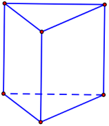
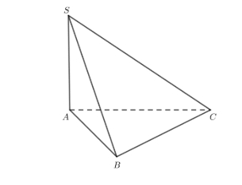
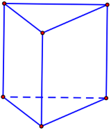
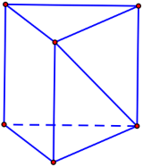
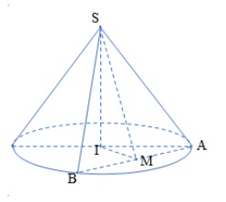
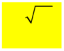
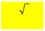
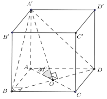
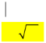
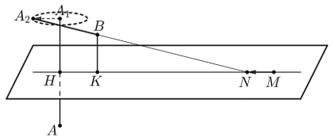

**NHÓM GIÁO VIÊN TOÁN VIỆT NAM  NĂM HỌC: **6** – **6**** ![ref1]
|
![ref2]

![ref3]
|
**ĐỀ THI TỐT NGHIỆP THPT QUỐC GIA NĂM 2021 MÃ ĐỀ 101** 

***Môn: Toán*** 

***Thời gian: 90 phút (Không kể thời gian phát đề)*** 
|
| - | :-: |

**Câu 1:**  Tập nghiệm của bất phương trình 3*x* < 2 là 

**A.** (−¥;log3 2).  **B.** (log3 2;+¥).  **C.** (−¥;log2 3).  **D.** (log2 3;+¥). 

**Câu 2:**  Nếu ò4 *f* (*x*)d*x* =3 và ò4 *g*(*x*)d*x* = −2 thì ò4 éë *f* (*x*)−*g*(*x*)ùûd*x* bằng 

1 1 1

**A.** −1.  **B.** −5.  **C.** 5.  **D.** 1. 

**Câu 3:**  Trong không gian *Oxyz*, cho mặt cầu (*S*) có tâm *I*(1;−4;0) và bán kính bằng 3.Phương trình 

của (*S*) là: 

**A.** (*x*+1)2 +(*y*−4)2 +*z*2 =9.  **B.** (*x*−1)2 +(*y* +4)2 +*z*2 =9.** 

**C.** (*x*−1)2 +(*y* +4)2 +*z*2 =3.  **D.** (*x*+1)2 +(*y*−4)2 +*z*2 =3. 

**Câu 4:**  Trong không gian  *Oxyz*, cho đường thẳng  *d* đi qua điểm  *M* (3;−1;4) và có một vectơ chỉ ![ref4]

phương *u* =(−2;4;5). Phương trình của *d* là: 

ì*x* = −2+3*t* ì*x* =3+2*t* ì*x* =3−2*t* ì*x* =3−2*t*

- ï ï ï

**A.** í*y* = 4−*t* .  **B.** í*y* = −1+4*t*.  **C.** í*y* =1+4*t* .  **D.** í*y* = −1+4*t*.** 

ïî*z* =5+4*t* ïî*z* = 4+5*t* ïî*z* = 4+5*t* ïî*z* = 4+5*t*

**Câu 5:**  Cho hàm số  *y* = *f* (*x*) có bảng xét dấu đạo hàm như sau:** 

![ref5]

Số điểm cực trị của hàm số đã cho là 

**A.** 5. **B.** 3.  **C.** 2.  **D.** 4. 

**Câu 6:**  Đồ thị hàm số nào dưới đây có dạng như đường cong trong hình bên?** 

![ref6]

**A.**  *y* = −2*x*4 +4*x*2 −1. **B.**  *y* = −*x*3 +3*x* −1.** 

**C.**  *y* = 2*x*4 −4*x*2 −1.  **D.**  *y* = *x*3 −3*x* −1. 

**Câu 7:**  Đồ thị của hàm số  *y* =−*x*4 +4*x*2 −3 cắt trục tung tại điểm có tung độ bằng** 

**A.** 0.  **B.** 3.  **C.** 1.  **D.** −3. 

**Câu 8:**  Với *n*là số nguyên dương bất kì, *n* ³ 4, công thức nào dưới đây đúng?** 

(*n*−4)! 4! *n*! *n*!

**A.**  *A* =~~ .  **B.**  *A* =~~ .  **C.**  *A* =~~ .  **D.**  *A*4 =~~ . 

*n*4 *n*! *n*4 (*n*−4)! *n*4 4!(*n*−4)! *n* (*n*−4)!

**Câu 9:**  Phần thực của số phức *z* =5−2*i*bằng 

**A.** 5.  **B.** 2.  **C.** −5.  **D.** −2. 

5

**Câu 10:**  Trên khoảng (0;+¥),đạo hàm của hàm số  *y* = *x*2 là** 

2 72 2 32 ¢ = 5 3 5 −32

**A.**  *y*¢ = *x* .  **B.**  *y*¢ = *x* .  **C.**  *y x*2 .  **D.**  *y*¢ = *x* . 

7 5 2 2

**Câu 11:**  Cho hàm số  *f* (*x*) = *x*2 +4. Khẳng định nào dưới đây đúng?** 

**A.** ò *f* (*x*)d*x* = 2*x* +*C* .   **B.** ò *f* (*x*)d*x* = *x*2 + 4*x* +*C*. 

**C.** ò *f* (*x*)d*x* = *x*33 +4*x*+*C* .  **D.** ò *f* (*x*)d*x* = *x*3 + 4*x* +*C* . ![ref7]

**Câu 12:**  Trong không gian *Oxyz*,cho điểm  *A*(−2;3;5). Tọa độ vectơ *OA* là** 

**A.** (−2;3;5).  **B.** (2;−3;5).  **C.** (−2;−3;5).  **D.** (2;−3;−5). 

**Câu 13:**  Cho hàm số  *y* = *f* (*x*) có bảng biến thiên như sau: 

![ref8]

Giá trị cực tiểu của hàm số đã cho bằng** 

**A.** −1.  **B.** 5.  **C.** −3.  **D.** 1. 

**Câu 14:**  Cho hàm số  *y* = *f* (*x*) có đồ thị là đường cong trong hình bên. Hàm số đã cho nghịch biến trên 

khoảng nào dưới đây? 

![ref9]

**A.** (0;1).  **B.** (−¥;0).  **C.** (0;+¥).  **D.** (−1;1). 

**Câu 15:**  Nghiệm của phương trình log3 (5*x*)= 2 là: 

**A.** *x* = 8.  **B.** *x* =9.  **C.** *x* = 9.  **D.** *x* =8. 

5 5

**Câu 16:**  Nếu ò3 *f* (*x*)d*x* = 4 thì ò3 3*f* (*x*)d*x* bằng 

0 0

**A.** 36.  **B.** 12.  **C.** 3.  **D.** 4. 

**Câu 17:**  Thể tích của khối lập phương cạnh 5*a* bằng 

**A.** 5*a*3.  **B.** *a*3.  **C.** 125*a*3.  **D.** 25*a*3. 

**Câu 18:**  Tập xác định của hàm số  *y* =9*x* là 

**A.**  .  **B.** [0;+¥).  **C.**  \{0}.  **D.** (0;+¥). ![ref10]![ref11]

**Câu 19:**  Diện tích *S* của mặt cầu bán kính *R* được tính theo công thức nào dưới đây? 

**A.** *S* =16*pR*2 .  **B.**  *y* =4*pR*2 .  **C.** *S* =*pR*2 .  **D.** *S* = 4*pR*3. 

3

**Câu 20:**  Tiệm cận đứng của đồ thị hàm số  *y* = 2*x* −1 là đường thẳng có phương trình: 

*x* −1

**A.** *x* =1.  **B.** *x* = −1.  **C.** *x* =2.  **D.** *x* = 1 . 

2

**Câu 21:**  Cho *a* >0 và *a* ¹1, khi đó log*a* 4 *a* bằng 

1 1

**A.** 4.  **B.**  .  **C.** − .  **D.** −4. 

4 4

**Câu 22:**  Cho khối chóp có diện tích đáy *B* =5*a*2 và chiều cao *h* =*a*. Thể tích của khối chóp đã cho bằng 

**A.**  5*a*3.  **B.**  5 *a*3.  **C.** 5*a*3.  **D.** 5*a*3. 

6 2 3

**Câu 23:**  Trong không gian  *Oxyz* , cho mặt phẳng  (*P*):3*x*−*y* +2*z* −1 =0. Vectơ nào dưới đây là một 

vectơ pháp tuyến của (*P*)?  ![ref12]![ref13]![ref14]![ref15]

**A.** *n*1 =(−3;1;2).  **B.** *n*2 =(3;−1;2).  **C.** *n*3 =(3;1;2).  **D.** *n*4 =(3;1;−2). 

**Câu 24:**  Cho khối trụ có bán kính đáy *r* =6 và chiều cao *h* =3. Thể tích của khối trụ đã cho bằng 

**A.** 108*p* .  **B.** 36*p* .  **C.** 18*p* .  **D.** 54*p* . 

**Câu 25:**  Cho hai số phức *z* =4+2*i* và *w*=3−4*i*. Số phức  *z*+*w* bằng 

**A.** 1+6*i* .  **B.** 7−2*i*.  **C.** 7+2*i*.  **D.** −1−6*i*. 

**Câu 26:**  Cho cấp số nhân (*un*) với *u*1 =3 và *u*2 =9. Công bội của cấp số nhân đã cho bằng 

**A.** −6.  **B.** 1 .  **C.** 3.  **D.** 6. 

3

**Câu 27:**  Cho hàm số  *f* (*x*) =*ex* +2. Khẳng định nào dưới đây đúng? 

**A.** ò *f* (*x*)d*x* =*ex*−2 +*C*.   **B.** ò *f* (*x*)d*x* =*ex* +2*x*+*C* .** 

**C.** ò *f* (*x*)d*x* =*ex* +*C*.  **D.** ò *f* (*x*)d*x* =*ex* −2*x* +*C*. 

**Câu 28:**  Trên mặt phẳng tọa độ, điểm *M*(−3;4) là điểm biểu diễn của số phức nào dưới đây? 

**A.** *z*2 =3+4*i*.  **B.** *z*3 =−3+4*i*.  **C.** *z*4 =−3−4*i*.  **D.** *z*1 =3−4*i* . 

**Câu 29:**  Biết hàm số  *y* = *x*+*a* (*a* là số thực cho trước, *a* ¹1) có đồ thị như trong hình bên. 

*x*+1

![ref16]

Mệnh đề nào dưới đây đúng?  ![ref17]![ref17]

**A.**  *y*'<0, "*x* ¹ −1.  **B.**  *y*'>0, "*x* ¹ −1.  **C.**  *y*'<0, "*x*Î .  **D.**  *y*'>0, "*x*Î . 

**Câu 30:**  Từ một hộp chứa 12 quả bóng gồm 5 quả màu đỏ và 7 quả màu xanh, lấy ngẫu nhiên đồng thời 

3 quả. Xác suất để lấy được 3 quả màu xanh bằng 

7 2 1 5

**A.**  .  **B.**  .  **C.**  .  **D.**  . 

44 7 22 12

**Câu 31:**  Trên đoạn [0;3], hàm số  *y* =−*x*3 +3*x* đạt giá trị lớn nhất tại điểm 

**A.** *x* =0.  **B.** *x* =3.  **C.** *x* =1.  **D.** *x* =2. 

**Câu 32:**  Trong không gian *Oxyz* , cho điểm  *M* (−1;3;2) và mặt phẳng (*P*):*x*−2*y* +4*z* +1=0. Đường 

thẳng đi qua *M* và vuông góc với (*P*) có phương trình là: 

*x*+1 *y*−3 *z* −2 *x*−1 *y* +3 *z* +2

**A.**~~  =~~ =~~ .   **B.**~~  =~~ =~~ .** 

1 −2 1 1 −2 1

**C.**  *x*−1 = *y* +3 = *z* +2 .   **D.**  *x*+1 = *y*−3 = *z* −2 . 

1 −2 4 1 −2 4

**Câu 33:**  Cho hình chóp *S*.*ABC* có đáy là tam giác vuông cân tại *B*,  *AB*=2*a* và *SA* vuông góc với mặt 

phẳng đáy. Khoảng cách từ *C* đến mặt phẳng (*SAB*) bằng 

**A.**  2*a*.  **B.** 2*a*.  **C.** *a*.  **D.** 2 2*a* . 

**Câu 34:**  Trong không gian *Oxyz* , cho hai điểm  *A*(1;0;0) và  *B*(4;1;2). Mặt phẳng đi qua  *A* và vuông 

góc với  *AB*có phương trình là 

**A.** 3*x*+ *y*+2*z*−17 =0.   **B.** 3*x*+ *y*+2*z*−3 =0. 

**C.** 5*x*+ *y*+2*z*−5 =0.   **D.** 5*x*+ *y*+2*z*−25 =0. 

**Câu 35:**  Cho số phức *z* thỏa mãn *iz* =5+4*i* . Số phức liên hợp của *z* là 

**A.** *z* = 4+5*i*.  **B.** *z* = 4−5*i*.  **C.** *z* = −4+5*i* .  **D.** *z* = −4−5*i* . 

**Câu 36:**  Cho hình lắng trụ đứng  *ABC*.*A*¢*B*¢*C*¢ có tất cả các cạnh bằng nhau ( tham khảo hình bên. Góc 

giữa hai đường thẳng  *AA*¢ và *BC*¢ là 

***A C***

***B***

***A' C'***

***B'***

**A.** 30o .  **B.** 90o .  **C.** 45o .  **D.** 60o . 

**Câu 37:**  Với mọi *a*,*b* thỏa mãn log2 *a*3 +log2 *b* =6, khẳng định nào dưới đây đúng? 

**A.** *a*3*b* =64.  **B.** *a*3*b* =36.  **C.** *a*3 +*b* =64.  **D.** *a*3 +*b* =64. 

**Câu 38:**  Nếu ò2 *f* (*x*)d*x* =5 thì ò2 éë2*f* (*x*)−1ùûd*x* bằng 

0 0

**A.** 8.  **B.** 9.  **C.** 10.  **D.** 12. 

ì2*x*+5 *khi x* ³1 ![ref18]

**Câu 39:**  Cho hàm số  *f* (*x*)= í . Giả sử  *F* là nguyên hàm của  *f* trên  thỏa mãn 

î3*x*2 +4 *khi x* <1

*F*(0) = 2. Giá trị của *F*(−1)+2*F*(2) bằng 

**A.** 27.  **B.** 29.  **C.** 12.  **D.** 33. 

**Câu 40:**  Có bao nhiêu số nguyên  *x* thỏa mãn (3*x*2 −9*x* )éëlog3 (*x* +25)−3ùû £0

**A.** 27.  **B.** Vô số.  **C.** 26.  **D.** 25. 

**Câu 41:**  Cho hàm số bậc ba *y* = *f* (*x*) có đồ thị là đường cong trong hình bên. Số nghiệm thực phân biệt 

của phương trình  *f* ( *f* (*x*))=1 là 

![ref19]

**A.** 9.  **B.** 3.  **C.** 6.  **D.** 7. 

**Câu 42:**  Cắt hình nón (*N*) bởi mặt phẳng đi qua đỉnh và tạo với mặt phẳng chứa đáy một góc bằng 600

ta thu được thiết diện là một tam giác đều cạnh 4*a*. Diện tích xung quanh của (*N*) bằng : 

**A.** 8 7*pa*2 .  **B.** 4 13*pa*2 .  **C.** 8 13*pa*2 .  **D.** 4 7*pa*2 . ****

![ref20]***https:/www.facebook.com/groups/toanvd.***  {*Trang *6* ![ref21]*
**NHÓM GIÁO VIÊN TOÁN VIỆT NAM  NĂM HỌC: **8** – **8**** ![ref1]

**Câu 43:**  Trên tập hợp các số phức, xét phương trình *z*2 −2(*m*+1)*z* +*m*2 =0 (m là tham số thực). Có bao 

nhiêu giá trị của m để phương trình đó có nghiệm *z*0 thỏa mãn *z*0=7?

**A.** 2.  **B.** 3.  **C.** 1.  **D.** 4. 

**Câu 44:**  Xét các số phức *z*,*w* thỏa mãn  *z* =1 và  *w* = 2. Khi  *z*+*iw*−6−8*i* đạt giá trị nhỏ nhất,  *z*−*w* 

bằng 

221 29

**A.**~~  .  **B.**  5.  **C.** 3.  **D.**~~  . 

5 5

*x y*−1 *z* −2

**Câu 45:**  Trong  không  gian  *Oxyz* ,  cho  đường  thẳng  *d* :  =~~ =  và  mặt  phẳng 

1  1 −1

(*P*):*x*+2*y*+ *z*−4 =0. Hình chiếu vuông góc của *d* trên (*P*) là đường thẳng có phương trình: 

*x y*+1 *z*+2 *x y*+1 *z*+2

**A.**  =~~ =~~ .  **B.**  =~~ =~~ . 

2  1 −4 3 −2 1

*x y*−1 *z* −2 *x y*−1 *z* −2

**C.**  =~~ =~~ .  **D.**  =~~ =~~ . 

2 1 −4 3 −2 1

**Câu 46:**  Cho  hàm  số  *f* (*x*)= *x*3 +*ax*2 +*bx*+*c*  với  *a*,*b*,*c*  là  các  số  thực.  Biết  hàm  số *g*(*x*) = *f* (*x*)+ *f*¢(*x*)+ *f*¢¢(*x*) có hai giá trị cực trị là là −3 và 6. Diện tích hình phẳng giới hạn 

*f* (*x*)

bởi các đường  *y* = *g*(*x*)+6 và  *y* =1 bằng 

**A.** 2ln3. **B.** ln3. **C.** ln18. **D.** 2ln2.

**Câu 47:**  Có bao nhiêu số nguyên  *y* sao cho tồn tại *x*Îæç1;3ö÷ thỏa mãn 273*x*2+*xy* =(1+ *xy*)279*x* . 

è3 ø

**A.** 27.  **B.** 9.  **C.** 11.  **D.** 12. 

**Câu 48:**  Cho khối hộp chữ nhật  *ABCD*.*A*'*B*'*C*'*D*' có đáy là hình vuông,  *BD* =2*a*, góc giữa hai mặt 

phẳng (*A*'*BD*) và (*ABCD*) bằng 300 . Thể tích của khối hộp chữ nhật đã cho bằng 

**A.** 6 3*a*3.  **B.**  2 3 *a*3.  **C.** 2 3*a*3.  **D.**  2 3 *a*3. 

9 3

**Câu 49:**  Trong không gian *Oxyz*,cho hai điểm  *A*(1;−3;−4), *B*(−2;1;2). Xét hai điểm *M* và  *N* thay đổi 

thuộc mặt phẳng (*Oxy*) sao cho *MN* =2. Giá trị lớn nhất của *AM* −*BN* bằng 

**A.** 3 5 .  **B.**  61.  **C.**  13.  **D.**  53. 

**Câu 50:**  Cho hàm số  *y* = *f* (*x*) có đạo hàm  *f* ¢(*x*) =(*x*−7)(*x*2 −9),"*x* Î . Có bao nhiêu giá trị nguyên ![ref22]

dương của tham số *m* để hàm số *g*(*x*)= *f* ( *x*3 +5*x* +*m*) có ít nhất 3 điểm cực trị? 

**A.** 6. **B.** 7. **C.** 5. **D.** 4.

**HẾT** 

|
![ref2]

![ref3]
|
**ĐỀ THI TỐT NGHIỆP THPT QUỐC GIA NĂM 2021 MÃ ĐỀ 101** 

***Môn: Toán*** 

***Thời gian: 90 phút (Không kể thời gian phát đề)*** 
|
| - | :-: |

**BẢNG ĐÁP ÁN VÀ GIẢI CHI TIẾT** 

|**1** |**2** |**3** |**4** |**5** |**6** |**7** |**8** |**9** |**10** |**11** |**12** |**13** |**14** |**15** |**16** |**17** |**18** |**19** |**20** |**21** |**22** |**23** |**24** |**25** |
| - | - | - | - | - | - | - | - | - | - | - | - | - | - | - | - | - | - | - | - | - | - | - | - | - |
|**A** |**C** |**B** |**D** |**D** |**A** |**D** |**D** |**A** |**C** |**C** |**A** |**C** |**A** |**C** |**B** |**C** |**A** |**B** |**A** |**B** |**D** |**B** |**A** |**B** |
|**26** |**27** |**28** |**29** |**30** |**31** |**32** |**33** |**34** |**35** |**36** |**37** |**38** |**39** |**40** |**41** |**42** |**43** |**44** |**45** |**46** |**47** |**48** |**49** |**50** |
|**C** |**B** |**B** |**B** |**A** |**C** |**D** |**B** |**B** |**A** |**C** |**A** |**A** |**A** |**C** |**D** |**D** |**B** |**D** |**C** |**D** |**C** |**D** |**D** |**A** |

**Câu 1:**  Tập nghiệm của bất phương trình 3*x* < 2 là 

**A.** (−¥;log3 2).  **B.** (log3 2;+¥).  **C.** (−¥;log2 3).  **D.** (log2 3;+¥). 

**Lời giải** 

**Chọn A** 

3*x* <2Û *x*<log3 2.

**Câu 2:**  Nếu ò4 *f* (*x*)d*x* =3 và ò4 *g*(*x*)d*x* = −2 thì ò4 éë *f* (*x*)−*g*(*x*)ùûd*x* bằng 

1 1 1

**A.** −1.  **B.** −5.  **C.** 5.  **D.** 1. 

**Lời giải** 

**Chọn C** 

4 4 4

òéë *f* (*x*)−*g*(*x*)ùûd*x* =ò *f* (*x*)d*x* −ò*g*(*x*)d*x* =3 −( −2) =5. 

1 1 1

**Câu 3:**  Trong không gian *Oxyz*, cho mặt cầu (*S*) có tâm *I*(1;−4;0) và bán kính bằng 3.Phương trình 

của (*S*) là: 

**A.** (*x*+1)2 +(*y*−4)2 +*z*2 =9.  **B.** (*x*−1)2 +(*y* +4)2 +*z*2 =9. ****

**C.** (*x*−1)2 +(*y* +4)2 +*z*2 =3.  **D.** (*x*+1)2 +(*y*−4)2 +*z*2 =3. 

**Lời giải** 

**Chọn B** 

Mặt cầu có tâm *I*(1;−4;0) và bán kính bằng 3 là (*x*−1)2 +(*y* +4)2 +*z*2 =9. 

**Câu 4:**  Trong không gian  *Oxyz*, cho đường thẳng  *d* đi qua điểm  *M* (3;−1;4) và có một vectơ chỉ ![ref4]

phương *u* =(−2;4;5). Phương trình của *d* là: 

![ref20]***https:/www.facebook.com/groups/toanvd.***  {*Trang *8* ![ref21]*
**NHÓM GIÁO VIÊN TOÁN VIỆT NAM  NĂM HỌC: **9** – **9**** ![ref1]

1. ìïí*xy*==−42−+*t* 3*t* . ïî*z* =5+4*t*

**Chọn D** 

ì*x* =3+2*t*

2. ïí*y* = −1+4*t*.** ï

   î*z* = 4+5*t*

ì*x* =3−2*t* ï

3. í*y* =1+4*t* .** ïî*z* = 4+5*t*

**Lời giải** 

ì*x* =3−2*t*

ï

4. í*y* = −1+4*t*.** ïî*z* = 4+5*t*

![ref20]***https:/www.facebook.com/groups/toanvd.***  {*Trang *9* ![ref21]*
**NHÓM GIÁO VIÊN TOÁN VIỆT NAM  NĂM HỌC: **10** – **10**** ![ref1]

ì*x* =3−2*t ![ref23]*Đường thẳng *d* đi qua *M* (3;−1;4) và có một vectơ chỉ phương *u* =(−2;4;5) là: ïí*y* = −1+4*t*. 

ïî*z* = 4+5*t* **Câu 5:**  Cho hàm số  *y* = *f* (*x*) có bảng xét dấu đạo hàm như sau:** 

![ref24]

Số điểm cực trị của hàm số đã cho là 

**A.** 5. **B.** 3.  **C.** 2.  **D.** 4. 

**Lời giải** 

**Chọn D** 

Ta thấy  *f*¢(*x*)=0 có  4 nghiệm là  *x* = −2;*x* = −1;*x* =1;*x* =4 và  *f* ¢(*x*)đổi dấu khi qua các nghiệm đó nên hàm số đã cho có 4 điểm cực trị. 

**Câu 6:**  Đồ thị hàm số nào dưới đây có dạng như đường cong trong hình bên?** 

![ref25]

**A.**  *y* = −2*x*4 +4*x*2 −1. **B.**  *y* = −*x*3 +3*x* −1. ****

**C.**  *y* = 2*x*4 −4*x*2 −1.  **D.**  *y* = *x*3 −3*x* −1. 

**Lời giải** 

**Chọn A** 

Đồ thị hàm số nhận *Oy* làm trục đối xứng nên loại đáp án B và D.** 

Từ đồ thị hàm số ta thấy  lim *y* = −¥ nên loại đáp án C.** 

*x*→+¥

**Câu 7:**  Đồ thị của hàm số  *y* =−*x*4 +4*x*2 −3 cắt trục tung tại điểm có tung độ bằng** 

**A.** 0.  **B.** 3.  **C.** 1.  **D.** −3. 

**Lời giải** 

**Chọn D** 

Gọi *M* (*xM* ;*yM* )là giao điểm của đồ thị hàm số  *y* =−*x*4 +4*x*2 −3 và trục *Oy*

Ta có  *xM* =0Þ *yM* =−3. 

**Câu 8:**  Với *n*là số nguyên dương bất kì, *n* ³ 4, công thức nào dưới đây đúng?** 

(*n*−4)! 4! *n*! *n*!

**A.**  *An*4 = *n*!~~ .  **B.**  *An*4 = (*n*−4)!.  **C.**  *An*4 = 4!(*n*−4)!.  **D.**  *An*4 = (*n*−4)!. 

**Lời giải** 

![ref20]***https:/www.facebook.com/groups/toanvd.***  {*Trang *10* ![ref21]*
**NHÓM GIÁO VIÊN TOÁN VIỆT NAM  NĂM HỌC: **13** – **13**** ![ref1]

**Chọn D** 

**Câu 9:**  Phần thực của số phức *z* =5−2*i*bằng 

**A.** 5.  **B.** 2.  **C.** −5.  **D.** −2. 

**Lời giải** 

**Chọn A** 

Phần thực của*z* =5−2*i*là 5. 

**Câu 10:**  Trên khoảng (0;+¥),đạo hàm của hàm số  *y* = *x*52 là** 

**A.**  *y*¢ = 2 *x*72 .  **B.**  *y*¢ = 2 *x*32 .  **C.**  *y*¢ = 5 *x*32 .  **D.**  *y*¢ = 5 *x*−32 . 

7 5 2 2

**Lời giải** 

**Chọn C** 

\+ æ ö¢ 5

Ta có trên khoảng (0; ¥) *y*¢=ç*x*52 ÷ = *x*52−1 = 5 *x*32.

- ø 2 2

**Câu 11:**  Cho hàm số  *f* (*x*) = *x*2 +4. Khẳng định nào dưới đây đúng?** 

**A.** ò *f* (*x*)d*x* = 2*x* +*C* .   **B.** ò *f* (*x*)d*x* = *x*2 + 4*x* +*C*. 

**C.** ò *f* (*x*)d*x* = *x*33 +4*x*+*C* .  **D.** ò *f* (*x*)d*x* = *x*3 + 4*x* +*C* . 

**Lời giải** 

**Chọn C** 

ò ( ) ò( 2 ) *x*3

*f x* d*x* = *x* +4 d*x* = +4*x*+*C* . 

3

**Câu 12:**  Trong không gian *Oxyz*,cho điểm  *A*(−2;3;5). Tọa độ vectơ *OA* là **![ref7]**

**A.** (−2;3;5).  **B.** (2;−3;5).  **C.** (−2;−3;5).  **D.** (2;−3;−5). 

**Lời giải** 

**Chọn A **

*OA*=(*xA* −*xO*;*A yA* −*yO*;*zA* −*zO* ) Þ*OA* =( −2;3;5). **Câu 13:**  Cho hàm số  *y* = *f* (*x*) có bảng biến thiên như sau: 

![ref8]

Giá trị cực tiểu của hàm số đã cho bằng** 

**A.** −1.  **B.** 5.  **C.** −3.  **D.** 1. 

**Lời giải** 

**Chọn C** 

Dựa vào BBT ta có giá trị cực tiểu của hàm số đã cho bằng −3.** 

**Câu 14:**  Cho hàm số  *y* = *f* (*x*) có đồ thị là đường cong trong hình bên. Hàm số đã cho nghịch biến trên 

khoảng nào dưới đây? 

![ref9]

**A.** (0;1).  **B.** (−¥;0).  **C.** (0;+¥).  **D.** (−1;1). 

**Lời giải** 

**Chọn A** 

**Câu 15:**  Nghiệm của phương trình log3 (5*x*)= 2 là: 

**A.** *x* = 8.  **B.** *x* =9.  **C.** *x* = 9.  **D.** *x* =8. 

5 5

**Lời giải** 

**Chọn C** 

log3 (5*x*) = 2 Û5*x* =32 Û *x* = 95 . 

**Câu 16:**  Nếu ò3 *f* (*x*)d*x* = 4 thì ò3 3*f* (*x*)d*x* bằng 

0 0

**A.** 36.  **B.** 12.  **C.** 3.  **D.** 4. 

**Lời giải** 

**Chọn B** 

3 3

ò3*f* (*x*)d*x* =3ò *f* (*x*)d*x* =3.4=12. 

0 0

**Câu 17:**  Thể tích của khối lập phương cạnh 5*a* bằng 

**A.** 5*a*3.  **B.** *a*3.  **C.** 125*a*3.  **D.** 25*a*3. 

**Lời giải** 

**Chọn C** 

Thể tích của khối lập phương cạnh 5*a* là *V* =(5*a*)3 =125*a*3 . 

**Câu 18:**  Tập xác định của hàm số  *y* =9*x* là 

**A.**  .  **B.** [0;+¥).  **C.**  \{0}.  **D.** (0;+¥). ![ref10]![ref11]

**Lời giải** 

**Chọn A** 

Hàm số mũ  *y* =*ax* , với *a* dương và khác 1 luôn có tập xác định là  . ![ref26]

**Câu 19:**  Diện tích *S* của mặt cầu bán kính *R* được tính theo công thức nào dưới đây? 

![ref20]***https:/www.facebook.com/groups/toanvd.***  {*Trang *13* ![ref21]*
**NHÓM GIÁO VIÊN TOÁN VIỆT NAM  NĂM HỌC:  –**  ![ref1]

1. *S* =16*pR*2 . 
2. *y* =4*pR*2 . 
3. *S* =*pR*2 . 

**Lời giải** 

4. *S* = 4*pR*3. 3

![ref20]***https:/www.facebook.com/groups/toanvd.***  {*Trang  ![ref21]*
**NHÓM GIÁO VIÊN TOÁN VIỆT NAM  NĂM HỌC: **28** – **28**** ![ref1]

**Chọn B** 

Ta có *S* = 4*pR*2 . 

**Câu 20:**  Tiệm cận đứng của đồ thị hàm số  *y* = 2*x* −1 là đường thẳng có phương trình: 

*x* −1

**A.** *x* =1.  **B.** *x* = −1.  **C.** *x* =2.  **D.** *x* = 1 . 

2

**Lời giải** 

**Chọn A** 

Ta có lim 2*x*−1= +¥ nên đồ thị hàm số *y* = 2*x* −1có tiệm cận đứng là  *x* =1. 

*x*→ 1+ *x*−1 *x* −1

**Câu 21:**  Cho *a* >0 và *a* ¹1, khi đó log*a* 4 *a* bằng 

1 1

**A.** 4.  **B.**  .  **C.** − .  **D.** −4. 

4 4

**Lời giải** 

**Chọn B** 

Do *a* >0 và *a* ¹1 nênlog 4 *a* =log *a*14 = 1log *a* = 1. 

*a a* 4 *a* 4

**Câu 22:**  Cho khối chóp có diện tích đáy *B* =5*a*2 và chiều cao *h* =*a*. Thể tích của khối chóp đã cho bằng 

**A.**  5*a*3.  **B.**  5 *a*3.  **C.** 5*a*3.  **D.** 5*a*3. 

6 2 3

**Lời giải** 

**Chọn D** 

1 1 2 5 3

Thể tích của khối chóp đã cho *V* = .*B*.*h* = .5*a* .*a* = *a* . 

3 3 3

**Câu 23:**  Trong không gian  *Oxyz* , cho mặt phẳng  (*P*):3*x*−*y* +2*z* −1 =0. Vectơ nào dưới đây là một 

vectơ pháp tuyến của (*P*)?   ![ref27]![ref28]![ref29]![ref30]

**A.** *n*1 =(−3;1;2).  **B.** *n*2 =(3;−1;2).  **C.** *n*3 =(3;1;2).  **D.** *n*4 =(3;1;−2). 

**Lời giải** 

**Chọn B  ![ref31]**

Vecto pháp tuyến của mặt phẳng (*P*):3*x*−*y* +2*z* −1 =0 là *n*2 =(3;−1;2). 

**Câu 24:**  Cho khối trụ có bán kính đáy *r* =6 và chiều cao *h* =3. Thể tích của khối trụ đã cho bằng  

**A.** 108*p* .  **B.** 36*p* .  **C.** 18*p* .  **D.** 54*p* . 

**Lời giải** 

**Chọn A** 

Thể tích của khối trụ đã cho *V* =*pr*2*h* =*p*.62.3=108*p* . 

**Câu 25:**  Cho hai số phức *z* =4+2*i* và *w*=3−4*i*. Số phức  *z*+*w* bằng 

**A.** 1+6*i* .  **B.** 7−2*i*.  **C.** 7+2*i*.  **D.** −1−6*i*. 

**Lời giải** 

**Chọn B** 

Ta có:  *z*+*w*=4+2*i*+3−4*i* =7−2*i* . 

**Câu 26:**  Cho cấp số nhân (*un*) với *u*1 =3 và *u*2 =9. Công bội của cấp số nhân đã cho bằng 

**A.** −6.  **B.** 1 .  **C.** 3.  **D.** 6. 

3

**Lời giải** 

**Chọn C** 

Công bội *q* = *u*2 =3. 

*u*1

**Câu 27:**  Cho hàm số  *f* (*x*) =*ex* +2. Khẳng định nào dưới đây đúng? 

**A.** ò *f* (*x*)d*x* =*ex*−2 +*C*.   **B.** ò *f* (*x*)d*x* =*ex* +2*x*+*C* . ****

**C.** ò *f* (*x*)d*x* =*ex* +*C*.  **D.** ò *f* (*x*)d*x* =*ex* −2*x* +*C*. 

**Lời giải** 

**Chọn B** 

Ta có: ò *f* (*x*)d*x* = ò(e*x*+2)d*x* =*ex* +2*x*+*C*. 

**Câu 28:**  Trên mặt phẳng tọa độ, điểm *M*(−3;4) là điểm biểu diễn của số phức nào dưới đây? 

**A.** *z*2 =3+4*i*.  **B.** *z*3 =−3+4*i*.  **C.** *z*4 =−3−4*i*.  **D.** *z*1 =3−4*i* . 

**Lời giải** 

**Chọn B** 

Ta có: *M*(−3;4) là điểm biểu diễn của số phức −3+4*i*. 

*x*+*a*

**Câu 29:**  Biết hàm số  *y* = (*a* là số thực cho trước, *a* ¹1) có đồ thị như trong hình bên. 

*x*+1

![ref16]

Mệnh đề nào dưới đây đúng?  ![ref17]![ref17]

**A.**  *y*'<0, "*x* ¹ −1.  **B.**  *y*'>0, "*x* ¹ −1.  **C.**  *y*'<0, "*x*Î .  **D.**  *y*'>0, "*x*Î . 

**Lời giải** 

**Chọn B** 

Tập xác định: *D* = \{−1}. ![ref32]

*x*+*a*

Dựa vào đồ thị, ta có: Hàm số  *y* = đồng biến trên (−¥;−1) và (−1;+¥)

*x*+1

- *y*'>0, "*x* ¹ −1. 

**Câu 30:**  Từ một hộp chứa 12 quả bóng gồm 5 quả màu đỏ và 7 quả màu xanh, lấy ngẫu nhiên đồng thời 

3 quả. Xác suất để lấy được 3 quả màu xanh bằng 

**A.**  7 .  **B.**  2 .  **C.**  1 .  **D.**  5 . 

44 7 22 12

**Lời giải** 

**Chọn A** 

Số phần tử của không gian mẫu là: *n*(W) =*C*132 . 

Biến cố “lấy được ba quả màu xanh” có số phần tử: *n*(*A*) =*C*73

Xác suất cần tìm là: *P*(*A*) = *n*(*A*) = 7

*n*(W) 44 . 

**Câu 31:**  Trên đoạn [0;3], hàm số  *y* =−*x*3 +3*x* đạt giá trị lớn nhất tại điểm 

**A.** *x* =0.  **B.** *x* =3.  **C.** *x* =1.  **D.** *x* =2. 

**Lời giải** 

**Chọn C** 

Ta có:  *y* = *f* (*x*)= −*x*3 +3*x* Þ *f*¢(*x*) = −3*x*2 +3

*y*¢= 0 Û éêë*xx* ==1−1Ï[0;3]. 

Ta có  *f* (0) =0; *f* (1)= 2; *f* (3)= −18. 

Vậy hàm số  *y* =−*x*3 +3*x* đạt giá trị lớn nhất tại điểm *x* =1. 

**Câu 32:**  Trong không gian *Oxyz* , cho điểm  *M* (−1;3;2) và mặt phẳng (*P*):*x*−2*y* +4*z* +1=0. Đường 

thẳng đi qua *M* và vuông góc với (*P*) có phương trình là: 

*x*+1 *y*−3 *z* −2 *x*−1 *y* +3 *z* +2

**A.**~~  =~~ =~~ .   **B.**~~  =~~ =~~ .** 

1 −2 1 1 −2 1

*x*−1 *y* +3 *z* +2 *x*+1 *y*−3 *z* −2

**C.**~~  =~~ = .   **D.**~~  =~~ = . 

1 −2 4 1 −2 4

**Lời giải** 

**Chọn D** 

Đường  thẳng  đi  qua  *M* (−1;3;2)  và  vuông  góc  với  (*P*)  có  một  véc  tơ  chỉ  phương  là *u* = *n* =(1;−2;4). Vậy phương trình đường thẳng cần tìm là:  *x*+1 = *y*−3 = *z* −2 . 

*P* 1 −2 4

**Câu 33:**  Cho hình chóp *S*.*ABC* có đáy là tam giác vuông cân tại *B*,  *AB*=2*a* và *SA* vuông góc với mặt 

phẳng đáy. Khoảng cách từ *C* đến mặt phẳng (*SAB*) bằng 

**A.**  2*a*.  **B.** 2*a*.  **C.** *a*.  **D.** 2 2*a* . 

**Lời giải** 

**Chọn B** 

Ta có:  *AB* ⊥ *BC*üýÞ *BC* ⊥ (*SAB*)

*SA*⊥ *BC* þ

Suy ra: *d*(*C*;(*SAB*)) = *BC* = *AB* = 2*a*.  

**Câu 34:**  Trong không gian *Oxyz* , cho hai điểm  *A*(1;0;0) và  *B*(4;1;2). Mặt phẳng đi qua  *A* và vuông 

góc với  *AB*có phương trình là 

**A.** 3*x*+ *y*+2*z*−17 =0.   **B.** 3*x*+ *y*+2*z*−3 =0. 

**C.** 5*x*+ *y*+2*z*−5 =0.   **D.** 5*x*+ *y*+2*z*−25 =0. 

**Lời giải** 

**Chọn B  **

Ta có  *AB* =(3;1;2) Þ *n*(*P*) =(3;1;2). 

Phương  trình  mặt  phẳng  đi  qua  *A* và  vuông  góc  với  *AB* là 3(*x*−1)+*y* +2*z* =0 Û3*x* + *y* +2*z* −3 =0. 

**Câu 35:**  Cho số phức *z* thỏa mãn *iz* =5+4*i* . Số phức liên hợp của *z* là 

**A.** *z* = 4+5*i*.  **B.** *z* = 4−5*i*.  **C.** *z* = −4+5*i* .  **D.** *z* = −4−5*i* . 

**Lời giải** 

**Chọn A** 

Ta có *iz* =5+4*i* Þ *z* = 5+4*i* Þ *z* = 4−5*i* Þ *z* = 4+5*i*. 

*i*

**Câu 36:**  Cho hình lăng trụ đứng  *ABC*.*A*¢*B*¢*C*¢ có tất cả các cạnh bằng nhau ( tham khảo hình bên). Góc 

giữa hai đường thẳng  *AA*¢ và *BC*¢ là 

***A C***

***B***

***A' C'***

***B'***

**A.** 30o .  **B.** 90o .  **C.** 45o .  **D.** 60o . 

**Lời giải** 

**Chọn C** 

***A C***

***B***

***A' C'***

***B'***

Ta có (*AA*¢,*BC*¢) =(*BB*¢,*BC*¢) = *B*¢*BC* . 

Tam giác *B*¢*BC* vuông cân tại *B*¢nên *B*¢*BC* =45o . 

**Câu 37:**  Với mọi *a*,*b* thỏa mãn log2 *a*3 +log2 *b* =6, khẳng định nào dưới đây đúng? 

**A.** *a*3*b* =64.  **B.** *a*3*b* =36.  **C.** *a*3 +*b* =64.  **D.** *a*3 +*b* =64. 

**Lời giải** 

**Chọn A** 

Ta có: log2 *a*3 +log2 *b* = 6 Û log2 (*a*3*b*) = 6 Û *a*3*b* = 26 Û *a*3*b* = 64. 

2 2

**Câu 38:**  Nếu ò *f* (*x*)d*x* =5 thì òéë2*f* (*x*)−1ùûd*x* bằng 

0 0

**A.** 8.  **B.** 9.  **C.** 10.  **D.** 12. 

**Lời giải** 

**Chọn A** 

ò2 éë2*f* (*x*)−1ùûd*x* =ò2 2*f* (*x*)d*x* −ò21d*x* =8. 

0 0 0

ì2*x*+5 *khi x* ³1 ![ref10]

**Câu 39:**  Cho hàm số  *f* (*x*)= í . Giả sử  *F* là nguyên hàm của  *f* trên  thỏa mãn 

î3*x*2 +4 *khi x* <1

*F*(0) = 2. Giá trị của *F*(−1)+2*F*(2) bằng 

**A.** 27.  **B.** 29.  **C.** 12.  **D.** 33. 

**Lời giải** 

**Chọn A** 

ìíî32*xx* +4 *khi x* <1Þ *F x* = ìïíïî*xx*2 ++54*xx*++*CC*12 *kkhhii xx*³<11. *f* (*x*)= 2+5 *khi x* ³1 ( ) 3

Vì *F*(0)= 2Þ*C* = 2Þ *F*(*x*)= ìïí*x*2 +5*x*+*C*1 *khi x* ³1.** 

2 ïî*x*3 +4*x*+2   *khi x* <1 Hàm số liên tục trên  Û lim *f* (*x*)= lim *f* (*x*)

- lim(*x*2 +5*x*+*C* )= lim*x*→(1*x*+ 3 +4*x*+*x*→2)1−

  *x*→ 1+ 1 *x*→ 1−

Û1+5+*C*1 =1+4+2

Û*C*1 =1

( )= ìï*x*2 +5*x*+1 *khi x* ³1

- *F x* í . 

ïî*x*3 +4*x*+2 *khi x* <1

Vậy *F*(−1)+2*F*(2) =−3 +2.15 =27. 

**Câu 40:**  Có bao nhiêu số nguyên  *x* thỏa mãn (3*x*2 −9*x* )éëlog3 (*x* +25)−3ùû £0

**A.** 27.  **B.** Vô số.  **C.** 26.  **D.** 25. 

**Lời giải** 

**Chọn C** 

Ta có điều kiện xác định của bất phương trình là *x* >−25. Đặt  *A*(*x*) =(3*x*2 −9*x* )éëlog3 (*x* +25)−3ùû,*x* > −25. 

3*x*2 −9*x* =0 Û*x* =0Ú*x* =2. log3 (*x*+25)−3 =0 Û *x* =2. 

Ta có bảng xét dấu  *A*(*x*) như sau 

Từ đó,  *A*(*x*) £0 Û é*x* = 2 Þ *x*Î{−24;−23;...;0;2} (do *x*Î ). 

êë−25 < *x* £0

Kết luận: có 26nghiệm nguyên thỏa mãn. 

**Câu 41:**  Cho hàm số bậc ba *y* = *f* (*x*) có đồ thị là đường cong trong hình bên. Số nghiệm thực phân biệt 

của phương trình  *f* ( *f* (*x*))=1 là 

![ref19]

**A.** 9.  **B.** 3.  **C.** 6.  **D.** 7. 

**Lời giải** 

**Chọn D** 

Từ đồ thị hàm số ta có 

- *f* (*x*) = *x*  *và*  *x*1 < −1             (1)

*f* ( *f* (*x*))=1Û êê *f* (*x*) =01                                  (2) êë *f* (*x*) = *x*2  *và*  1< *x*2 < 2         (3)

Dựa vào đồ thị, (1) có đúng 1 nghiệm, (2) và (3) mỗi phương trình có 3 nghiệm phân biệt và 7 nghiệm trên phân biệt nhau. 

**Câu 42:**  Cắt hình nón (*N*) bởi mặt phẳng đi qua đỉnh và tạo với mặt phẳng chứa đáy một góc bằng 600

ta thu được thiết diện là một tam giác đều cạnh 4*a*. Diện tích xung quanh của (*N*) bằng : 

**A.** 8 7*pa*2 .  **B.** 4 13*pa*2 .  **C.** 8 13*pa*2 .  **D.** 4 7*pa*2 . 

**Lời giải** 

**Chọn D** 

Gọi *I* là tâm đáy nón. Ta có thiết diện qua đỉnh là tam giác *SBA*.

Gọi M là trung điểm của AB. Suy ra *SMI* =600 .

Do tam giác *SAB* đều cạnh 4*a* Þ *SM* = 4*a* 3 = 2*a* 3.

2

Xét tam giác *SIM* vuông tại *I* ta có *SI* =3*a*;*IM* =*a* 3.

Xét D*IMA* vuông tại *M* ta có *IA*= *IM* 2 +*MA*2 = 3*a*2 +(2*a*)2 = *a* 7 . Khi đó *Sxq* =*prl* =*pa* 7.4*a* = 4 7*pa*2 .

**Câu 43:**  Trên tập hợp các số phức, xét phương trình *z*2 −2(*m*+1)*z* +*m*2 =0 (*m* là tham số thực). Có bao 

nhiêu giá trị của *m* để phương trình đó có nghiệm *z*0 thỏa mãn *z*0 =7?

**A.** 2.  **B.** 3.  **C.** 1.  **D.** 4. 

**Lời giải** 

**Chọn B** 

D¢=(*m*+1)2 −*m*2 =2*m*+1. 

+)  Nếu  D¢³ 0 Û 2*m*+1³ 0 Û *m*³ −1,  phương  trình  có  2  nghiệm  thực.  Khi  đó 

2

- *z*0 =7 Û *z*0 = ±7. 

  Thế *z*0 =7 vào phương trình ta được: *m*2 −14*m* +35 =0 Û*m* =7 ± 14 (nhận). 

  Thế *z*0 =−7 vào phương trình ta được: *m*2 +14*m*+63=0, phương trình này vô nghiệm. 

  +)  Nếu  D¢< 0 Û 2*m*+1< 0 Û *m*< −1,  phương  trình  có  2  nghiệm  phức  *z* ,*z* Ï  thỏa 

2 1 2

*z*2 = *z*1, *z*1 =*z*2=7 . Khi đó *z*1.*z*2 =*z*1 2 = *m*2 = 72 hay *m*=7 (loại) hoặc *m*=−7 (nhận). 

Vậy tổng cộng có 3 giá trị của *m* là *m* = 7± 14 và *m*=−7. 

**Câu 44:**  Xét các số phức *z*,*w* thỏa mãn *z* =1 và  *w* = 2. Khi  *z*+*iw*−6−8*i* đạt giá trị nhỏ nhất, *z*−*w* 

bằng 

221 29

**A.**~~  .  **B.**  5.  **C.** 3.  **D.**~~  . 

5 5

**Lời giải** 

**Chọn D** 

Ta có: 

- *w* = 2Þ *iw* = 2

  *z*+*iw* £*z*+ *iw* =3

  *P* = *z*+*iw*−6−8*i* ³−6 −8*i* −*z* +*iw* =10 −3 =7. 

ìï = 1

ï*k* 2

ì*z* = *k*.*iw*,(*k* ³0) ïï*h* = −10 ìï*z* = 3+ 4*i *Suy ra: *P*min =7 khi ïí 6 8 ( ) ( £ )Þ í 3 Þ ïí 58 56 . 

ïî− − = + ï*z* = 3+ 4 ïï

*i h*. *z iw* ï 5 5*i w*

, *h* 0 ïï*w*= 8 −6*i* î = 5 + 5*i*

- 5 5

3 4 −æç8 6 ö = 29

Vậy  *z*−*w* = + *i* + *i* . 

5 5 è5 5 ÷ø 5

**Câu 45:**  Trong  không  gian  *Oxyz* ,  cho  đường  thẳng  *d* :  *x* = *y*−1 = *z* −2  và  mặt  phẳng 

1  1 −1

(*P*):*x*+2*y*+ *z*−4 =0. Hình chiếu vuông góc của *d* trên (*P*) là đường thẳng có phương trình: 

*x y*+1 *z*+2 *x y*+1 *z*+2

**A.**  =~~ =~~ .  **B.**  =~~ =~~ .  

2  1 −4 3 −2 1

*x y*−1 *z* −2 *x y*−1 *z* −2

**C.**  =~~ =~~ .  **D.**  =~~ =~~ . 

2 1 −4 3 −2 1

**Lời giải** 

**Chọn C** 

Tọa độ giao điểm  *A* của *d* và (*P*) thỏa mãn hệ phương trình: 

ïí1 *y*1−1 *z*−−12 Û ìïí*xy*==10 Þ *A* 0;1;2). 

ì*x* =~~ = (

ïî*x*+2*y*+ *z*−4 =0 ïî*z* = 2

Lấy điểm *B*(1;2;1)Î*d* . Gọi *H* là hình chiếu của *B* trên (*P*). ÞPhương trình *BH* : ìïí*xy*==12++*t*2*t* 

ïî*z* =1+*t*

Do *H* = *BH* (*P*) nên tọa độ điểm *H* thỏa mãn hệ phương trình: 

ìï*t* = −1

ì*x* = + ï 3

1 *t* ïï*x* = 2

ïï*y* = 2+2*t* Û í 3 Þ *H* æ2;4;2ö Þ *AH* =æ2;1;−4ö í*z* =1+*t* ï = 4 ç3 3 3÷ ç3 3 3÷. 

- *y* è ø è ø ïî*x*+2*y*+ *z*−4 =0 ï 3
  - 2

ï*z* =

- 3

Gọi *d*¢ là hình chiếu vuông góc của *d* trên (*P*) Þ *d*¢ đi qua  *A* và *H*

- *d*¢ có một vector chỉ phương là *u* =(2;1;−4). 

*x y*−1 *z* −2

Vậy phương trình đường thẳng *d*¢ là:  =~~ =~~ . 

2  1 −4

**Câu 46:**  Cho  hàm  số  *f* (*x*)= *x*3 +*ax*2 +*bx*+*c*  với  *a*,*b*,*c*  là  các  số  thực.  Biết  hàm  số *g*(*x*) = *f* (*x*)+ *f*¢(*x*)+ *f*¢¢(*x*) có hai giá trị cực trị là là −3 và 6. Diện tích hình phẳng giới hạn 

bởi các đường  *y* = *g*(*fx*()*x*+)6 và  *y* =1 bằng 

**A.** 2ln3. **B.** ln3. **C.** ln18. **D.** 2ln2.

**Lời giải** 

**Chọn D** Ta có 

*f*¢(*x*) =3*x*2 +2*ax*+*b*; 

*f*¢¢(*x*)=6*x*+2*a*; 

*f*¢¢¢(*x*)=6; 

*g*(*x*) = *f* (*x*)+ *f*¢(*x*)+ *f*¢¢(*x*) Þ *g*¢(*x*)= *f*¢(*x*)+ *f*¢¢(*x*)+6. 

Vì *g*(*x*) có hai giá trị cực trị là là −3 và 6 nên không giảm tổng quát, *g*(*x*) có hai điểm cực trị là *x*1,*x*2 và  *g*(*x*1)= −3, *g*(*x*1)=6. 

*f* (*x*) *f* (*x*)

Phương trình hoành độ giao điểm của hai đường  *y* = *g*(*x*)+6 và  *y* =1 là  *g*(*x*)+6 =1

- *f* (*x*) = *g*(*x*)+6
- *f* (*x*)= *f* (*x*)+ *f*¢(*x*)+ *f*¢¢(*x*)+6
- *f*¢(*x*)+ *f*¢¢(*x*)+6=0

  *g* (*x*)=0Û éêë*xx* == *xx*

DÛ*S*i=ệ*xx*n tíè*x*¢21 −ch hình ph*g*¢*f*(*x*(*x*))ö÷6 −ẳng giö *xx*212èớ=.*g*i h(*x*2*x*ạæn b*f* (6ở*x*i cáø)d−*x*c đưlnờng −6( )= 6 *xf*2 (=*x*)l*f*n¢12 (và*x*−)  *y*−ln=*f*3¢1¢( l*x*à): −6ö

*y g*(*x*)+6

*x*òæç ò *g*(*x*) ö÷ = *x*ò2 æçç −

- ò21 æçç *g*(*x*)+6÷ød*x* 1÷÷ød*x*ò1 æçç *gx*1¢ççè()*x*+) ö *g x*d*x x*1 *g x* +6 ÷÷ød*x* 

çè *g*(*x*)+ *g*(*x*)+6 ÷ø *x*1 è ( )

- ÷÷ = + =2ln2.

**Câu 47:**  Có bao nhiêu số nguyên  *y* sao cho tồn tại *x*Îæç1;3ö÷ thỏa mãn 273*x*2+*xy* =(1+ *xy*)279*x* . 

è3 ø

**A.** 27.  **B.** 9.  **C.** 11.  **D.** 12. 

**Lời giải** 

**Chọn C** 

1![ref33]

` `**Khi**  *y* £ 0, vì *xy* > −1 và *x* > nên ta có  *y* > −3.

3

Với  *y* =0, phương trình thành: 273*x*2−9*x* −1=0 vô nghiệm vì 273*x*2−9*x* −1<270 −1 =0,"*x* Îæç1;3ö÷ è3 ø

Với  *y* = −1, phương trình thành: 273*x*2−10*x* −(1−*x*) =0, có nghiệm vì *g*1(*x*) = 273*x*2−10*x* −(1−*x*) liên tục trên é1;3ù và *g* æç1ö÷.*g* (3)<0. 

êë3 úû 1è3ø 1

Với  *y* = −2, phương trình thành: 273*x*2−11*x* −(1−2*x*) =0, có nghiệm vì *g*2(*x*) = 273*x*2−11*x* −(1−2*x*)

liên tục trên éêë13;3ùúû và *g*2 æçè13ö÷ø.*g*2 (3)<0. 

³1 é1 ùú![ref33]
**\
` `Khi  *y* , xét trên êë3;3û, ta có 

273*x*2+*xy* = (1+ *xy*)279*x* Û 3*x*2 −9*x* =log27(1+*xy*) −*xy*

- 3*x*−9−log27(1+ *xy*) +*y* =0.

*x*

Xé log (1+ *xy*) é1

t hàm  *g*(*x*) =3*x*−9− 27~~ +*y* trên  ;3ùú.

*x* êë3 û

Ta có  *g*'(*x*) =3+ ln*x*(1l+n2*x*7*y*) − *x*(1+ *xyy*)ln27 >3−3*x*1ln3 ³3−ln33 >0, *x* éë13 3úû.

2 2 " Îê~~ ; ù

Do đó, hàm *g*(*x*) đồng biến trên  3;3ù ế phương trình *g*(*x*) =0 có nghiệm trên ç ;3ö÷

é1 ú. Vì th æ1

êë û è3 ø khi và chỉ khi *g*æç1ö÷*g*(3)<0. Áp dụng bất đẳng thức ln(1+*u*)<*u* với mọi *u* >0, ta có 

è3ø

*g*(3) = −log27(1+3*y*) + *y* > − 3*y* +*y* >0. 

3 3ln27

Do đó *g*ç3÷ log æ1+ ö÷+ *y* −8 <0 Û1 £*y* £9(do  *y* là số nguyên dương). 

æ1ö<0Û − ç *y*

- ø 3 è 3ø

Vậy  *y*Î{−2;−1;1;2;...;9} hay có 11 giá trị  *y* thỏa đề. 

**Câu 48:**  Cho khối hộp chữ nhật  *ABCD*.*A*'*B*'*C*'*D*' có đáy là hình vuông,  *BD* =2*a*, góc giữa hai mặt 

phẳng (*A*'*BD*) và (*ABCD*) bằng 300 . Thể tích của khối hộp chữ nhật đã cho bằng 

3 2 3 3 3 2 3 *a*3

**A.** 6 3*a* .  **B.**~~  *a* .  **C.** 2 3*a* .  **D.**  . 

9 3

**Lời giải** 

**Chọn D** 

Gọi *O* là tâm hình vuông  *ABCD*. Vì *BD*⊥ *OA* và *BD*⊥ *AA*' nên *BD* ⊥ (*A*'*OA*)Þ *BD*⊥ *OA*' Lại có (*A*'*BD*)Ç(*ABCD*)= *BD*. Do đó ((*A*'*BD*),(*ABCD*))= *A*'*OA*=300 (Hình vẽ trên). 

Vì tứ giác  *ABCD* là hình vuông có *BD* =2*a* nên *OA*=*a* và  *AB* = *AD* = *a* 2 . 

Xét tam giác  *A*'*AO* vuông tại  *A* có *OA*=*a* và  *A*'*OA*=300 nên  *AA*'=*OA*.tan300 = *a* 3 . 

3

Vậy thể tích khối hộp chữ nhật *V* = *AB*.*AD*.*AA*'=a 2.*a* 2.*a* 3 = 2 3 *a*3 . 

3  3

**Câu 49:**  Trong không gian *Oxyz*,cho hai điểm  *A*(1;−3;−4), *B*(−2;1;2). Xét hai điểm *M* và  *N* thay đổi 

thuộc mặt phẳng (*Oxy*) sao cho *MN* =2. Giá trị lớn nhất của *AM* −*BN* bằng 

**A.** 3 5 .  **B.**  61.  **C.**  13.  **D.**  53. 

**Lời giải** 

**Chọn D** 

Vì *zA*.*zB* <0 nên  *A*,*B* nằm khác phía so với mặt phẳng (*Oxy*). 

Gọi *H*,*K* lần lượt là hình chiếu vuông góc của  *A*,*B* lên mặt phẳng (*Oxy*) 

- *H*(1;−3;0), *K*(−2;1;0). 

Gọi  *A*1 là điểm đối xứng của  *A* qua (*Oxy*)Þ *A*1(1;−3;4). 

Gọi  *A*2 thỏa  *A*1*A*2 = *MN* Þ *A*1*A*2 =2

- *A*2 Î đường tròn  (*C*) nằm trong mặt phẳng song song với  (*Oxy*) và có tâm  *A*1, bán kính *R* =2. 

  Khi đó: *AM* −*BN*=*A*1*M* −*BN* =*A*2*N* −*BN* £*A*2*B *

  Dấu "=" xảy ra và  *A*2*B* đạt giá trị lớn nhất Û *A*1*A*2 ngược hướng với *HK* . 

- *A A* = − *A*1*A*2 *HK* =æç6;−8;0ö÷ Þ *A* æç11;−23;4ö÷ Þ *A B* = 53. 

  1 2 *HK* è5 5 ø 2 è 5 5 ø 2

Vậy giá trị lớn nhất của *AM* −*BN* bằng  53. 

**Câu 50:**  Cho hàm số  *y* = *f* (*x*) có đạo hàm  *f* ¢(*x*) =(*x*−7)(*x*2 −9),"*x* Î . Có bao nhiêu giá trị nguyên ![ref22]

dương của tham số *m* để hàm số *g*(*x*)= *f* ( *x*3 +5*x* +*m*) có ít nhất 3 điểm cực trị? 

**A.** 6. **B.** 7. **C.** 5. **D.** 4.

**Lời giải** 

**Chọn A** 

Ta có BBT của hàm  *y* = *h*(*x*) =*x*3 +5*x* như sau 

Ta có  *g*¢(*x*)=*x*3 +5*x*¢.*f*¢( *x*3 +5*x* +*m*). Rõ ràng *x* =0 là điểm cực trị của hàm số  *y* = *h*(*x*) . 

- *x*3 +5*x* +*m* = 7 é *x*3 +5*x* = 7−*m*
- ` `ê 

Ta có:  *f*¢( *x*3 +5*x* +*m*) = 0 Û ê *x*3 +5*x* +*m* =3 Ûê *x*3 +5*x* =3−*m* . 

- ` `ê 

êë *x*3 +5*x* +*m* = −3 êë *x*3 +5*x* = −3 −*m*

Để hàm số  *g*(*x*) có ít nhất 3 điểm cực trị thì phương trình *g*¢(*x*) =0 có ít nhất 2 nghiệm phân biệt khác 0 và *g*¢(*x*) đổi dấu khi đi qua ít nhất 2 trong số các nghiệm đó. 

Từ BBT ta có 7−*m* >0 Û*m* <7 Þ*m*Î{1;2;3;4;5;6}.

Vậy có 6 giá trị của *m* thỏa mãn yêu cầu đề bài. 
![ref20]***https:/www.facebook.com/groups/toanvd.***  {*Trang *28* ![ref21]*

[ref1]: Aspose.Words.8e3e4aa7-7030-429c-9298-2de830a37aa3.001.png
[ref2]: Aspose.Words.8e3e4aa7-7030-429c-9298-2de830a37aa3.002.png
[ref3]: Aspose.Words.8e3e4aa7-7030-429c-9298-2de830a37aa3.003.png
[ref4]: Aspose.Words.8e3e4aa7-7030-429c-9298-2de830a37aa3.004.png
[ref5]: Aspose.Words.8e3e4aa7-7030-429c-9298-2de830a37aa3.005.png
[ref6]: Aspose.Words.8e3e4aa7-7030-429c-9298-2de830a37aa3.006.png
[ref7]: Aspose.Words.8e3e4aa7-7030-429c-9298-2de830a37aa3.007.png
[ref8]: Aspose.Words.8e3e4aa7-7030-429c-9298-2de830a37aa3.008.png
[ref9]: Aspose.Words.8e3e4aa7-7030-429c-9298-2de830a37aa3.009.png
[ref10]: Aspose.Words.8e3e4aa7-7030-429c-9298-2de830a37aa3.010.png
[ref11]: Aspose.Words.8e3e4aa7-7030-429c-9298-2de830a37aa3.011.png
[ref12]: Aspose.Words.8e3e4aa7-7030-429c-9298-2de830a37aa3.013.png
[ref13]: Aspose.Words.8e3e4aa7-7030-429c-9298-2de830a37aa3.014.png
[ref14]: Aspose.Words.8e3e4aa7-7030-429c-9298-2de830a37aa3.015.png
[ref15]: Aspose.Words.8e3e4aa7-7030-429c-9298-2de830a37aa3.016.png
[ref16]: Aspose.Words.8e3e4aa7-7030-429c-9298-2de830a37aa3.017.png
[ref17]: Aspose.Words.8e3e4aa7-7030-429c-9298-2de830a37aa3.018.png
[ref18]: Aspose.Words.8e3e4aa7-7030-429c-9298-2de830a37aa3.024.png
[ref19]: Aspose.Words.8e3e4aa7-7030-429c-9298-2de830a37aa3.025.png
[ref20]: Aspose.Words.8e3e4aa7-7030-429c-9298-2de830a37aa3.030.png
[ref21]: Aspose.Words.8e3e4aa7-7030-429c-9298-2de830a37aa3.031.png
[ref22]: Aspose.Words.8e3e4aa7-7030-429c-9298-2de830a37aa3.056.png
[ref23]: Aspose.Words.8e3e4aa7-7030-429c-9298-2de830a37aa3.062.png
[ref24]: Aspose.Words.8e3e4aa7-7030-429c-9298-2de830a37aa3.063.png
[ref25]: Aspose.Words.8e3e4aa7-7030-429c-9298-2de830a37aa3.064.png
[ref26]: Aspose.Words.8e3e4aa7-7030-429c-9298-2de830a37aa3.075.png
[ref27]: Aspose.Words.8e3e4aa7-7030-429c-9298-2de830a37aa3.082.png
[ref28]: Aspose.Words.8e3e4aa7-7030-429c-9298-2de830a37aa3.083.png
[ref29]: Aspose.Words.8e3e4aa7-7030-429c-9298-2de830a37aa3.084.png
[ref30]: Aspose.Words.8e3e4aa7-7030-429c-9298-2de830a37aa3.085.png
[ref31]: Aspose.Words.8e3e4aa7-7030-429c-9298-2de830a37aa3.087.png
[ref32]: Aspose.Words.8e3e4aa7-7030-429c-9298-2de830a37aa3.091.png
[ref33]: Aspose.Words.8e3e4aa7-7030-429c-9298-2de830a37aa3.189.png
